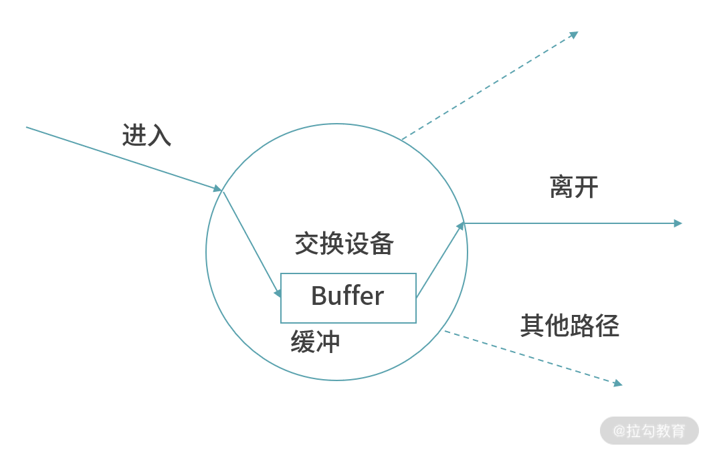

## 操作系统

- [IO 调用模型](https://www.masterraghu.com/subjects/np/introduction/unix_network_programming_v1.3/ch06lev1sec2.html)
  - 同步阻塞
  - 同步非阻塞（主动轮询）
    - 事件驱动
      - 单信号驱动
      - IO 多路复用
  - 异步 IO
- 线程切换
  - 切换时机
    - 系统调用（system call）
      - 软中断
    - 中断（interrupt）
      - 中断信号
      - 时钟中断
  - 上下文切换(Context switching)
- stdin, stdout, and stderr
  - stdin、stdout 和 stderr 是三个标准的 I/O 流，它们分别代表标准输入、标准输出和标准错误输出。在 Unix/Linux 系统中，每个进程都默认打开了这三个流，它们通常分别与进程的键盘输入、终端输出和错误信息输出相关联。
  - 查看：`lsof -p 1234`
- 进程通信
  - API 规范
    - HTTP
      - REST API
    - RPC
  - 方式
    - 进程之内
    - 跨进程
      - 管道
      - 消息队列
      - Socket
  - 序列化、反序列化

## vscode

- vscode remote
  - [Remote - SSH](https://code.visualstudio.com/docs/remote/ssh#_debugging-on-the-ssh-host)
  - [Remote - Containers](https://code.visualstudio.com/docs/remote/containers)
    - [附加到正在运行的容器](https://code.visualstudio.com/docs/remote/attach-container)
    - [创建开发容器](https://code.visualstudio.com/docs/remote/create-dev-container)
    - [高级容器配置场景](https://code.visualstudio.com/remote/advancedcontainers/overview)
  - GitHub Codespaces
  - The VS Code Server
  - Remote Repositories

## JavaScript

- 二进制
  - ArrayBuffer
    - ArrayBuffer 对象表示通用的、固定长度的二进制数据缓冲区
    - 必须使用其封装类 ArrayBufferView 进行实例化后才能进行访问
    - ArrayBuffer 只是描述有这样一块空间可以用来存放二进制数据，但在计算机的内存中并没有真正地为其分配空间。只有当具体类型化后，它才真正地存在于内存中
  - ArrayBufferView
    - ArrayBufferView 并不是一个具体的类型，而是代表不同类型的 Array 的描述。这些类型包括：Int8Array、Uint8Array、DataView 等
  - Blob
    - Blob（Binary Large Object）是 JavaScript 的大型二进制对象类型
- 元编程
  - Reflect 主要是和 Proxy 配对使用，提供对象语义的默认行为
  - get/set 带有额外的 receiver 参数，现阶段，receiver 其实只对访问器进行上下文修改。因为对于除了访问器（立即求值导致的）以外的属性，没有其他情况会出现这种上下文丢失的情况了，因为即使是一般函数调用，过程也是分步的，先获取函数对象（[[Get]]），再执行函数（[[Call]]）。而不会在[[Get]]的时候直接执行就意味着不会出现上下文丢失。receiver 参数完全是为了解决访问器上下文问题而添加的。


## TypeScript

- 类型系统
  - “在 TypeScript 中，类型是一组可能的值”
- 类型推导
- 类型编程
- 类型系统
  - TypeScript 基于结构类型系统
    - TypeScript 的结构类型系统是基于 JavaScript 的动态 duck 类型系统在运行时的工作方式而设计的
    - ```ts
      type X = {
          a: string;
      };
      type Y = {
          a: string;
      };
      const x: X = { a: 'a' };
      const y: Y = x; // 有效
      ```
    - 比较规则
      ```ts
      type X = {
          a: string;
      };
      const y = { a: 'A', b: 'B' }; // 有效, 至少它拥有相同的成员 X
      const r: X = y;
      ```
      - 函数参数按类型进行比较，而不是按名称进行比较
        - 函数返回类型必须相同：或者子类型
- tsconfig
  - lib
  - strict
  - esModuleInterop
    - 允许从未使用“default”属性导出的 CommonJS 模块导入默认值
    - 启用此选项后，我们可以使用“import MyLibrary from 'my-library'”而不是“import * as MyLibrary from 'my-library'”
  - 迁移到 TypeScript 的建议
    - allowJs
    - noImplicitAny
- tagged union
- 测试构造函数的原型属性是否出现在对象原型链中的任何位置
- TypeScript 编译器有两个主要职责：
  - 检查类型错误
  - 编译为 JavaScript
- 提取构造器参数签名
  - `ConstructorParameters<typeof Server>`
- 获取函数参数签名
  - `Parameters<typeof fn>;`
- 获取对象某一属性签名
  - `type Age = Person["age"];`

## 框架

- React vs Vue
  - React 为什么函数式开发范式
  - why hook（范式与原理哪个更为接近）
    - react 原生的响应式方案是非常依赖数据不可变性的，hook、函数式编程理念与 react 更为接近
    - vue：更好的逻辑分离与组合复用、类型推导
  - vue、react 区别
    - 渲染机制差不多，响应式机制一个可变
- React vs Vue
  - 数据驱动
    - 不可变数据 VS 可变数据
  - 响应原理
    - 原理
      - Vue
        - vue 和 mobx 这类基于 proxy 的响应方案，核心依赖的就是“容器对象引用不变，内部属性状态发生改变”，而面向对象的 class 实例的本质，就是一个引用不变的对象，里面有一些可变的状态，还有一些用来改变这些状态的动作。完美配合！
      - React
        - react 原生的响应式方案是非常依赖数据不可变性的
        - 监测变量引用（reference）的变化，然后整个子树去协调更新
        - 要求“内部不要变，容器整体引用要变”，也就是你每一个动作都必须生成一个新的实例，这样它才能检测到状态的变化。刚好和对象的特性是反的。这就天然切合声明式编程、FP 的特质。
    - 上层范式
      - 视图范式
      - 模型范式
      - 我们讨论 react class 组件是 FP 还是 OOP，其实不是讨论 class 组件 API 本身的风格，而是讨论“它作为 UI 库，更容易和 FP/OOP 哪种风格的 model 模型相对接


- diff
  - 同层对比
  - type 变了就不再对比子节点
  - 移动：复用元素、尽量减少创建新元素
    - 判断 type 么？ 那不行，同 type 的节点可能很多，区分不出来的
    - 每个节点都是有唯一的标识 key，利用 key 复用
    - vue2 双端对比、vue3 最小递增子序列


- 闭包是将函数代码和其环境一起存储的一种数据结构
  - 闭包引用的上下文中的自由变量，会被捕获到闭包的结构中，成为闭包类型的一部分。一般来说，如果一门编程语言，其函数是一等公民，那么它必然会支持闭包（closure），因为函数作为返回值往往需要返回一个闭包
  - 闭包是一种特殊的函数，它会捕获函数体内使用到的上下文中的自由变量，作为闭包成员的一部分


- 错误分类
  - 不可恢复错误
    - Syntax errors 语法错误
    - Runtime errors 运行时错误
  - 可恢复错误
    - Logic errors 逻辑错误


- 类型层级
  - any
    - 污染问题：any 可以赋值给其他任何类型的变量（因为没有类型检查），导致其他变量出错
  - unknown
    - unknown类型的变量，不能直接赋值给其他类型的变量（除了any类型和unknown类型）
    - 不能直接调用unknown类型变量的方法和属性
  - Object
  - 包装类型
  - 基本类型、值类型
  - undefined、null
  - never
    - 表示一种不存在、不会发生的值
    - never类型的使用场景，主要是在一些类型运算之中，保证类型运算的完整性
- 高级类型
  - 联合类型
  - 交叉类型 
    - 交叉类型的主要用途是表示对象的合成
- 类型缩小
- 类型编程
  - type
  - typeof
- 类型兼容
  - 如果类型A的值可以赋值给类型B，那么类型A就称为类型B的子类型（subtype）
- type vs interface
  - interface 仅仅是对象类型，type 任何类型
  - 接口可以声明合并


- React
  - React 渲染
    - 触发
      - setState、dispatch、forceUpdate
      - useSyncExternalStore
      - 再次调用 ReactDOM 顶级方法（相当于调用根组件）
    - 异步渲染
      - 批处理
        - 批处理次数
          - ```js
              const [counter, setCounter] = useState(0);

              const onClick = async () => {
                setCounter(0);
                setCounter(1);

                const data = await fetchSomeData();

                setCounter(2);
                setCounter(3);
              };
            ```
          - React 17 以原始事件处理期间为单位 - 执行 3次
          - React 18 以事件循环周期为单位 - 执行 2次
        - flushSync
      - 闭包陷阱和状态快照
  - vDom: render => diff => patch
    - reconcile
      - render => vdom
        - 在这个过程中，React 循环遍历整个组件树，查找标记为更新的组件
        - 对于每个标记的组件，从它开始，React 将递归渲染其中的所有子组件
          - 在正常渲染中，React 并不关心“props 是否改变”——它会无条件地渲染子组件
        - 渲染中 setState
          - 立即状态更新并重新渲染组件，[限制 50 次](https://github.com/facebook/react/blob/v18.0.0/packages/react-reconciler/src/ReactFiberHooks.new.js#L430-L469)
      - diff
    - commit patch
      - 在提交阶段的生命周期中同步运行 UI 渲染
  - 并发渲染
    - 这使 React 能够在渲染阶段暂停工作以允许浏览器处理事件。React 将在以后适当地恢复、丢弃或重新计算该工作。一旦渲染过程完成，React 仍然会一步同步运行提交阶段
    - [Fiber](https://github.com/facebook/react/blob/v18.0.0/packages/react-reconciler/src/ReactInternalTypes.js#L64-L193)
      - React 存储了一个内部数据结构，用于跟踪应用程序中存在的所有当前组件实例
      - React 将组件的所有 hooks 存储为附加到该组件的 fiber object 的链表
      - 在渲染过程中，React 将迭代这个纤维对象树，并在计算新的渲染结果时构造一个更新的树。
  - React 组件设计原则
    - 纯函数、不可变
      - 可变状态会导致 `UI = f(state)` 计算结果失效
    - 单向数据流规则


## 编程语言


- 代码复用
  - 代码拷贝
  - 指针拷贝
  - 指针代理/委托/借用
    - 多态
    - 原型链
    - 作用域链
    - 组合

## JavaScript


- 对象
  - 公开属性
  - 私有属性
  - 静态属性
    - 静态属性只能作用于 class 本身。
    - 普通属性里调用
  - 静态私有属性
- 实现私有属性
  - 主要有闭包、WeakMap 和 Symbol 这三种方式。
    - 构造器 + 闭包
      ```js
      function WidgetG() {
        var appName = "天气应用";
        this.getName = function () {
          return appName;
        };
      }
      WidgetG.prototype = (function () {
        var model = "支持安卓";
        return {
          getModel: function () {
            return model;
          },
        };
      })();
      var widget7 = new WidgetG();
      console.log(widget7.getName()); // 返回 “天气应用”console.log(widget7.getModel()); // 返回 “支持安卓”
      ```
- WeakMap，它的特点是只接受对象作为键名，键名是弱引用，键值可以是任意的
- 多态
  - 多态的特性就是，运行期才能动态决定调用的子类方法。对某个类型调用某个方法，执行的实际方法可能是某个子类的覆写方法
  - 可见，多态具有一个非常强大的功能，就是允许添加更多类型的子类实现功能扩展，却不需要修改基于父类的代码。
  - 多态机制使内部结构不同的对象可以共享相同的外部接口。即子类可以重写父类的某个函数，从而为这个函数提供不同于父类的行为。一个父类的多个子类可以为同一个函数提供不同的实现，从而在父类这个公共的接口下，表现出多种行为。
  - 多态的使用场景：当类之间存在层次结构，并且类之间是通过继承关联时。这意味着，虽然针对不同对象的具体操作不同，但通过一个公共的类，它们（那些操作）可以通过相同的方式予以调用。
- 组合、继承意义
  - 业务开发
  - 基础设施？
- object 接口


- js 类实现、Object.create
- 实现私有属性的方法其实就两种：闭包和 symbol
- 在 JavaScript 中，this 是在运行时而不是编写时绑定的。所以要正确地使用它，需要考虑到函数调用时的执行上下文。
- 在 this 的绑定中，有一点是需要我们注意的，那就是当我们使用箭头函数的时候，this 是在词法域里面的，而不是根据函数执行时的上下文。
- 箭头函数区别
  - 不能作为构造函数
- 为什么 0.1+0.2 不等于 0.3？
  - 解决
- 如何判断一个值是不是数字

## 网络

- 网络性能
  - 吞吐量
    - 带宽
  - 抖动
    - 最大延迟与最小延迟的时间差
    - 时延
      - 排队时延
      - 处理时延
      - 发送时延
      - 传播时延
  - 丢包率
    - 包损坏
    - 超过 MUT
    - 超过 TTL
    - 网络发生拥塞，数据流量太大，网络设备处理不过来自然而然就有些数据包会丢了
- 数据交换：先从一条链路进入交换设备，然后缓存下来，再转发（切换）到另一条路径 
  - 交换技术的本质，就是让数据切换路径
- 网络传输
  - 类型
    - 端到端（Host-to-Host）
    - 广播的能力，是一对多、多对多
  - 分片传输
  - 寻址：路由、路径选择
    - 网络状态
- 网络问题
  - 乱序
  - 丢包
  - 阻塞、延迟
- 网络性能指标
  - 吞吐量
  - 丢包率
  - 延迟
- TCP（Transport Control Protocol）是一个传输层协议，提供 Host-To-Host 数据的可靠传输，支持全双工，是一个连接导向的协议。

  - 序号
  - 丢包
    - 请求/响应模型
    - 确认与重发的机制
      - 超时重传：每一个发送了，但是没有 ACK 的包，都有设一个定时器，超过了一定的时间，就重新尝试
        - TCP 动态采样 RTT 的时间进行加权估算超时时间
        - 超时间隔加倍。每当遇到一次超时重传的时候，都会将下一次超时时间间隔设为先前值的两倍。两次超时，就说明网络环境差，不宜频繁反复发送
      - 快速重传：当接收方收到一个序号大于下一个所期望的报文段时，就会检测到数据流中的一个间隔，于是它就会发送冗余的 ACK，仍然 ACK 的是期望接收的报文段。而当客户端收到三个冗余的 ACK 后，就会在定时器过期之前，重传丢失的报文段
        - 例如，接收方发现 6 收到了，8 也收到了，但是 7 还没来，那肯定是丢了，于是发送 6 的 ACK，要求下一个是 7。接下来，收到后续的包，仍然发送 6 的 ACK，要求下一个是 7。当客户端收到 3 个重复 ACK，就会发现 7 的确丢了，不等超时，马上重发
    - 收到应答包确定连接建立
  - 流量控制（大小）
    - 滑动窗口 rwnd 是怕发送方把接收方缓存塞满，而拥塞窗口 cwnd，是怕把网络塞满
  - 拥塞控制（速度）

- TCP 和 UDP 有哪些区别？
  - TCP 是面向连接的，UDP 是面向无连接的。
    - 所谓的建立连接，是为了在客户端和服务端维护连接，而建立一定的数据结构来维护双方交互的状态，用这样的数据结构来保证所谓的面向连接的特性。
  - TCP 提供可靠交付。通过 TCP 连接传输的数据，无差错、不丢失、不重复、并且按序到达。
    - UDP 继承了 IP 包的特性，不保证不丢失，不保证按顺序到达。
  - TCP 是面向字节流的
    - UDP 继承了 IP 的特性，基于数据报的，一个一个地发，一个一个地收。
  - TCP 是可以有拥塞控制的。它意识到包丢弃了或者网络的环境不好了，就会根据情况调整自己的行为，看看是不是发快了，要不要发慢点。UDP 就不会，应用让我发，我就发，管它洪水滔天
  - TCP 其实是一个有状态服务，通俗地讲就是有脑子的，里面精确地记着发送了没有，接收到没有，发送到哪个了，应该接收哪个了，错一点儿都不行。而 UDP 则是无状态服务。通俗地说是没脑子的，天真无邪的，发出去就发出去了。
- MAC 层定义了本地局域网的传输行为
- IP 层定义了整个网络端到端的传输行为
- 网络传输是以包为单位的，二层叫帧，网络层叫包，传输层叫段。我们笼统地称为包
- IP 头里面有个 8 位协议，这里会存放，数据里面到底是 TCP 还是 UDP，当然这里是 UDP
- 适合场景
  - 需要资源少，在网络情况比较好的内网，或者对于丢包不敏感的应用
  - 不需要一对一沟通，建立连接，而是可以广播的应用
  - 需要处理速度快，时延低，可以容忍少数丢包，但是要求即便网络拥塞，也毫不退缩，一往无前的时候
    - TCP 在网络不好出现丢包的时候，拥塞控制策略会主动的退缩，降低发送速度，这就相当于本来环境就差，还自断臂膀，用户本来就卡，这下更卡了。
    - HTTP 协议，往往采取多个数据通道共享一个连接的情况，这样本来为了加快传输速度，但是 TCP 的严格顺序策略使得哪怕共享通道，前一个不来，后一个和前一个即便没关系，也要等着，时延也会加大。
    - 流媒体的协议
      - 直播
        - 实时性比较比较重要，宁可丢包，也不要卡顿的
        - 对于丢包，其实对于视频播放来讲，有的包可以丢，有的包不能丢，因为视频的连续帧里面，有的帧重要，有的不重要，如果必须要丢包，隔几个帧丢一个，其实看视频的人不会感知，但是如果连续丢帧，就会感知了，因而在网络不好的情况下，应用希望选择性的丢帧。
    - 实时游戏
- TCP/UDP 建立连接的本质就是在客户端和服务端各自维护一定的数据结构（一种状态机），来记录和维护这个“连接”的状态 。并不是真的会在这两个端之间有一条类似“网络专线”这么一个东西（在学网络协议之前脑海里是这么想象的）。
- 在 IP 层，网络情况该不稳定还是不稳定，数据传输走的是什么路径上层是控制不了的，TCP 能做的只能是做更多判断，更多重试，更多拥塞控制之类的东西。
- 滑动窗口

  - 流量控制
  - 拥塞控制

- 内网服务外网用
  - 动态公网 IP + DDNS
  - 内网穿透
  - IPv6
- 称呼
  - TCP,段
  - IP，数据包
  - 链路层，Frame（帧）
- 其他
  - 吞吐率：吞吐量指单位时间内可以传输的平均数据量。比如用 bit/s 作为单位，就是 bps
- 传输层
  - 通常 TCP 数据包的长度不会超过 IP 数据包的长度，以确保单个 TCP 数据包不必再分割
  - TCP
- 网络层、链路层
  - 数据在网络中交换（封包交换算法），并不需要预先建立一个连接，而是任由数据在网络中传输，每个节点通过路由算法帮助数据封包选择下一个目的地
  - 网络层
    - IP 寻址
    - 选路
      - BGP
  - 性能至上的 IP 层
    - 无连接、非可靠、无确认
  - 数据链路层
    - 封装帧
    - MAC 寻址
    - 定义物理层标准
  - 路由器
    - 网络层
    - 连接不同网络
  - 交换机
    - 链路层
    - 连接同一网络下的不同主机
    - 交换
      - 交换技术的本质，就是让数据切换路径。因为，网络中的数据是以分组或封包（Packet）的形式传输，因此这个技术也称作封包交换技术（Packet Switch）
      - 具有交换能力的设备
        - 路由器
        - 链路层交换机
- 称呼

  - 传输层：TCP 段
  - 网络层：IP 封包 Packet
  - 链路层：Frame

- 保证顺序的具体算法，以及如何在保证顺序的基础上，同时追求更高的吞吐量
  - 滑动窗口
    - 传输需要保证可靠性，还需要控制流速，这两个核心能力均由滑动窗口提供
- 网络安全
  - https 安全协议
  - 防火墙
- Whireshark 追溯的是最底层网卡传输的 Frame（帧），可以追溯到数据链路层。因此对二进制形式的解读，也就是我们的消息视图也要分层。因为对于同样的数据，不同层的解读是不同的。
- 网之初，性本善，不丢包，不乱序

## CSS

- 大型项目的 CSS 编写和维护
  - 难点
    - 协作难 易冲突 维护苦 灵活性差
  - 需求
    - 可维护性
    - 可扩展性
    - 可重用
  - CSS 规则难以管理
    - 全局命名空间
    - 权重(特异性)
    - 级联规则
  - CSS 的最佳实践
    - 样式表和关注点分离
    - CSS 方法论
      - BEM
      - CSS Modules
      - Atomic CSS


## 其他

- hash：每次 hash 值的变化，浏览器不发出请求，也就不会刷新页面，还会触发 hashchange
- history：pushState 和 replaceState，通过这两个 API 可以改变 url 地址且不会发送请求

  - 但因为没有 # 号，所以当用户刷新页面之类的操作时，浏览器还是会给服务器发送请求
    - 为了避免出现这种情况，所以这个实现需要服务器的支持，需要把所有路由都重定向到根页面。

- git
  - husky
  - lint-staged
  - commitlint
- 版本发布：发版与 CHANGELOG 自动化

  - standard-version
  - 根据指定规则自动升级项目不同级别（major、minor、patch）的版本并打 tag
  - 对比历史 commit 提交自动生成不同版本间的可阅读、分类的 CHANGELOG 日志

- em 相对于自身元素的 font-size

- web 攻击

  - 点击劫持
  - 跨站脚本 (XSS)
  - 跨站请求伪造 (CSRF)


- Referer

  - Referrer-Policy
    - 默认：`Referrer-Policy: strict-origin-when-cross-origin`
      - 同源时，发送完整的 Referer 字段；
      - 跨域时，如果 HTTPS 网址链接到 HTTP 网址，不发送 Referer 字段，否则发送源信息
  - 设置 Policy 的方法
    - 元素属性
      - rel
      - referrerpolicy
    - 标签设置整个网页的 Referer Policy 策略
    - Headers 请求头：`Referrer-Policy: no-referrer`
  - 作用及使用场景
    - 防盗链：按照 Referer 来源来判断是否在配置的白名单或者黑名单中，来决定资源能否可被访问
    - 埋点分析：Referer 提供用户的来源网址和整体访问链路
    - 错误排查（接口日志）

- HTTP/0.9
  - request 只有一行且只有一个 GET 命令
- HTTP/1.0
  - 增加状态码
  - 在 request 和 response 中添加 header 的概念
  - 在 header 中添加 content-type 以此可以传输 html 之外类型的文件
  - bad
    - http 队头阻塞
    - 短连接
- HTTP/1.1

  - 长链接 keep-alive
  - chunked 机制，分块响应
  - 缓存控制
  - 内容协商，包括语言、编码和类型，客户端和服务器现在可以就交换哪些内容达成一致
  - 请求头域中新增了 Host 字段：处理一个 IP 地址上面多个虚拟主机


- [Resource Fetch Prioritization and Scheduling in Chrome](https://docs.google.com/document/d/1bCDuq9H1ih9iNjgzyAL0gpwNFiEP4TZS-YLRp_RuMlc/edit#)

- 函数
  - this
    - 修改 this
      - call
      - apply
        - `func.apply(context, args)`
      - bind
        - 绑定 this，生成新的函数对象
    - 回调函数中防止 this 丢失
      - 包装
      - bind
  - 装饰器
    - 装饰器 是一个围绕改变函数行为的包装器。主要工作仍由该函数来完成。
  - 部分（应用）函数（Partial functions）


- tcp
  - 发送方选择随机生成的序列号“x”并向接收方发送 SYN 数据包。
  - 接收器递增“x”，选择随机生成的序列号“y”并发回 SYN/ACK 数据包。
  - 发送方递增序列号并回复 ACK 数据包和应用程序数据的第一个字节。
- 流量控制是一种退避机制，旨在防止发送方压垮接收方
- Congestion Control 拥塞控制


- 计算机的本质是一个状态机，内存里存储的所有数据构成了当前的状态，CPU 只能利用当前的状态计算出下一个状态
- 当你企图使用计算机解决一个问题是，其实就是在**思考如何将这个问题表达成状态**（用哪些变量存储哪些数据）以及如何在状态中转移（怎样根据一些变量计算出另一些变量）。所以所谓的空间复杂度就是为了支持你的计算所必需存储的状态最多有多少，所谓时间复杂度就是从初始状态到达最终状态中间需要多少步！
- 贪心：每个阶段选择最优状态
- 分解、递推
  - 无后效性
    - 动态规划是通过拆分问题，定义问题状态和状态之间的关系，使得问题能够以递推
    - “缓存”，“重叠子问题”，“记忆化”：
  - “最优子结构”


- 动态规划常用来求解最优化问题，它们不仅包含重叠子问题，还具有另外两大特性：最优子结构、无后效性。


- 动态规划
  - 而动态规划就是这样一个指导我们解决问题的思想：你需要利用已经计算好的结果来推导你的计算，即大规模问题的结果是由小规模问题的结果运算得来的
  - 问题类型
    - 求“最”优解问题（最大值和最小值）
      - 枚举
        - 枚举搜索
    - 可行性
    - 总数
- 无后效性
  - 如果这些重叠子问题无后效性，那么我们就可以利用缓存的方法，在求得每个子问题的解之后将求解结果存入缓存数组中。如果在后续的计算分支中遇到相同的子问题，就直接从备忘录中取出我们已经计算过的结果
- 备忘录的递归 vs 动态规划
  - 核心一样：消除重叠子问题
  - 备忘录的递归
    - 每次都要进行备忘录的分支处理逻辑
    - 自顶向下
  - 动态规划
    - 迭代替换递归
    - 自底向上
      - 当求解大问题的时候，我们已经可以确保该问题依赖的所有子问题都已经计算过了，那么我们就无需检查子问题是否已经求解，而是直接从缓存中取出子问题的解
    - 阶梯缓存
- 贪心
  - 选择最优
  - 子问题最优
- 动态规划
  - 最大和的连续子数组
  - 乘积最大子数组
  - 最长回文子串
  - 最长上升子序列
- 二叉树
  - 二叉树中的最大路径和
  - [105. 从前序与中序遍历序列构造二叉树](https://leetcode.cn/problems/construct-binary-tree-from-preorder-and-inorder-traversal/description/)
  - [103. 二叉树的锯齿形层序遍历](https://leetcode.cn/problems/binary-tree-zigzag-level-order-traversal/description/)
  - [235. 二叉搜索树的最近公共祖先](https://leetcode.cn/problems/lowest-common-ancestor-of-a-binary-search-tree/description/)
  - [236. 二叉树的最近公共祖先](https://leetcode.cn/problems/lowest-common-ancestor-of-a-binary-tree/description/)
- 数组
  - [56. 合并区间](https://leetcode.cn/problems/merge-intervals/description/)
- 回溯
  - [LCR 083. 全排列](https://leetcode.cn/problems/VvJkup/description/)
  - [51. N 皇后](https://leetcode.cn/problems/n-queens/description/)
  - [22. 括号生成](https://leetcode.cn/problems/generate-parentheses/description/)
- 哈希
  - [169. 多数元素](https://leetcode.cn/problems/majority-element/description/)
- 分治
  - [50. Pow(x, n)](https://leetcode.cn/problems/powx-n/description/)
- 动规
  - [122. 买卖股票的最佳时机 II](https://leetcode.cn/problems/best-time-to-buy-and-sell-stock-ii/description/)


- 最优子结构
  - 独立性
- 搜索状态
  - 回溯算法在尝试和回退中穷举所有可能的解，并通过剪枝避免不必要的搜索分支。原问题的解由一系列决策步骤构成，我们可以将每个决策步骤之前的子序列看作为一个子问题
  - 回溯算法通常并不显式地对问题进行拆解，而是将问题看作一系列决策步骤，通过试探和剪枝，搜索所有可能的解
    - 适合用回溯解决的问题通常满足“决策树模型”，这种问题可以使用树形结构来描述，其中每一个节点代表一个决策，每一条路径代表一个决策序列。
- 分解状态
  - 分治
  - 递推
    - 动态规划（涉及到多个状态）
      - 决策（无后效性）
      - 最优子结构
      - 原问题的解可以由子问题的解构建得来
      - 动态规划是递推的一种形式，但它通过巧妙地储存中间结果来避免重复计算，从而在处理某些类型的问题时更为高效
    - 原理
      - 重叠子问题
      - 最优子结构
        - 原问题的最优解是从子问题的最优解构建得来的
      - 无后效性
        - 给定一个确定的状态，它的未来发展只与当前状态有关，而与过去经历的所有状态无关。
    - 实现方式
      - 自顶向下
        - 使用一个存储结构（如数组或哈希表）来保存这些子问题的解，即“记忆化”
      - 自底向上
        - 填充表格
- 最值问题
  - 穷举
- 最优组合
  - 枚举
    - 枚举搜索
      - 递归
- 备忘录
  - 数组
  - 哈希表

- 链表（单链表）
  - 单链表翻转
  - 字符串是否是回文字符串的问题
  - 两个有序的链表合并
  - 删除链表倒数第 n 个结点
  - 求链表的中间结点
- 树
  - 树的前中后序遍历
  - 验证二叉搜索树
  - 104. 二叉树的最大深度 - 力扣（LeetCode）
  - 二叉树
    - 104. 二叉树的最大深度
    - 144. 二叉树的前序遍历
    - 543. 二叉树的直径
    - 剑指 Offer 55 - I. 二叉树的深度
- 排序
  - 快排
- 分治
  - 二分查找
  - 归并排序：912. 排序数组 - 力扣（LeetCode）
    - 归并思想
    - 海量数据处理
  - 快速排序
  - pow
- 回溯
  - 回溯算法在尝试和回退中穷举所有可能的解，并通过剪枝避免不必要的搜索分支。原问题的解由一系列决策步骤构成，我们可以将每个决策步骤之前的子序列看作为一个子问题
  - 题目
    - 全排列问题：给定一个集合，求出其所有可能的排列组合
  - 78. 子集 - 力扣（LeetCode）
  - 51. N 皇后 - 力扣（LeetCode）
  - 全排列
- 动态规划
  - [爬楼梯](https://leetcode.cn/problems/climbing-stairs/description/)
  - 斐波那契数列
  - 最小路径和
  - 0-1 背包问题
    - 给定 n 个物品，每个物品都有各自的价值 vi 和重量 wi，现在给你一个背包，背包所能承受的最大重量是 W，那么往这个背包里装物品，问怎么装能使被带走的物品的价值总和最大
  - [零钱兑换](https://leetcode.cn/problems/coin-change/)
    - 零钱兑换 II 
  - 编辑距离
  - 股票问题
- 贪心：局部最优解
  - 每一个阶段，我们都选择当前看起来最优的决策
  - 贪心算法是一种在每一步选择中都采取在当前状态下最好或最优（即最有利）的选择，从而希望导致结果是最好或最优的算法
- 树
  - 组合状态：构建解空间/解答树、决策树
    - 遍历
      - 回溯
    - 递推/动态规划
  - 分解状态：分解问题树
    - 递归/分治
    - 递归/动态规划


- LeetCode 第 91 题，
- LeetCode 第 51 题 黄河

- 搜索问题：找到满足特定条件的解决方案
  - 排列
    - [全排列](https://leetcode.cn/problems/permutations/description/)
    - [47. 全排列 II](https://leetcode.cn/problems/permutations-ii/)
  - 子集和
    - [78. 子集](https://leetcode.cn/problems/subsets/)
  - 组合优化


常见的策略有三种：先进先出策略 FIFO（First In，First Out）、最少使用策略 LFU（Least Frequently Used）、最近最少使用策略 LRU（Least Recently Used）。

循环链表
链表操作


栈在表达式求值中的应用
栈在函数调用中的应用
栈在括号匹配中的应用
如何实现浏览器的前进、后退功能
leetcode 上关于栈的题目大家可以先做 20,155,232,844,224,682,496.

循环队列
确定好队空和队满的判定条件。
队空 head = tail
队满(tail+1)%n=head
队列应用 09 | 队列：队列在线程池等有限资源池中的应用
请求排队 任务排队调度
不过，设置一个合理的队列大小，也是非常有讲究的。队列太大导致等待的请求太多，队列太小会导致无法充分利用系统资源、发挥最大性能。

- 将 table / list 抽象，用类似 scheme 驱动的方式
- ui 都有差异,在设计层面，可能由于业务需求，很难做到统一，不得已自带设计体系
- 后端数据模型没有统一，因此对接数据前后涉及到的前端状态管理、数据流转也未能统一，复用性大打折扣。


- 阿里三面：灵魂拷问——有 react fiber，为什么不需要 vue fiber 呢？
  - React 从诞生之日的设计哲学就是，当状态发生变化时，重新创建所有视图。
  - 即使你只是修改了组件树最深处的一个小小的状态，React 仍然需要自顶重新创建整个 vdom 树并且 Diff
  - 引入 fiber 机制后使得 React 的渲染过程可以中断，让出主线程响应用户事件，或者允许插入更高优先级的更新
  - Vue 有一套细粒度的响应式机制，框架的更新粒度是组件级别，除此之外还有 Block Tree 等分离静态/动态模板的优化手段，更新的效率是足够高的，也就没有必要引入 fiber 这样的机制
- why react fiber


- 闭包是指函数能够记住和访问其词法范围，即使该函数在其词法范围之外执行也是如此。

- 箭头函数

  - 没有 arguments
  - 无法通过 apply、call、bind 改变 this 指向

- 位运算
  - 与
  - 或
  - 异或
  - 取反
  - 左移
  - 右移
- 字典树


- 代码

  - 构建 CommonJS (CJS) 和 ECMAScript (ESM) 模块格式 - p
    `   "exports": {
  ".": {
    "import": {
      "types": "./lib/esm/types/index.d.ts",
      "default": "./lib/esm/index.mjs"
    },
    "require": {
      "types": "./lib/cjs/types/index.d.ts",
      "default": "./lib/cjs/index.js"
    }
  }
},`

                                                      ```
                                                      “types": "./lib/cjs/types/index.d.ts",

                                                "main": "./lib/cjs/index.js",

                                                ```

                                                ```

- 单元测试
  Mocha.js、Chai.js 和 ts-node。Mocha.js 是一个测试运行器，Chai.js 是一个断言库，用于帮助确定您是否从代码中获得了预期的结果，而 ts-node 帮助我们在 TypeScript 项目中使用这些工具。
- 集成测试
  - 本地
    - npm link
    - npm pack
  - 代理
    - Verdaccio
- 发布包
  - 在您的文件中添加一个 files 字段 package.json，以指示当 npm 打包您的代码以供发布时应包含哪些文件。
  - npm version <major|minor|patch>
  - prepack 在打包 npm 包以准备发布到注册表之前，npm 使用该脚本
  - 安全检查
  - `npm publish --access=public`
  - 自动化版本管理和发布
- 集成 CI/CD


- JS

  - Tagged template literals
  - Symbols
  - 2020
    - Optional chaining
    - Nullish coalescing operator (??)
    - import()
    - String.matchAll
    - Promise.allSettled()
  - 2021
    - String.replaceAll()
    - Promise.any
    - Nullish coalescing assignment (??=)
    - Logical and assignment (&&=)
    - Logical or assignment (||=)
    - WeakRef: Hold a “weak” reference to an object, without preventing the object from being garbage-collected.
  - 2022


- `new Function`
  - `new Function ([arg1, arg2, …argN], functionBody)`
  - 上下文是全局的
  - 场景：动态生成代码、计算

```js
const pipe =
  (...fns) =>
  (value) =>
    fns.reduce((v, fn) => fn(v), value);

const asyncPipe =
  (...fns) =>
  (value) =>
    fns.reduce((chain, fn) => chain.then(fn), Promise.resolve(value));

const compose =
  (...fns) =>
  (value) =>
    fns.rightReduce((v, fn) => fn(v), value);
```

- Vue

  - 如何避免 data 中一个复杂对象（自身或属性对象）被默认被创建为响应式（Non-reactive Object）的过程
    - Object.defineProperty
    - Object.frezen


- ui、api、rpc、mq、servcie、db


- 前端代码分层架构
  - 视图层
  - 业务层
    - Model：描述业务的实体对象，是业务所围绕的核心概念，你的公司所做的业务，本质上就是在创建和处理这些对象
    - Service：描述工作流程的服务对象，它们主要是对实体对象的处理过程、逻辑、事件，是使得业务产生实际效果的非实体对象
      - 领域模型帮我们描绘了有关这个业务的核心对象的各种逻辑，但是，我们的这个业务实体会面对很多场景，每一个场景下，可能存在有些特定的转化逻辑，这就需要我们在领域模型的基础上，提供对应场景的服务。简单讲，你可以把领域服务想象成领域模型实例的处理工厂，在这些处理中，我们是为了描述特定场景下的业务需求，所以，领域服务仍然是业务描述，和 UI 无关。
    - 总而言之，领域模型是相对比较普遍的业务描述，而领域服务是相对比较特殊的业务描述。
    - 一般来讲，服务需要遵循无状态的原则，状态一般会放在领域模型中。
    - 数据驱动视图，事件驱动业务逻辑
    - 业务开发下，更应该关注的是业务模型，行为指令，这才是最好维护的
    - 视图层只做 data 消费，业务写在 Model 层
    - 不要视图驱动业务模型
  - 数据层
  - 交互模型
    - 交互有两种，一种是界面交互，一种是业务交互
    - 交互模型会引用领域模型和领域服务，同时，它还会被用到视图层中，交给视图层使用
    - 可以把交互模型和我们平时讲的“状态管理器”划一个约等号，交互模型的实例向视图层提供状态属性和方法，属性用于视图层进行渲染，而方法用于事件回调


- js 正则相关 api
- 数组、字符串 api


- 发布
- 消费
- 生产


- URL

  - QueryString
    - 结构：`field1=value1&field2=value2&field3=value3...`
    - 多个 value 关联到同一个 field（无明确处理规范）
      - `key=a&key=b`（建议优先此形式）
  - URL 编码：将非 ASCII 字符转换为百分号编码形式（`%HH`：先转成 UTF-8 编码，再对每个字节进行%HH 的编码）
    - `encodeURI`
    - `encodeURIComponent`：URL 中有特殊含义的字符（如 空格、%、&、=、?、# 等）无法直接在 Query String 中使用
      - % 百分号编码为 %25
      - 空格编码为 %20（建议优先）或 +；
        - decodeURIComponent，是无法解析 + 为 空格的
    - qs
      - 自定义性强
      - 多层嵌套对象（Nested object）的支持
      - 使用场景：拥有强大的序列化能力，可以处理复杂的类 JSON 数据。
    - URL/URLSearchParams
      - 适合常规的 Web 端数据传输，处理平面数据结构
      - URLSearchParams 采用了 application/x-www-form-urlencoded 编码模式，而这个编码采用了一个非常早期（RFC 1738）的通用百分号编码方法——就是将 空格转换为+
  - x-www-form-urlencoded：是一种常见的编码格式，用于将表单数据编码为 URL 查询字符串
  - 空格编码为 +；


- lint 机制和 IDE 提示

  - git hooks

- 如何将主线程还给浏览器，以便浏览器更新页面？
  - 时间切片 + 宏任务
    - 因为宏任务是在下次事件循环中执行，不会阻塞本次页面更新，而微任务是在本次页面更新前执行
    - React Scheduler 使用 MessageChannel 就是为了产生宏任务，
      - 嵌套深的 setTimeout(fn, 0) 最低 4mm 间隔延迟
- 如何通过 postMessage 实现一个真正 0 延迟的定时器

  ```js
  (function () {
    var timeouts = [];
    var messageName = "zero-timeout-message";

    // 保持 setTimeout 的形态，只接受单个函数的参数，延迟始终为 0。
    function setZeroTimeout(fn) {
      timeouts.push(fn);
      window.postMessage(messageName, "*");
    }

    function handleMessage(event) {
      if (event.source == window && event.data == messageName) {
        event.stopPropagation();
        if (timeouts.length > 0) {
          var fn = timeouts.shift();
          fn();
        }
      }
    }

    window.addEventListener("message", handleMessage, true);

    // 把 API 添加到 window 对象上
    window.setZeroTimeout = setZeroTimeout;
  })();
  ```

- css
  - bfc 布局规则
- js
  - 说一下原型链，原型链实现继承。
  - vue 中 nextTick 的实现，结合浏览器事件循环机制说一下？
  - 说说 commonjs 和 esmodule？
  - 手写简版 promise，基础架子，不用写 all、race 等 api
  - 手写 bind
- 框架原理
  - vue 模板编译原理
- http
  - http 和 tcp 协议？
  - 缓存相关（对比缓存？强缓存？对应请求头）
  - cookie 有哪些属性？
  - options
  - 简单请求？
  - 跨域？
- 浏览器
  - 为甚么要有同源策略？dns 劫持？
  - 渲染原理
- 算法
  - 回文字符串个数
  - 猴子吃香蕉
  - 爬楼梯
  - 最长公共子串
- 项目
  - 项目怎么做的移动端适配？
    - flexible 原理
    - 移动端的 1 像素问题怎么解决
  - 团队协作，以前的开发流程？
- 其他

  - 职业规划？
  - 有什么问题吗？
  - 为什么要离职？
  - 怎么学习的？


- VDOM 的更新机制
  - render：组件渲染生成一棵新的虚拟 dom 树；
  - diff：新旧虚拟 dom 树对比，找出变动的部分；（也就是常说的 diff 算法）
    - 旧 diff 算法 = 同层对比 + 深度优先 + 前序遍历
  - patch：为真正改变的部分创建真实 dom，把他们挂载到文档，实现页面重渲染；
- why react fiber
  - 在数据更新时，react 生成了一棵更大的虚拟 dom 树，给第二步的 diff 带来了很大压力，树的递归过程没法暂时停止，阻塞用户响应
  - diff 过程切片，react fiber 使得 diff 阶段有了被保存工作进度的能力
    - 为什么有了 react fiber 就能断点恢复呢；
      - fiber 是链表结构，只要保留下中断的节点索引，就可以恢复之前的工作进度；
- 有 react fiber，为什么不需要 vue fiber 呢？
  - vue 基于数据劫持 + 编译优化，能够更加精确更新
- hooks
  - 实现
    - hooks 实现内部实现实际将组件状态放在组件实例对应的 Fiber 节点里面。
  - why hooks
    - hooks 对并发友好：并发过程 React 内核可以维护多份数据模型，并发渲染“多个版本”的组件树
      - 而如果你用了 class 组件，就很容易出问题，因为“多个版本”的组件树，其中 class 组件的实例对象是共享的，
- Vue 与 React 框架的对比
  - 范式
  - 生态
  - 原理
- 渲染机制
- 设计思想
- 响应式原理
  - react
    - 不可变、setState
    - 会自顶向下重新渲染组件，自顶向下的含义是，该组件以及它的子组件全部需要渲染
    - 手动优化
  - vue
    - 可变、响应式
    - vue 使用 Object.defineProperty（vue@3 迁移到了 Proxy）对数据的设置（setter）和获取（getter）做了劫持，也就是说，vue 能准确知道视图模版中哪一块用到了这个数据，并且在这个数据修改时，告诉这个视图，你需要重新渲染了
  - 所以当一个数据改变，react 的组件渲染是很消耗性能的——父组件的状态更新了，所有的子组件得跟着一起渲染，它不能像 vue 一样，精确到当前组件的粒度。
- Vue
  - 性能
    - 响应式
      - proxy
    - diff
      - 静态标记
  - ref 和 reactive 的区别


- 响应式更新：响应式更新」描述的是「状态与 UI 之间的关系
  - 状态变化如何映射到 UI 变化
- 单向数据流：单向数据流」描述的是「组件之间的关系
  - 当状态变化后，变化产生的影响只会从上往下传递
- 双向数据绑定：「双向数据绑定」描述的是「组件内逻辑与视图的关系」

- http 连接

  - 请求响应和长连接
    - keep-alive
      - Keep-Alive 是 HTTP 1.1 版增加的功能
  - 当一个网站需要加载的资源较多时，浏览器会尝试并发发送请求（利用多线程技术）。浏览器会限制同时发送并发请求的数量，通常是 6 个，这样做一方面是对用户本地体验的一种保护，防止浏览器抢占太多网络资源；另一方面也是对站点服务的保护，防止瞬时流量过大
  - HTTP 2.0 的多路复用


- Q640】如何实现数组函数 reduce #658
- const reduce = (list, fn, ...init) => {
  let next = init.length ? init[0] : list[0]
  for (let i = init.length ? 0 : 1; i < list.length; i++) {
  next = fn(next, list[i], i)
  }
  return next
  }
- 什么是防抖和节流，他们的应用场景有哪些
- 实现一个数组扁平化的函数 flatten
- const flatten = list => list.reduce((a, b) => a.concat(Array.isArray(b) ? flatten(b) : b), [])
- 如何实现一个深拷贝 (cloneDeep)


- 拆分-按需加载
- 缩小
  - 混淆
  - 代码升级
  - Removing unused code.
    - DevTools code coverage.
    - analysis of their webpack bundles
- 压缩
- 缓存
  - http
  - V8’s code cache
- PRPL（推送、渲染、预缓存、延迟加载）是一种通过积极的代码拆分和缓存来优化互动的模式：


- 正则
  - 分割行而不包含行终止符 str.split(/\r?\n/)
  - 分割行同时包含行终止符 /(?<=\r?\n)/
  - 多行文本消除首尾**空白符**：`string.replace(/^\s+|\s+$/g,"")`
  - js 正则相关 api
- 框架 xss 防范
  - xss
    - js
    - 拼接 HTML + encode
  - script
    - 逃逸
- 主题切换
  - 原理
    - 主题生成：CSS 原生变量/CSS 预构建 + CSS 样式覆盖
    - 切换、触发
      - 跟随系统
        - `prefers-color-scheme`
        - `window.matchMedia("(prefers-color-scheme: dark)").matches`
      - class、dataset 手动切换策略
        - `class.dark`
        - `[data-theme]=dark`
  - 现有工程改造
    - postcss/stylelint
    - 查找 & 替换】所有颜色变量
    - 通过 Stylelint 编辑器插件提示,保存时自动替换
  - 状态封装
    - [useColorMode](https://vueuse.org/core/useColorMode/)


- Web 安全

  - 网络
    - TLS
      - 自签名
    - Http
      - Helmet
  - 密码
  - 身份验证
    - JWT 这类令牌的场景，是多个系统间通过非信任通道（数据发到浏览器再由浏览器发到另一个系统）传递数据（这也是典型的第三方登录的场景）而不是当会话用，也不是在一个完全自己控制的系统中传数据用，也不是在消息队列发消息用。

- glob 语法

  - `*`：任何路径段
    - 星号不匹配名称以点开头的“不可见文件”，如果我们想匹配这些，我们必须在星号前加上一个点：`.*`
  - `**`：匹配零个或多个路径段
  - `!`：排除
  - `\{xx,xx\}`：可选匹配


- [7](https://freegpt.one/)
- 25 https://iq.thc.org/tunnel-via-cloudflare-to-any-tcp-service
- 33 https://github.com/kaleidawave/ezno
- 39 https://github.com/zh-lx/code-inspector
- 45 https://github.com/highlight/highlight
- 46 https://keyvhq.js.org/
- 50 https://www.promptingguide.ai/
- 51 https://www.actionsbyexample.com/
- 52 https://www3.nd.edu/~dthain/compilerbook/


- 以各种编码对文本进行编码和解码
  - 类 TextEncoder< /code> 或类 TextDecoder
- 文本
  - 字符串拆分成行
    - RE_SPLIT_EOL = /\r?\n/;
    - /(?<=\r?\n)/
  - 通过流行读取文本文件
  - 写入
    - 覆盖
    - 增加
- 目录

  - 操作系统特定的全局临时目录中创建我们的临时目录
  - 重要的是要注意临时目录不会在 Node.js 脚本终止时自动删除。我们要么必须自己删除它，要么依靠操作系统定期清理它的全局临时目录

- web stream
  - 文本流：字符串
  - 二进制流：Uint8Arrays（一种 TypedArray）
- WebStream
  - ReadableStream
  - WritableStream
  - TransformStream：传输流或称管道，由读、写流组成，从输入流（读）传输数据到输出流（写）
- ReadableStream

  - Reading via Readers
  - Reading via asynchronous iteration
    ```js
    const iterator = readableStream[Symbol.asyncIterator]();
    let exhaustive = false;
    try {
      while (true) {
        let chunk;
        ({ done: exhaustive, value: chunk } = await iterator.next());
        if (exhaustive) break;
        console.log(chunk);
      }
    } finally {
      // If the loop was terminated before we could iterate exhaustively
      // (via an exception or `return`), we must call `iterator.return()`.
      // Check if that was the case.
      if (!exhaustive) {
        iterator.return();
      }
    }
    ```
  - Piping ReadableStreams to WritableStreams


- Monorepo
  - 架构
    - 依赖管理
    - 任务编排
      - 串行
      - 并行
      - 拓扑结构
    - 版本发布
  - 库
    - [lage](https://github.com/microsoft/lage)
- 构建系统

  - 缓存-增量


- link

  - preload
  - prefetch
  - 资源优先级

- webpack

  - hash
    - hash 每个构建生成的唯一哈希
    - chunkhash 基于每个块的内容
    - contenthash 最终生成的文件内容

- pro
  - 关闭 sourcemap
  - 分析大文件，找出内鬼
    - webpack-bunle-a
    - 拆包
    - 外置
    - cdn 加速
    - 压缩


- HTTP 缓存
  - 浏览器发出的所有 HTTP 请求首先会转至浏览器缓存，用于检查是否存在可满足请求的有效缓存响应。如果存在匹配，则从缓存中读取响应，从而消除网络延迟和传输产生的数据成本。
  - HTTP 缓存的行为由请求标头和响应标头的一起控制
  - 策略
    - 版本化 URL 的长期缓存
    - 非版本化 URL 的服务器重新验证
  - 通过设置 ETag 或 Last-Modified ，您可以让重新验证请求更加高效。它们最终会触发在请求标头中提到 If-Modified-Since 或 If-None-Match 请求标头。

Cache-Control: no-cache 适用于每次使用前应与服务器重新验证的资源。
Cache-Control: no-store 适用于永远不要缓存的资源。
Cache-Control: max-age=31536000 适用于版本化的资源。


- 对象
  - 内部槽
    - 用于操作对象（获取属性、设置属性等）的方法槽
    - 存储值的数据槽。
  - 属性的集合
    - 属性 key - value
      - key
        - A string 一个字符串
        - A symbol 一个符号 
    - 分类
      - 数据属性
      - 访问器属性
        - getter
        - setter

- super
  - SuperCall
  - SuperProperty

- WebStream API
  - writable streams
  - readable streams
  - transform streams


- 软件设计
  - 目的：对抗不断增加的需求变化，变化会导致软件不稳定
  - 分离关注点
  - 分离变化：尽可能把变的部分和不变的部分分开，让不变的部分稳定下来
- 软件设计
  - 模型设计/定义
    - 软件设计即要抽象设计，一切皆抽象，抽象出稳定的系统模型层非常重要，应用的核心模型是相对稳定的，实现细节则是容易变动的部分
  - 模型之间如何交互？
    - 接口设计：帮助从具体的实现细节中抽离出来
      - 接口是把变和不变隔离开
      - 接口应该是尽可能稳定的
        - 接口的使用者对于接口是一种依赖关系，被依赖的一方越稳定越好，而只有规模越小，才越有可能稳定下来
      - 做接口设计时，需要关注不同的使用者
        - 每个使用者面对的接口，其实都是一种角色接口，识别出接口不同的角色是至关重要的
    - 原则：接口隔离
      - 同一个对象扮演不同角色的场景，每个接口代表着与不同使用者交互的角色
      - 分离关注点，使用接口识别出不同的角色是至关重要的
      -  ISP 理解成接口设计的 SRP。
- ISP 还可以从更广泛的角度去理解，也就是说，不要依赖于任何不需要的东西，这个原则可以指导我们在高层次上进行设计。


- 如果你发现了任何做运行时类型识别的代码，很有可能已经破坏了 LSP、OCP。
- 要满足 LSP，首先这个对象体系要有一个统一的接口，而不能各行其是，其次，子类要满足 IS-A 的关系
- IS-A 的判定是基于行为的
  


  - 控制反转：即反转控制流，是框架经常使用到的一种模式，由框架来调用应用，而不是应用来调动框架
  - DI 容器/IoC 容器
    - 负责组装代码，把业务模型和具体类联合在一起
    - 即便是没有 DI 容器的语言，组装代码与模型代码也应该是分开的
    - 依赖注入
      - 依赖注入的最主要目的，就是为了实现依赖倒置。一个是手段，一个是目的
      - 依赖注入真正实现了面向接口编程的愿景，可以很方便地替换同一接口的不同实现，而不会影响到依赖这个接口的客户端。而且使用了依赖注入后，每个组件只需要关注自己的逻辑，而不需要关心组件之间的组合逻辑，大大降低了系统复杂度
- 应对变化
  - how：构建模型
    - 分离关注点：从不同角度看待问题
    - 找到共性
  - 模型抽象设计
  - 如何应对变化对模块设计的影响


- any
  - noImplicitAny
  - 污染问题
- unknown
- never：空类型
- Typescript 生态
  - tsc & AST
    - [ts-morph](https://github.com/dsherret/ts-morph)
  - tsd 验证器：[tsd](https://github.com/SamVerschueren/tsd)
  - 类型生成
    - [quicktype](https://github.com/quicktype/quicktype)
  - 运行时 ts 类型验证
    - [zod](https://github.com/colinhacks/zod)


MVC 是一种软件架构模式，通常用于开发用户界面，主要是在解决数据逻辑和视图逻辑的分离问题；**MVC 在不同编程领域有不同的通信模型变化**，而在 web 前端领域里通常是 MVP 和 MVVM 的 MVC 变种模型，并且前端的 MVC 对应整个 web 应用的 MVC 模型中的 V。

主要由三部分组成

- Model：应用的状态管理和业务逻辑
- View：视图渲染和视图逻辑管理
- Controller：控制器，接受、处理用户指令，调度数据模型和视图通信


  - 状态通信
    - 状态管理
      - 组件级
      - 页面路由级/业务级
      - 应用会话级
    - 组件树 + 层级栈：区域状态

- WebServer
- WAF
  - ModSecurity
- DNS
- CDN
  - 就近访问
  - 高速专有线路连接
  - 全局负载均衡和缓存系统
    - 智能 DNS
    - 缓存
- WebSocket
  - HTTP/2 针对的是“队头阻塞”，而 WebSocket 针对的是“请求 - 应答”通信模式
  - WebSocket 采用了二进制帧结构
  - URI 格式、“ws”和“wss”，分别表示明文和加密的 WebSocket 协议。
  - WebSocket 的默认端口也选择了 80 和 443，因为现在互联网上的防火墙屏蔽了绝大多数的端口，只对 HTTP 的 80、443 端口“放行”，所以 WebSocket 就可以“伪装”成 HTTP 协议，比较容易地“穿透”防火墙，与服务器建立连接
  - WebSocket 的握手
    - 利用了 HTTP 本身的“协议升级”特性，“伪装”成 HTTP，这样就能绕过浏览器沙盒、网络防火墙等等限制
    - WebSocket 的握手是一个标准的 HTTP GET 请求，但要带上两个协议升级的专用头字段：
      - “Connection: Upgrade”，表示要求协议“升级”；
      - “Upgrade: websocket”，表示要“升级”成 WebSocket 协议


- SSR
- Static Hosting
  - SSG
    - ssr + pre-renders
      - Crawl-based Pre-rendering
        - /、~/pages、nitro.prerender.routes
        - HTML 中的 `<a href="...">`
  - CSR


- Web 服务遇到的威胁
  - 第一种叫“DDoS”攻击（distributed denial-of-service attack），有时候也叫“洪水攻击”
  - 代码注入
    - “SQL 注入”（SQL injection）应该算是最著名的一种“代码注入”攻击了，它利用了服务器字符串拼接形成 SQL 语句的漏洞，构造出非正常的 SQL 语句，获取数据库内部的敏感信息。
    - HTTP 头注入
    - JS 代码注入
      - 跨站脚本”（XSS）
        - 利用 JavaScript 脚本获取未设防的 Cookie。
      - CSP内容安全策略，CSRF防御


- EOF（如C程序所示）不是一个字符
- EOF (end-of-file) 是内核提供的一种条件，可由应用程序检测到。当读取操作到达文件末尾时，应用程序可以检测到该条件


- rest
  - REST更像是一种范式，而不是API标准
  - REST API”用于基于HTTP的JSON API
  - 使用 REST，一切都以资源为中心，可以检索和操作资源


- Unicode
  - Unicode 为每个字符提供了一个唯一的编号，如 h 对应的码位(`U+<hex>` 格式) 为 U+0068
  - 字符编码将 Unicode 代码点转换为唯一的代码单元序列。
    - UTF-8、UTF-16 和 UTF-32

- Rest 参数与 Spread 语法
  - spread 语法这样操作任何可迭代对象
  - Array.from 适用于类数组对象也适用于可迭代对象。
Spread 语法只适用于可迭代对象


- 箭头函数
  - 箭头函数没有自身的 this，从外部词法环境中查找 this
    - 不能用作构造器
  - 箭头函数没有 "arguments"

- 部分（应用）函数（Partial functions）
  - let bound = func.bind(context, [arg1], [arg2], ...);

- NodeJS 错误
  - 操作错误
  - 编程错误
  - 捕获
    - 处理
    - 传播
  - Nodejs 捕获
    - Try-Catch 尝试捕获
    - 异步
      - Callbacks 回调
      - Promises 承诺
    - 全局
  - 创建自定义错误处理程序


- 构建DOM树；
样式计算；
布局定位；
图层分层；
图层绘制；
合成显示；
- 在CSS属性改变时，重渲染会分为“回流”、“重绘”和“直接合成”三种情况，分别对应从“布局定位”/“图层绘制”/“合成显示”开始，再走一遍上面的流程。


- 脚手架
- 样式隔离方案：CSS Modules
- ESLINT 代码检查
- commit 信息规范\commitlint
  - git hooks: husky
- 代码复用：组件模版与 code snippets
- 版本发布：发版与 CHANGELOG 自动化
  - 引入 standard-version 对自动打 tag 以及 CHANGELOG 生成进行规范


- PNPM
  - 幻影依赖
  - 安装速度快、节省磁盘
- Changesets[12]、Beachball[13]、Auto[
- Turborepo
  - 任务编排
  - 构建缓存


<<<<<<< HEAD
type 和 interface 区别；
any、unknown 和 never 区别
extends 用法
泛型；
高阶：如何理解类型系统是图灵完备的。

- JS 常见 API
  - 正则
    - String.prototype.replace(pattern, replacement)
      - replacement
        - replacer(match, p1, p2, /* …, */ pN, offset, string, groups)

- TSL
  - Cipher Suite
  - Random
  - 数字证书
    - 签名是如何制作
      - 数字证书中包含的信息将使用 SHA-256 算法进行哈希处理。生成哈希值后，证书颁发机构使用 RSA 非对称密钥加密技术使用其私钥对哈希值进行加密
    - 信任链


- 异步 = 语法 + 并发模型
- 并发模型
  - 单线程事件循环
- 浏览器中的 EventLoop
  - 需要主要的是在浏览器中，所谓的 macro-task 代表：setTimerout、setInterval、script脚本、UI渲染等。
  - 而所谓的 micor-task 代表则是：Promise、MutationObserver 等


- Cookie
  - 本质目的：在浏览器能够持久化少量数据
  - 特征
    - 能自动附加在 http 请求中
  - 主要用途：记录少量会话状态
  - 第三方 Cookie
    - 统一登录
    - 为 Web 提供了跨站点跟踪的能力
  - SameSite Cookie
    - Lax
      - 对于允许用户从外部链接到达本站并使用已有会话的网站站
      - Lax 属性只会在使用危险 HTTP 方法发送跨域 Cookie 的时候进行阻止，例如 POST 方式。
      - 同时，使用 JavaScript 脚本发起的请求也无法携带 Cookie。
  - 隐式沙盒
    - https://mp.weixin.qq.com/s/Oq_0wXXB9JPbcHEB6qw4ZQ
- HTTP 协议是无状态的协议
  - 众所周知，HTTP 协议是无状态的协议，如果你在同一个客户端向服务器发送多次请求，服务器不会知道这些请求来自同一客户端。
  - 这正是 HTTP 协议得以广泛应用的原因，试想一下，如果它是有状态协议，你必须要时刻与服务器建立链接，那么如果连接意外断开，整个会话就会丢失，重新连接之后一般需要从头开始；而如果是无状态协议，使得会话与连接本身独立起来，这样即使连接断开了，会话状态也不会受到严重伤害，保持会话也不需要保持连接本身


- 页面流式渲染
  - 技术层面更合理的做法是，每个组件描述它自身所需的数据依赖，页面渲染时遇到没有数据依赖的静态组件，立即发送给用户，遇到有数据依赖的组件则发起请求（Render-As-You-Fetch），不同组件可以独立发起不同请求，每个组件数据请求完毕后即刻开始自身渲染，最终得到页面流式渲染，用户渐进式地看到一块块成形的界面渲染的效果
  - Streaming SSR 


- 错误的处理策略
  - 向上抛出
  - 捕获并处理
  - 反馈给用户
  - 重试
  - 记录错误日志
- Node.js 异常处理机制
  - 同步代码：try-catch
  - 异步代码
    - Callback
      - 通常会将第一个参数作为错误对象传递出来，然后根据是否存在错误来进行处理
    - Promise
      - catch
    - EventEmitter
      - on(error)
  - 集中
- 线上异常定位
  - 发现问题
    - 性能指标
      - 系统指标
      - 应用指标
        - QPS、请求响应时间、错误率
  - 快速响应
    - 服务回滚
    - 紧急修复
    - 限流、降速
  - 定位解决，一旦问题得到控制，我们需要深入分析服务、代码和数据以找到根本原因


- Tree-Shaking 依赖 ESM 的静态结构。
- Tree-Shaking 中的第二个关键点——副作用。如果一个
函数调用会产生副作用，那么就不能将其移除


- FIFO：先进先出算法
- LRU：最近最少使用算法，
- LFU：最不常使用算法


闭包是将函数，或者说代码和其环境一起存储的一种数据结构。闭包引用的上下文中的自由变量，会被捕获到闭包的结构中，成为闭包类型的一部分

- native 端
  - 在 native 端，Unity 是我们比较熟悉的老牌游戏引擎
  - cocos 2D-3D 主要用于小游戏
- web 端
  -  three.js
  -  pixi.js
  -  Oasis Engine
- 场景模型
  - web3D 的主流格式是 glTF（GL Transmission Format


- TypedArray
  - Int8
  - Float32
- ArrayBuffer


- 原码
- 反码
- 补码
  - 计算机在存储数字值时会采用“补码”的形式
  - 反码 + 1
  - 无符号数的反码和补码，与其原码保持一致？
- ACL（Access Control List） 访问控制列表
- 在计算机中，有符号数之间的减法操作（比如 “10 - 3”）是如何进行运算的吗？


- 0x
- 0o
- 0b
- b'A' 此字符的ASCII码值
- String 内部存储的是 Unicode 字符串的 UTF8 编码，而 char 直接存的是 Unicode Scalar Value
- 字符串字面量中的转义
  - Rust 还支持通过 \x 输入等值的 ASCII 字符，以及通过 \u{} 输入等值的 Unicode 字符
  - 禁止转义的字符串字面量
    - 使用 r"" 或 r#""# 把字符串字面量套起来就行了


- TCP
  - 可靠性
    - 发送 -> 确认；超时 -> 重发
- 网络问题
  - 丢包
  - 乱序
  - 延迟
- 协议设计
  - 序号：用于标识传输包的序号，这样就可以知道这个包是第几个分片了。
  - 起始标记：记录分帧的第一个 UDP 包。
  - 结束标记：记录分帧的最后一个 UDP 包
- 计算速度
  - 大小、体积
    - 网络
    - 原生
  - 调度
    - 并发
  - 缓存


- 发送 -> 确认；超时 -> 重发
  - 定时器
    - 在 TCP 协议中，为了避免重传次数过多，定时器的超时时间会按 2 的指数增长
    - 如果第七次之后仍然超时，则断开 TCP 连接
- RTP/RTCP

- 项目架构
  - 参数验证
  - 路由
  - 日志
  - 身份验证
  - 依赖注入
- 模块


- s
  - https
  - Helmet
  - 身份验证
    - 会话
    - 令牌


- pnpm
  - 幻影依赖
  - 安装效率
  - 节省磁盘


- 父子
- 跨组件
  - 提升
  - 单例
- 原生
  - label+for
  - dispatchEvent 和 addEventListener


- Typescript 项目架构
  - formatting
  - type linting
    - eslint
  - 构建
    - AST：[ts-morph](https://github.com/dsherret/ts-morph)
    - 类型加载：[typesync](https://github.com/jeffijoe/typesync)
    - 类型工具：[type-fest](https://github.com/sindresorhus/type-fest)
  - 类型查找
    - 模块
    - tsconfig
  - 模块
    - import type 语句区分类型和正常接口
      - importsNotUsedAsValues 编译设置 remove 默认值，自动删除输入类型的 import 语句
    - CommonJS 模块支持
    - 模块定位（module resolution）
      - Node
  - TS 只做类型功能，由其他编译器编译代码、消除类型
    - ts
      - tsconfig
        - Language and Environment
          - target
          - lib
        - Modules
          - module node
          - moduleResolution
          - allowSyntheticDefaultImports
          - "declaration": true,
      - package.json
        - "type": "module"
          - 路径名-扩展名 写全
        - exports
          - 将目录映射到文件
            - "./util": "./dist/src/util/errors.js"

- d.ts 类型声明文件
- declare
  - 变量声明：用来告诉编译器，某个类型的变量的存在，可以在当前文件中使用
  - 声明增强：为外部模块扩展新的类型或类型声明合并


- 追踪式垃圾回收（Tracing GC）
  - 原理：
    - 标记（mark）找出不再被引用的对象，然后将其清理（sweep）掉
  - bad
    - GC 在内存分配和释放上无需额外操作，而 ARC 添加了大量的额外代码处理引用计数，所以 GC 效率更高，吞吐量（throughput）更大
    - 但是，GC 释放内存的时机是不确定的，释放时引发的 STW（Stop The World），也会导致代码执行的**延迟（latency）不确定**
      - fix：混合写屏障
        - https://go.dev/blog/ismmkeynote


- 输入
  - 输入源可以是物理设备，例如麦克风、网络摄像头或来自用户硬盘或远程网络对等点的本地或远程文件。
- 媒体流
- 元素、RTC
- TCP 传送可靠、有序的数据流：如果中间数据包丢失，则 TCP 会缓冲其后的所有数据包，等待重传，然后按顺序将数据流传送给应用程序
- 不保证交货顺序
- 没有确认、重传或超时
- 无连接状态跟踪
- 无拥塞控制
- 信令服务
  - 会话发起协议 (SIP)
- 连接建立后，应用程序仍然可以在 RTCPeerConnection 对象中添加和删除流。每次发生这种情况时，都会调用自动 SDP 重新协商，并重复相同的初始化过程。


Map 相对于 WeakMap ：

Map 的键可以是任意类型，WeakMap 只接受对象作为键（null除外），不接受其他类型的值作为键
Map 的键实际上是跟内存地址绑定的，只要内存地址不一样，就视为两个键；WeakMap 的键是弱引用，键所指向的对象可以被垃圾回收，此时键是无效的
Map 可以被遍历， WeakMap 不能被遍历
键是弱引用对象，而值可以是任意。


开发语言
MVC 或类 MVC 框架
  视图层
    单向数据流机制进行应用状态管理
    

错误处

props 的数据流向是单向的，只能从父组件流向子组件

<<<<<<< HEAD
- 存储、计算、网络是计算机基本概念
=======
>>>>>>> gitbutler/integration

state 更新的异步性和自动批处理
声明这三种数据来设计 React 应用的数据流，进而控制应用的交互和逻辑。
只有这三种数据的变更会自动通知到 React 框架，触发组件必要的重新渲染


## end

## Quetions

- file magic
  - file magic也不一定非要放文件开头
  - https://www.ibm.com/support/pages/what-magic-number
- Web 生态架构
  - 协议方面
    - HTTPS 强化通信链路安全
    - HTTP/2 优化传输效率
  - 应用方面
    - Nginx/OpenResty 提升网站服务能力
    - WAF 抵御网站入侵攻击
    - CDN 内容访问加速
    - 浏览器
- http 客户端设计
  - https://mp.weixin.qq.com/s/By-iXlONjSZLKFG2Xd7rpg 重复
  - https://mp.weixin.qq.com/s/NfyxtWUzjHh6ucXvBF9B4Q 缓存
  - https://mp.weixin.qq.com/s/E4SdYEkEzurfrnJrBu3bjA 并发下载
  - https://mp.weixin.qq.com/s/8RJSBwCDTvwX3Oql31ckkg 重试
  - https://mp.weixin.qq.com/s/lGqnGg-Zdnt-b7grdh9NnQ 压缩
- 发布 - 消费 - 生产
- AI
  - 机器学习
    - 深度学习
- 路由器
  - WAN 千兆入口
  - LAN 出口
  - 双频
    - 双频合一
  - wifi 传输标准
    - ac 5
    - ax 6
  - 速率（天线）
  - 信号
    - 发射频率
    - 天线增益
  - 性能
    - cpu
      - 博通1-联发科2-海思
    - 内存
    - 固件
      - 华硕
- Web 框架
  - 路由
  - 中间件
- Cloudflare
  - Cloudflare Zero Trust
- 操作系统
  - 可执行文件
    - 二进制执行文件
    - shell 脚本文件
  - 文件格式
    - 文本格式
      - 以 NULL 结尾的字符串、回车符和换行符或其他控制字符，这些字符旨在读取和操作
    - 二进制格式
      - 二进制文件格式是一种将数据编码为二进制格式的方法
- Freedom
  - CS + Mesh + IP 多播
  - 如何让外网访问到内网服务
    - IPv6
    - 公网 IP4
      - DDNS
    - 内网穿透
      - 内网穿透概念： 通过在有公网 IP 的服务器上运行反向代理服务与局域网内某主机上运行的反向代理服务（Web 服务器）之间建立一个安全的通道。远程通过访问公有云主机反向代理服务，跳到局域网服务器，并可以通过它来间接访问局域网内其它主机
- CSS
  - 内容溢出
    - `overflow 的值为 scroll 或 hidden`
    - 长字符设置 word-break
    - img 上设置 max-width: 100%
- Admin 系统模块
  - 列表
  - 表单
  - 权限设计
  - 登陆验证
  - 工作流
- Monorepo
  - 依赖管理
  - 任务编排
    - 缓存
    - 监听
  - 版本发布
    - 支持 monorepo
      - 同步
      - diff
- Vue
  - 实例
    - vnode
    - component
    - ctx
- 单词
  - 知道怎么说/读
    - 口语、听力
    - 阅读
    - 写作
- Typescript
  - 怎么动态推导回调函数的返回值类型
  - 断言
    - ！
    - as
- 思维图
  - https://developer.mozilla.org/en-US/docs/Web/CSS/mask
  - https://css-tricks.com/clipping-masking-css/
  - https://codepen.io/inventicon/pen/xpvWOq
  - https://codepen.io/nicktayloruk/pen/BaoKxaW
- 权限设计
  - 架构思想
    - 最小权限原则
      - 权限设计尽量细
      - 每个用户权限尽量少
    - 权限职责划分
    - 分级分层保护：外层调用内层，需要多层检验保护
    - 尽可能少的 root
      - 如果一个用户需要root能力，那么应当进行权限包围——马上提升权限（比如 sudo），处理后马上释放权限
- 前端组件
  - canvas table
    - [glide-data-grid](https://grid.glideapps.com/)
  - canvas text
    - [Canvas-Txt](https://github.com/geongeorge/Canvas-Txt/)
    - [canvas-hypertxt](https://github.com/quicktype/canvas-hypertxt)
- 数据库
  - Mongodb
    - 面向文档的数据库：是一种非关系型数据库（NoSQL），它存储和管理的数据以文档的形式存在
    - 概念
      - 集合
        - 文档
          - 文档：是一个 BJSON 对象
          - BJSON：二进制格式的 JSON 样式的文档
    - MQL
  - PostgreSQL
    - 表
      - 行
- 请求
  - swr
  - 防抖
  - 取消
- 优化三大宝
  - 拆分/分层
  - 缓存
  - 加机子（计算角度）
    - 算法
    - 并发
    - native code
- NodeJS
  - 部署
    - [The complexity of writing an efficient NodeJS Docker image](https://www.specfy.io/blog/1-efficient-dockerfile-nodejs-in-7-steps)
- SSH
  - TSL 握手
  - tty
- React
  - StrictMode？
<<<<<<< HEAD
- Blog
  - `nitroApp.hooks.hook("content:file:beforeParse", (file: ContentFile)` 类型问题
  - Toc、JSX 组件更新问题
  - vueuse pr、类似 rxjs 响应式 api 设计
    - 思考
      - computed 单个计算
        - (cb) => ref
      - pipe 压缩计算
        - (ref, cb) => ref
    - api
      - event-emitter
      - untilValue
  - provide/inject ts 体操
  - https://metascraper.js.org/#/
  - 命令式组件 Side
    - 创建命令式组件
      - create
      - destroy
      - Comp
    - 动态组件内容配置
      - slot
      - component
      - teleport
=======
>>>>>>> gitbutler/integration
- 个人 
  - freedom2
    - share-screen
  - parcel-vue
    - https://github.com/vitejs/vite/tree/main/packages/create-vite


## IT

- 语言层-开发者角度
  - 内存和资源安全
    - 类型系统
    - 资源安全缺陷也是大部分语言都会有的问题，诸如文件 /socket 这样的资源，如果分配出来但没有很好释放，就会带来资源的泄漏，支持 GC 的语言对此也无能为力，很多时候只能靠程序员手工释放
      - 然而资源的释放并不简单，尤其是在做异常处理或者非正常流程的时候，很容易忘记要释放已经分配的资源


- 语言学习路线
  - 基础
    - 变量、值和类型
<<<<<<< HEAD
    - 语句、表达式、运算
      - 控制语句
=======
    - 运算符、表达式、语句
      - 表达式：计算
      - 语句：控制流
>>>>>>> gitbutler/integration
    - 函数
    - 模块系统
      - 模块路径
  - 数据结构
  - 面向对象编程
  - 代码调试及错误处理
    - 调试
      - 打印日志
    - 编程语言、框架的错误处理模型
      - 编程语言应该尽力提醒程序员不要忽略错误
        - 错误码，容易忽略错误 ❌
        - 错误类型化，通过类型系统检查 ✅
      - 将正确逻辑和错误处理分隔开
        - 比如 `try-catch`
        - 模式匹配 `match`
      - 错误传播
        - 返回值形式
          - 返回值具有二义性：返回值有它原本的语义，强行把错误类型嵌入到返回值原本的语义中 ❌
            - 可类似 Golang **多值**返回，区分开错误返回和正常返回
          - 错误需要显式的传播
        - 异常抛出
          - 异常可以通过栈回溯（stack unwind）被一层层自动传递，直到遇到捕获异常的地方，如果回溯到 main 函数还无人捕获，程序就会崩溃
            - 异常看成一种关注点分离（Separation of Concerns）：错误的产生和错误的处理完全被分隔开，调用者不必关心错误，而被调者也不强求调用者关心错误
            - 使用异常来返回错误可以极大地简化错误处理的流程，它解决了返回值的传播问题
          - 异常安全、异常性能问题 😩
          - 开发者滥用，无脑往上抛 ❌
            - 无论什么错误都上抛，混淆、违背了“正确区分错误和异常”的原则
      - 全局捕获：未捕获的异常应该让应用程序崩溃、记录并重新启动
  - 代码测试
  - 高级特性
    - 泛型编程
    - 并发编程
      - 数据竞争
      - 很多高级语言会把线程概念屏蔽掉，只允许开发者使用语言提供的运行时来保证并发安全  
        - Golang 要使用 channel 和 Goroutine 
        - Erlang 只能用 Erlang process
    - 异步编程
    - FFI
    - 函数式编程
    - 宏编程
  - 应用开发
    - 字符串、文本操作
    - 二进制操作、编解码
    - 网络、IO 编程
    - 协议、编译原理
    - 操作系统
      - IPC
        - 命名管道
        - Unix Domain Sockets
        - Unix 信号
        - 消息队列
        - 共享内存
        - 内存映射文件
        - I/O 文件（文件和 TCP 套接字）