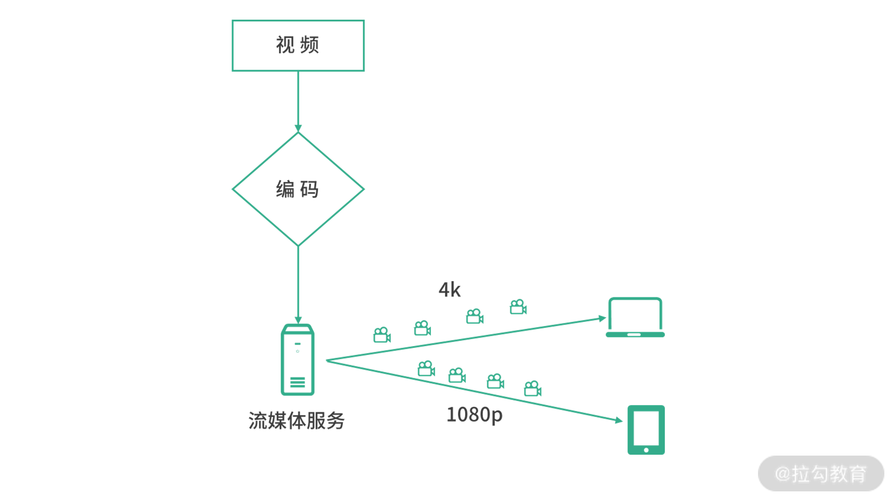
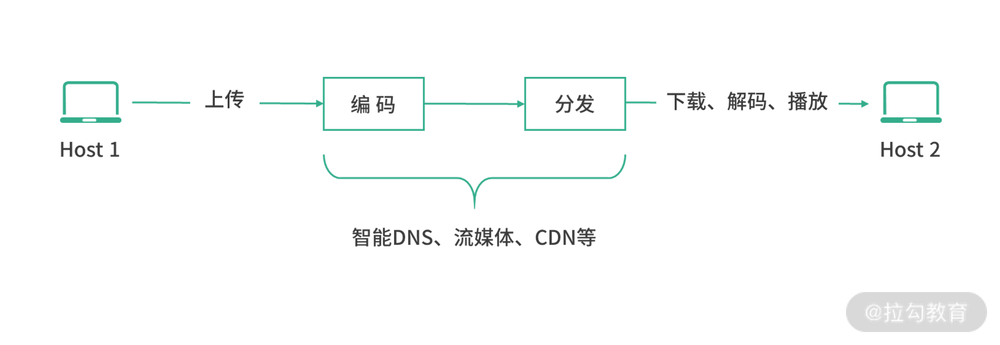

## 操作系统

- 进程
  - 进程状态：阻塞、非阻塞
  - 阻塞
    - 主动阻塞
    - IO 调用
      - IO 调用模型
- 进程通信
  - API 规范
    - HTTP
      - REST API
    - RPC
  - 方式
    - 进程之内
      - SM，SharedMemory
      - FFI，Foreign Function Interface
    - 跨进程
      - 管道
      - 消息队列
      - Socket
  - 序列化、反序列化
- 文件
  - 可执行文件
    - shell
    - 图形
  - 数据文件
  - file magic
    - 有些file magic是可以从头至尾一行行扫描的，在哪找到了，把那里当开头就行。

## vscode

- vscode remote
  - [Remote - SSH](https://code.visualstudio.com/docs/remote/ssh#_debugging-on-the-ssh-host)
  - [Remote - Containers](https://code.visualstudio.com/docs/remote/containers)
    - [附加到正在运行的容器](https://code.visualstudio.com/docs/remote/attach-container)
    - [创建开发容器](https://code.visualstudio.com/docs/remote/create-dev-container)
    - [高级容器配置场景](https://code.visualstudio.com/remote/advancedcontainers/overview)
  - GitHub Codespaces
  - The VS Code Server 
  - Remote Repositories

## 框架

- 插件设计
  - 串形
  - 洋葱
- http 客户端设计
  - https://mp.weixin.qq.com/s/By-iXlONjSZLKFG2Xd7rpg 重复 
  - https://mp.weixin.qq.com/s/NfyxtWUzjHh6ucXvBF9B4Q 缓存
  - https://mp.weixin.qq.com/s/E4SdYEkEzurfrnJrBu3bjA 并发下载
  - https://mp.weixin.qq.com/s/8RJSBwCDTvwX3Oql31ckkg 重试
  - https://mp.weixin.qq.com/s/lGqnGg-Zdnt-b7grdh9NnQ 压缩
- 主流框架原理（React、Vue）
  - 底层原理
    - 渲染：视图是状态的一种映射 `UI = f(state)`
      - VDom 渲染机制
        - render => vdom
        - diff vdom
        - patch
    - 响应
      - 数据驱动：state => UI
        - vue 依赖追踪
      - 事件驱动
  - 上层范式：组件
    - 组件：将状态与「和他相关的 UI 映射关系」约束在一起
      - 组件是为了解决框架实现原理中「UI到状态的映射」的途径
    - 语法
      - 对象形式
      - 函数式
- 逻辑分离、复用
  - 组件 => 松散耦合单元
  - Model 与 UI 分离 => model、viewmodel
    - 状态逻辑
    - UI
      - 模板
      - 原子样式
- 业务架构
  - 业务
    - 业务模型
    - 模型交互流程
  - model => view
- 状态管理
  - 如何与框架实现原理尽可能契合？
  - Model 组织结构管理问题
  - 细分领域管理
    - 表单状态
    - 流程状态
    - 请求缓存
- React vs Vue
  - why hook（范式与原理哪个更为接近）
    - react 原生的响应式方案是非常依赖数据不可变性的，hook、函数式编程理念与 react 更为接近
    - vue：更好的逻辑分离与组合复用、类型推导
  - vue、react 区别
    - 渲染机制差不多，响应式机制一个可变
- diff
  - 同层对比
  - type 变了就不再对比子节点
  - 移动：复用元素、尽量减少创建新元素
    - 判断 type 么？ 那不行，同 type 的节点可能很多，区分不出来的
    - 每个节点都是有唯一的标识 key，利用 key 复用
    - vue2 双端对比、vue3 最小递增子序列
- 状态管理
  - 思考
    - 人机交互的业务逻辑本身，是【针对人的行为做出反馈】
    - 异步 IO => 数据变化 => 视图渲染
      - command pattern+event driven、state$＝reduce(userIntent$, initialState)
      - 数据驱动视图，事件驱动业务逻辑
      - 状态提升或者抽离到外部单例 store
      - 在组件里写逻辑，通信问题，观察数据
      - 前端圈有些思路，违背了很多根本性的架构理念，最典型的就是依赖方向，数据流方向，读写分离的问题。只是由于绝大多数项目复杂度低，破坏性产品功能迭代少，所以对架构要求不高而已
      - 视图层依赖数据层


  - 利用原生的文件系统（ES Module）来实现对响应式全局状态的管理。
  - 分层
    - 不同场景 UI 变化、对接的数据模型不同
    - headless 组件即无 ui 组件，表示仅提供 UI 元素和交互的数据状态逻辑、状态、流转处理和API，但不提供标记、样式或预构建实现（或另外实现)
    - 有效分离了 ui 定义和业务定义、层次分明
    - 容器/展示
    - 依赖方向应该是由不稳定指向稳定，而UI是最不稳定的，如果任何逻辑一定要先让组件渲染出来，那一定是错的，没有什么值得讨论的。
    - 对象
      - 函数一等公民，也和面向对象不矛盾。在没有class的年代，js的函数一等公民加上词法作用域，带来的闭包特性，也是一种经典的面向对象的手段，所谓“闭包是穷人的对象”嘛。访问限定、封装、隔离，都可以用闭包搞定。而多态这种特性。。。JS这种鸭子类型的动态语言难道不是天然支持多态吗？多态搞起来比TS方便多了。
      - 单线程模型风格  
        - 最基础的是声明式编程，或者说函数式编程。这个风格最大的特点就“数据不可变”，变量和属性都只能赋值一次，不能重新赋值。如果一个class内部属性不可变、方法都是纯函数，那么它虽然看起来像是对象，但其实属于FP。
        - 在声明式编程的基础上，加上可变状态，也就是允许变量和属性重新赋值，就变成了“基于对象的编程”，Object-based Programing。所谓“对象”，就是可变的数据的组合。
        - 在此基础上，再加上对象之间的继承关系，就从OBP变成了OOP，“面向对象的编程”。
    - proxy响应式+OOP模型，还是选择react响应式+FP模型
    - ui、model、db
- SSR
  - dev
- css
  - Tailwind 通过使用 PurgeCSS 来扫描你的大包产物并删除你不需要的规则。这得以使其在生产环境中 CSS 文件缩减为几 KB
    - 属性化模式  
    - 自动值推导
    - 按需生成
  - Icon
    - image
    - font
      - css 类 伪元素
    - svg
      - svg
      - css 类 bg
        - dataUri
  - Theme
    - 方案
      - CSS 原生变量
      - CSS 预构建 + CSS 样式覆盖
    - 现有工程改造
      - postcss/stylelint
      - 查找 & 替换】所有颜色变量
      - 通过 Stylelint 编辑器插件提示,保存时自动替换
    - 行为
      - class、dataset 切换策略
      - 系统监听： `window.matchMedia("(prefers-color-scheme: dark)").matches`
- SSR
  - 原理
    - renderToString => html
    - 注水、客户端激活
  - 优点
    - 更快的首屏加载
    - 更好的 SEO
  - 缺点
    - 开发中的限制
      - 平台特有 API
      - 响应性
      - 组件生命周期钩子
    - 更高的服务端负载
- 同构渲染
  - 同构、通用应用：应用的大部分代码同时运行在服务端和客户端
  - 结构
    - app
    - server.js
    - client.js
- Github
  - 开发
    - Token
    - Github APP
    - OAuth APP：OAuth App 使用 GitHub 作为身份提供程序以验证为授予应用程序访问权限的用户
  - API
    - Github API
    - WebHook


vue和react都抛弃了基于class组织组件的模式，是为了解决逻辑复用带来的命名冲突问题以及依赖注入问题。


- Vue 在组件方面的心智模型仍然是「拥有数据与行为且自响应式的对象」
- React 在组件方面的心智模型是「副作用受上下文托管的纯函数」
- Props 无论是跟着 View 销毁还是函数参数总是暂时性的输入，States 无论跟着组件实例还是置外总必须是持久化的，至于怎么判断更新
- 变更集
  - 依赖追踪
  - 引用不等性


- react 为什么函数式开发范式
  - 函数式的数据不可变契合 react 原理
  - 并发
  - this.state 问题
  - React 并发模式下很容易出现数据竞态（data race）的问题。
    - this.state 是一个对象，每次更新局部，更新时也可新加 state 进去，这就让 state 整体比较混沌。
    - 使用高阶组件等模式时，会造成 this.props 中的数据来源不透明，同样混沌。
    - 因为 this 魔法指针的存在，很容易挂一大堆东西上去，互相随意调用，就会让逻辑缠绕。
  - 复用状态逻辑
    - 提供逻辑共享，以替代高阶组件。
  - 逻辑关注点
  - algebraic effects

- 框架体系不同
  - Vue
    - 组件语义：基于响应式的对象
    - Vue 在组件方面的心智模型仍然是「拥有数据与行为且自响应式的对象」
    - 接近大家习惯的 JS
  - React
    - 函数
    - 副作用受控的「执行上下文（evaluation context）」
    - React 在组件方面的心智模型是「副作用受上下文托管的纯函数」


- state 去重
  - 处理多个组件状态同时更新这种case
- props 浅对比
- diff children 动静分离
在 React 中，随时间变化的数据称为状态，状态的行为更像是快照


- React
  - 并发渲染
    - 这使 React 能够在渲染阶段暂停工作以允许浏览器处理事件。React 将在以后适当地恢复、丢弃或重新计算该工作。一旦渲染过程完成，React 仍然会一步同步运行提交阶段。
  - vDom: render => diff => patch
    - reconcile
      - render => vdom
      - diff
    - commit: patch
  - React 是如何知道输出何时以及如何实际改变的呢？
    - state
      - setState
        - 异步更新、批处理
          - React 17 及更早版本，React 事件处理程序中进行批处理
          - React 18 现在对任何单个事件循环 tick 中排队的所有更新进行“自动批处理”
        - 同步？
    - diff 算法
  - 功能组件：
    useState二传手
    useReducer派遣
    类组件：
    this.setState()
    this.forceUpdate()
    其他：
    再次调用 ReactDOM 顶层render(<App>)方法（相当于调用forceUpdate()根组件）
    从新useSyncExternalStore钩子触发的更新
  - 标准渲染行为
    - React 从树的顶部开始渲染，如果组件没有被标记为需要更新则跳过
    - React 的默认行为是，当父组件渲染时，React 会递归地渲染其中的所有子组件！
      - 在正常渲染中，React 并不关心“props 是否改变”——它会无条件地渲染子组件，因为父组件渲染！
  - 渲染并不是一件坏事——它是 React 知道它是否需要对 DOM 进行实际更改的方式！
  - React Render 规则
    - 纯函数
  - 并发渲染
    - [Fiber](https://github.com/facebook/react/blob/v18.0.0/packages/react-reconciler/src/ReactInternalTypes.js#L64-L193)
      - React 存储了一个内部数据结构，用于跟踪应用程序中存在的所有当前组件实例
      - React 将组件的所有 hooks 存储为附加到该组件的 fiber object 的链表


## 容器

### 容器突然被杀死
   
1. 容器内的主进程已成功结束
2. 交互程序的标准流没用附加管道或者终端
3. 收到关闭信号，如 `Ctrl+C`
4. 守护进程重启
5. docker stop
6. 系统杀死

7. 查看日志
8. 检查容器的状态，如退出状态码
9. 从相同的失败映像创建和启动容器，并使用 shell 覆盖入口sh点

## 程序设计语言

- 具有图灵完备性的计算机语言，就被称为图灵完备语言
  - “图灵完备”指的是语言指定的数据操作规则能够实现图灵机的全部功能
  - 图灵机是所有程序设计语言最底层的模型
  - 今天接触到的程序设计语言都是图灵完备的
- 程序设计语言发展简史
  - 机器语言
  - 汇编语言：对机器指令语义化封装
    - 缺点：不同厂商具有各自的 CPU 指令集
  - 高级程序设计语言：程序设计语言的发展就是一个“逐步远离计算机硬件，向着待解决的问题靠近”的过程
    - 屏蔽底层计算机硬件细节：如 C 语言
    - 类型系统：对内存抽象
      - 泛型编程
      - 动态类型
    - 内存管理
      - 自动垃圾回收机制
    - 如何组织程序
      - 结构化
      - 面向对象
    - 多核：高并发
      - 并发模型、异步模型
      - 内存安全
    - 语言表达力
      - 程序设计语言的一个重要发展趋势：声明式编程
      - DSL（Domain Specific Language，简称 DSL），它是一种用于某个特定领域的程序设计语言
        - DSL 不必做到图灵完备，它只要做到满足特定领域的业务需求，就足以缩短问题和解决方案之间的距离，降低理解的门槛
        - DSL 分类：区别 DSL 采用的是不是宿主语言
          - 外部 DSL 
          - 内部 DSL：本质就是一个程序库，**将意图与实现分离开来**
    - 函数式编程的程序设计语言
      - 关注如何解决问题，如何一层层构建抽象
      - 并发安全
- 首先是学习语法、编程模型
  - 命令式编程是面向计算机硬件的抽象：命令式程序就是一个冯诺依曼机的指令序列
      - 变量（对应着存储单元）
      - 赋值语句（获取存储指令）
      - 表达式（内存引用和算术运算）
      - 控制语句（跳转指令）
        - 顺序
        - 选择
        - 循环
      - 函数（过程）
    - 类型系统
    - 面向泛型
    - 面向对象：隔离（封装）、接口（多态）
    - 函数式：组合
  - 然后学习程序库
  - 最后学习运行时
- 类型是对内存的一种抽象。不同的类型，会有不同的内存布局和内存分配的策略。
不同的类型，有不同的操作。所以，对于特定的类型，也有特定的一组操作。
- 类型系统
  - 静态、动态
    - 动态
      - 类型检查
  - 强弱类型
    - 弱类型
      - 类型转化
        - 访问到了不同的地址和内存空间，这就导致程序出现严重的问题
    - 强类型
      - 类型抽象 =〉泛型
- 如何实现跨语言调用？
- 内存回收
  - 手动管理
  - 追踪式 GC
    - STW
  - 自动引用计数
  - 所有权模型

## JavaScript


- 解构
- 扩展
- 剩余

- Reflect主要是和Proxy配对使用，提供对象语义的默认行为
- get/set带有额外的receiver参数，现阶段，receiver其实只对访问器进行上下文修改。因为对于除了访问器（立即求值导致的）以外的属性，没有其他情况会出现这种上下文丢失的情况了，因为即使是一般函数调用，过程也是分步的，先获取函数对象（[[Get]]），再执行函数（[[Call]]）。而不会在[[Get]]的时候直接执行就意味着不会出现上下文丢失。receiver参数完全是为了解决访问器上下文问题而添加的。

- 二进制
  - ArrayBuffer
    - ArrayBuffer 对象表示通用的、固定长度的二进制数据缓冲区
    - 必须使用其封装类 ArrayBufferView 进行实例化后才能进行访问
    - ArrayBuffer 只是描述有这样一块空间可以用来存放二进制数据，但在计算机的内存中并没有真正地为其分配空间。只有当具体类型化后，它才真正地存在于内存中
  - ArrayBufferView
    - ArrayBufferView 并不是一个具体的类型，而是代表不同类型的 Array 的描述。这些类型包括：Int8Array、Uint8Array、DataView 等
  - Blob
    - Blob（Binary Large Object）是 JavaScript 的大型二进制对象类型


- 元编程
  - “With” 和 “eval” — ECMAScript中的动态作用域
    ，使用with和eval虽然加强了静态作用域，但相比之下，with和eval在实现上也可能会削弱变量查找和词法环境储存的性能（译注：因为这相当于扩充了当前作用域，增加了存储消耗和查找范围）。因此在ES5中，with在严格模式下被移除了，此外严格模式下的eval方法不再会在当前上下文创建变量。所以，ES5的严格模式下是完全遵守词法环境的实现。

## TypeScript

- 提取构造器参数签名
  - `ConstructorParameters<typeof Server>`
- 获取函数参数签名
  - `Parameters<typeof fn>;`
- 获取对象某一属性签名
  - `type Age = Person["age"];`

## NodeJS

- Node.js 优化
  - 计算
    - 增加线程池
- BFF
  - SFF = Serverless + BFF
- 模块
  - 使用模块代替全局变量
  - 模块风格
    - callback
    - sync
    - promise
- 日志
  - 记录、格式化和存储
  - 类型
    - error
    - warn
    - info
    - verbose
    - debug
- web 服务
  - Fastify
  - trpc
  - zod
- 日志：收集程序运行期间的信息
  - 字段
    - 信息
    - 时间戳
    - 日志级别
    - 来源
    - 目的地
  - 日志级别：表示消息优先级
    - FATAL：您的应用程序无法恢复
    - 0: error：表示系统中的错误情况恰好会停止特定操作，但不会停止整个系统。当第三方 API 返回错误时，您可以在此级别登录。
    - 1: warn
    - 2: info
    - 3: verbose
    - 4: debug
    - 5: silly
  - 格式化
  - 持久化
  - 查询

## 源码阅读技巧

找主线的意思是，你需要找到一条功能主线，建立起对这个项目结构性的认知，而不是一上来就把精力放在每一个接口的细节上。你对细节部分的了解会随着你对项目的深入而逐渐增加。而有了主线后，你就有了着力点，就可以不断深入了。

尽量忽略其他不相干 case 情况，保持主逻辑功能流程分析
**这里有个小技巧：看源码过程一般建议关注主线逻辑，像各种特殊情况可通过注释、issue 或者测试用例查看原由**。


1. 理解功能需求
2. 实现猜想
3. 功能源码主流程 debugger
4. 源码细节
   1. 看 issue
   2. 看测试用例


## 并发编程体系


- 语言分类
  - 编译型 vs 解释型
  - 强类型 vs 弱类型：对变量类型检查的程度，隐式转换
  - 静态类型 vs 动态类型：类型检查发生的时机、变量可动态类型赋值
- 编程：CPU 计算 + IO 调用
- IO
  - 内存
  - 网络
  - I/O设备
    - 磁盘
- [IO 调用模型](https://www.masterraghu.com/subjects/np/introduction/unix_network_programming_v1.3/ch06lev1sec2.html)
  - 同步阻塞
  - 同步非阻塞（主动轮询）
    - 事件驱动
      - 单信号驱动
      - IO 多路复用
  - 异步IO
- 线程切换
  - 切换时机
    - 系统调用（system call）
      - 软中断
    - 中断（interrupt）
      - 中断信号
      - 时钟中断
  - 上下文切换(Context switching)
- 并发
  - 调度模式
    - 抢占式调度
    - 协作式调度
  - 缺点
    - 资源竞争
    - 逻辑同步
  - 编程模型
    - 线程模型
      - 多线程 + 同步原语 + 阻塞IO
    - 事件模型
      - 事件驱动 + 
        - 协程
          - 类似线程模型，线程：系统调度，协程：用户态调度
        - 事件循环
      - 事件驱动
        - 在合作型多任务处理中，总有一个处理内核负责所有I/O处理。其在设计模式中称为反应器模式
      - 模型
        - 单线程事件循环 + 异步回调队列
        - 协程模型
          - 特点
            - 协程就是用户态线程。协程的调度完全由开发者进行控制，因此实现协程的关键也就是实现一个用户态线程的调度器。由于协程是在用户态中实现调度，避免了内核态的上下文切换造成的性能损失，从而突破了线程在 IO 上的性能瓶颈。
            - 框架或者编程语言将阻塞操作转为无阻塞，同时将其控制权交到其他的执行线程中
          - 按调用栈分类（由于协程必须支持 挂起/恢复，因此对于挂起点的状态保存就显得极其关键。）
            - 有栈协程（Stackful Coroutine）：每个协程都有自己的调用栈，类似于线程的调用栈
            - 无栈协程（Stackless Coroutine）：协程没有自己的调用栈，挂起点的状态通过状态机或闭包等语法来实现。
          - 按调度方式分类
            - 对称协程（Symmetric Coroutine）：任何一个协程都是相互独立且平等的，调度权可以在任意协程之间转移。对称协程有自己独立的调度器，除了挂起是由自己主动让出，它更像一个操作系统的原生线程，协程的调度运行完全取决于自己的调度器，在一个协程挂起后可以调度任何一个协程。
            - 非对称协程（Asymmetric Coroutine）：协程出让调度权的目标只能是它的调用者，即协程之间存在调用和被调用关系。
              - 通过语法 `yield`、`await` 显示协作
          - 范式
            - CSP
            - Actor

## rust

## 软件设计

- 软件设计目标
  - 功能性：软件设计应该满足用户需求，实现所需的功能和特性。
  - 可靠性：软件设计应该能够在预期的条件下正常运行，并具有一定的容错能力。
  - 可用性：软件设计应该易于使用和理解，用户能够轻松地完成所需的任务。
  - 可维护性：软件设计应该易于维护和修改，使得开发者能够快速有效地对软件进行更新和修复。
  - 可扩展性：软件设计应该能够支持未来的扩展和修改，以适应不断变化的需求。
  - 安全性：软件设计应该具有一定的安全性，以保护用户数据和系统资源。
  - 高性能：软件设计应该能够在合理的时间内完成所需的任务，并能够有效地利用系统资源。
  - 可测试性：软件设计应该易于测试，以确保软件系统的正确性和稳定性。
- 设计模式：代码编写层面的设计指导
  - 是一种使代码更加面向对象、可维护、可重用的指导原则
  - 软件设计模式强调的是解决方案，目的是提高代码的质量和效率
- 软件架构
  - 架构：系统结构描述
  - 软件架构：软件架构是一种软件系统的结构组织，是对软件系统的各个模块、组件、接口、数据流等的描述及**组合关系**，和它们协同起来完成功能的**运作规则**（时序图）
    - 架构 = 系统、模块（从业务维度上职责的划分）、框架（规范、约束）、组件（技术维度上的复用）
  - 架构设计的主要目的是为了解决软件复杂度带来的问题
    - **架构即(重要)决策**，是在一个有约束的盒子里去求解或接近最合适的解
  - 架构设计
    - 物理层面：业务量级
    - 业务层面：业务架构
  - 常见架构设计
    - 面向服务架构（service-oriented architecture，简称 SOA）
      - 每个服务都是一个独立的功能单元，承担不同的功能，服务之间通过通信协议连在一起
      - **微服务**就是采用容器技术的面向服务架构
        - 一个微服务就是一个独立的进程
- 软件评估标准
  - 性能
  - 可用性、稳定性
  - 可扩展
  - 安全
- 软件设计方法
  - 关注点分离
    - 变与不变分离
- 面向对象系统设计，对需求进行分析从而产生概念模型
  - 模型
    - 业务层面：概念模型
    - 实现层面：设计模型
  - UML 工具

## 编程语言

- 运行时
  - 程序生命周期中的阶段
  - 运行时库
  - 运行时系统
- 结构化语言设计
  - 语法结构
    - 变量、值和类型
    - 表达式与运算符
    - 控制流
      - 顺序
      - 循环
      - 分支
      - 跳转
    - 函数
    - 模块
- 代码复用
  - 代码拷贝
  - 指针拷贝
    - 组合
    - Mixin
  - 指针委托
    - 继承
    - 原型链
- 编程技巧
  - Class 类
    - 类也是一种模块
    - 在一些情况下存在特定场景，需要抽象出与具体实现、实例化无关的通用逻辑，或者纯调用关系的逻辑，但是使用传统的抽象类会陷入到单继承的窘境。以往常见的做法是，实现由静态方法组成的工具类（Utils），比如 java.util.Collections。
    - 代码复用
      - 抽象类是不能实例化的类，用 abstract 关键字修饰 class，其目的主要是代码重用、覆盖（多态）
      - 我们可以把通用功能放到抽象类；而一些特定的行为或属性，我们可以通过继承放到实现类中
- 函数式编程
  - Lambda 演算和图灵机是等价的？
    - 函数式编程来自 λ 演算法
      - λ 演算，规则非常简单，只有三条
        - `<表达式>::= <标识符>`
        - `<表达式>::= (λ<标识符>.<表达式>)`
        - `<表达式>::= (<表达式> <表达式>)`
  - 用面向对象编程的方式对系统的结构进行搭建，然后，用函数式编程的理念对函数接口进行设计/或者说计算设计
    - 分离可变状态
    - 副作用隔离
      - Monad
    - 可组合性 => 接口 => 抽象 => 分离关注点
      - 函数的合成还必须满足结合律
  - Pointfree 的本质就是使用一些通用的函数，组合出各种复杂运算
  - 函数式编程是一种编程的模式，在这种编程模式中最常用的函数和表达式。它强调在编程的时候用函数的方式思考问题，函数也与其他数据类型一样，处于平等地位。可以将函数作为参数传入另一个函数，也可以作为别的函数的返回值。函数式编程倾向于用一系列嵌套的函数来描述运算过程。
    - 简单说，Pointfree 就是运算过程抽象化，处理一个值，但是不提到这个值。这样做有很多好处，它能够让代码更清晰和简练，更符合语义，更容易复用，测试也变得轻而易举。
- 类型
  - 类型层次
    - 向上转型？
  - 结构化类型
    - 接口标记
- 接口和抽象类
  - 抽象类可扩展功能
  - 接口是对行为的抽象
  - 接口的多继承
  - 接口标记

## JavaScript

- 变量可变 + 状态共享 => 状态变化 => 状态管理
- 值保证不会显式改变一个量，而纯函数保证的是，不会隐式改变一个量

- 函数式编程
  - 副作用
    - 状态：无状态，但计算机世界里是有状态的，如何隔离状态
      - 不可变
        - 函数式编程的不变性。函数式编程的不变性主要体现在它的值和纯函数上
        - 不可变就是在减少程序被外界影响的同时，也减少对外界的影响


        - 脏东西，这种被称为对现实世界的影响（Effect）
        - 因为脏东西被装在盒子里，我们又回到了纯函数的世界。换句话说，在计算的过程中，一旦出现了脏东西，那我们就用一个新盒子把它装进去，然后对自己说，“这个盒子里有个脏东西”，然后进行下一步。注意到，我们没有打开盒子，所以自然就没有对世界产生任何影响。
        - 把这个装了脏东西的盒子当做函数的输出
          - 打开的过程是有影响的，但是在计算f(x)的过程中，是纯函数，是没有影响的。这就是我们经常说的，要把影响（或者说副作用）push to edge，即推到纯函数的外面，程序的边缘地带。

- 函数操作复习
  - 部分应用可以减少每次函数调用时需要传入的参数，而柯里化更是把函数调用时需要传入的参数数量，降到了 1。它们实际上都起到了控制参数数量的作用
  - 通过柯里化每次传一个参数
- Pointe-Free Style
  - var isOdd = (x) => equalsToOne(remainderOfTwo(x));
  - point free的理解：把参数去掉，是指参数的含义已经体现在函数声明（名字）里面了，比如equalsToOne，那就是说传入的值是否等于1，如果是equalsToA，那么这个A就得传为参数，加上要比较的x就是两个参数了。这就是所谓“暴露给使用者的就是功能本身”。
- reducer
  - 它最主要的作用其实是解决在使用多个 map、filter、reduce 操作大型数组时，可能会发生的性能问题。而通过使用 transducer 和 reducer，我们就可以优化一系列 map、filter、reduce 操作，使得输入数组只被处理一次并直接产生输出结果，而不需要创建任何中间数组
  - composeReducer 原理


- 谁告诉你Monad可以简化IO操作的？ Monad最大的作用就是在pure 函数式编程中处理副作用


    - 插件式架构
    - 依赖倒置

- 控制反转，是框架经常使用到的一种模式，其核心是反转控制流，由框架来调用应用，而不是应用来调动框架。
- 依赖注入就是为了解决这个问题而生的，它的核心思路是：客户端只需要声明自己依赖的接口，而不要真正去实例化它，真正的实例会在合适的时机注入到客户端中去
- 依赖倒置原则，是面向对象设计原则 SOLID 中的 D（Dependency Inversion），核心要义是：不要让高层依赖底层，而要让底层依赖高层的抽象。
  - 依赖注入的最主要目的，就是为了实现依赖倒置。一个是手段，一个是目的。

- 对象
  - 公开属性
  - 私有属性
  - 静态属性
    - 静态属性只能作用于 class 本身。
    - 普通属性里调用
  - 静态私有属性
- 实现私有属性
  - 主要有闭包、WeakMap 和 Symbol 这三种方式。
    - 构造器 + 闭包
      ```js
      function WidgetG() { var appName = "天气应用"; this.getName = function(){ return appName; }}WidgetG.prototype = (function(){ var model = "支持安卓"; return { getModel: function(){ return model; } }}());var widget7 = new WidgetG();console.log(widget7.getName()); // 返回 “天气应用”console.log(widget7.getModel()); // 返回 “支持安卓”
      ```
- WeakMap，它的特点是只接受对象作为键名，键名是弱引用，键值可以是任意的
- JavaScript 中是通过哪些方法来解决代码复用
  - js：基于原型链的继承
  - 委托
  - 借用：在 JavaScript 中，函数有自带的 apply 和 call 功能。我们可以通过 apply 或 call 来“借用”一个功能。
  - 拷贝
  - 组合混入
- JS-代码复用
  - 复制
    - object.assign
  - 组合/委托
- 多态
  - 多态的特性就是，运行期才能动态决定调用的子类方法。对某个类型调用某个方法，执行的实际方法可能是某个子类的覆写方法
  - 可见，多态具有一个非常强大的功能，就是允许添加更多类型的子类实现功能扩展，却不需要修改基于父类的代码。
  - 多态机制使内部结构不同的对象可以共享相同的外部接口。即子类可以重写父类的某个函数，从而为这个函数提供不同于父类的行为。一个父类的多个子类可以为同一个函数提供不同的实现，从而在父类这个公共的接口下，表现出多种行为。
  - 多态的使用场景：当类之间存在层次结构，并且类之间是通过继承关联时。这意味着，虽然针对不同对象的具体操作不同，但通过一个公共的类，它们（那些操作）可以通过相同的方式予以调用。
- 组合、继承意义
  - 业务开发
  - 基础设施？
- object 接口
- 继承、组合
  - 继承 自定而下的关系定义
  - 组合 
- 父母都是以自身经历过往去教育孩子，可以他们为模板下的孩子有可能发展成为不了未来人才
- js 类实现、Object.create
- 实现私有属性的方法其实就两种：闭包和 symbol
- 在 JavaScript 中，this 是在运行时而不是编写时绑定的。所以要正确地使用它，需要考虑到函数调用时的执行上下文。
- 在 this 的绑定中，有一点是需要我们注意的，那就是当我们使用箭头函数的时候，this 是在词法域里面的，而不是根据函数执行时的上下文。
- 箭头函数区别
  - 不能作为构造函数
- JavaScript 当中有几种类型的值
  - 7+1
- 为什么 0.1+0.2 不等于 0.3？
  - 解决
- 如何判断一个值是不是数字
- Object.create
- 如何识别一个数组？ isArray
- 对象创建
  - 字面量语法
  - 构造器语法

## 编译原理

- 词法分析
- 语法分析
- 语义分析
- 代码生成

## 网络

- 数据交换：先从一条链路进入交换设备，然后缓存下来，再转发（切换）到另一条路径    
  - 交换技术的本质，就是让数据切换路径
- 网络传输
  - 类型
    - 端到端（Host-to-Host）
    - 广播的能力，是一对多、多对多
  - 分片传输
  - 寻址：路由、路径选择
    - 网络状态
- 网络问题
  - 乱序
  - 丢包
    - 包损坏
    - 超过 MUT
    - 超过 TTL
  - 阻塞、延迟
- 网络性能指标
  - 吞吐量
  - 丢包率
  - 延迟
- TCP（Transport Control Protocol）是一个传输层协议，提供 Host-To-Host 数据的可靠传输，支持全双工，是一个连接导向的协议。
  - 序号
  - 丢包
    - 请求/响应模型
    - 确认与重发的机制
      - 超时重传：每一个发送了，但是没有 ACK 的包，都有设一个定时器，超过了一定的时间，就重新尝试
        - TCP 动态采样 RTT 的时间进行加权估算超时时间
        - 超时间隔加倍。每当遇到一次超时重传的时候，都会将下一次超时时间间隔设为先前值的两倍。两次超时，就说明网络环境差，不宜频繁反复发送
      - 快速重传：当接收方收到一个序号大于下一个所期望的报文段时，就会检测到数据流中的一个间隔，于是它就会发送冗余的 ACK，仍然 ACK 的是期望接收的报文段。而当客户端收到三个冗余的 ACK 后，就会在定时器过期之前，重传丢失的报文段
        - 例如，接收方发现 6 收到了，8 也收到了，但是 7 还没来，那肯定是丢了，于是发送 6 的 ACK，要求下一个是 7。接下来，收到后续的包，仍然发送 6 的 ACK，要求下一个是 7。当客户端收到 3 个重复 ACK，就会发现 7 的确丢了，不等超时，马上重发
    - 收到应答包确定连接建立
  - 流量控制（大小）
    - 滑动窗口 rwnd 是怕发送方把接收方缓存塞满，而拥塞窗口 cwnd，是怕把网络塞满
  - 拥塞控制（速度）


- TCP 和 UDP 有哪些区别？
  - TCP 是面向连接的，UDP 是面向无连接的。
    - 所谓的建立连接，是为了在客户端和服务端维护连接，而建立一定的数据结构来维护双方交互的状态，用这样的数据结构来保证所谓的面向连接的特性。
  - TCP 提供可靠交付。通过 TCP 连接传输的数据，无差错、不丢失、不重复、并且按序到达。
    - UDP 继承了 IP 包的特性，不保证不丢失，不保证按顺序到达。
  - TCP 是面向字节流的
    - UDP 继承了 IP 的特性，基于数据报的，一个一个地发，一个一个地收。
  - TCP 是可以有拥塞控制的。它意识到包丢弃了或者网络的环境不好了，就会根据情况调整自己的行为，看看是不是发快了，要不要发慢点。UDP 就不会，应用让我发，我就发，管它洪水滔天
  -  TCP 其实是一个有状态服务，通俗地讲就是有脑子的，里面精确地记着发送了没有，接收到没有，发送到哪个了，应该接收哪个了，错一点儿都不行。而 UDP 则是无状态服务。通俗地说是没脑子的，天真无邪的，发出去就发出去了。
- MAC 层定义了本地局域网的传输行为
- IP 层定义了整个网络端到端的传输行为
- 网络传输是以包为单位的，二层叫帧，网络层叫包，传输层叫段。我们笼统地称为包
-  IP 头里面有个 8 位协议，这里会存放，数据里面到底是 TCP 还是 UDP，当然这里是 UDP
-  适合场景
   - 需要资源少，在网络情况比较好的内网，或者对于丢包不敏感的应用
   - 不需要一对一沟通，建立连接，而是可以广播的应用
   - 需要处理速度快，时延低，可以容忍少数丢包，但是要求即便网络拥塞，也毫不退缩，一往无前的时候
     - TCP 在网络不好出现丢包的时候，拥塞控制策略会主动的退缩，降低发送速度，这就相当于本来环境就差，还自断臂膀，用户本来就卡，这下更卡了。
     - HTTP 协议，往往采取多个数据通道共享一个连接的情况，这样本来为了加快传输速度，但是 TCP 的严格顺序策略使得哪怕共享通道，前一个不来，后一个和前一个即便没关系，也要等着，时延也会加大。
     - 流媒体的协议
       - 直播
         - 实时性比较比较重要，宁可丢包，也不要卡顿的
         - 对于丢包，其实对于视频播放来讲，有的包可以丢，有的包不能丢，因为视频的连续帧里面，有的帧重要，有的不重要，如果必须要丢包，隔几个帧丢一个，其实看视频的人不会感知，但是如果连续丢帧，就会感知了，因而在网络不好的情况下，应用希望选择性的丢帧。
     - 实时游戏
- TCP/UDP建立连接的本质就是在客户端和服务端各自维护一定的数据结构（一种状态机），来记录和维护这个“连接”的状态 。并不是真的会在这两个端之间有一条类似“网络专线”这么一个东西（在学网络协议之前脑海里是这么想象的）。
- 在IP层，网络情况该不稳定还是不稳定，数据传输走的是什么路径上层是控制不了的，TCP能做的只能是做更多判断，更多重试，更多拥塞控制之类的东西。
- 滑动窗口
  - 流量控制
  - 拥塞控制


- 内网服务外网用
  - 动态公网IP + DDNS
  - 内网穿透
  - IPv6
- 称呼
  - TCP,段
  - IP，数据包
  - 链路层，Frame（帧）
- 其他
  - 吞吐率：吞吐量指单位时间内可以传输的平均数据量。比如用 bit/s 作为单位，就是 bps
- 传输层
  - 通常TCP数据包的长度不会超过IP数据包的长度，以确保单个TCP数据包不必再分割
  - TCP
- 网络层、链路层
  - 数据在网络中交换（封包交换算法），并不需要预先建立一个连接，而是任由数据在网络中传输，每个节点通过路由算法帮助数据封包选择下一个目的地
  - 网络层
    - IP 寻址
    - 选路
      - BGP
  - 性能至上的 IP 层
    - 无连接、非可靠、无确认
  - 数据链路层
    - 封装帧
    - MAC 寻址
    - 定义物理层标准
  - 路由器
    - 网络层
    - 连接不同网络
  - 交换机
    - 链路层
    - 连接同一网络下的不同主机
    - 交换
      - 交换技术的本质，就是让数据切换路径。因为，网络中的数据是以分组或封包（Packet）的形式传输，因此这个技术也称作封包交换技术（Packet Switch）
      - 具有交换能力的设备
        - 路由器
        - 链路层交换机


  
- 称呼
  - 传输层：TCP 段
  - 网络层：IP 封包 Packet
  - 链路层：Frame


- 保证顺序的具体算法，以及如何在保证顺序的基础上，同时追求更高的吞吐量
  - 滑动窗口
    - 传输需要保证可靠性，还需要控制流速，这两个核心能力均由滑动窗口提供
- 网络安全
  - https 安全协议
  - 防火墙
- Whireshark 追溯的是最底层网卡传输的 Frame（帧），可以追溯到数据链路层。因此对二进制形式的解读，也就是我们的消息视图也要分层。因为对于同样的数据，不同层的解读是不同的。
- 网之初，性本善，不丢包，不乱序

## 工程

- 工程思维
  - 分解问题
  - 分层
- 应用及工程优化问题
  - 计算
    - 算法优化
    - 增量计算
      - 缓存
    - 并发计算
      - 多核：并行计算
      - 单线程：分片计算

## css

- CSS Modules
- Atomic CSS
- CSS in JS
   - https://github.com/vanilla-extract-css/vanilla-extract
   - https://emotion.sh/docs/introduction
   - https://styled-components.com/

## Web

页面加载
  - 网络层
    - 连接复用
    - 并发连接
    - CDN
    - 缓存
  - 减少页面初载时，所需加载资源的「数量」和「体积」
    - 代码分割
      - 如何查看代码利用率
  - 初始渲染
    - 减少阻塞渲染的请求
      - 将脚本标签放在 body 标签的底部；
      - 使用 async 异步加载脚本；
      - 内联小型 JS 或 CSS 代码段（如果它们需要同步加载）
    - 避免阻塞渲染的顺序请求链
      - 内联合并
      - 预加载或预连接
- 页面交互

[延迟加载非关键 CSS](https://web.dev/defer-non-critical-css/)
  - devtool
    - 测量 Performance
    - 优化 Coverage
  - 提取关键 css
    - [critical](https://github.com/addyosmani/critical)
  - 异步加载非关键 CSS
    - `<link rel="preload" href="styles.css" as="style" onload="this.onload=null;this.rel='stylesheet'"><noscript><link rel="stylesheet" href="styles.css"></noscript>`
- 预加载关键资产以提高加载速度

- preconnect
- prefetch 
- preload


- WebGPU
  - [Babylon.js](https://github.com/BabylonJS)
- 页面
  - 加载
    - 减少资源文件的请求数量
    - 减小每个资源文件的大小
      - 懒加载
        - 按路线拆分代码
      - 分析大小、组成
        - 使用webpack-dashboard和webpack-bundle-analyzer等工具来了解您的应用程序有多大。每隔几个月重新审视一下您应用的整体性能
        - bundlesize验证 webpack 资产不超过指定的大小。将它与 CI 集成，以便在应用程序变得太大时得到通知
    - 提高每个资源的加载速度
      - 缓存代码
  - 交互
- 评审工具
  - Lighthouse
- 性能优化
  - 资源大小
  - 资源调度
  - 图片
    - 格式
      - webp
      - jpg
      - png
    - 响应式图片
      - 根据屏幕大小和分辨率选择性加载
        - DPR
        - srcset
        - sizes
    - Image组件的最佳实践
    - Img
      - loading="lazy"：延迟加载
        - 未指定大小的图片会降低 CLS
      - srcset/img-set
      - sizes
- pwa
  - 首屏优化
    - 静态资源优化
      - precache
    - 动态数据优化
      - 字典数据 swr
    - 直出的 html
- 实现端到端类型安全
  - tRPC、Zod、PrismatTanStack Router

## 可视化

- 可视化
  - 图形引擎
  - 图表
  - UI

## 音视频

- 流媒体
  - 本质：将音视频数据进行切片，可传输一部分即可播放一部分
  - HLS（HTTP Live Streaming）：流媒体协议
    - m3u8
      - m3u8 文件是目录，它记录了每个视频切片文件（ts）对应的视频时间范围
  - 架构    
  - 直播
    - 录制端不断上传视频内容，视频内容编码后流媒体服务器负责分发
    - m3u8 文件可以看作一个动态的文件，能够不断产生新的数据。因此直播技术中，可以考虑将获取 m3u8 文件设计成一个接口，不断由播放器请求新的 m3u8 文件
    - 架构    
      - 录制端：负责录制直播视频，用流的形式上传。
      - 计算集群：专门负责编码上传的流数据，然后进行压缩、转码、切片等工作。
      - 对象存储：存储原始视频和转码后的视频（相当于 CDN 的源，回源用）。
      - CDN：将转码后的内容分发到离用户较近的节点，方便用户获取。
      - 直播 App：给用户看直播时使用
- 视频的编码和解码

## web

- Web 生态架构
  - 协议方面
    - HTTPS 强化通信链路安全
    - HTTP/2 优化传输效率
  - 应用方面
    - Nginx/OpenResty 提升网站服务能力
    - WAF 抵御网站入侵攻击
    - CDN 内容访问加速
    - 浏览器

## 规划

- 前端工程师发展方向
  - 互联网四大件：ui，api，rpc，service 和 db
  - 转型
    - 全栈
      - BFF
        - 所谓的 api 胶水层解决方案，搞来搞去也无非缓存，RPC、MQ
      - 低代码
        - MPA + 微前端 + CSR、SSR
        - 低代码框架
          - [amis](https://github.com/baidu/amis)
      - 前后类型一体化
    - 平台前端
    - 垂类前端
      - 互动游戏，3d，xr，音视频

## 其他


- hash：每次 hash 值的变化，浏览器不发出请求，也就不会刷新页面，还会触发hashchange
- history：pushState 和 replaceState，通过这两个 API 可以改变 url 地址且不会发送请求
  - 但因为没有 # 号，所以当用户刷新页面之类的操作时，浏览器还是会给服务器发送请求
    - 为了避免出现这种情况，所以这个实现需要服务器的支持，需要把所有路由都重定向到根页面。


- stale-while-revalidate
  - 场景
    - 资源的 URL 是不能变的
    - 可接受牺牲一次资源的新鲜性
  - 配置：stale-while-revalidate大、max-age小应该是主流的选择
  - must-revalidate指令，可以屏蔽 stale-while-revalidate指令


- git
  - husky
  - lint-staged 
  - commitlint
- 版本发布：发版与 CHANGELOG 自动化
  - standard-version
  - 根据指定规则自动升级项目不同级别（major、minor、patch）的版本并打 tag
  - 对比历史 commit 提交自动生成不同版本间的可阅读、分类的 CHANGELOG 日志


- em 相对于自身元素的 font-size


- web 攻击
  - 点击劫持
  - 跨站脚本 (XSS)
  - 跨站请求伪造 (CSRF)


- 环境锁定
- 项目模板
  - plop 代码模板生产
  - 支持 Mock 数据
  - 自动生成router，过滤components组件
  - Proxy 代理


css 重叠
相同类名
相同属性

https://github.com/dcastil/tailwind-merge


提示浏览器如何加载资源


- Referer
  - Referrer-Policy
    - 默认：`Referrer-Policy: strict-origin-when-cross-origin`
      - 同源时，发送完整的 Referer 字段；
      - 跨域时，如果 HTTPS 网址链接到 HTTP 网址，不发送 Referer 字段，否则发送源信息
  - 设置 Policy 的方法
    - 元素属性
      - rel 
      - referrerpolicy
    - 标签设置整个网页的 Referer Policy 策略
    - Headers 请求头：`Referrer-Policy: no-referrer`
  - 作用及使用场景
    - 防盗链：按照 Referer 来源来判断是否在配置的白名单或者黑名单中，来决定资源能否可被访问
    - 埋点分析：Referer 提供用户的来源网址和整体访问链路
    - 错误排查（接口日志）


- vite
  - 按需编译
  - 没有打包？
  - 冷启动性能优势。
  - 开发和生产环境的一致性
  - 极致的缓存复用
- esbuild
  - 没有热更新
  - 没有缓存
  - 不支持懒打包，比如基于路由和请求的按需打包方案


- 单链表翻转（递归或者循环）
- 树的前中后序遍历
- 动态规划（爬楼梯以及变形问题、斐波那契数列、股票问题）
- 二分查找（以及变形）
- 排序（快排）
- 搜索二维矩阵
- 零钱兑换
- 验证二叉搜索树


- 贪心算法是一种在每一步选择中都采取在当前状态下最好或最优（即最有利）的选择，从而希望导致结果是最好或最优的算法
- 分治
  - 分治思想应
    - 海量数据排序
      - 分治：拆分成多份小数据
      - 合并：归并
    - 二分查找
- 回溯
  - 题目
    - 全排列
    - 没有重复
    - 八皇后
  - 其他
    - 回溯算法是在遍历「树枝」，DFS 算法是在遍历「节点」
    - 要素
      - 问题状态
      - 选择
      - base 结束条件
- 动态规划
  - why dp 效率更高
    - DP是枚举有希望成为答案的解。这个空间比暴力的小得多
    - 也就是说：DP自带剪枝。
    - DP的核心思想：尽量缩小可能解空间
  - 做动规思路
    - 分解问题
      - 定义问题状态
      - 找决策转换关系
    - 数学归纳法
  - 判断问题类型
    - 能将大问题拆成几个小问题，且满足无后效性、最优子结构性质。
- 回溯 vs 贪心 vs 动态
  - 
  - 区别
    - 贪心：局部最优解
      - 每一个阶段，我们都选择当前看起来最优的决策
      - 贪心算法是根据当前阶段得到局部最优解，然后再看下一个阶段，逐个求解。这样导致的问题就是，我们可能永远无法得到真正的最优解：整体最优解
      - 它能解决的问题需要满足三个条件，最优子结构、无后效性和贪心选择性（这里我们不怎么强调重复子问题）。


- 升维，树的结构思维
  - 组合状态 => 回溯、多分只选择模型 => 状态树
    - 树的遍历
  - 分解问题 => 解答树，推导原问题
    - 递推形式
    - 递归形式
      - 前序写法
        - 先进先出
      - 后序写法
        - 后序遍历，利用递归的堆栈帮你实现了倒序遍历的效果
          - 利用堆栈保存原来状态

- 二叉树
  - 题目
    - 104. 二叉树的最大深度
    - 144. 二叉树的前序遍历
    - 543. 二叉树的直径
    - 剑指 Offer 55 - I. 二叉树的深度
  - 二叉树解题的思维模式分两类
    - 通关遍历一遍二叉树得到答案：用一个 traverse 函数配合外部变量来实现
      - 需要在什么时候（前/中/后序位置）做？其他的节点不用你操心，递归函数会帮你在所有节点上执行相同的操作。
    - 是否可以定义一个递归函数，通过子问题（子树）的答案推导出原问题的答案？如果可以，写出这个递归函数的定义，并充分利用这个函数的返回值，这叫「分解问题」的思维模式。
  - 快速排序就是个二叉树的前序遍历，归并排序就是个二叉树的后序遍历
  - 前中后序是遍历二叉树过程中处理每一个节点的三个特殊时间点
    - 前序位置的代码在刚刚进入一个二叉树节点的时候执行
    - 后序位置的代码在将要离开一个二叉树节点的时候执行；
      - 本质上是利用递归的堆栈帮你实现了倒序遍历的效果
    - 中序位置的代码在一个二叉树节点左子树都遍历完，即将开始遍历右子树的时候执行。
      - 遍历有序数组
  - 二叉树题目的递归解法可以分两类思路，第一类是遍历一遍二叉树得出答案，第二类是通过分解问题计算出答案，这两类思路分别对应着 回溯算法核心框架 和 动态规划核心框架。
- 递归写法（有返回）、遍历写法（有全局结果）
  - 意味着前序位置的代码只能从函数参数中获取父节点传递来的数据，而后序位置的代码不仅可以获取参数数据，还可以获取到子树通过函数返回值传递回来的数据。
  - 一旦你发现题目和子树有关，那大概率要给函数设置合理的定义和返回值，在后序位置写代码了
- 二叉树的所有问题，就是让你在前中后序位置注入巧妙的代码逻辑，去达到自己的目的，你只需要单独思考每一个节点应该做什么，其他的不用你管，抛给二叉树遍历框架，递归会在所有节点上做相同的操作。
- 是否可以通过遍历一遍二叉树得到答案？如果可以，用一个 traverse 函数配合外部变量来实现。

2、是否可以定义一个递归函数，通过子问题（子树）的答案推导出原问题的答案？如果可以，写出这个递归函数的定义，并充分利用这个函数的返回值。

3、无论使用哪一种思维模式，你都要明白二叉树的每一个节点需要做什么，需要在什么时候（前中后序）做。


JVM标记清除算法：

大多数主流虚拟机采用可达性分析算法来判断对象是否存活，在标记阶段，会遍历所有 GC ROOTS，将所有 GC ROOTS 可达的对象标记为存活。只有当标记工作完成后，清理工作才会开始。
- 核心就是标记可达对象，清除不可达对象

不足：1.效率问题。标记和清理效率都不高，但是当知道只有少量垃圾产生时会很高效。2.空间问题。会产生不连续的内存空间碎片。


常见的策略有三种：先进先出策略 FIFO（First In，First Out）、最少使用策略 LFU（Least Frequently Used）、最近最少使用策略 LRU（Least Recently Used）。


循环链表
链表操作


单链表 字符串是否是回文字符串的问题


两个有序的链表合并
删除链表倒数第 n 个结点
求链表的中间结点


栈在表达式求值中的应用
栈在函数调用中的应用
栈在括号匹配中的应用
如何实现浏览器的前进、后退功能
leetcode上关于栈的题目大家可以先做20,155,232,844,224,682,496.


循环队列
确定好队空和队满的判定条件。
队空 head = tail
队满(tail+1)%n=head
队列应用 09 | 队列：队列在线程池等有限资源池中的应用
请求排队 任务排队调度
不过，设置一个合理的队列大小，也是非常有讲究的。队列太大导致等待的请求太多，队列太小会导致无法充分利用系统资源、发挥最大性能。


- 将 table / list 抽象，用类似 scheme 驱动的方式
- ui 都有差异,在设计层面，可能由于业务需求，很难做到统一，不得已自带设计体系
- 后端数据模型没有统一，因此对接数据前后涉及到的前端状态管理、数据流转也未能统一，复用性大打折扣。


因为屏幕像素密度问题，根据devicePixelRate不同要将canvas设置对大小


二分查找法：有序对半查找


- 代码无非对输入数据的计算
  - 数据处理操作
    - 增
    - 删
    - 查
  - 这些操作中，哪个操作最影响效率，对时间复杂度的损耗最大？
  - 寻找合理的数据结构最能帮助你提高数据操作的使用效率


- 递归
  - fibo
- 分治
  - 没有重复计算
    - 动态规划
    - 记忆
  - pow
- 贪心
  - 子问题的最优解能够递推到最终问题的最优解
  - 最优子结构
- 分支选择模型
  - 买卖股票
  - 优化
    - 剪枝


- 阿里三面：灵魂拷问——有react fiber，为什么不需要vue fiber呢？
  - React 从诞生之日的设计哲学就是，当状态发生变化时，重新创建所有视图。
  - 即使你只是修改了组件树最深处的一个小小的状态，React 仍然需要自顶重新创建整个 vdom 树并且 Diff
  - 引入 fiber 机制后使得 React 的渲染过程可以中断，让出主线程响应用户事件，或者允许插入更高优先级的更新
  - Vue 有一套细粒度的响应式机制，框架的更新粒度是组件级别，除此之外还有 Block Tree 等分离静态/动态模板的优化手段，更新的效率是足够高的，也就没有必要引入 fiber 这样的机制
- why react fiber


- 范式层：API + 语法
- 运行时/框架层
  - 线程模型
  - 事件驱动模型
- 操作系统
  - 屏蔽硬件
  - 向上层提供异步特性
    - 多线程
    - 异步事件

 

- 关键请求：如何确定请求的优先级以提高速度


- 闭包是指函数能够记住和访问其词法范围，即使该函数在其词法范围之外执行也是如此。


- 箭头函数
  - 没有 arguments
  - 无法通过 apply、call、bind 改变this指向


- 位运算
  - 与
  - 或
  - 异或
  - 取反
  - 左移
  - 右移
- 字典树


- 创建包
  - 运行 `npm init -y` 以创建 package.json 文件
  - package.json name
- 代码
  - 构建 CommonJS (CJS) 和 ECMAScript (ESM) 模块格式
    - p
     ```
     "exports": {
    ".": {
      "import": {
        "types": "./lib/esm/types/index.d.ts",
        "default": "./lib/esm/index.mjs"
      },
      "require": {
        "types": "./lib/cjs/types/index.d.ts",
        "default": "./lib/cjs/index.js"
      }
    }
  },
    ```

    ```
    “types": "./lib/cjs/types/index.d.ts",
"main": "./lib/cjs/index.js",
    ```
- 单元测试
  Mocha.js、Chai.js 和 ts-node。Mocha.js是一个测试运行器，Chai.js是一个断言库，用于帮助确定您是否从代码中获得了预期的结果，而ts-node帮助我们在 TypeScript 项目中使用这些工具。
- 集成测试
  - 本地
    - npm link
    - npm pack
  - 代理
    - Verdaccio
- 发布包
  - 在您的文件中添加一个files字段package.json，以指示当 npm 打包您的代码以供发布时应包含哪些文件。
  - npm version <major|minor|patch>
  - prepack在打包 npm 包以准备发布到注册表之前，npm 使用该脚本
  - 安全检查
  - `npm publish --access=public`
  - 自动化版本管理和发布
- 集成 CI/CD 


- 状态逻辑的组合特别棘手
- 如果您需要它们与组件状态交互怎么办？


- JS
  - Tagged template literals
  - Symbols
  - 2020
    - Optional chaining
    - Nullish coalescing operator (??)
    - import()
    - String.matchAll
    - Promise.allSettled()
  - 2021
    - String.replaceAll()
    - Promise.any
    - Nullish coalescing assignment (??=)
    - Logical and assignment (&&=)
    - Logical or assignment (||=)
    - WeakRef: Hold a “weak” reference to an object, without preventing the object from being garbage-collected.
  - 2022


- 日志
  - 级别
  - 格式化
  - 持久化

- `new Function`
  - `new Function ([arg1, arg2, …argN], functionBody)`
  - 上下文是全局的
  - 场景：动态生成代码、计算


```js
const pipe = (...fns) => (value) => fns.reduce((v, fn) => fn(v), value)

const asyncPipe = (...fns) => (value) => fns.reduce((chain, fn) => chain.then(fn), Promise.resolve(value))

const compose = (...fns) => (value) => fns.rightReduce((v, fn) => fn(v), value)
```


- Vue
  - 如何避免 data 中一个复杂对象（自身或属性对象）被默认被创建为响应式（Non-reactive Object）的过程
    - Object.defineProperty
    - Object.frezen


- 大型项目的 CSS 编写和维护
  - 难点
    - 协作难 易冲突 维护苦 灵活性差
  - 需求
    - 可维护性
    - 可扩展性
    - 可重用
  - CSS 规则难以管理
    - 全局命名空间
    - 权重(特异性)
    - 级联规则
  - CSS 的最佳实践
    - 样式表和关注点分离
    - CSS 方法论
      - Atomic Design
      - BEM

- store
  - model
  - 业务
  - UI


- 前端架构组织
  - 前端代码逻辑 = 业务逻辑 + 视图逻辑 + 功能
  - 前端用ddd话，像是各种领域服务值对象聚合根的概念其实是弱的，因为逻辑基本都在后端，所以大部分前端场景都是贫血模型，在前端的业务领域主要关注的是概念模型，模型核心属性，概念模型关联关系这些，前后端和产品对于领域模型的理解应该是一致的。所以像是检验这块应该属于视图/交互模型的职责，业务模型本身应该是不感知的
  - 分层
    - DB 持久化
    - Model：数据模型、业务模型
    - Service 业务交互服务场景
    - View（视图框架）
      - MVVM：面向 Model
      - MDV：把 Model 实例化并和 DOM 联动
      - UI 状态逻辑
- 框架原理
  - 
  - 响应原理
    - 作用
      - UI视图的部分，负责对接dom，响应系统的部分，负责实现数据联动
      - 由前端框架来响应式地连接UI和model
    - 原理
      - Vue
        - vue和mobx这类基于proxy的响应方案，核心依赖的就是“容器对象引用不变，内部属性状态发生改变”，而面向对象的class实例的本质，就是一个引用不变的对象，里面有一些可变的状态，还有一些用来改变这些状态的动作。完美配合！
      - React
        - react原生的响应式方案是非常依赖数据不可变性的
        - 监测变量引用（reference）的变化，然后整个子树去协调更新
        - 要求“内部不要变，容器整体引用要变”，也就是你每一个动作都必须生成一个新的实例，这样它才能检测到状态的变化。刚好和对象的特性是反的。这就天然切合声明式编程、FP的特质。
    - 上层范式
      - 视图范式
      - 模型范式
      - 我们讨论react class组件是FP还是OOP，其实不是讨论class组件API本身的风格，而是讨论“它作为UI库，更容易和FP/OOP哪种风格的model模型相对接
- js的函数一等公民加上词法作用域，带来的闭包特性
- 单线程模型风格
  - 最基础的是声明式编程，或者说函数式编程。这个风格最大的特点就“数据不可变”，变量和属性都只能赋值一次，不能重新赋值。
  - 在声明式编程的基础上，加上可变状态，也就是允许变量和属性重新赋值，就变成了“基于对象的编程”
    - 所谓“对象”，就是可变的数据的组合
  - 在此基础上，再加上对象之间的继承关系，就从OBP变成了OOP，“面向对象的编程”
    - 通过class父类子类来继承，或者通过prototype原型链来继承，各种不同的继承方案，都可以。但是继承是很容易误用的，组合优于继承，所以至少在前端开发中，实际上真正的OOP比较少，大部分是OBP。
- 这五个东西里面，只有C和D之间有强相关性，其他两两之间其实都没啥关系。对于前端开发，真正需要讨论的重大的技术方案决策，其实就是选择proxy响应式+OOP模型，还是选择react响应式+FP模型
  - C 响应原理：react 原生 vs. mobx 代理
D 模型风格：面向对象 OOP vs. 函数式 FP
- 所以，在“正常”的语言里，你搞一个user充血对象，里面挂俩save load方法，或者你搞一个user贫血对象，然后给他配两个专属saveUser loadUser函数，效果是完全一样的。事实上，c这样缺乏class基础设施的语言就是这么搞oo的，只要把user struct和相关的函数归类放好，比如放在同一个文件里，别乱掉，就完全可以表达大部分充血entity能够表达的业务逻辑。


- 设计
  - 分层与协议


- 其主要原因是只用了 Node.js 做一些工具或者简单的服务端应用，并没有真实地了解 Node.js 的特点以及所适用的场景，因此谈不上熟练应用 Node.js。如果你想在简历中带上，熟练应用 Node.js，那你可以带着这些问题来学习下本讲的知识点。
- node 服务开发
  - 首先我们需要应用工具将服务发布到远程机器上，这里就涉及devops 工具；

我们需要保证远程服务的安全与稳定，这就涉及一些进程管理工具，例如我们常见的 PM2；

我们需要判断远程服务运行是否正常，这就涉及远程服务的监控和告警机制；

遇到运行问题时，我们需要通过远程日志来定位分析问题，这就涉及日志打印和跟踪染色。

- 后端服务应用则必须关注服务的稳定与安全。因为都是基于用户发送的内容，用户有时候发送一些非法或者违法的内容。其次需要关注并发性能，因此必须充分考量服务器所能承载的最大用户并发数，在并发即将达到阈值时，又需要考量平行扩容方案。还有就是为了用户体验，需要充分做好服务的性能优化，做到极致的接口响应时间。
- 你需要在每个业务场景中，思考在哪里进行一些关键逻辑或者数据打印日志信息，这里就需要 Node.js 日志服务模块，而这类日志服务又不能影响性能，因此需要考虑一些高性能日志打印工具。其次在服务端运行，你可能会遇到诸如内存泄漏、句柄泄漏或者进程异常退出等问题，因此这里就需要这类工具和方法来分析定位现网问题。


- 一个是前端工程化的应用，另外一个是后端服务应用


- 在分层理念中，一种通用的分层思想，是将应用分为“数据层”“逻辑层”“表现层”
  - 前端分层架构
    - 视图层
    - 应用层
    - 领域层
    - 基础设施层
- 我们的代码同时承载了业务的逻辑和界面的交互逻辑
- 领域模型
  - Model：描述业务的实体对象，是业务所围绕的核心概念，你的公司所做的业务，本质上就是在创建和处理这些对象
  - Service：描述工作流程的服务对象，它们主要是对实体对象的处理过程、逻辑、事件，是使得业务产生实际效果的非实体对象
    - 领域模型帮我们描绘了有关这个业务的核心对象的各种逻辑，但是，我们的这个业务实体会面对很多场景，每一个场景下，可能存在有些特定的转化逻辑，这就需要我们在领域模型的基础上，提供对应场景的服务。简单讲，你可以把领域服务想象成领域模型实例的处理工厂，在这些处理中，我们是为了描述特定场景下的业务需求，所以，领域服务仍然是业务描述，和UI无关。
  - 总而言之，领域模型是相对比较普遍的业务描述，而领域服务是相对比较特殊的业务描述。
    - 一般来讲，服务需要遵循无状态的原则，状态一般会放在领域模型中。
  - 交互模型
    - 交互有两种，一种是界面交互，一种是业务交互
    - 交互模型会引用领域模型和领域服务，同时，它还会被用到视图层中，交给视图层使用
    - 可以把交互模型和我们平时讲的“状态管理器”划一个约等号，交互模型的实例向视图层提供状态属性和方法，属性用于视图层进行渲染，而方法用于事件回调
  - ViewModel
- 大部分业务逻辑基本都在后端，所以大部分前端场景都是贫血模型，在前端的业务领域主要关注的是概念模型，模型核心属性，概念模型关联关系这些
- ui => view-model => store/container => service => model
  - data 的 reactivity 应当仅用于从 model 向 view 的数据绑定，除此之外的逻辑都不应该依赖 data 的 reactivity
  - 数据驱动视图，事件驱动业务逻辑
    - 业务开发下，更应该关注的是业务模型，行为指令，这才是最好维护的
  - 视图层只做 data 消费，业务写在 Model 层
  - 不要视图驱动业务模型


- srs、zlm、m7s


- this week
  - [x] 车证到期
  - 博客
  - 延迟还贷
  - 找工作
    - 简历
      - 复盘项目经验
    - 面试刷题/重学
      - 算法
      - Vue
      - JS
        - 异步
        - 函数、数组
        - 对象
        - v8
        - 语法
- 规划
  - 职业
    - 不写代码，你还会做什么？
    - 或者说你怎么在代码这条路写到极致？
      - 大头兵
        - 技术经验过硬
        - 性价比要高
  - 大前端方向
    - Web 前端
    - 前端工程化
    - 跨端：桌面端、移动端、小程序
    - 图形：图表、3D
    - 游戏
    - 后端服务：Node BFF
    - 音视频
- 学习
  - node
  - rust
  - 音视频
  - 可视化
    - canvas 学习及应用
  - 软件设计
  - 重学英语
- 悟
  - 人生就是一个见招拆招的过程
  - 努力
    - 方向
      - 个人规划
      - 社会方向，比如现在人工智能大火等
  - 学习思路
    - what：是什么
      - 学什么东西，首先要摸清楚其提供的概念模型
    - why：为什么
    - how：怎么做
      - 做经典题
    - use：应用


- 小程序
  - 双线程架构
    - 沙盒
  - JS的执行和页面绘制逻辑运算是一个线程中的


- react
  - ui is a value
  - ui 即 state
  - 组件就是 state 与 ui 映射关系


- 图形
  - API
    - DirectX 12、Vulkan、Metal
    - WebGPU
      - WebGPU 是一个精确的图形 API
      - 跨平台的高性能图形标准
  - 引擎
    - Babylon.js 
- 可视化
  - 图表
  - UI


- 性能
  - TTFB： Time to First Byte——被视为点击链接和第一位内容进入之间的时间。
  - FP： First Paint - 任何像素第一次对用户可见。
  - FCP： First Contentful Paint - 请求的内容（文章正文等）变得可见的时间。
  - TTI: Time To Interactive——页面开始交互的时间（事件连接等）。


- js 正则相关 api
- 数组、字符串 api

- 如何用 napi-rs 搭建一个 Node.js 可以调用的 Rust 库
- Rust 并发和异步模型
- Rust 宏编程


- URL
  - 百分号编码：% + 2 个 16 进制数字编码（UTF-8），范围 %00 - %FF
  - js 编码
    - qs
      - 自定义性强
      - 多层嵌套对象（Nested object）的支持
      - 使用场景：拥有强大的序列化能力，可以处理复杂的类 JSON数据。
    - URL/URLSearchParams
      - 适合常规的 Web 端数据传输，处理平面数据结构
        - 数组：`key=a&key=b`
    - 延伸
      - 空格编码问题：“ ” => "%20" 或者 "+"


- 数据绑定
  - 在 Angular 中，如果不知道什么内容发生变化，就会对整个树进行脏值检查，而向上传播会导致它多次发生。在 Knockout 中，很难跟踪变化的路径，因为你会在 DOM 上走来走去，出现循环也是司空见惯的。
- 单向数据流


- lint 机制和 IDE 提示
  - git hooks


- 应用渲染静态页面的过程
  - 模板页面的渲染
    - 服务端、客户端代码构建
    - renderToString
    - hydrateRoot
  - 路由的匹配
  - header 标签的修改
  - 数据请求
    - 获取到每个模板页面初始化的请求，并在服务器端请求好，再进行 HTML 拼凑
    - 数据同步：数据状态注水脱水，让客户端、服务端同步
      - 如何防止重复请求
- typescript-plugin-css-modules


- 如何将主线程还给浏览器，以便浏览器更新页面？
  - 时间切片 + 宏任务
    - 因为宏任务是在下次事件循环中执行，不会阻塞本次页面更新，而微任务是在本次页面更新前执行
    - React Scheduler 使用 MessageChannel 就是为了产生宏任务，
      - 嵌套深的 setTimeout(fn, 0) 最低 4mm 间隔延迟
- 如何通过postMessage实现一个真正 0 延迟的定时器
  ```js
  (function () {
    var timeouts = [];
    var messageName = 'zero-timeout-message';

    // 保持 setTimeout 的形态，只接受单个函数的参数，延迟始终为 0。
    function setZeroTimeout(fn) {
      timeouts.push(fn);
      window.postMessage(messageName, '*');
    }

    function handleMessage(event) {
      if (event.source == window && event.data == messageName) {
        event.stopPropagation();
        if (timeouts.length > 0) {
          var fn = timeouts.shift();
          fn();
        }
      }
    }

    window.addEventListener('message', handleMessage, true);

    // 把 API 添加到 window 对象上
    window.setZeroTimeout = setZeroTimeout;
  })();
  ```


- css
  - bfc布局规则
- js
  - 说一下原型链，原型链实现继承。
  - vue中nextTick的实现，结合浏览器事件循环机制说一下？
  - 说说commonjs和esmodule？
  - 手写简版promise，基础架子，不用写all、race等api
  - 手写bind
- 框架原理
  - vue 模板编译原理
- http
  - http和tcp协议？
  - 缓存相关（对比缓存？强缓存？对应请求头）
  - cookie有哪些属性？
  - options
  - 简单请求？
  - 跨域？
- web 安全
- 浏览器
  - 为甚么要有同源策略？dns劫持？
  - 渲染原理
- 算法
  - 回文字符串个数
  - 猴子吃香蕉
  - 爬楼梯
  - 最长公共子串
- 项目
  - 项目怎么做的移动端适配？
    - flexible原理
    - 移动端的1像素问题怎么解决
  - 团队协作，以前的开发流程？
- 其他
  - 职业规划？
  - 有什么问题吗？
  - 为什么要离职？
  - 怎么学习的？


- VDOM 的更新机制
  - render：组件渲染生成一棵新的虚拟dom树；
  - diff：新旧虚拟dom树对比，找出变动的部分；（也就是常说的diff算法）
    - 旧 diff 算法 = 同层对比 + 深度优先 + 前序遍历
  - patch：为真正改变的部分创建真实dom，把他们挂载到文档，实现页面重渲染；
- why react fiber
  - 在数据更新时，react生成了一棵更大的虚拟 dom 树，给第二步的diff带来了很大压力，树的递归过程没法暂时停止，阻塞用户响应
  - diff 过程切片，react fiber 使得 diff 阶段有了被保存工作进度的能力
    - 为什么有了react fiber就能断点恢复呢；
      - fiber 是链表结构，只要保留下中断的节点索引，就可以恢复之前的工作进度；
- 有 react fiber，为什么不需要 vue fiber 呢？
  - vue 基于数据劫持 + 编译优化，能够更加精确更新
- hooks
  - 实现
    - hooks 实现内部实现实际将组件状态放在组件实例对应的Fiber节点里面。
  - why hooks
    - hooks 对并发友好：并发过程React内核可以维护多份数据模型，并发渲染“多个版本”的组件树
      - 而如果你用了class组件，就很容易出问题，因为“多个版本”的组件树，其中class组件的实例对象是共享的，
- Vue 与 React 框架的对比
  - 范式
  - 生态
  - 原理
- 渲染机制
- 设计思想
- 响应式原理
  - react
    - 不可变、setState
    - 会自顶向下重新渲染组件，自顶向下的含义是，该组件以及它的子组件全部需要渲染
    - 手动优化
  - vue
    - 可变、响应式
    - vue使用Object.defineProperty（vue@3迁移到了Proxy）对数据的设置（setter）和获取（getter）做了劫持，也就是说，vue能准确知道视图模版中哪一块用到了这个数据，并且在这个数据修改时，告诉这个视图，你需要重新渲染了
  - 所以当一个数据改变，react的组件渲染是很消耗性能的——父组件的状态更新了，所有的子组件得跟着一起渲染，它不能像vue一样，精确到当前组件的粒度。
- Vue
  - 性能
    - 响应式
      - proxy
    - diff
      - 静态标记
  - ref 和 reactive的区别


15
18
22
23
24
25
26
34
36
37
39
50

- 响应式更新：响应式更新」描述的是「状态与UI之间的关系
  - 状态变化如何映射到UI变化
- 单向数据流：单向数据流」描述的是「组件之间的关系
  - 当状态变化后，变化产生的影响只会从上往下传递
- 双向数据绑定：「双向数据绑定」描述的是「组件内逻辑与视图的关系」


- http 连接
  - 请求响应和长连接
    - keep-alive
      - Keep-Alive 是 HTTP 1.1 版增加的功能
  - 当一个网站需要加载的资源较多时，浏览器会尝试并发发送请求（利用多线程技术）。浏览器会限制同时发送并发请求的数量，通常是 6 个，这样做一方面是对用户本地体验的一种保护，防止浏览器抢占太多网络资源；另一方面也是对站点服务的保护，防止瞬时流量过大
  - HTTP 2.0 的多路复用


- service + model
  - 如果不考虑继承，user.save(data) 几乎就是 save(user,data)的语法糖
  - 充血的entity不可能表达所有的业务逻辑，比如对多个user的同时操作，或者跨多个类型entity同时进行操作，等等。所以ddd除了entity之外，还得需要domain service进行补充
  - 充血entity作为一条纪律，可以强迫开发者去把尽可能多的业务逻辑从流水账事务脚本中抽取出来（实在抽不出来的只能留个尾巴美其名曰domain service）。