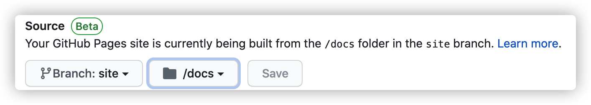

# 使用 GithubPage、GithubAction、VuePress 搭建个人博客

笔者一直想开发个人博客，类笔记，方便记录自己的技术成长过程。

首先 git 是非常适合文本文件的管理，市面也有很多基于 git 开发笔记产品，笔者也将个人项目开发放眼到 git 相关技术及生态。本文中，笔者将使用 GithubPage 作为个人博客网站静态资源托管，使用 VuePress 生成静态网站，利用 GithubAction 自动化构建部署发布。

**内容目录**
- [使用 GithubPage、GithubAction、VuePress 搭建个人博客](#使用-githubpagegithubactionvuepress-搭建个人博客)
  - [Github Page 及发布源](#github-page-及发布源)
    - [Github Page](#github-page)
    - [发布源](#发布源)
  - [自定义域名](#自定义域名)
  - [VuePress](#vuepress)
    - [vuepress 默认主题的菜单配置](#vuepress-默认主题的菜单配置)
  - [GithubAction 自动部署](#githubaction-自动部署)

## Github Page 及发布源

### Github Page

GitHub Pages 是 Github 提供的一个静态网页托管服务，你可以把你制作的 HTML 静态网页通过 git 工具上传至 GitHub 代码仓库。

Github 提供三种站点类型：
- 项目
- 用户
- 组织

用户和组织站点始名为 `<user>.github.io` 或 `<organization>.github.io` 

项目站点的源文件与其项目存储在同一个仓库中，项目的站点名为 `<user>.github.io/<repository>` 或者 `<organization>.github.io/<repository>`

因为我们的博客项目和要静态托管的资源是同处于同个仓库之中，所以我们将使用 github 项目站点的形式，即我们的站点需要例如 `laoergege.github.io/laoergege-blog` 这项的域名地址形式才能访问。如何创建项目站点可参考官方项目文档。

> [创建 GitHub Pages网站](https://help.github.com/en/github/working-with-github-pages/creating-a-github-pages-site)

### 发布源

至 2020.08.09，github page source 规则发生了变化，可以自行选择分支和发布目录（root 或者 /docs），不再像以前限定 master 上的 /docs 目录或者特定 gh-pages 分支根目录



> [GitHub Pages 站点的发布源](https://help.github.com/cn/github/working-with-github-pages/configuring-a-publishing-source-for-your-github-pages-site#choosing-a-publishing-source)

本次博客项目发布源策略：
- master 作为写作分支
- site 作为发布分支，且发布的目录为 docs
- page tag 作为构建动机（触发 github action）

## 自定义域名

项目站点类型的网站必须通过 `<xxx>.github.io/repository` 形式进行访问，非常不方便，所幸 GitHub Pages 支持自定义域名，GitHub Pages 支持两种类型的域名：
- 二级域名(eg. blog.example.com)
- 顶级域名(eg. example.com)

另外如果用户在某个项目下配置了自定义域名，该自定义域名将替换其他未配置自定义域的任何项目的 Github Page 的域名。例如，如果你有个一个项目自定义域名为 `www.octocat.com`，并且您拥有一个未自定义域名的项目网站 `octo-project`，则该仓库的 GitHub Pages 网站将在 `www.octocat.com/octo-project` 上部署。

更多详情内容参考：

> [关于自定义域名和 GitHub 页面](https://help.github.com/cn/github/working-with-github-pages/about-custom-domains-and-github-pages)

自定义域名配置步骤参考：

> [配置 GitHub Pages 网站的自定义域](https://help.github.com/cn/github/working-with-github-pages/managing-a-custom-domain-for-your-github-pages-site#configuring-a-subdomain)

自定义域名，需要注意两点：

1. 在域名服务提供商配置 CNAME 记录，指向你的 `<user>.github.io`
2. 确保每次发布的资源文件中存在 CNAME 文件，内容为你配置的域名地址

## VuePress

[VuePress](https://vuepress.vuejs.org/zh/guide/#%E5%AE%83%E6%98%AF%E5%A6%82%E4%BD%95%E5%B7%A5%E4%BD%9C%E7%9A%84%EF%BC%9F) 是基于 vue 技术开发的静态网站生成器，每一个由 VuePress 生成的页面都带有预渲染好的 HTML，也因此具有非常好的加载性能和搜索引擎优化（SEO）。同时，一旦页面被加载，Vue 将接管这些静态内容，并将其转换成一个完整的单页应用（SPA），其他的页面则会只在用户浏览到的时候才按需加载。

VuePress 默认情况下，文件将会被生成在 `.vuepress/dist`，需要 `.vuepress/config.js` 中的 dest 字段来修改成 `docs` 文件夹，以下是笔者初期的 vuepress config。

```javascript
// .vuepress/config.js
module.exports = {
  // 基本配置
  title: 'Laoergege Blog',
  description: 'Just For Fun',
  dest: path.resolve(__dirname, '../../docs'),
  extraWatchFiles: [ //监听 menu 菜单
    './menu.js'
  ],

  // theme
  themeConfig: {
    ...menu
  },
}
```

随着文章的数量越多，我们的菜单也会变多，为了方便维护管理，笔者将菜单配置分离到 menu.js 文件，并开启监听。

### vuepress 默认主题的菜单配置

笔者将 vuepress 的 nav 配置为一级菜单（nav 支持嵌套配置），sidebar 作为二三级等菜单配置

```javascript
// nav 配置
[
  // nav item
  {
   text: 'menu name',
   link: '/path',
   items: [
     {...}
   ]
  }
  ...
]
// side 配置
[
  '/path' // side item
]

// vuepress 会自动获取文件第一个 header 标题作为菜单名
// 如果你想要显示地指定链接的文字 使用一个格式为 [link, text] 的数组
[
  ['/path', 'menu name'] // side item
] 
```

link 可以省略 .md 拓展名；如果 link 以 / 结尾的路径将会被视为 */README.md，即我们访问 `host/Git/` 地址时将默认访问 `Git` 目录下 README 文件；。如果你想要显示地指定链接的文字，使用一个格式为 [link, text] 的数组。

**多侧边栏**

将侧边栏的菜单与一级菜单关联映射，实现多侧边栏菜单，我们需要将 sidebar 配置为对象形式，其 key 与 nav 菜单 link 保持一致。

```javascript
// menu.js
module.exports = {
    nav: [
        {
            text: 'JavaScript',
            link: '/JavaScript/'
        },
        {
            text: 'NodeJS',
            link: '/NodeJS/'
        },
        {
            text: 'Git',
            link: '/Git/'
        }
    ],
    sidebar: {
        // key 与 nav 菜单 link 保持一致
        '/NodeJS/': [
            'Node Event Loop'
        ],
        '/Git/': [
            // 侧边栏分组
            {
                title: 'Git 博客开发系列', // title 必要
                children: [
                    '使用 GithubPage、GithubAction、VuePress 搭建个人博客'
                ]
            }
        ]
    }
}
```

**分组侧边栏**

上面配置中，实现分组侧边栏需要将 side item 使用以下格式

```json
{
    title: 'menu name', // title 必要
    children: [
        ...
    ]
}
```

参考更多 [vuepress 默认主题配置](https://vuepress.vuejs.org/zh/theme/default-theme-config.html#%E9%A6%96%E9%A1%B5)

## GithubAction 自动部署

```yml
name: Build and Deloy

on:
  push:
    tags: 
      - page

jobs:
  build-and-deploy:
    runs-on: ubuntu-latest
    steps:
    - name: Checkout
      uses: actions/checkout@v2
      with:
        ref: site
        fetch-depth: 0
    - name: Pull
      run: |
        git config --global user.email "xxx"
        git config --global user.name "xxx"
        git pull origin master
    - name: Install-node
      uses: actions/setup-node@v1
      with: 
        node-version: 12 
    - name: SetCache
      uses: actions/cache@v1
      with: 
        path: ~/.npm
        key: ${{ runner.os }}-node-${{ hashFiles('**/package-lock.json') }}
        restore-keys: |
          ${{ runner.os }}-node-
    - name: Install
      env: 
        CI: true
      run: npm ci
    - name: Build
      run: npm run docs:build
    - name: Deploy
      run: |
        git config --global user.email "xxx"
        git config --global user.name "xxx"
        git add .
        git commit -m 'release'  
        git push
```