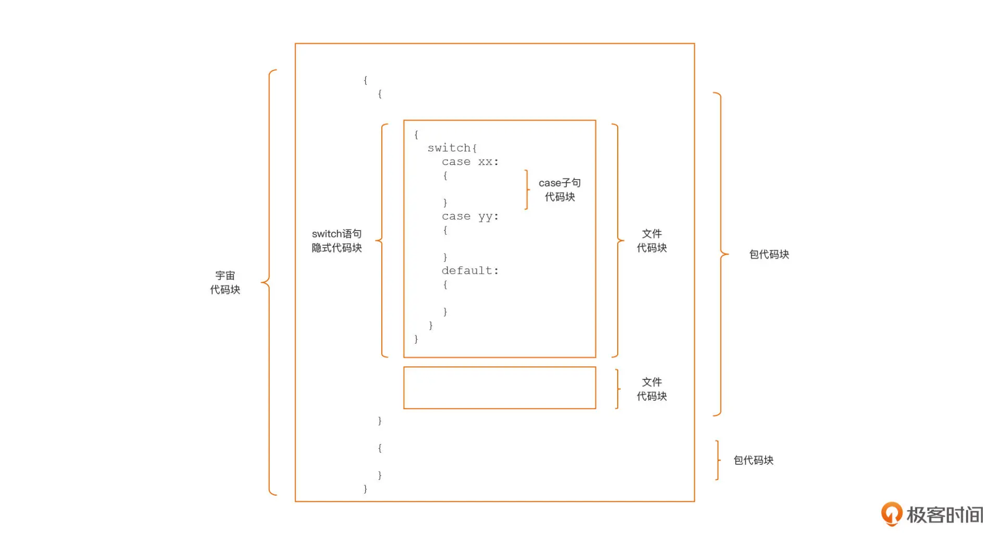
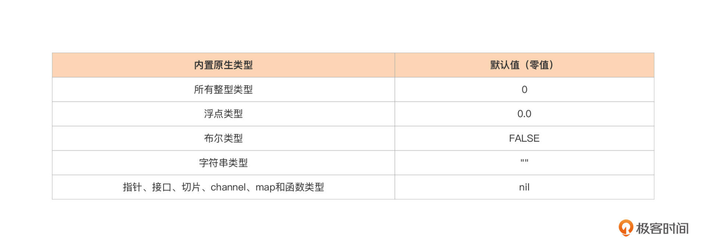
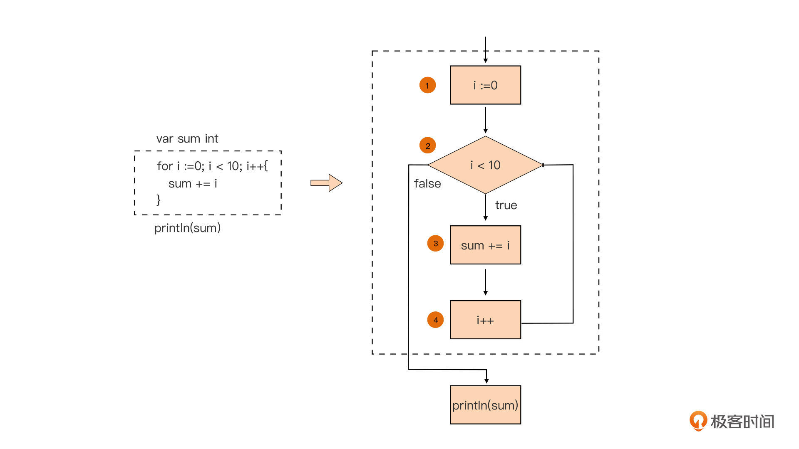

- Go
  - 设计哲学
    - 简单
    - 显示
    - 组合
      - 在计算机技术中，正交性用于表示某种不相依赖性或是解耦性
      - 语言的语法元素间和语言特性也存在着正交的情况，并且通过将这些正交的特性组合起来，我们可以实现更为高级的特性
    - 并发
    - 面向工程
      - 去除包的循环依赖
      - 包名以路径为标准
        - 导入路径的最后一个分段名与包名是相同
  - 基础
    - 程序结构
      - main.main 函数：Go 应用的入口函数
      - init 函数：Go 包的初始化函数
        - 常用用途：重置包级变量值
      - Go 包是程序逻辑封装的基本单元
        - 一个标识符要成为导出标识符需同时具备两个条件：一是这个标识符声明在包代码块中，或者它是一个字段名或方法名；二是它名字第一个字符是一个大写的 Unicode 字符。这两个条件缺一不可
      - import -> 常量 -> 变量 -> init 函数
        - 同步 import 其他 Go 包
      - 代码块与作用域    
        - Go 语言规范明确规定的。隐式代码块有五种，分别是宇宙代码块、包代码块、文件代码块、分支控制语句隐式代码块，以及 switch/select 的子句隐式代码块
          - 宇宙隐式代码块 预定义标识符
          - 包代码 包顶层声明的标识符都具有包代码块范围的作用域
          - 文件块 导入的包名
    - 变量、值和类型
      - `var (...)` 聚合声明可以提升代码可读性
      - 局部变量 短变量声明形式 `:=`
      - 零值：没有显式为变量赋予初值，Go 编译器会为变量赋予这个类型的零值
        - 复合类型变量的零值就是它们组成元素都为零值
        -   
      - 类型
        - 类型定义 `type T S`
        - 类型别名 `type T = S`
        - 分类
          - 基本数据类型
          - 复合数据类型
            - 结构体
            - 引用类型：切片、映射、通道、接口和函数类型
      - 常量
        - 不可变、编译期求值
        - 无类型常量
          - 隐式转型
        - 自动重复上一行 、const 块中的行偏移量指示器 iota
    - 控制语句
      - for
        - 除了循环体外，循环前置、条件、后置都是可选的    
        - 当仅条件
          - `for i < 10 { ... }`
          - 无限循环
            - `for true { ... }`
            - `for { ... }`
        - for range
          - `for i, v := range sl`
          - `for i := range sl`
          - `for _, v := range sl`
          - 在 for range 语句中，range 后面接受的表达式的类型可以是数组、指向数组的指针、切片、字符串，还有 map 和 channel（需具有读权限）
          - 参与 for range 循环的是 **range 表达式的副本**
        - continue + loop label、break + loop label 
          - label 跳出内层循环到指定外层循环
      - switch
        - 语法
          ```go
          switch initStmt; expr {
              case expr1:
                  // 执行分支1
              case expr2:
                  // 执行分支2
                  fallthrough；// 执行下一个 case 代码逻辑
              case expr3_1, expr3_2, expr3_3:
                  // 执行分支3
              case expr4:
                  // 执行分支4
              ... ...
              case exprN:
                  // 执行分支N
                  break
              default: 
                  // 执行默认分支
          }
          ```
        - 从上到下，表达式列表从左往右依次求值比较
        - switch 语句各表达式的求值结果可以为各种类型值，只要它的类型支持比较操作即可
        - 无论 default 分支出现在什么位置，它都只会在所有 case 都没有匹配上的情况下才会被执行的
        - case 匹配执行完毕后自动结束 switch
        - fallthrough：执行下一个 case 代码逻辑
        - Go 语言规范中明确规定，不带 label 的 break 语句中断执行并跳出的，是**同一函数内 break 语句所在的最内层的 for、switch 或 select**
        - type switch
          - `switch x.(type){...}`
          - `switch v := x.(type){...}`
          - 只有接口类型变量才能使用 type switch，并且所有 case 语句中的类型必须实现 switch 关键字后面变量的接口类型
    - 函数
      - 函数参数传递采用是值传递的方式。所谓“值传递”，就是将实际参数在内存中的表示逐位拷贝（Bitwise Copy）到形式参数中
      - 结构体 分配 栈
      - 在 Go 中，可变长参数实际上是通过切片来实现的。所以，我们在函数体中，就可以使用切片支持的所有操作来操作变长参数
      - 接口类型的形参
        - 通过编译器将其他类型变量“装箱”为一个接口类型
      - 函数支持多返回值
      - 为每个返回值声明变量名，这种带有名字的返回值被称为具名返回值（Named Return Value）。这种具名返回值变量可以像函数体中声明的局部变量一样在函数体内使用
      - 函数是“一等公民”
      - 闭包
        - Go 闭包是在函数内部创建的匿名函数
      - 函数类型
        - 函数也可以被显式转型
      - 函数签名相同的两个函数类型就是相同的函数类型
    - 数组
      - `var arr [N]T`
      - `var arr1 [6]int // [0 0 0 0 0 0]` 元素自动初始为 0
      - `var arr1 [...]int{0, 0, 0} // [0 0 0 0 0 0]` 自动自动长度 3
      - `var arr1 [...]int{6: 36}` 创建长度为7且末元素为36的数组
      - `var mArr [2][3][4]int` 多维数组
      - **数组类型变量是一个整体**，这就意味着一个数组变量表示的是整个数组
    - 切片
      - 切片本质上就类似 JS 的引用类型，切片就是对底层数组的引用
        ```go
        type slice struct {
            array unsafe.Pointer //array: 是指向底层数组的指针；
            len   int // len: 是切片的长度，即切片中当前元素的个数；
            cap   int // cap: 是底层数组的长度，也是切片的最大容量，cap 值永远大于等于 len 值。
        }
        ```
      - `var arr = []T{...}` len == max
      - `arr := make([]byte, len, cap)`
      - `array[low : high : max]` 对现有数组切片引用
        - high、max 理解非闭合数组下标
        - 省略 low，默认 0
        - 省略 high、max，默认整个数组
      - append 动态扩容：当 len 超过 cap，切片就会和原数组解除“绑定”，后续对切片的任何修改都不会反映到原数组中了
    - 结构体与方法
      - 结构体
        - 声明
          ```go
            type T struct {
                Field1 T1
                Field2 T2
                ... ...
                FieldN Tn
            }
          ```
        - 字段名首字母大小写决定可见性（大写 可见）
          - 私有字段 使用特定的构造函数完成赋值
      - 方法
        - Go 语言中的方法的本质就是，一个以方法的 receiver 参数作为第一个参数的普通函数（receiver 相当于其他语言中方法里的 this）
          ```go
          func (t *T或T) MethodName(参数列表) (返回值列表) {
              // 方法体
          }
          ```  
        - 方法接收器（receiver）参数、函数 / 方法参数，以及返回值变量对应的作用域范围，都是函数 / 方法体对应的显式代码块
        - receiver
          - receiver 参数也是方法与类型之间的纽带
          - 方法声明要与 receiver 参数的基类型声明放在同一个包内，也就是不能跨越 Go 包为其他包的类型以及内置类型声明新方法
          - receiver 参数的基类型本身不能为指针类型或接口类型
          - receiver 参数的类型
            - T 类型为实例的副本
            - *T 类型则为实例本身
            - ***T 和 T 调用方法时编译器互相转换**
        - 方法直接调用
          - `<T|*T>.<method>(<t|&t>, ...)`
    - 接口
      - 一组方法的集合
      - 接口类型变量
        - 结构化类型
          - interface{} 空接口类型的这一可接受任意类型变量值作为右值的特性
      - 接口逆操作也就是通过接口类型变量“还原”它的右值的类型与值信息，这个过程被称为“类型断言（Type Assertion）”
        - v, ok := i.(T)
          - 断言存储在接口类型变量 i 中的值的类型为 T
        - v := i.(T)
          - 断言失败会发生 painc
      - 方法集合论
        - 方法集合也是用来判断一个类型是否实现了某接口类型的唯一手段，可以说，“方法集合决定了接口实现”
        - Go 语言规定，*T 类型的方法集合包含所有以 *T 为 receiver 参数类型的方法，以及所有以 T 为 receiver 参数类型的方法
      - 接口类型变量
        - 静态特性：编译时类型安全
        - 动态特征：接口类型变量在程序运行时可以被赋值为不同的动态类型变量
          - 所谓鸭子类型，就是指某类型所表现出的特性（比如是否可以作为某接口类型的右值），不是由其基因（比如 C++ 中的父类）决定的，而是由类型所表现出来的行为（比如类型拥有的方法）决定的
        - `error != nil` 问题：注意接口类型的数据结构
          - 接口类型变量的内部表示
            ```go
            // $GOROOT/src/runtime/runtime2.go
            // 空接口类型
            type eface struct {
                _type *_type
                data  unsafe.Pointer
            }
            // 非空接口类型
            type iface struct {
                tab  *itab
                data unsafe.Pointer
            }
            type itab struct {
                inter *interfacetype // 指向接口类型信息
                _type *_type // 指向数据类型信息
                hash  uint32 // copy of _type.hash. Used for type switches.
                _     [4]byte
                fun   [1]uintptr // 存放接口方法地址
            }
            ```
          - 未显式初始化的接口类型变量的值为 nil，也就是这个变量的 _type/tab 和 data 字段都为 nil
          - Go 在进行等值比较时，只有两个接口类型变量的类型信息（eface._type/iface.tab._type）相同，且数据指针（eface.data/iface.data）所指数据相同时，两个接口类型变量才是相等的
    - 类型嵌入：直接以`{类型名}`的方式
      - 接口类型的类型嵌入
        - TODO: 接口类型也能嵌入？接口本质是什么
        - 方法集合并入
        - 接口类型只能嵌入接口类型
      - 结构体类型的类型嵌入：直接以类型名作为结构体字段的方式
        - **组合代理（delegate）模式**
          - “实现继承”
          - 组合冲突时，必须以嵌入类型字段隔开区分，eg a.A.t、a.A.t
  - 错误处理机制
    - 统一的错误类型接口 error
      ```go
      type interface error {
          Error() string
      }
      ```
      - `err := errors.New("your first demo error")`
      - `errWithCtx = fmt.Errorf("index %d is out of bounds", i)`
    - **多返回值机制**并且以最后一个作为错误返回值的范式
    - 错误处理策略
      - 透明错误信息
        ```go
        err := doSomething()
        if err != nil {
            // 不关心err变量底层错误值所携带的具体上下文信息
            // 执行简单错误处理逻辑并返回
            ... ...
            return err
        }
        ```
      - 自定义错误值、自定义错误类型扩展我们的错误上下文
        - 错误值变量以 ErrXXX 格式命名
        - 自定义导出的错误类型以XXXError的形式命名
        - 错误匹配处理
          - 基于错误值、类型
            - error.Is 错误值比较
            - errors.As
            - 类型断言机制（Type Assertion）或类型选择机制（Type Switch）
          - 基于行为
    - panic 抛出异常、recover 捕获异常、defer 释放资源
      - 无论在哪个 Goroutine 中发生未被恢复的 panic，整个程序都将崩溃退出
      - defer
        - defer 是 Go 语言提供的一种延迟调用机制
        - defer + 表达式 
          - 表达式是在注册 deferred 函数时对表达式的参数进行求值
        - 在当前函数返回前，deferred 函数是按照后入先出（LIFO）的顺序执行的
  - 并发
    - channel 传递消息或实现同步
      - 空结构体 做 类型使用
    - select 实现多路 channel 的并发控制
    - 并发与组合的哲学是一脉相承的，并发是一个更大的组合的概念，它在程序设计的全局层面对程序进行拆解组合，再映射到程序执行层面上：goroutines 各自执行特定的工作，通过 channel+select 将 goroutines 组合连接起来
  - 工程
    - 包管理 Go Module
      - 代理配置
        - `go env -w GOPROXY=https://mirrors.aliyun.com/goproxy/`
      - 初始化 mod 文件
        - `go mod init <xxx>`
      - 添加依赖、升级 / 降级依赖的版本
        - `go get <xxx>`、`go get <xxx>@v`
        - `go mod tidy` 自动分析 Go 源码的依赖变更，包括依赖的新增、版本变更以及删除，并更新 go.mod 中的依赖信息
      - 升级 / 降级依赖的版本
        - `go get <xxx>@v`
        - 修改 mod 文件
          - `go mod edit -require=<xxx>@v`
            - `go mod tidy`
      - 删除依赖
        - 源码删除对应 import 包的语言
          - `go mod tidy`
      - Go Module 机制会自动分析项目的依赖包，并选出最适合的版本
        - 语义化版本
        - 语义导入：包导入路径中引入主版本号的方式来同时依赖一个包的两个不兼容版本
        - 最小版本选择：Go 会在该项目依赖项的所有版本中，选出符合项目整体要求的“最小版本”
    - 构建
      - dev `go run <xxx>`
      - prd `go build <xxx>`


- 整型的溢出问题
- 字符串
  - string 类型的数据是不可变的，提高了字符串的并发安全性和存储利用率
  - 多行字符串
  - 它支持字符串的主流语言一样，Go 语言中的字符串值也是一个可空的字节序列，字节序列中的字节个数称为该字符串的长度.一个个的字节只是孤立数据，不表意
  - 表意 码点
  - rune 类型与字符字面值
    - 一个 rune 实例就是一个 Unicode 字符，一个 Go 字符串也可以被视为 rune 实例的集合。我们可以通过字符字面值来初始化一个 rune 变量
    - Unicode 专用的转义字符\u 或\U 作为前缀，来表示一个 Unicode 字符
      - '\u4e2d'
  - 字符串字面值
- 内存对齐，偏移


      - Go 语言中，凡通过类型声明语法声明的类型都被称为 defined 类型
      - 类型别名 `type a = b`：类型别名定义的新类型则和原类型拥有相同的方法集合
- 指针
  - var p *T
  - var p1 = unsafe.Pointer(p)
    - 任何指针类型都可以显式转换为一个 unsafe.Pointer，而 unsafe.Pointer 也可以显式转换为任意指针类型
    - p = (*T)(p1)
  - 取地
    - var p *int = &a
  - 解引用
    - fmt.Printf("%p\n", p)
  - Go 为指针变量 p 分配的内存单元中存储的是整型变量 a 对应的内存单元的地址
  - 在 Go 语言中 uintptr 类型的大小就代表了指针类型的大小
  - 限制
    - 限制一：限制了显式指针类型转换。
    - 限制二：不支持指针运算
  - unsafe.Pointer


- 并发

  - goroutine
    - 由 Go 运行时（runtime）负责调度的、轻量的用户级线程
  - 利用的也是操作系统提供的线程或进程间通信的原语，比如：共享内存、信号（signal）、管道（pipe）、消息队列、套接字（socket）
  - 在这些通信原语中，使用最多、最广泛的（也是最高效的）是结合了线程同步原语（比如：锁以及更为低级的原子操作）的共享内存方式，因此，我们可以说传统语言的并发模型是基于对内存的共享的
  - 并发模型
    - CSP（Communicationing Sequential Processes，通信顺序进程）
      - 一个符合 CSP 模型的并发程序应该是一组通过输入输出原语连接起来的 P 的集合。从这个角度来看，CSP 理论不仅是一个并发参考模型，也是一种并发程序的程序组织方法


- 内存对齐
  - 对于各种基本数据类型来说，它的变量的内存地址值必须是其类型本身大小的整数倍
  - 对于结构体而言，它的变量的内存地址，只要是它最长字段长度与系统对齐系数两者之间较小的那个的整数倍就可以了。但对于结构体类型来说，我们还要让它每个字段的内存地址都严格满足内存对齐要求
  - 在Go中，结构体的字段会按照它们的声明顺序存储，但编译器可能会在字段之间插入填充字节（padding）以确保每个字段都按照其对齐要求对
  - min（结构体最长字段的长度，系统内存对齐系数）


- map
  - map[key_type]value_type
  - Go 语言中要求，key 的类型必须支持“==”和“!=”两种比较操作符。
  - 函数类型、map 类型自身，以及切片类型是不能作为 map 的 key 类型的。
  - 声明、初始化
  - map 类型的容量不会受限于它的初始容量值，当其中的键值对数量超过初始容量后，Go 运行时会自动增加 map 类型的容量，保证后续键值对的正常插入
  - 查找
    - Go 语言的 map 类型支持通过用一种名为“comma ok”的惯用法
  - 删除
    - delete(m, "key2")
  - 像对待切片那样通过 for range 语句对 map 数据进行遍历
    - 对同一 map 做多次遍历的时候，每次遍历元素的次序都不相同
    - 程序逻辑千万不要依赖遍历 map 所得到的的元素次序


- Goroutine 调度器
  - G-P-M 模型
- CSP 模型
  - Goroutine
  - channel
    - `var ch chan int`
      - chan<- 只发送channel类型
      - <-chan 只接收channel类型
    - ch1 := make(chan int)    无缓冲 channel
      - Goroutine 对无缓冲 channel 的接收和发送操作是同步的
    - ch2 := make(chan int, 5) 带缓冲 channel
      - 对带缓冲 channel 的发送操作在缓冲区未满、接收操作在缓冲区非空的情况下是异步的（发送或接收不需要阻塞等待）
      - 对带缓冲 channel 的发送操作在缓冲区未满、接收操作在缓冲区非空的情况下是异步的（发送或接收不需要阻塞等待）
    - channel 关闭后，所有等待从这个 channel 接收数据的操作都将返回
      - 发送端负责关闭 channel
      - ```
      n := <- ch      // 当ch被关闭后，n将被赋值为ch元素类型的零值
m, ok := <-ch   // 当ch被关闭后，m将被赋值为ch元素类型的零值, ok值为false
for v := range ch { // 当ch被关闭后，for range循环结束
    ... ...
}
      ```

  

  - 读写锁（RWMutex）
    - 写锁与 Mutex 的行为十分类似，一旦某 Goroutine 持有写锁，其他 Goroutine 无论是尝试加读锁，还是加写锁，都会被阻塞在写锁上。
但读锁就宽松多了，一旦某个 Goroutine 持有读锁，它不会阻塞其他尝试加读锁的 Goroutine，但加写锁的 Goroutine 依然会被阻塞住。
  - 条件变量
    - 我们可以把一个条件变量理解为一个容器，这个容器中存放着一个或一组等待着某个条件成立的 Goroutine。当条件成立后，这些处于等待状态的 Goroutine 将得到通知，并被唤醒继续进行后续的工作。这与百米飞人大战赛场上，各位运动员等待裁判员的发令枪声的情形十分类似
  - 原子操作由底层硬件直接提供支持，是一种硬件实现的指令级的“事务”


- 并发
  - 并发原语
    - Channel 消息通信
    - 同步原语
      - 互斥锁（sync.Mutex）
      - 读写锁（sync.RWMutex）
      - 条件变量（sync.Cond）
    - 原子操作原语
      - 原子操作由底层硬件直接提供支持，是一种硬件实现的指令级的“事务”
  - 并发编排


- if
  - 支持声明 if 语句的自用变量
  - 快乐路径
- switch-case 
  - type switch
  - case 语句还支持表达式列表


字符串 range

func main() {
    var m = []int{1, 2, 3, 4, 5}  
             
    {
      i, v := 0, 0
        for i, v = range m {
            go func() {
                time.Sleep(time.Second * 3)
                fmt.Println(i, v)
            }()
        }
    }
    time.Sleep(time.Second * 10)
}


遍历 map 中元素的随机性