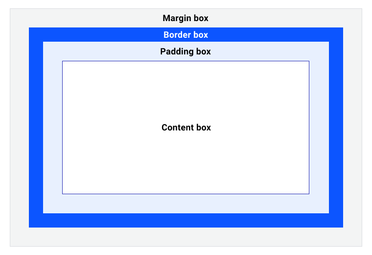

# CSS 布局

- CSS 布局
  - [盒子模型](https://developer.mozilla.org/zh-CN/docs/learn/css/building_blocks/the_box_model#%E7%9B%92%E5%AD%90%E6%A8%A1%E5%9E%8B%E5%92%8C%E5%86%85%E8%81%94%E7%9B%92%E5%AD%90)：页面是由一个个相互作用、嵌套的盒子组成
    - 盒子模型：box = content + padding + border + margin
        
    - 怪异模型和标准盒模型
      - 标准模型元素宽度 width = content
        - `box-sizing: border-box`
      - 怪异模型元素宽度 width = content + padding + border
        - `box-sizing: content-box`
  - FC：Formatting context(格式化上下文) 是 W3C CSS2.1 规范中的一个概念。它是页面中的一块独立渲染区域，并且有一套渲染规则，它决定了其子元素将如何定位，以及和其他元素的关系和相互作用，并且不受外部影响
  - 普通流：依次排列，排满换行
    - 元素由文档流中的依次顺序排列
    - 普通流包括 BFC、IFC、相对定位规则
    - [不同元素会产生相应的盒子](https://www.w3.org/TR/CSS2/visuren.html#box-gen)
    - 任何一个处在 Normal Flow 中的元素，不是在 BFC 中，就是在 IFC 中，取决于元素本身是 block box 还是 inline box
    - 在块格式化上下文中，盒子在垂直方向依次排列；而在行内格式化上下文中，盒子则水平排列
  - [BFC：块级格式化上下文](#bfc)
  - `display:  [ <display-outside> | <display-inside> ]`
    - display-outside：指定元素在文档流的布局表现
      - block 块级元素
      - inline 内联元素
      - inline-block
    - display-inside：指定元素的内部子元素的布局方式，主要有以下几类
      - 文档流
        - float
      - table
      - [flex](#flex)
        - [Flexbox](https://web.dev/learn/css/flexbox/)
        - [A Complete Guide to Flexbox](https://css-tricks.com/snippets/css/a-guide-to-flexbox/)
      - [grid](#grid)
        - [Grid](https://web.dev/learn/css/grid/)
        - [A Complete Guide to Grid](https://css-tricks.com/snippets/css/complete-guide-grid/)
        - [网格布局](https://developer.mozilla.org/zh-CN/docs/Web/CSS/CSS_Grid_Layout)
  - position：控制盒子位置，脱离父盒的内部布局
    - static
    - relative
    - absolute
    - fixed
    - sticky
    - 层叠上下文和层叠顺序
  - column-width
- CSS 尺寸单位
- 布局模式
  - 垂直水平居中
    - flex + justify-content: center + align-items: center
    - position: absolute + left: 50% + top: 50% + transform: translate(-50%, -50%)
  - 多列布局
    - 等列布局
      - inline-block
    - 自适应宽
      - calc
      - float
    - 圣杯布局（三分栏布局）

## BFC

BFC，即块级格式化上下文，除了根元素，创建 BFC 条件：

- 浮动元素
- 绝对定位元素
- display 为 inline-blocks、flow-root, 或者 Table cells，Flex items，Grid items 等的元素;
- overflow 不为 visible 的元素
- [等](https://developer.mozilla.org/zh-CN/docs/Web/Guide/CSS/Block_formatting_context)

### BFC 布局特性

1. BFC 中块级盒子垂直排放
2. 同一个 BFC 下的块级盒子垂直方向会边距重叠
3. BFC 中的盒子左外边(margin 的左边)触及 BFC 容器的包含块左边界，右外边界触及 BFC 容器的包含块右边界。即使有 float 元素存在也不会影响这个特性，除非块级元素建立了新的 BFC。
4. 同一 BFC 下一个 BFC [块容器](https://developer.mozilla.org/zh-CN/docs/Web/CSS/Visual_formatting_model)不会与浮动盒子重叠
  > 需要注意的是并不是所有创建 BFC 的元素都不会与浮动元素重叠，比如绝对定位元素，必须不是脱离原 BFC。  
  > [The border box of a table, a block-level replaced element, or an element in the normal flow that establishes a new block formatting context (such as an element with 'overflow' other than 'visible') must not overlap the margin box of any floats in the same block formatting context as the element itself.](https://www.w3.org/TR/CSS2/visuren.html#floats)
5. [在计算 BFC 的高度时，浮动元素也参与计算](https://www.w3.org/TR/CSS22/visudet.html#root-height)

BFC 应用
- 防止边距折叠（2）
- 包含浮动子元素，防止高度坍塌（5）
- 实现多列布局（4）

## Flex

- 容器
  - flex-direction
  - flex-wrap
  - *flex-flow*: flex-direction flex-wrap
  - justify-content
  - align-content
  - *place-content*: justify-content align-content
  - align-items: 弹性行内对齐项目
  - gap, row-gap, column-gap
- 项目
  - flex
  - flex-grow
  - flex-shrink
  - `flex-basis`
    - `0`：item会折叠到最小的宽度
    - auto: 子项的基本尺寸根据其自身的尺寸决定
    - [flex:0 flex:1 flex:none flex:auto应该在什么场景下使用？](https://www.zhangxinxu.com/wordpress/2020/10/css-flex-0-1-none/?shrink=1)
    - [解决用flex布局时内容可能溢出的问题](https://stackoverflow.com/questions/43809612/prevent-a-child-element-from-overflowing-its-parent-in-flexbox)
      - 本质：flex item 元素初始值 `min-width: auto`
      - 解决：`min-width: 0` 、`overflow: hidden`
  - order 对子项目排序
  - align-self: 弹性行内对齐项目

## Grid

- Grid
  - 网格容器
    - 内联轴（Inline Axis） 
    - 块轴（Block Axis）
    - 创建网格容器
      - 默认情况下，显式设置 display 的值为 grid 或 inline-grid 时，就会自动创建一个 1 x N 的网格（一列N行的网格），**其中 N 由网格容器的子元素、文本节点和伪元素决定**
  - 网格线、行列、区域、间隔
    - 网格线
      - 网格布局中未显式给网格线命名的情况下，默认是以数字索引号命名，并且从1 开始叠加，同时它的反方向则从 -1 开始命名
      - 其默认索引号会受 CSS 的书写模式 `writing-mode` 影响，但不受 `direction` 属性的影响
      - 线与线之间构成行或列，行列重叠的块则是**网格单元格**
      - **单个或多个**网格单元组成的**矩形**则是**网格区域**
    - 定格网格
      - 定义行列
        - `grid-template-<rows|columns>: [网格线命名1 网格线命名2...] 网格轨道1尺寸 ...`
          - `grid-template: <grid-template-rows> / <grid-template-columns>`
          - 隐式网格区域名称：`xxx-start` 与 `xxx-end` 的网格线命名会隐藏式生成 `xxx` 的命名区域
      - 定义区域
        - `grid-template-areas`
          - 跨行或列命名相同的网格区域名称，可以达到合并单元格的作用
          - 网格上的每一个单元格都必须被填充
            - `.` 表示一个空的网格单元
          - 隐式的网格线名称：区域的行列网格线将是 `xxx-start`、`xxx-end` 命名
    - 间隔
      - `column-gap`
      - `row-gap`
      - `gap: <grid-row-gap> <grid-column-gap>;`
  - 放置算法、自动放置、自动扩充行列（隐式网格）
    - 网格布局中的网格系统可以为分`显式网格`和`隐式网格`
      - 显式网格：即通过 `grid-template-rows` 、`grid-template-columns` 或 `grid-template-areas` 创建的网格
      - 隐式网格：即自动创建的行列和显示网格组合在一起，重新创建新的网格，这个新网格被称为隐式网格
    - `grid-auto-flow`：用来控制自动网格项目放置的流向算法
      - `row` 默认
        - 从左往右，从上往下依次放置，超出则自动扩充行
      - `column`
        - 从上到下，从左到右依次放置，超出则自动扩充列
      - `row dense`/`column dense`
        - dense 密集模式
        - 默认 sparse 稀疏模式，即放置项目时从不回溯以填补漏洞
    - 放置算法
      - 如果显式网格中没有空间来放置自动定位的网格项，则此算法可能会导致在隐式网格中创建新行或新列
        - `grid-auto-[rows|columns]：size...`
          - 来指定隐式网格轨道尺寸
          - 值列表是不断循环的
      - 创建匿名网格项目
        - 在网格系统中，网格容器内的文本节点，被称为匿名网格项目
        - 注意，网格容器的伪元素 `::before` 和 `::after` 生成的内容也被称为网格项目 ，但它们不是匿名网格项目
      - 分组处理（每组成员会按照其在源文档的位置顺序）
        - 有明确位置的网格项目（能够形成矩形区域），可直接定位
        - 仅明确指定行位置的项目（即 `grid-auto-flow: row` 模式下，如果是 `grid-auto-flow: column` 下面的算法内容则跟着对应相反）
          - 在 `row [sparse]` 模式下，在指定行上从左到右寻找不重叠并且比同组里在它前面的项目还后的网格单元
          - 在 `row dense` 模式下，在指定行上从左到右寻找不重叠的网格单元
        - 其他剩余网格项目
          - 在 `row [sparse]` 模式下，从网格的开始行列位置开始从左往右、从上往下的流向寻找未重叠的网格单元格放置剩余网格项目 A，而网格项目 B 则在 A 的后续流向寻找未重叠的网格单元格，依次类推
            - 如果剩余网格项目 B 有指定列位置，则从指定的 grid 列上递增行寻找不重叠并且在 A 后续流中的网格单元，依次类推
          - 在 `row dense` 模式下，每次都从网格的开始行列位置开始从左往右、从上往下的流向寻找未重叠的网格单元格放置剩余网格项目
            - 如果剩余网格项目有指定列位置，则从指定的 grid 列上递增行寻找不重叠的网格单元即可
  - 网格项目、对齐
    - 自主定位项目所在**网格区域**
      - 通过网格线编号或名称指定的网格线围绕的区域就是其定位的网格区域
        - `grid-[column|row]-[start|end]: <name> / <number>`
        - `grid-[column|row]: <start> / <end>`
          - `<start|end>`: `<name> / <number>`
        - `grid-area: <row-start> /  <column-start> /  <row-end> / <column-end>`
      - 通过网格区域名称
        - `grid-area: name`
      - 起始线 + 网格跨度
        - 起始线，即网格线进行跨度的初始位置。在自主定位中，起始线的位置与网格线 start 一致
          - `grid-[column|row]: <start> / span <integer>`
          - `grid-area: <row-start> /  <column-start> /  span <count> / span <count>`
        - `grid-[column|row]-[start|end]: span <integer>`
          - 不建议同时在 `grid-*-start` 和 `grid-*-end` 属性上使用 span 来合并网格单元格，因为 `grid-*-end` 的计算会被忽略
    - 项目对齐、自主对齐
    - 重叠
      - 网格项目按照在文档中出现的先后顺序来决定，越往后出现，它在 z 轴的层级越高
      - `z-index`
  - 嵌套网格、子网格
    - 嵌套网格：其子网格与父网格是两个独立的网格系统
    - 子网格（`subgrid`）：子网格继承了其父网格的网格轨道，并与之无缝对接，同时子网格功能还能增强网格项目的能力
  - `margin`
    - 网格项目上设置 margin 值时，并不会致使网格溢出容器，只会让网格项目距所在单元格（或网格区域）四边有一定的间距（margin 值）。它表现出来的现象就像是网格项目向内收缩一样

- 使用网格线定义行列、区块
  - flex
    - justify-items
    - align-items
    - `place-items: <align-items> / <justify-items> | value`
    - justify-content
    - align-content
    - `place-content: <align-content> / <justify-content> `
- item（根据网格线、行列、区去定位）
  - flex
    - order
    - align-self
    - justify-self
    - place-self

## CSS 尺寸单位

- width 尺寸关键词
  - `auto`：自动伸缩以适配父容器宽度
  - `min-content`：内部元素最小宽度值最大的元素宽度作为容器宽度
  - `max-content`：内部元素最大宽度值最大的元素宽度作为容器宽度
  - `fit-content`：在 `min-content` 和 `max-content` 范围内自动伸缩
  - 参考
    - https://css-tricks.com/fit-content-and-fit-content/
    - https://www.zhangxinxu.com/wordpress/2016/05/css3-width-max-contnet-min-content-fit-content/
- 尺寸计算函数
  - min()
  - max()
  - clamp()
  - clac()
  - grid 网格轨道专用函数
    - `minmax()`
    - `repeat(num|auto-fit|auto-fill, 列表值)`
      - auto-fill 不会扩展网格项目，将保留可用的空间，而不改变网格项目的宽度
      - auto-fit 将扩展网格项目以填补可用空间
    - `fit-content()`
- 尺寸单位
  - %：相对于其父容器的 width 计算
  - rem 是相对于 HTML 根元素（<html> 元素）的 font-size 计算；
  - em 是相对于元素自身的 font-size 计算；
  - ex 是相对于它的字体上下文的 x 高度，其中 x 的高度由 font-family 和 font-size 两个因素决定，即它等于特定字体在特定font-size 下的 x 高度；
  - ch 是基于特定字体下的 0 字形宽度来计算，它也会随字体而变化，一般情况下，它是一个估计值，因为 0 字形的宽度通常是字体的平均字符宽度；
  - vw 、vh 、vmin 和 vmax 是视窗单位，它是相对于浏览器视窗的宽度和高度来计算的
  - `fr` 
    - 弹性伸缩，仅能用于 CSS 网格布局
    - `fr` 计算规则
      - 扣除可计算后的剩余空间用于弹性分配
      - 当 `fr` 总和大于 1 时，按比例分配网格容器的可用空间
      - 当 `fr` 之和小于 1 时，`弹性系数 * 可用空间`，意味着它们将只占用小于 100% 的网格容器的可用空间
      - 最小尺寸触发
        - `fr` 会自动设置最小值 `min-width: min-content`
        - 当弹性网格轨道大小小于最小尺寸时，将以 `min-cotent` 作为其尺寸，并重新计算调整其他弹性轨道
    - 在 `calc()` 表达式中不能使用 `fr`
    - 在 `gap` 属性中不能使用 `fr`
    - 等列问题
      - 

- 只要内容是灵活的（网格项目大小会随着内容扩大或收缩），一个 fr 单位就是总量的一部分 。意思是说，只要网格项目中的内容能够缩放以适合该网格轨道（列或行），设置 1fr 网格轨道的大小就相等 
- 一旦网格项目内容停止缩放以适应网格轨道，设置 fr 值的网格轨道就会被重新调整，使内容能更好的适配
- 如果你真的需要均分列（所有设置 1fr 的列宽相等），就应该使用 minmax(0, 1fr) 来替代 1fr ，将 1fr 的默认min-width 从 min-content （即 auto）重置为 0 。这样就允许网格轨道尺寸保持在 0 至 1f 范围内（最小小到 0 ，最大大到 1fr），从而创建保持相等的列
  - fr 这个表现行为和 Flexbox 中的 flex:1 有点类似，除了使用 minmax(0, 1fr) 来替代 1fr 之外，可以在网格项目上显式设置 min-width: 0 来达到同等的效果