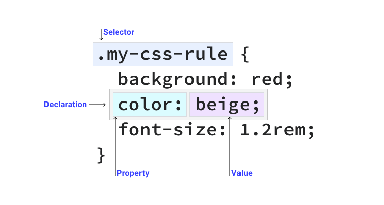
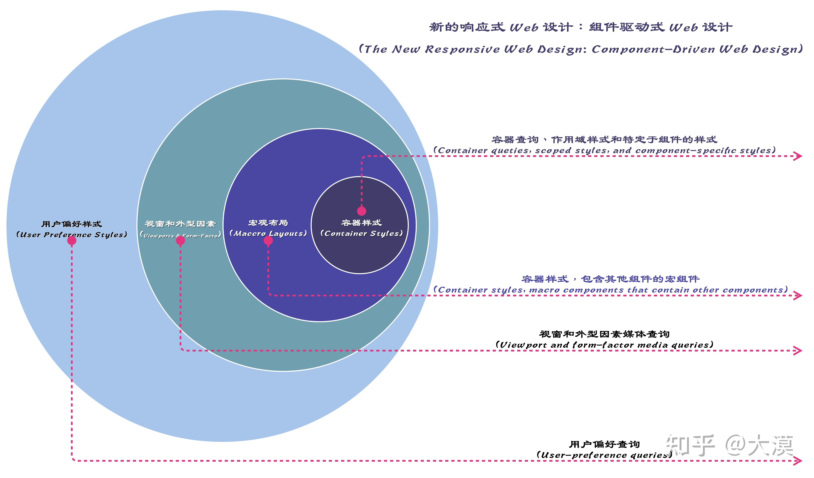

  - 语法
    - @rules
    - CSS 选择器及优先级
        
      ```
      1. !important 会覆盖页面内任何位置的元素样式
      1.内联样式，如 style="color: green"，权值为 1000
      2.ID 选择器，如#app，权值为 0100
      3.类、伪类、属性选择器，如.foo, :first-child, div[class="foo"]，权值为 0010
      4.标签、伪元素选择器，如 div::first-line，权值为 0001
      5.通配符、子类选择器、兄弟选择器，如*, >, +，权值为 0000
      6.继承的样式没有权值
      ```
    - 单位、值、function
    - 自定义变量
  - 响应式设计
    - API
      - 媒体查询
      - 容器查询
      - Viewport 尺寸单位（vw、vh）
    - 实践
      - Viewport 断点
      - 移动优先
      - [组件驱动式Web设计](https://zhuanlan.zhihu.com/p/497961289)
          


- CSS
  - 样式规则
    - 继承
    - 层叠(覆盖)
      - 样式权重
      - 资源顺序
      - 优先级
      - 重要程度
  - 语法
    - 选择器
    - 属性单位
    - 变量
    - 嵌套
    - 功能
    - 混入
    - 模块
  - 内容
    - [页面布局](./CSS页面布局.md)
    - 形状和图形
    - 图像
    - Colors
    - 文本排版
    - 动画
    - 交互
    - 变形
      - [zoom和transform:scale的区别](https://www.zhangxinxu.com/wordpress/2015/11/zoom-transform-scale-diff/)
    - 响应性
    - 可访问性
  - CSSOM
    - element.style
    - styleSheets
    - CSS Typed OM
  - 使用 CSS 的形式
    - 纯 CSS
    - CSS 编译
    - CSS in JavaScript
      - https://github.com/vanilla-extract-css/vanilla-extract
      - https://emotion.sh/docs/introduction
      - https://styled-components.com/
  - 工程化
    - [滚动穿透](./滚动穿透.md)
- HTML
  - 元素分类
    - 文档元信息
    - 语义标签
    - 链接
    - 替换型标签（script、iframe、媒体相关，如声音、图片、视频等外部元素替换自身的一类标签）
    - 表单
    - 表格
  - 事件冒泡与委托机制