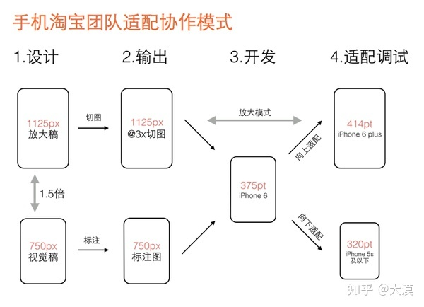

# 页面适配

- 页面适配
  - 屏幕像素原理
  - 适配
    - 自适应
    - 响应式布局


1. viewport 固定 width
2. rem
3. vw + rem
4. vw

  


- 我们开发的H5页面还需要兼容安卓4.4和iOS9 以下的设备，为此需要针对这些版本的设备提供 vw 适配的Polyfill（postcss-viewport-units）。
- vw-layout适配方案和Flexible适配方案最大不同之处，他是基于视窗宽度计算的。所以 vw-layout 适配方案并不适用于平板或PC，无法像 Flexible适配方案，让页面水平居中，两边留白
- 再说一下他们的共性。不管是 Flexible 还是 vw-layout 适配方案，他们还是还基于一定的比例进行缩放的。


```css
:root { 
    /* 理想视窗宽度，就是设计稿宽度 */ 
    --ideal-viewport-width: 750; 
    /* 当前视窗宽度 100vw */ 
    --current-viewport-width: 100vw; 
    /* 最小视窗宽度 */ 
    --min-viewport-width: 320px; 
    /* 最大视窗宽度 */ 
    --max-viewport-width: 1920px; 
    /** 
    * clamp() 接受三个参数值，MIN、VAL 和 MAX，即 clamp(MIN, VAL, MAX) 
    * MIN：最小值，对应的是最小视窗宽度，即 --min-viewport-width 
    * VAL：首选值，对应的是100vw，即 --current-viewport-width 
    * MAX：最大值，对应的是最大视窗宽度，即 --max-viewport-width 
    **/ 
    --clamped-viewport-width: clamp( var(--min-viewport-width), var(--current-viewport-width), var(--max-viewport-width) ) 
} 

.card {  
    --ideal-border-radius: 38; /* 750px 设计中圆角值 */
    border-radius: calc( var(--ideal-border-radius) * var(--clamped-viewport-width) / var(--ideal-viewport-width) ); 
} 

.card__media {
    --ideal-border-radius: 24;  /* 750px 设计中圆角值 */
    border-radius: calc( var(--ideal-border-radius) * var(--clamped-viewport-width) / var(--ideal-viewport-width) ); 
} 

.card__media img { 
    --ideal-border-radius: 24; /* 750px 设计中圆角值 */
    border-radius: calc( var(--ideal-border-radius) * var(--clamped-viewport-width) / var(--ideal-viewport-width) ); 
}
```


[postcss-px-to-viewport](https://github.com/evrone/postcss-px-to-viewport)