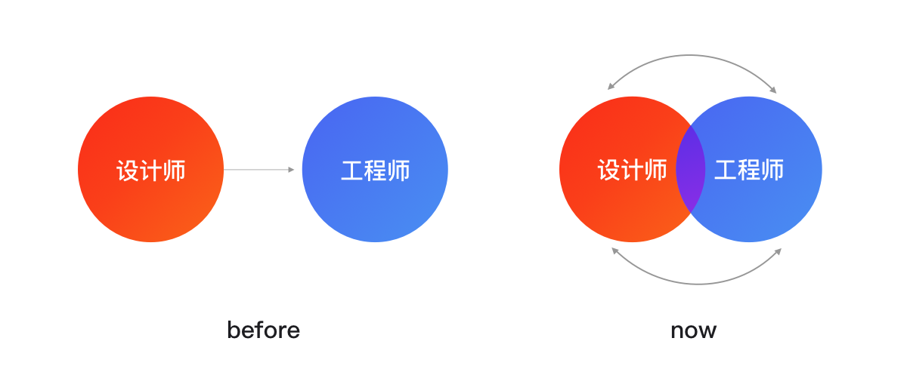
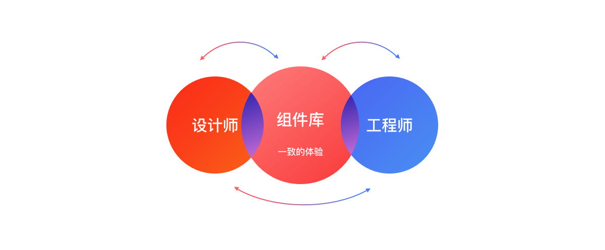
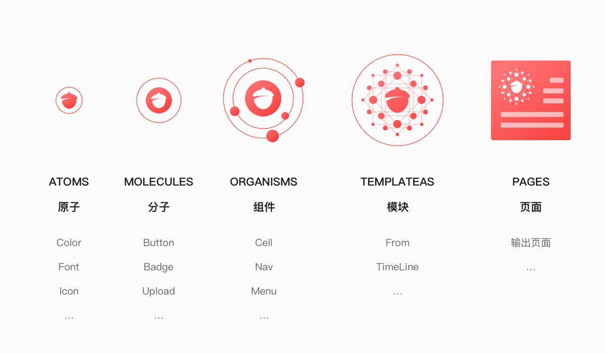

> 推荐阅读 
>
> [京东 vue3 组件库震撼升级，如约而至](https://jelly.jd.com/article/6062fd43960312017f4b9e25)

前端工程师与UI设计师协调总是有困难。无论以往的单向协作模式，还是循环互动的模式，令二者之间的交流变得更多，师和工程师之间难以跨越的“鸿沟”会降低协作的效率。

通过统一标准与体验，设计一套优秀的组件库便可以让我们

- 沟通更高效，开发更快捷，产品的体验更一致，可以极大限度地提升产研效率
- 同时可以让彼此有更多的时间去做各自领域更具价值的事情

**场景多，组件难以扩展覆盖；特殊的业务场景，现有设计及组件难以满足** 与 **保证整体产品的一致性，设计原则** 的矛盾

原子性，抽象提炼关键设计点，打散每个组件元素，重新思考其内在的【一致性】和【可组合性】，提高组件组合扩展性，满足更多场景需求。