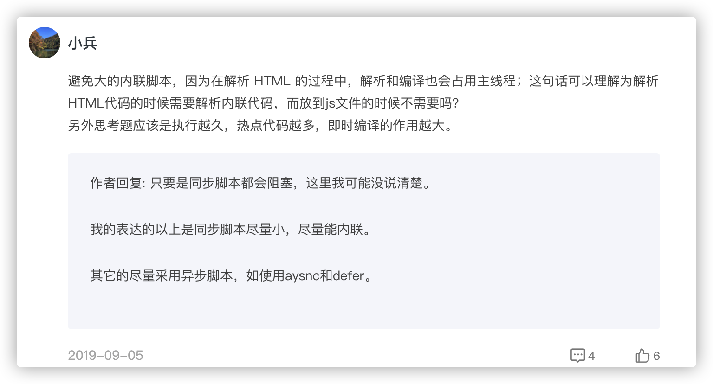

# JavaScript 代码执行过程（编译时）

## JavaScript 是 “解释型语言”？

很多 JavaScript 初学者都会学习认识到 JavaScript 是一个解释型语言，与之相对就是编译型语言，如 C/C++、GO。为什么？因为 JavaScript 是通过解释器把源程序中的指令是一条一条指令解释执行的？

首先需要明确的一点：**用解释型或者编译型来分类一个语言，是完全不正确的，不够严谨**。

编译跟解释只是源码到目标代码之间的**不同执行流程、两种不同动作行为**：

- 编译型：**程序执行之前，需要经过编译器的编译过程**，并且编译之后会直接**保留**机器能读懂的二进制文件，这样每次运行程序时，都可以直接运行该二进制文件，而**不需要再次重新编译**了。

- 解释型：程序在**每次执行时**都需要**通过解释器**对程序进行动态解释和执行。

编译跟解释最主要的是发生的时机不同。

其实语言一般只会定义其抽象语义，一组规范，而不会强制性要求采用某种实现方式。换句话说，只要能实现语义，你也可以写一个C 的解释器解释运行 C，但 C 主流的是用 GCC 编译执行的，所以大多数人会认为 C 是“编译型语言”。

## 解释器

解释器就是个黑箱，输入是源码，输出就是输入程序的执行结果，对用户来说中间没有独立的“编译”步骤。这非常抽象，内部是怎么实现的都没关系，只要能实现语义就行。实际上很多解释器内部是以“编译器+虚拟机”的方式来实现的，先通过编译器将源码转换为抽象语法树（AST）或者字节码，然后由虚拟机去完成实际的执行。**所谓“解释型语言”并不是不用编译，而只是不需要用户显式去使用编译器得到可执行代码而已**。

> 虚拟机在真实硬件上抽象一层，用来执行中间抽象指令集，如字节码；其实把 AST 也看作指令集，VM 遍历执行 AST， 只不过线性（相对于树形）的指令序列看起来更像一般真正机器会执行的指令序列而已。
>
> 虚拟机执行指令的实现方式大概有这样几种：
>
> 1. AST + 树遍历解释器逐条解释执行（其他中间语言模拟实现）
>
>    这样的方式即不生成也不存下目标代码，后续执行没有多少可复用的信息。
>
>    网上搜索到一个不错的[解释器实现系列教程文]( https://ruslanspivak.com/lsbasi-part1/ )，大伙可以体验体验看。
>
> 2. AST => 机器码
>
>    早期 V8 引擎架构就是直接编译成机器码，代码执行效率高，但后面引入字节码，重构了旧架构，至于为什么下文有介绍。
>
> 3. AST => 字节码 => 虚拟机 编译成 机器码 执行
>
>    如今 V8 的新架构就是 字节码 + 字节码解释器 + 优化编译器 组合，下文有介绍。

V8 架构下，使用编译的方式把高级语言的代码编译成机器码执行，是不是跟普遍印象中的“解释器”挺不同的? 如果一种语言的主流实现是解释器，其内部实现是编译器+树遍历解释器，那它还真像是名副其实的“解释型语言”，但其实这样的执行效率并不高。

编译器和解释器工作流程对比：


编译器和解释器都会将原码编译成中间码或者字节码。这个编译过程一般有三个阶段：

1. 词法分析
2. 语法分析
3. 语义分析

## 编译过程

### 词法分析

计算机无法像人类一样一眼读取理解语句，只能非常笨拙地一个符号一个符号去识别。

词法分析，目的就是在连续的字符中识别出一个一个的不可能再分的、最小的单个字符或字符串（token），并尽可能地识别出符号的属性。


### 语法分析

经过词法分析阶段有了上面的符号（token）流后，结合不同 token 属性作用，一个一个去套对应的语法规则，就可以识别出一句完整的语句，并确定这条语句的语法。

语法分析阶段就是在词法分析基础上根据语法规则把符号组成各类的语法单位，例如各种语句，表达式、程序块等，并且以树形结构去代表了程序语法结构，这个树被称为抽象语法树（Abstract Syntax Tree，AST）。

该结构是计算机容易理解和处理的，和渲染引擎将 HTML 格式文件转换为计算机可以理解的 DOM 树的情况类似。


### 语义分析

语法分析只能分析句子的语法结构是否正确，而语义分析是编译过程的一个逻辑阶段， 语义分析的任务是对结构上正确的[源程序](https://baike.baidu.com/item/源程序/9752646)进行上下文有关性质的审查，检查源程序是否符合程序语言的规则，语言设计的核心就在语义阶段上体现出来。

比如类型检查时，下面两句函数传参类型不符合。

```javascript
function test(int p) {}

test("abc")
```

AST 不仅要以结构化地方式展示源码，而且在语义分析中扮演了重要的角色，编译器检查验证程序和语言元素的语法使用是否正确。之后， 使用 AST 来生成实际的字节码或者机器码。了解了上面的相关概念后，接下来看看 V8 是怎么执行 JavaScript 代码。

## V8 是如何执行一段 JavaScript 代码的

V8 执行一段代码流程图：


按照中间不同产物划分阶段：

1. 生成抽象语法树（AST）和 执行上下文
2. 生成字节码
3. 执行代码

从源码到生成抽象语法树这个解析阶段上文有介绍，这里就不重复。有了 AST 后，那接下来 V8 就会生成该段代码的执行上下文。因为 JavaScript 的作用域是词法作用域，生成执行上下文主要是记录代码在词法中的环境信息，请参考另外一篇[《JavaScript 代码执行过程（运行时）》](./JavaScript 代码执行过程（运行时）.md)。

### 生成字节码

解释器 Ignition 会根据 AST 生成字节码。字节码就是介于 AST 和机器码之间的一种代码。但是与特定类型的机器码无关，字节码需要通过解释器将其转换为机器码后才能执行。


#### 为什么使用字节码

早先 V8 是直接把全部的 JS 编译成机器码，所以执行效率非常高。但是需要将生成的机器码需要消耗大量的内存来存放，这样下来不仅耗时而且耗空间。

为了提高效率，Chrome 浏览器引入二进制代码缓存的原因，通过把二进制代码缓存起来重复利用，这样就省去了再次编译的时间。

V8 使用两种代码缓存策略来缓存生成的机器代码：

1. 内存缓存（in-memory cache)：第一次执行一段代码时，会编译源 JavaScript 代码，并将编译后的二进制代码缓存在内存中，
2. 硬盘缓存：关闭了浏览器，下次重新打开浏览器再次执行相同代码时，也可以直接重复使用编译好的二进制代码。


但是这也只是提高了启动效率，内存占用还是没解决。

所以 v8 退而求其次，采用惰性编译，也就是先编译最外层的 js 代码，惰性编译除了能提升 JavaScript 启动速度，还可以解决部分内存占用的问题。


但这段代码必须被解析多次——绿色的代码一次、黄色的代码再解析一次（当 new Person 被调用）、红色的代码再解析一次（当 doWork() 被调用）。因此，如果你的 js 代码的闭包套了 n 层，那么最终他们至少会被 v8 解析 n 次！

而且还有一个问题一直未解决，那就是有一些代码一旦程序初始化完成便不会再执行，这些只执行一次的代码也会在内存中长期存在、长期占用空间，浪费了宝贵的内存资源。

##### 引入字节码的好处

1. 字节码虽然占用的空间比原始的 JavaScript 多，但是相较于机器代码，字节码还是小了太多，所以可以**将全部的代码直接编译成字节码，然后按需解释执行，同时也解决之前惰性编译、初始代码带来的问题**。

   

2. 生产字节码的花费时间比生成机器代码更少。

   

3. 字节码也是编译过程中的中间代码，可以看成是机器代码的抽象，引入了字节码，就可以统一将字节码转换为不同平台的二进制代码。总而言之，就是**抽象了代码、降低代码的复杂度，提供了跨平台能力**。

   

### 执行代码

解释器 Ignition 除了负责生成字节码之外，它还有另外一个作用，就是解释执行字节码，想了解解释器是如何解释执行字节码的，查看另一篇[笔记](./解释器是如何解释执行字节码的.md)。

在 Ignition 执行字节码的过程中，如果发现有热点代码（HotSpot），比如一段代码被重复执行多次，这种就称为热点代码，那么后台的编译器 TurboFan 就会把该段热点的字节码编译为高效的机器码，然后当再次执行这段被优化的代码时，只需要执行编译后的机器码就可以了，这样就大大提升了代码的执行效率。


Ignition + TurboFan 的组合，就是字节码解释器 + 优化编译器的黄金组合，我们把这种技术称为即时编译（JIT）。除了 V8 使用了“字节码 +JIT”技术之外，苹果的 SquirrelFish Extreme 和 Mozilla 的 SpiderMonkey 也都使用了该技术。

JIT 技术的兴起，使得 JavaScript 的解释器不再是“单纯的”，再用 “解释型语言” 去分类就显得不太合适了。

## JavaScript 代码性能优化

单次脚本的下载、解析、执行时间

隐藏类、内联缓存

对于优化 JavaScript 执行效率，你应该将优化的中心聚焦在单次脚本的执行时间和脚本的网络下载上

提升单次脚本的执行速度，避免 JavaScript 的长任务霸占主线程，这样可以使得页面快速响应交互；避免大的内联脚本，因为在解析 HTML 的过程中，解析和编译也会占用主线程；减少 JavaScript 文件的容量，因为更小的文件会提升下载速度，并且占用更低的内存。


全局代码，或者函数 ！

比如下载完一个js文件，先编译这个js文件,但是js文件内定义的函数是不会编译的。

等调用到该函数的时候，Javascript引擎才会去编译该函数！




V8 实现了 script 流和代码缓存技术。Script 流即当脚本开始下载的时候，async 和 deferred 的脚本在单独的线程中进行解析。这意味着解析会在脚本下载完成时立即完成。这会提升 10% 的页面加载速度。

字节码缓存

PRPL


## 总结

JavaScript 代码被执行分为两个过程：编译时和运行时，本文是对编译时的阶段进行描述，编译时又分为：

1. 源码词法、语法分析生产 AST 过程
2. AST 转译为字节码 过程
3. 字节码被解释执行和JIT编译执行

其中引入字节码实则是做了工程上的恰当取舍，虽然在执行上多了一层整体效率下降了些，但从利弊权衡来看是最优解，以时间换空间，让 v8 能更好的服务于低内存的移动设备，总的来说字节码的优势有如下三点：

1. 解决空间问题（主要）：字节码占用内存不多，大大降低内存的使用；
2. 解决启动问题：生成字节码的时间很短、缓存字节码提高了代码的启动速度；
3. 代码架构清晰：采用字节码，可以简化程序的复杂度，使得 V8 移植到不同的 CPU 架构平台更加容易。

## 参考

- 《浏览器工作原理与实践》
- 《图解 Google V8》
- [什么是解释型语言？ - 李广胜的回答 - 知乎]( https://www.zhihu.com/question/268303059/answer/336730398)
-  [虚拟机随谈（一）：解释器，树遍历解释器，基于栈与基于寄存器，大杂烩](https://www.cnblogs.com/bozhang/articles/3115089.html)
- [V8 Ignition：JS 引擎与字节码的不解之缘](https://zhuanlan.zhihu.com/p/26669846)
- [YY's Studio.【虚拟机简史】基于栈虚拟机vs基于寄存器虚拟机](https://yanyezhang.github.io/2018/08/15/%E3%80%90Java%E8%99%9A%E6%8B%9F%E6%9C%BA%E7%AE%80%E5%8F%B2%E3%80%91%E5%9F%BA%E4%BA%8E%E6%A0%88%E8%99%9A%E6%8B%9F%E6%9C%BAvs%E5%9F%BA%E4%BA%8E%E5%AF%84%E5%AD%98%E5%99%A8%E8%99%9A%E6%8B%9F%E6%9C%BA/)