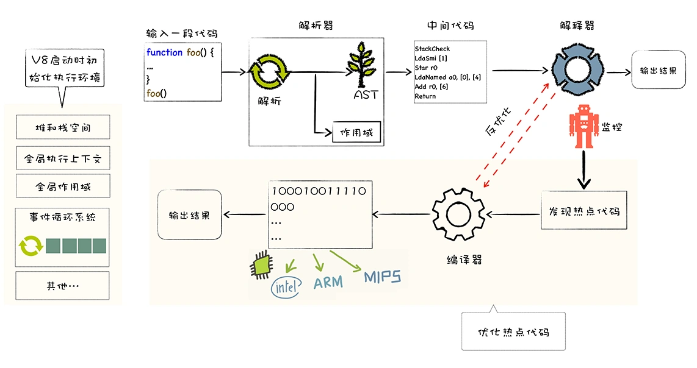
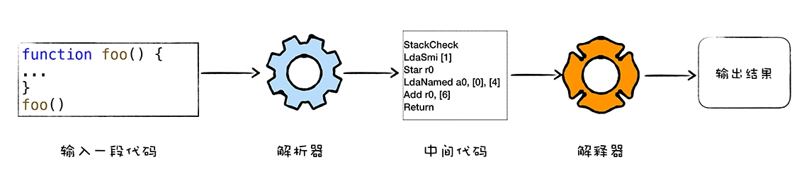
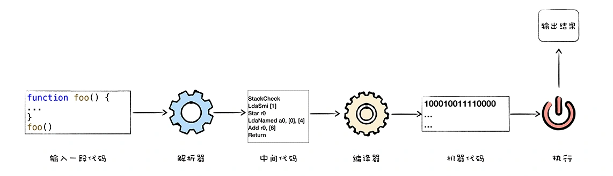

# V8 编译流水线

  

## V8 和 JavaScript

V8 是一个由 Google 开发的开源 JavaScript 引擎，你可以把 V8 看成是一个虚构出来的计算机，也称为虚拟机，虚拟机通过模拟实际计算机的各种功能来实现代码的执行，如模拟实际计算机的 CPU、堆栈、寄存器等，虚拟机还具有它自己的一套指令系统。

CPU 看成是一个非常小的运算机器，我们可以通过二进制的指令和 CPU 进行沟通，工程师们为 CPU 提供了一大堆指令，来实现各种功能，我们就把这一大堆指令称为指令集（Instructions），也就是机器语言。我们给 CPU 发出“1000100111011000”的二进制指令，也就是机器代码、机器码。

像 JavaScript 这类高级语言，通常有两种方式来执行

1. 第一种是解释执行，需要先将输入的源代码通过解析器编译成中间代码，之后直接使用解释器解释执行中间代码，然后直接输出结果。具体流程如下图所示：

  

2. 第二种是编译执行。采用这种方式时，也需要先将源代码转换为中间代码，然后我们的编译器再将中间代码编译成机器代码。通常编译成的机器代码是以二进制文件形式存储的，需要执行这段程序的时候直接执行二进制文件就可以了。还可以使用虚拟机将编译后的机器代码保存在内存中，然后直接执行内存中的二进制代码。

  

> 在上图中的中间码，字节码的由来下文会介绍，这是 V8 的一个优化重点。

### V8 是怎么执行 JavaScript 代码的？

V8 并没有采用某种单一的技术，而是混合编译执行和解释执行这两种手段，我们把这种混合使用编译器和解释器的技术称为 JIT（Just In Time）技术。这是一种权衡策略，因为这两种方法都各自有各自的优缺点，解释执行的启动速度快，但是执行时的速度慢，而编译执行的启动速度慢，但是执行时的速度快。

## 编译流水线

 

1. 初始化基础环境；
2. 解析源码生成 AST 和作用域；
3. 依据 AST 和作用域生成字节码；
4. 解释执行字节码；
5. 监听热点代码；
6. 优化热点代码为二进制的机器代码；
7. 反优化生成的二进制机器代码。

疑问

解释器是怎么解释执行，是不是动态编译成对应的机器指令？

在 浏览器中或者 NodeJS 中，V8 是作为单独线程执行 JavaScript 代码？

- V8
  - JIT
  - 惰性编译
  - 内联缓存
  - 隐藏类

另外，V8 的主要功能，就是结合 JavaScript 语言的特性和本质来编译执行它。

docker run --rm -it andreburgaud/d8 shell