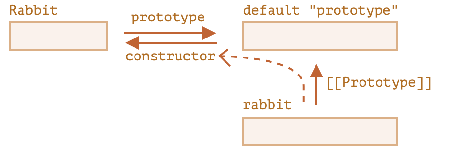
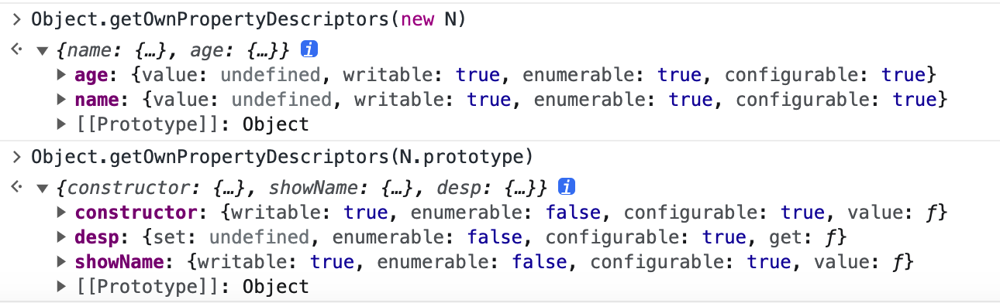

# JavaScript 对象

- JavaScript 对象
  - 对象
    - 本质：一切事物的总称
    - 特征：唯一、状态、行为
  - JavaScript 对象模型设计
    - [具有高度动态性的属性集合](#javascript-对象模型设计)
      - Object.prototype 上的属性操作
        - for..in 循环在其自身和继承的属性上进行迭代。所有其他的键/值获取方法仅对对象本身起作用
        - let clone = Object.create(Object.getPrototypeOf(obj), Object.getOwnPropertyDescriptors(obj))
    - [原型机制](#javascript-的原型机制)
      - 原型继承
      - 原型链
    - [函数对象](#函数对象)
  - JavaScript 面向对象编程
    - [new + 构造器模拟“类”行为](#new--构造器模拟类行为)
    - [ES6 中的类 class](#es6-中的类-class)
    - [继承](#继承)
  - 元编程
    - Object.defineProperty
    - Proxy&Reflect
  - 其他
    - instanceof 运算符原理及实现
    - new 运算符原理及实现

## JavaScript 对象模型设计

JavaScript 对象的设计要点：

1. 在 JavaScript 中，对象的状态和行为其实都被抽象为了**属性**
2. 属性描述符分为数据属性和访问器属性两类（一个属性仅可以是其中一种类型）
   - 数据属性
     - value，就是属性的值
     - writable，可写
     - enumerable，可枚举
     - configurable，决定该属性能否被删除或者改变特征值
   - 访问器属性
     - get，在取属性值时被调用
     - set，在设置属性值时被调用
     - enumerable，可枚举
     - configurable，决定该属性能否被删除或者改变特征值
3. 对象是一个**属性集合**，属性是一个**key-value 的索引结构**
4. 运行时对象具有动态修改属性的能力
5. JavaScript 中函数是一种特殊对象

## JavaScript 的原型机制

- 所有对象都有私有属性 `[[prototype]]`保持对原型的引用，它要么是另一个对象，要么就是 null
  - 访问/设置原型
    - 非标准属性 `__proto__` 来访问一个对象的原型
      - `__proto__` 不是对象的属性，而是 Object.prototype 的访问器属性
    - ES
      - `Object.getPrototypeOf()`、`Reflect.getPrototypeOf`
      - `Object.setPrototypeOf`、`Reflect.setPrototypeOf`
- 原型继承构造对象：基于已有的对象创建新对象，新对象将拥有原型对象的属性和方法
  - 一切皆对象：在 JS 中，所有的对象都默认顶端继承 Object.prototype
  - `new` + 构造器.prototype
      
  - `Object.create()`：利用指定的原型和可选的属性描述来创建一个新的空对象
    - `Object.create(null)` 创建的真空的对象，通常，对象会从 Object.prototype 继承内建的方法和 `__proto__` getter/setter，会占用相应的键，且可能会导致副作用。原型为 null 时，对象才真正是空的
- 原型链：在原型继承的机制下，查找属性时如果对象本身没有则会继续访问该对象的原型对象，依次类推直到找到为止或者原型为空，整个原型访问过程就构成原型链

### 原型链图

画出上面原型链中各个对象 `__proto__` ，`constructor` 和 `prototype` 的关系：

  

- 所有的对象默认继承 Object.prototype
- `Object.prototype.__proto__ === null`
- 所有的函数对象继承 Function.prototype
- `Function.__proto__` === `Function.prototype`

## JavaScript 面向对象编程

面向对象编程范式主要分两类：

- 基于类：“基于类”的编程提倡使用一个关注分类和类之间关系开发模型。在这类语言中，**总是先有类，再从类去实例化一个对象**。类与类之间又可能会形成继承、组合等关系。类又往往与语言的类型系统整合，形成一定编译时的能力。
- 基于原型：“基于原型”的编程看起来更为提倡程序员**先去关注一系列对象实例的行为**，而后才去关心如何将这些对象，划分到最近的使用方式相似的原型对象，而不是将它们先分成类。

“类”在 JavaScript 中仅仅只是一个对象的“类型”标签，语言使用者唯一可以访问该属性的方式是 `Object.prototype.toString`，也可通过 `Symbol.toStringTag` 自定义 Object.prototype.toString 的行为：

```js
let o = { [Symbol.toStringTag]: "MyObject" }
console.log(Object.prototype.toString.call(o)); // '[object MyObject]'
```

```js
class ValidatorClass {
  get [Symbol.toStringTag]() {
    return "Validator";
  }
}

Object.prototype.toString.call(new ValidatorClass()); // "[object Validator]"
```

### new + 构造器模拟“类”行为

早期 JavaScript 因为一些公司的政治原因，引入了 new、this 等语言特性，使之“看起来语法更像 Java”。

new + 构造器模拟“类”创建对象：

```js
function c1(){
    this.p1 = 1;
    this.p2 = function(){
        console.log(this.p1);
    }
} 
var o1 = new c1;
o1.p2();
```

但上面的一切还是基于运行时原型系统，new 的行为：

1. 以构造器函数的 prototype 属性值为原型创建新对象
2. 将 this 指向该对象
3. 将this、参数传给构造函数并执行
4. 若构造函数返回对象则直接返回，否则使用新创建的对象返回

new + this 的语法特性让函数变成混乱，而且它客观上提供了两种方式，一是在构造器中添加属性，二是在构造器的 prototype 属性上添加属性，导致创建行为不统一。

```js
function c1(){
    this.p1 = 1;
    this.p2 = function(){
        console.log(this.p1);
    }
} 
var o1 = new c1;
o1.p2();

function c2(){
}
c2.prototype.p1 = 1;
c2.prototype.p2 = function(){
    console.log(this.p1);
}

var o2 = new c2;
o2.p2();
```

### ES6 中的类 Class

ES6 中加入了新特性 class、extends，new + this 跟 function 搭配的怪异行为终于可以不使用了，但是类的写法依旧是**基于原型机制的语法糖**，JavaScript 的原型体系同时作为一种编程范式和运行时机制存在。**推荐在任何场景，我都推荐使用 ES6 的语法来定义类，而令 function 回归原本的函数语义**。

```js
class N {
  name;
  age;

  constructor(name, age) {
    this.name = name;
    this.age = age;
  }

  showName() {
    console.log(this.name);
  }

  get desp() {
    return `My name is ${this.name}`;
  }
}
```

注意类对象创建的行为：

- 类的数据属性写在对象上
- 访问器属性和方法则写在原型对象上的（且不可枚举）

  

- Class 类语法包括
  - 构造器
  - 实例属性
  - 静态属性
  - 私有属性
  - 静态块：在类生成时运行一次，主要作用是对静态属性进行初始化
  - 继承

更多 Class 语法细节[参考](https://es6.ruanyifeng.com/#docs/class)。

### 继承

继承是面向对象编程的一个重要特性，而在 JavaScript 实现继承的方式是组合继承：通过**借用构造函数**实现独享数据属性，通过**原型继承**共享方法属性：

> PS：JS 的继承形式有太多形式及叫法，

```js
function inheritPrototype(subType, superType){
  var prototype = Object.create(superType.prototype); // 创建对象，创建父类原型的一个副本
  prototype.constructor = subType;                    // 增强对象，弥补因重写原型而失去的默认的constructor 属性
  subType.prototype = prototype;                      // 指定对象，将新创建的对象赋值给子类的原型
}

function Parent() {
  this.name = 'parent';
}

Parent.prototype.say = function() {
  console.log('hello'); 
}

function Child() {
  Parent.call(this); // 借用 Parent 构造器
}

// 原型继承
inheritPrototype(Child, Parent)

let child = new Child();
```

#### ES6 继承

```js
class A {}
class B extends A {
  constructor() {
    super()
  }
}

const b = new B();
```

ES6 的继承本质也是基于原型，Babel 的继承源码实现：

```js
function _inherits (subClass, superClass) { 
	subClass.prototype = Object.create(superClass && superClass.prototype, { 
		constructor: { 
			value: subClass, 
			enumerable: false, // 原型不可枚举
			writable: true, 
			configurable: true 
		} 
	}); 

  // 静态属性继承
	if (superClass) Object.setPrototypeOf ? Object.setPrototypeOf(subClass, superClass) : subClass.__proto__ = superClass; 
}
```

#### Class super 关键词

- super
  - 子类必须在 `constructor()` 方法中调用 `super()`
    - ES6 的继承机制：内部创建的空对象必须先继承父类的属性和方法，再将该对象作为子类的实例返回给子类的 this，即“继承在前，实例在后”
    - ES5 的继承机制：直接一个子类的实例对象，然后应用父类构造器继承父类的属性和方法，即“实例在前，继承在后”
  - super作为函数调用时，代表父类的构造函数
  - super作为对象时，在普通方法中，指向父类的原型对象；在静态方法中，指向父类
  - 子类普通方法中通过super调用父类的方法时，方法内部的this指向当前的子类实例
  - **可继承原生构造函数**自定义子类

## 函数对象

JavaScript 用对象模拟函数的设计代替了一般编程语言中的函数，它们可以像其它语言的函数一样被调用、传参。

任何宿主只要提供了“具有`[[call]]`私有字段的对象”，就可以被 JavaScript 函数调用语法支持；如果它能实现`[[construct]]`，它就是一个构造器对象，可以作为构造器被调用。

用户使用 function 语法或者 Function 构造器创建的对象同时具有 `[[call]]` 和 `[[construct]]`；而 => 语法创建的函数仅仅是函数。

## 其他

### instanceof 运算符原理

instanceof 检测左侧的原型链上是否存在右侧构造器的 prototype 对象：

```js
function instanceof2(left, right) {
    if(left === null || typeof left !== 'object') {
       return false
    }

    if(typeof right !== 'function') {
        throw new Error('right must be Function')
    }

    while(true) {
         left = Object.getPrototypeOf(left)
         if(left === right.prototype) {
            return true
        }
    }
    return false
}

let person = function () {
}
let programmer = function () {
}
programmer.prototype = new person()
let nicole = new programmer()

console.log(instanceof2(nicole, programmer))

console.log(instanceof2(nicole, person))
```

### new 运算符原理及实现

```js
function _new(fn, ...args) {
    let obj = Object.create(fn.prototype)
    let result = fn.apply(obj, args)
    return result instanceof Object ? result : obj
}

function A(name, age) {
    this.name = name
    this.age = age
}

A.prototype.sayHello = function() {
    console.log('hello world')
}

console.log(_new(A, 'lys', 123) instanceof A)

function B(name, age) {
    this.name = name
    this.age = age
    return {
        name,
        age
    }
}

console.log(_new(B, 'lys', 123) instanceof B)

function C() {}

C.prototype = Object.create(A.prototype)
C.prototype.constructor = C

console.log(_new(C, 'lys', 123) instanceof A)
```

### 原型输出题目

```js
function Page() {
  return this.hosts;
}
Page.hosts = ['h1'];
Page.prototype.hosts = ['h2'];

const p1 = new Page();
const p2 = Page();

console.log(p1.hosts);
console.log(p2.hosts);
```

## 参考

- [《如何回答面试中的JavaScript原型链问题》](https://yanhaijing.com/javascript/2021/03/13/javascript-prototype-chain/)
- 极客学习《重学前端》