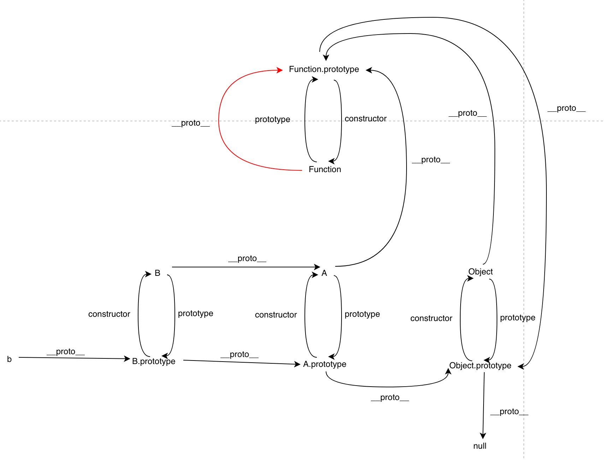

# JavaScript 对象

- JavaScript 对象
  - 对象本质：一切事物的总称
    - 对象的特征：唯一、状态、行为
  - [对象模型设计](#javascript-对象模型)
    - 属性集合：key-value 结构
    - 具有动态性
  - [基于原型的面向对象编程](#基于原型的面向对象编程)
    - [原型系统](#javascript-的原型机制)
    - 原型修改方法
      - `__proto__`
      - new + 构造器.prototype
      - es5
        - Object.create
        - Object.getPrototypeOf
        - Object.setPrototypeOf
    - [new + 构造器模拟“类”行为](#new--构造器模拟类行为)
    - [ES6 中的类 class](#es6-中的类-class)
      - 类
        - 构造器
        - 实例属性
        - 静态属性
        - 私有属性
        - 静态块：在类生成时运行一次，主要作用是对静态属性进行初始化
        - 继承
    - [原型继承](#原型继承)
    - [ES6 继承](#es6-继承)
  - [原型链判断](#原型链判断)
  - [函数对象](#函数对象)

## JavaScript 对象模型

JavaScript 对象的设计要点：

1. 在 JavaScript 中，对象的状态和行为其实都被抽象为了**属性**
2. 属性分为数据属性和访问器属性两类

   - 数据属性
     - value，就是属性的值
     - writable，可写
     - enumerable，可枚举
     - configurable，决定该属性能否被删除或者改变特征值
   - 访问器属性
     - get，在取属性值时被调用
     - set，在设置属性值时被调用
     - enumerable，可枚举
     - configurable，决定该属性能否被删除或者改变特征值

   如果一个描述符不具有 value、writable、get 和 set 中的任意一个键，那么它将被认为是一个数据描述符。
   如果一个描述符同时拥有 value 或 writable 和 get 或 set 键，则会产生一个异常。

3. 对象是一个**属性集合**，属性是一个**key-value 的索引结构**
4. 运行时对象具有动态修改属性的能力

JavaScript 的对象系统设计跟目前主流如 Java 基于类的面向对象差异非常大：**具有高度动态性的属性集合**。

JavaScript 提供了完全运行时能力，这使得它可以模仿具有多种编程范式支持：同时支持面向对象类和原型的编程范式、函数式编程（JavaScript 中函数是一种特殊对象）。那么 JavaScript 是如何基于这样的动态对象模型设计自己的原型系统，以及你熟悉的函数、类等基础设施。

## 基于原型的面向对象编程

面向对象编程范式主要分两类：

- 基于类：“基于类”的编程提倡使用一个关注分类和类之间关系开发模型。在这类语言中，**总是先有类，再从类去实例化一个对象**。类与类之间又可能会形成继承、组合等关系。类又往往与语言的类型系统整合，形成一定编译时的能力。
- 基于原型：“基于原型”的编程看起来更为提倡程序员**先去关注一系列对象实例的行为**，而后才去关心如何将这些对象，**划分到最近的使用方式相似的原型对象，而不是将它们先分成类**。

“类”在 JavaScript 中仅仅只是一个对象的“类型”标签，语言使用者唯一可以访问该属性的方式是 `Object.prototype.toString`，也可通过 `Symbol.toStringTag` 自定义 Object.prototype.toString 的行为：

```js
let o = { [Symbol.toStringTag]: "MyObject" }
console.log(Object.prototype.toString.call(o)); // '[object MyObject]'
```

```js
class ValidatorClass {
  get [Symbol.toStringTag]() {
    return "Validator";
  }
}

Object.prototype.toString.call(new ValidatorClass()); // "[object Validator]"
```

基于原型的面向对象系统通过“复制”的方式来创建新对象。原型系统的“复制操作”有两种实现思路：

- 一个是并不真的去复制一个原型对象，而是使得新对象持有一个原型的引用（JavaScript 选择）；
- 另一个是切实地复制对象，从此两个对象再无关联。

### JavaScript 的原型机制

原型系统机制：

- 所有对象都有私有属性 `[[prototype]]`（目前大多数浏览器厂商非标准实现 `__proto__` 属性）保持对原型的引用；
- 读一个属性，如果对象本身没有，则会继续访问对象的原型、依次类推原型的原型，直到原型为空或者找到为止（**原型链**）。

很多基于原型的系统提倡运行时原型的修改，而基于类的面向对象系统大多数在编译期确定类无法运行时修改。原型修改方法：

- `Object.prototype.__proto__`，直接暴力访问属性去访问的对象的内部 `[[Prototype]]`，但这个属性是非 web 标准。
- new + 构造器：指定原型创建对象
- ES5 提供的原型操作标准方法
  - Object.create 创建一个对象，并将原型指针指向指定对象
  - Object.getPrototypeOf 获得一个对象的原型；
  - Object.setPrototypeOf 设置一个对象的原型。

基于原型范式的对象编程

```js
// 直接创建对象实例，运行时默认原型为 Object.prototype
var cat = {
    say(){
        console.log("meow~");
    },
    jump(){
        console.log("jump");
    }
}

// 关注对象行为，创建制定原型新对象
// 非 ES 标准： var tiger = { say(){} }; tiger.__proto__ = cat 
var tiger = Object.create(cat,  {
    say:{
        writable:true,
        configurable:true,
        enumerable:true,
        value:function(){
            console.log("roar!");
        }
    }
})

var anotherCat = Object.create(cat);

anotherCat.say();

// 利用原型来实现抽象和复用
var anotherTiger = Object.create(tiger);

anotherTiger.say();
anotherTiger.jump();
```

### new + 构造器模拟“类”行为

早期 JavaScript 因为一些公司的政治原因，引入了 new、this 等语言特性，使之“看起来语法更像 Java”。

new + 构造器模拟“类”创建对象：

```js
function c1(){
    this.p1 = 1;
    this.p2 = function(){
        console.log(this.p1);
    }
} 
var o1 = new c1;
o1.p2();
```

但上面的一切还是基于运行时原型系统，new 的行为：

1. 以构造器函数的 prototype 属性值为原型创建新对象
2. 将 this 指向该对象
3. 将this、参数传给构造函数并执行
4. 若构造函数返回对象则直接返回，否则使用新创建的对象返回

new + this 的语法特性让函数变成混乱，而且它客观上提供了两种方式，一是在构造器中添加属性，二是在构造器的 prototype 属性上添加属性，导致创建行为不统一。

```js
function c1(){
    this.p1 = 1;
    this.p2 = function(){
        console.log(this.p1);
    }
} 
var o1 = new c1;
o1.p2();

function c2(){
}
c2.prototype.p1 = 1;
c2.prototype.p2 = function(){
    console.log(this.p1);
}

var o2 = new c2;
o2.p2();
```

### ES6 中的类 class

ES6 中加入了新特性 class、extends，new、this 跟 function 搭配的怪异行为终于可以不使用了，但是类的写法依旧是基于原型机制的语法糖，JavaScript 的原型体系同时作为一种编程范式和运行时机制存在。**推荐在任何场景，我都推荐使用 ES6 的语法来定义类，而令 function 回归原本的函数语义**。

注意对象创建的行为：
- 类的数据属性写在对象上
- 访问器属性和方法则写在原型对象上的（且不可枚举）

```js
class N {
  name;
  age;

  constructor(name) {
    this.name = name;
  }

  showName() {
    console.log(this.name);
  }

  get desp() {
    return `My name is ${this.name}`;
  }
}
```

- 类
  - 构造器
  - 实例属性
  - 静态属性
  - 私有属性
  - 静态块：在类生成时运行一次，主要作用是对静态属性进行初始化
  - 继承

更多 [Class 相关语法](https://es6.ruanyifeng.com/#docs/class)参考。

### 原型继承

继承是面向对象编程的一个重要特性，在 JavaScript 实现继承的方式有

- 拼接（复制）继承：`Object.assign`
- 主要是基于原型链的继承（原型代理）：通过**借用构造函数**实现独享数据属性，通过**原型链**继承共享方法属性。

以下是寄生组合式继承（PS：SB 名称）代码示例：

> 推荐阅读
> - [JavaScript 继承](https://tsejx.github.io/javascript-guidebook/object-oriented-programming/inheritance/prototype-chain#%E5%8E%9F%E5%9E%8B%E5%AF%B9%E8%B1%A1%E4%B8%8E%E5%AE%9E%E4%BE%8B)
> - [JavaScript对象继承一瞥](https://yanhaijing.com/javascript/2014/11/09/object-inherit-of-js/)

```js
function inheritPrototype(subType, superType){
  var prototype = Object.create(superType.prototype); // 创建对象，创建父类原型的一个副本
  prototype.constructor = subType;                    // 增强对象，弥补因重写原型而失去的默认的constructor 属性
  subType.prototype = prototype;                      // 指定对象，将新创建的对象赋值给子类的原型
}

// 父类初始化实例属性和原型属性
function SuperType(name){
  this.name = name;
  this.colors = ["red", "blue", "green"];
}
SuperType.prototype.sayName = function(){
  alert(this.name);
};

// 借用构造函数传递增强子类实例属性（支持传参和避免篡改）
function SubType(name, age){
  SuperType.call(this, name); // 类似 class super
  this.age = age;
}

// 将父类原型指向子类
inheritPrototype(SubType, SuperType);

// 新增子类原型属性
SubType.prototype.sayAge = function(){
  alert(this.age);
}

var instance1 = new SubType("xyc", 23);
var instance2 = new SubType("lxy", 23);

instance1.colors.push("2"); // ["red", "blue", "green", "2"]
instance1.colors.push("3"); // ["red", "blue", "green", "3"]
```

简化版

```js
// new + 构造器，寄生组合式继承
function A() {}
function B() {}

// 关键
B.prototype = Object.create(A)
B.prototype.constructor = B

B.prototype.xxx = function() {}

let b = new B()
```

注意不要 `B.prototype=A.prototype` ，这种共享原型的方式会导致对 B 的原型扩展，A 的实例也能访问得到。

### ES6 继承

```js
class A {}
class B extends A {
  constructor() {
    super()
  }
}

const b = new B();
```

- super 要点
  - 子类必须在 `constructor()` 方法中调用 `super()`
    - ES6 的继承机制：内部创建的空对象必须先继承父类的属性和方法，再将该对象作为子类的实例返回给子类的 this，即“继承在前，实例在后”
    - ES5 的继承机制：直接一个子类的实例对象，然后应用父类构造器继承父类的属性和方法，即“实例在前，继承在后”
  - super作为函数调用时，代表父类的构造函数
  - super作为对象时，在普通方法中，指向父类的原型对象；在静态方法中，指向父类
  - 子类普通方法中通过super调用父类的方法时，方法内部的this指向当前的子类实例
  - **可继承原生构造函数**自定义子类

ES6 的继承本质也是基于原型，Babel 的继承源码实现：

```js
function _inherits (subClass, superClass) { 
	subClass.prototype = Object.create(superClass && superClass.prototype, { 
		constructor: { 
			value: subClass, 
			enumerable: false, // 原型不可枚举
			writable: true, 
			configurable: true 
		} 
	}); 

  // 静态属性继承
	if (superClass) Object.setPrototypeOf ? Object.setPrototypeOf(subClass, superClass) : subClass.__proto__ = superClass; 
}
```

## 其他

### 原型链判断

画出上面原型链中各个对象 `__proto__` ，`constructor` 和 `prototype` 的关系：

  

**原型链中 Function 比较特殊的地方就是 `Function.__proto__` 指向自己的 `Function.prototype` 需要特殊记忆**。

### 函数对象

JavaScript 用对象模拟函数的设计代替了一般编程语言中的函数，它们可以像其它语言的函数一样被调用、传参。

任何宿主只要提供了“具有`[[call]]`私有字段的对象”，就可以被 JavaScript 函数调用语法支持；如果它能实现`[[construct]]`，它就是一个构造器对象，可以作为构造器被调用。

用户使用 function 语法或者 Function 构造器创建的对象同时具有 `[[call]]` 和 `[[construct]]`；而 => 语法创建的函数仅仅是函数。

## 参考

- [《如何回答面试中的JavaScript原型链问题》](https://yanhaijing.com/javascript/2021/03/13/javascript-prototype-chain/)
- 极客学习《重学前端》