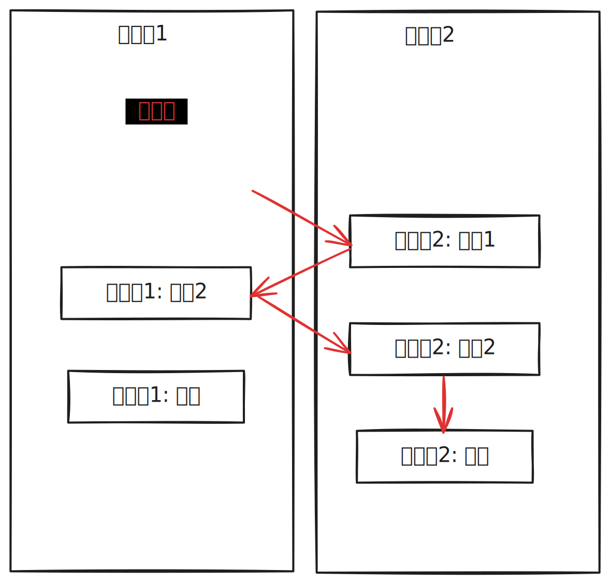

# JavaScript 异步编程

- JavaScript 异步编程
  - [异步编程](#异步编程)
  - [JavaScript 的异步原理：事件循环 + 回调队列](#javascript-的异步原理单线程事件循环--回调队列)
  - [JavaScript 异步编程范式](#javascript-异步编程)

## 异步编程

异步编程是一种在程序执行过程中不阻塞的编程方式。在编程语言中，同步编程意味着代码任务一个接一个执行发生，任务的执行流程与代码的编写、调用顺序是一样的；而在异步编程中，我们将编写异步单元，执行流与任务的编写、调用顺序不再一致，任务执行时机不再像同步编程那样直观，它们统一由异步运行时并发调度决定。



这样做的好处就是允许程序在等待某些操作完成时继续执行其他任务，从而提高程序的并发性和响应性。但编程模型相对复杂一些，因为你需要处理任务完成通知，以及在**多个任务间协同操作**（代码是可异步执行，但业务逻辑必须是同步关系）是编程中异步处理的关键解决之道。

> 这里可能需要提及一点的是多线程和异步的区别关系：线程是系统功能的执行单位，而异步描述的是任务之间的协作关系，我们可以将多条异步的任务流分别应用于多线程当中去并发执行，但并发不一定是用多线程也可以是用单线程，具体要看异步框架/运行时的实现方式。故多线程只是异步编程实现的一种技术实现。

总的来说，异步编程是一种应用程序级别、语言或框架层面实现的并发编程模型，旨在非阻塞地执行代码，允许程序在等待长时间操作时继续执行其他任务。

## JavaScript 的异步原理：事件循环 + 回调队列

JavaScript 是一门单线程语言，语言层面没有提供多线程编程能力，同时也跟大多数同步编程语言一样，一旦遇到耗时任务整个线程就会被阻塞。因此并发性是指事件循环在完成其他工作后执行 JavaScript 回调函数的能力。

在 ES6 之前，JavaScript 语言本身并没有任何异步能力。JavaScript 的异步实现主要是由宿主环境提供的运行时能力，使用异步 API + 异步回调的模式：

```js
// 异步回调
function foo() {
    alert("Hello");
}

// 异步 API
setTimeout(foo, 3000)
```

但对于这样的模式，在执行环境层面是如何支持？我们应该有一个感性的认知：一个 JavaScript 引擎会常驻于内存中，不断循环等待着、执行着回调队列里的任务；而当发起异步调用完成时，系统会将异步回调任务放进队列里。总的来说，JavaScript 的并发模型是一个单线程事件循环 + 回调队列：

> 以下是浏览器事件循环模型中 JavaScript 交互的部分


ES5 之后，JavaScript 引入了 Promise。我们不需要宿主的安排任务，JavaScript 引擎本身也可以发起异步任务了。我们把宿主环境调度的任务称为宏观任务，把 JavaScript 引擎内部调度任务称为微观任务。引擎会先处理微任务队列中的微任务，直至所有微任务清空才真正退出，如果在微任务中循环触发新的微任务，那么也将被清完为止将能进入下一个宏任务。

## JavaScript 异步编程范式

> 网上对 JavaScript 异步编程范式介绍有很多很详细的，笔者对于这块内容就挑着记录 😊

- 异步回调
- 发布订阅模式：发布订阅模式解决了回调地狱的问题，但存有逻辑碎片化的问题
  - [手写 EventEmitter 实现](https://github.com/laoergege/laoergege-blog/issues/84)
- [Promise](#promise)：通过链式调用的写法不仅解决了回调地狱的问题，而且线型管理 Callback 的方式使得相关逻辑内聚提高了一定的可读性
  - [Promise 异步错误](#promise-异步错误)
- [Async/Await](#asyncawait)
  - [Generator](#generator)
- 函数响应式编程：是一种发布订阅模式和迭代模式的结合，相比发布订阅模式带来事件支离，函数响应式编程则把它们串连起来，当作事件流来处理

### Promise

Promise 代表着一种未来的承诺，本质是一种数据结构，可以看作是状态机和观察者模式结合。

> [Promises/A+ 规范链接地址](https://promisesaplus.com/)

- Promise 实例
  - state    
    - pending
    - fulfilled
    - rejected
  - result
  - reason: 是一个 Promise 里 reject 之后返回的拒绝原因
  - exception: 是一个异常，是在 Promise 里面可以用 throw 语句抛出来的值
  - then、catch、finally
    - 链式调用
    - 延迟绑定
    - 值穿透、错误冒泡：当我们不在 then 中放入参数，或者参数不为 function，例：promise.then().then()，那么其后面的 then 依旧可以得到之前 then 返回的值
    - 返回值穿透：resolve 返回值，如果返回值是 Promise，则直接获取内部结果返回
    - onResolved 和 onRejected 这两项函数需要异步调用
- Promise 静态方法
  - **resolve**
    - 参数为 Promise 对象，直接返回
    - 参数为 Thenable 对象
    - 其他数据类型，作为新 Promise 的 result
  - reject
  - all：所有 Promises 状态成功就返回，否则返回失败的 Promises
  - allSettled：所有的 Promise 状态完成就返回，不管其是否处理成功
  - any：优先返回状态成功的 Promise，否则返回全部失败结果
  - race：优先返回状态完成的 Promise

> [实现的简易版本 promise.js](https://github.com/laoergege/laoergege-blog/blob/master/content/JavaScript/codes/promise.js)

### Promise 异步错误

```js
try {
  setTimeout(() => throw new Error("Whoops!"));
} catch (e) {
  console.log(e) // no happend
}
```

异步错误无法被 try catch 直接捕获，因为异步代码的执行不与 try catch 的代码在同一个调用栈中。

如果我们把 Promise 当作着一种异步结果，当产生错误时，自然不会抛出原 Promise 代码外部。

看个例子：

```js
try {
  new Promise((resolve, reject) => {
    throw new Error("Whoops!");
  }).catch(alert); // Error: Whoops!
} catch(error) {
  console.log(error) // no happend
}
```

但实际上 JavaScirpt Promise 的执行者（executor）是同步执行，而处理程序（handler）是异步执行。Promise 的执行者（executor）和 promise 的处理程序（handler）周围有一个“隐式的 try..catch”。如果发生异常，它就会被捕获，这样就可以保持在语义上相同了。

再看一种情况：

```js
new Promise(function(resolve, reject) {
  setTimeout(() => {
    throw new Error("Whoops!");
  }, 1000);
}).catch(alert);
```

上面的错误不会被 Promise 捕获，setTimeout 也是一种异步操作，故不在 Promise 的异步内部自然无法捕获。

JavaScript 引擎会跟踪未处理的 rejection，在这种情况下会生成一个全局的 error，在浏览器中，我们可以使用 unhandledrejection 事件来捕获这类 error：

```js
window.addEventListener('unhandledrejection', function(event) {
  // 这个事件对象有两个特殊的属性：
  alert(event.promise); // [object Promise] - 生成该全局 error 的 promise
  alert(event.reason); // Error: Whoops! - 未处理的 error 对象
});

new Promise(function() {
  throw new Error("Whoops!");
}); // 没有用来处理 error 的 catch
```

### Async/Await

Async/Await 本质上是 Promise + Generator 异步方案标准化，可以实现用同步的写法，编写异步代码的效果。

自所以 Generator 能用在异步方案中，可以说 JavaScript 中的 Generator 是一种无栈式协程。按调用栈分类，有栈协程（Stackful Coroutine）：每个协程都有自己的调用栈，类似于线程的调用栈；而无栈协程（Stackless Coroutine）：协程没有自己的调用栈，挂起点的状态通过状态机和闭包等语法来实现。

无栈协程意味着无法在内部函数中挂起协程，且具有**传染性**：要求所有调用链条中的函数都必须支持异步特性，只有在 await 点才能切换控制权：

```js
const a = () => {
  return 10 + b();
};

const b = () => {
  return 20 + c();
};

const c = async () => {
  let c = await Promise.resolve(30);
  return c;
};

console.log(a()) // 1020[object Promise]
```

在 `[a,b,c]` 的调用链中，c 是一个异步操作，当 c 被 await 操作挂起时，整个调用栈并不会被挂起，而是继续执行完毕，c 直接返回一个 Promise。为了让整个调用链都能被挂起，所有函数都必须转成异步函数，并且使用 await 挂起调用点：

```js
const a = async () => {
  return 10 + await b();
};

const b = async () => {
  return 20 + await c();
};

const c = async () => {
  let c = await Promise.resolve(30);
  return c;
};

console.log(await a()) // 60
```

调用栈执行完毕就会消失，而每个异步函数是一个独立的协程，本质上是一个状态机，只会记录挂起时的状态点，而有栈协程则会记录自己的调用栈。

#### Async/Await 的实现原理

本质上是把 Async 函数编译成 Generator 协程和生成一个基于 Promise 的调度器去迭代完成 Generator 函数。

```js
async function g() {
    let res = await 1;
    const fn = () => { throw 2 }
    res += await fn();
    return res;
}
```

把 async 函数转成生成器：

- function* 相当于 async
- yield 相当于 await

```js
const _g = async(function* () {
    let res = yield 1;
    const fn = () => Promise.reject(2)
    res += yield fn();
    return res;
})

function async(gen) {
  function _async() {
      return new Promise((resolve, reject) => {
          const g = gen()
          const next = (val, key = "next") => {
              try {
                const { value, done } = g[key](val)

                if (done) {
                    resolve(value)
                } else {
                    Promise.resolve(value).then(
                        (val) => next(val),
                        (e) => next(e, "throw")
                    )
                }
              } catch (error) {
                  reject(error)
              }
          }

          next()
      })
  }

  return _async
}
```

对比下 Babel 编译生成的代码：

```js
"use strict";

function asyncGeneratorStep(gen, resolve, reject, _next, _throw, key, arg) {
  try {
    var info = gen[key](arg);
    var value = info.value;
  } catch (error) {
    reject(error);
    return;
  }
  if (info.done) {
    resolve(value);
  } else {
    Promise.resolve(value).then(_next, _throw);
  }
}

function _asyncToGenerator(fn) {
  return function () {
    var self = this,
      args = arguments;
    return new Promise(function (resolve, reject) {
      var gen = fn.apply(self, args);
      function _next(value) {
        asyncGeneratorStep(gen, resolve, reject, _next, _throw, "next", value);
      }
      function _throw(err) {
        asyncGeneratorStep(gen, resolve, reject, _next, _throw, "throw", err);
      }
      _next(undefined);
    });
  };
}

function g() {
  return _g.apply(this, arguments);
}

function _g() {
  _g = _asyncToGenerator(function* () {
    let res = yield 1;

    const fn = () => {
      throw 2;
    };

    res += yield fn();
    return res;
  });
  return _g.apply(this, arguments);
}
```

## 参考

- [并发编程模型：事件驱动 vs 线程](https://zhuanlan.zhihu.com/p/32961438)
- [使用 promise 进行错误处理](https://zh.javascript.info/promise-error-handling)
- 阮一峰《深入掌握 ECMAScript 6 异步编程》
- [100 行代码实现 Promises/A+ 规范](https://zhuanlan.zhihu.com/p/83965949)