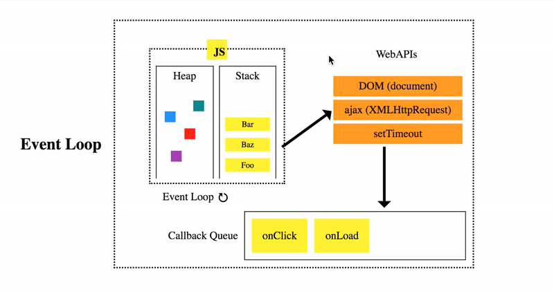
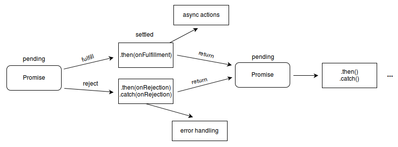

# JavaScript 异步编程

- JavaScript 异步编程
  - [何为异步编程](#何为异步编程)
  - [JavaScript 的执行环境：事件循环 + 回调队列](#javascript-的执行环境事件循环--回调队列)
  - [JavaScript 异步编程范式](#javascript-异步编程)

## 何为异步编程

**同步/异步关注的是事物之间的行为模式、协作关系**：一个事物的发生必须等待另一事物的结果，这就是同步，反之亦是异步，说明事物之间没有因果顺序关系，是独立性的。

> 很多人将同步/异步与阻塞/非阻塞混淆在，其实阻塞/非阻塞关注、描述的是对象状态，比如进程

同步/异步是一种术语在不同场景下有不同层面的意思。在编程语言中，同步编程意味着指令、任务的执行流程跟代码的编写、调用顺序是一样的，而异步编程模型中，代码更多是被组织成为了异步任务单元，任务的执行顺序、发生时机不再像同步编程那样直观、可预测，它们统一由异步运行时并发调度并且通过特定语法来确保时序关系。

编程语言的异步体系构成：

- 硬件层
- 操作系统进程、线程
- 异步模型
- 异步编程范式

硬件层：我们世界的事物是在并发发生的，计算机的内部硬件同样如此。比如多个 CPU 可以并行工作；CPU 可以与 IO 设备异步工作，IO 设备通过 DMA 方式直接与内存打交道，然后通过中断信号后通知 CPU 再来读取相应的设备缓冲区。

操作系统：大多数编程语言都是同步模型，但实际上我们的程序在计算机内部却是并发执行的，操作系统以线程作为最小调度执行单位并且分时调度我们的代码（操作系统会保存上下文及执行位置以便恢复原来执行），这对于开发者来说是无感的，并且操作系统还帮我们屏蔽硬件层面的异步，（主要）提供了阻塞的系统调用，这样的一切使得我们程序表现出一种同步执行效果。

并发模型：为了保证并发系统设计的正确性人们试图通过形式化的模型来规范它，并发模型主要分为**线程模型**和**异步模型（事件驱动）**，从本质上说其实两者是等价的，它们都是调度代码执行的手段，或者说在计算机里模拟并发性的手段。区别：
- 线程适合处理事务之间有着明显因果关系或者相关性很强的场合，事件驱动机制会把代码搞的支离破碎
- 事件驱动比较擅长处理异步事件的问题，但当需要处理跨事件的事务逻辑时，事件驱动都会变得复杂难解；事务驱动有一点优势的地方，就是它与生俱来的并发性和灵活性
- 线程是分时调度或抢占式调度机制；而事件驱动机制则采用单线程事件循环、协程这样一种协作式的调度机制
- 使用协作式多任务处理的应用程序的编程难点在于，切换处理，保持上下文环境，这些职责都落在了可怜的开发者肩上了或者由编程语言去实现异步运行时和编程范式；而线程模型则由操作系统自带

那么异步编程相比同步编程究竟有什么好处？使用异步编程可以提高系统的并发性，相当于提高系统的响应性和资源利用率。

任务一般分为 IO 密集型和 CPU 密集型。而 web 领域是一个 IO 密集的场景：主流的多线程并发方案不仅要面对竞争条件、死锁等编程问题，更重要的是绝大部分线程都处在等待网络响应或者等待磁盘读取中，CPU 的利用率依然很低，而且大部分 CPU 都耗在操作系统的线程调度上了；而且线程也是资源，它们不是免费的，系统有数量限制。

**异步编程主要是解决 CPU 上下文切换消耗问题，提高 CPU 利用率**。  

**异步编程本质上是带有用户空间线程的协作式多任务处理机制**，应用程序在用户空间中管理"线程"和上下文切换，由用户程序自行任务调度避免了**阻塞原来线程，CPU 在线程上下文切换消耗**。

> 协作式的核心是“主动”协调：我不放弃执行权，任何人不能强制我休眠；我做完了自己的工作，那就一定要主动放弃执行权，方便其它人使用CPU工作。

总结来说，异步编程是一种并发编程模型，**任务只有具备异步特性才能被并发执行**，但保证单个事务的连续性（代码是可异步执行，但业务逻辑必须是同步关系）是编程中**异步处理**的关键解决之道。

接下来，我们来看看 JavaScript 异步编程中的异步运行时和编程范式。

## JavaScript 的执行模型：单线程事件循环 + 回调队列

JavaScript 是一门单线程语言，意味着语言没有提供多线程能力，同时也跟大多数语言一样都是默认同步编程模型，一旦遇到耗时任务整个线程就会被同步阻塞。

在 ES6 之前，JavaScript 语言本身并没有任何异步能力，
对于 JavaScript 来说，耗时任务的异步化主要由执行环境提供的异步 API，并且在异步处理上则通过异步回调的范式。可以说在编程层面，**JavaScirpt 异步 = 异步 API + 异步回调**的模式。

但对于这样的模式，在执行环境层面是如何支持？我们应该有一个感性的认知：一个 JavaScript 引擎会常驻于内存中，它等待着宿主环境把 JavaScript 代码或者函数传递给它执行。ES5 之后，JavaScript 引入了 Promise，这样，不需要宿主的安排任务，JavaScript 引擎本身也可以发起任务了。我们把宿主发起的任务称为宏观任务，把 JavaScript 引擎发起的任务称为微观任务。

整个执行模型是一个单线程事件循环 + 回调队列：

> 以下是浏览器事件循环模型中 JavaScript 交互的部分



## JavaScript 异步编程范式

> 网上对 JavaScript 异步编程范式介绍有很多很详细的，笔者对于这块内容就挑着记录 😊

- JavaScript 异步编程范式对比
  - Callback
    - 回调地狱
    - 分流结果处理：每种任务的处理结果存在两种可能性（成功或失败），那么需要在每种任务执行结束后分别处理这两种可能性
  - 发布订阅模式：发布订阅模式解决了回调地狱的问题，但存有逻辑碎片化的问题
    - [手写 EventEmitter 实现](https://github.com/laoergege/laoergege-blog/issues/84)
  - [Promise](#promise)：通过链式调用的写法不仅解决了回调地狱的问题，而且线型管理 Callback 的方式使得相关逻辑内聚提高了一定的可读性
    - [Promise 异步错误](#promise-异步错误)
  - [Generator](#generator--协程)
  - Async/Await：本质上是 promise + generator 异步方案标准化
    - [Async/Await 实现原理](#asyncawait-实现原理)
  - 函数响应式编程：是一种发布订阅模式和迭代模式的结合，相比发布订阅模式带来事件支离，函数响应式编程则把它们串连起来，当作事件流来处理

### Promise

Promise 代表着一种未来的承诺，本质是一种数据结构，可以看作是状态机和观察者模式结合。

> [Promises/A+ 规范链接地址](https://promisesaplus.com/)

- Promise 实例
  - state    
    - pending
    - fulfilled
    - rejected
  - result
  - reason: 是一个 Promise 里 reject 之后返回的拒绝原因
  - exception: 是一个异常，是在 Promise 里面可以用 throw 语句抛出来的值
  - then、catch、finally
    - 链式调用
    - 延迟绑定
    - 值穿透、错误冒泡：当我们不在 then 中放入参数，或者参数不为 function，例：promise.then().then()，那么其后面的 then 依旧可以得到之前 then 返回的值
    - 返回值穿透：resolve 返回值，如果返回值是 Promise，则直接获取内部结果返回
    - onResolved 和 onRejected 这两项函数需要异步调用
- Promise 静态方法
  - **resolve**
    - 参数为 Promise 对象，直接返回
    - 参数为 Thenable 对象
    - 其他数据类型，作为新 Promise 的 result
  - reject
  - all：所有 Promises 状态成功就返回，否则返回失败的 Promises
  - allSettled：所有的 Promise 状态完成就返回，不管其是否处理成功
  - any：优先返回状态成功的 Promise，否则返回全部失败结果
  - race：优先返回优先完成的 Promise

通过手写实现 Promise、异步顺序考点去更好了解 Promise 机制吧 😘

> [100 行代码实现 Promises/A+ 规范](https://zhuanlan.zhihu.com/p/83965949)

> [ 😘 笔者实现的简易版本 promise.js](https://github.com/laoergege/laoergege-blog/blob/master/docs/JavaScript/codes/promise.js)

> [异步顺序考点](https://github.com/laoergege/laoergege-blog/issues/81)

### Promise 异步错误

我们把 Promise 当作着一种异步结果，当产生错误时，自然不会抛出原 Promise 代码外部，因为语言的异常机制需要在同一调用栈中才能被捕获,而异步代码的执行发生是在另一个调用栈。

```js
try {
  new Promise((resolve, reject) => {
    throw new Error("Whoops!");
  }).catch(alert); // Error: Whoops!
} catch(error) {
  console.log(error) // no happend
}
```

但实际上 JavaScirpt Promise 的执行者（executor）是同步执行，而处理程序（handler）是异步执行。Promise 的执行者（executor）和 promise 的处理程序（handler）周围有一个“隐式的 try..catch”。如果发生异常，它就会被捕获，这样就可以保持在语义上相同了。

再看一种情况：

```js
new Promise(function(resolve, reject) {
  setTimeout(() => {
    throw new Error("Whoops!");
  }, 1000);
}).catch(alert);
```

上面的错误不会被 Promise 捕获，setTimeout 也是一种异步操作，故不在 Promise 的异步内部自然无法捕获。

JavaScript 引擎会跟踪未处理的 rejection，在这种情况下会生成一个全局的 error，在浏览器中，我们可以使用 unhandledrejection 事件来捕获这类 error：

```js
window.addEventListener('unhandledrejection', function(event) {
  // 这个事件对象有两个特殊的属性：
  alert(event.promise); // [object Promise] - 生成该全局 error 的 promise
  alert(event.reason); // Error: Whoops! - 未处理的 error 对象
});

new Promise(function() {
  throw new Error("Whoops!");
}); // 没有用来处理 error 的 catch
```

### Generator & 协程

JavaScript 中的 Generator 是一种无栈协程：协程没有自己的调用栈，挂起点的状态通过**状态机**和**闭包**等语法来实现；而有栈协程：每个协程都有自己的调用栈，类似于线程的调用栈。

无栈协程就意味着无法在内部函数中挂起协程

```js
function *test() {
  console.log('execution start');
  
  ['A', 'B'].forEach(function(item) {
    yield item; // Uncaught SyntaxError: Unexpected identifier
  })
}

const t = test()
t.next()
```

### Async/Await 实现原理

Async/Await 其实只是语法糖，本质上是把 Async 函数编译成 Generator 函数和生成一个基于 Promise 的 Generator 函数自动执行器去迭代完 Generator 函数。

```js
function _async(gen) {
  const g = gen()
  return new Promise((resolve, reject) => {
    const next = function(res) {
      try {
        let { value, done } = g.next(res);
        if(done) {
          resolve(value) 
        } else {
          Promise
            .resolve(value) // promise.resolve 解析结果并可捕获 Promise 异步错误进行同步处理
            .then(next, (err) => g.throw(err)) // 通过 promise.then 不断调 generator.next 直到 done
        }
      } catch (error) {
        reject(error)
      }
    };
    next();
  });
}

function* g() {
  let res = yield 1;
  const fn = () => Promise.reject(2)
  try {
    res += yield fn();
  } catch (error) {
    console.log("error: " + error);
  }
  return res;
}

// 执行
_async(g)
```

把生成器 g 跟 async 函数版本对比一下，不就是：

- function* 换成 async
- yield 换成 await

```js
async function g() {
  let res = await 1;
  const fn = () => { throw 2 }
  res += await fn();
  return res;
}
```

对比下 Babel 编译生成的代码：

```js
"use strict";

function asyncGeneratorStep(gen, resolve, reject, _next, _throw, key, arg) {
  try {
    var info = gen[key](arg);
    var value = info.value;
  } catch (error) {
    reject(error);
    return;
  }
  if (info.done) {
    resolve(value);
  } else {
    Promise.resolve(value).then(_next, _throw);
  }
}

function _asyncToGenerator(fn) {
  return function () {
    var self = this,
      args = arguments;
    return new Promise(function (resolve, reject) {
      var gen = fn.apply(self, args);
      function _next(value) {
        asyncGeneratorStep(gen, resolve, reject, _next, _throw, "next", value);
      }
      function _throw(err) {
        asyncGeneratorStep(gen, resolve, reject, _next, _throw, "throw", err);
      }
      _next(undefined);
    });
  };
}

function g() {
  return _g.apply(this, arguments);
}

function _g() {
  _g = _asyncToGenerator(function* () {
    let res = yield 1;

    const fn = () => {
      throw 2;
    };

    res += yield fn();
    return res;
  });
  return _g.apply(this, arguments);
}
```

## 学习参考

- [从根本上了解异步编程体系](https://zhuanlan.zhihu.com/p/434361727)
- [白话并发模型和异步编程范式](https://code2life.top/2021/05/31/0062-concurrent-model-async-programming/)
- [并发编程模型：事件驱动 vs 线程](https://zhuanlan.zhihu.com/p/32961438)
- [Asynchronous programming. Blocking I/O and non-blocking I/O](https://luminousmen.com/post/asynchronous-programming-blocking-and-non-blocking)
- [使用 promise 进行错误处理](https://zh.javascript.info/promise-error-handling)
-  阮一峰《深入掌握 ECMAScript 6 异步编程》