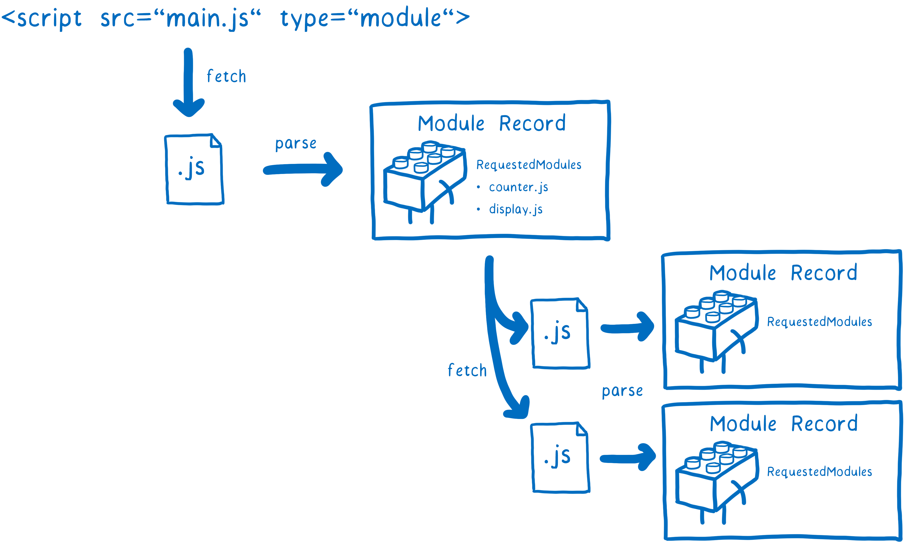
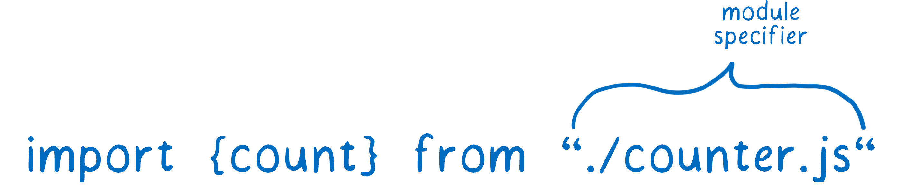
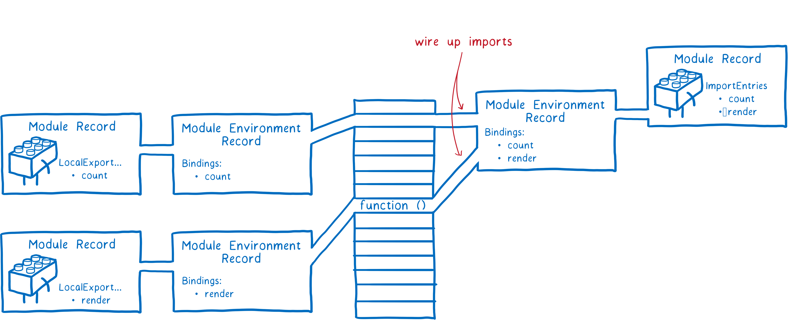

# JavaScript 模块

- JavaScript 模块
  - [模块化发展历程](#javascript-模块发展历程)
  - [CommonJS](#commonjs)
  - [ES Modules](#es-modules)

## JavaScript 模块发展历程

1. 原始阶段
   1. 文件划分
   2. IIFE
   3. 对象命名空间
2. 社区标准化阶段
   1. **CommonJS**：适用于服务端的同步模块加载机制  
   2. AMD：适用于浏览器的异步模块加载机制
   3. UMD：通用模块标准
3. **ES Modules**

### 原始阶段：文件划分、对象命名空间方式、IIFE

- 文件划分：以文件形式上模块化划分变量
- 对象命名空间：解决了全局污染、大部分命名冲突问题
- IIFE：实现成员访问控制

```js
// module-a.js
;(function () {
  var name = 'module-a'
  function method1 () {
    console.log(name + '#method1')
  }

  window.moduleA = {
    method1: method1
  }
})()

// module-b.js
;(function () {
  var name = 'module-b'
  function method1 () {
    console.log(name + '#method1')
  }

  window.moduleB = {
    method1: method1
  }
})()
```

```html
<!DOCTYPE html>
<html>
<head>
  <meta charset="UTF-8">
  <title>Stage 2</title>
</head>
<body>
  <script src="module-a.js"></script>
  <script src="module-b.js"></script>
  <script>
    moduleA.method1()
    moduleB.method1()
  </script>
</body>
</html>
```

上面还存留一个最明显的问题就是：**模块依赖的加载**，这也是后面社区模块化规范和模块打包工具的出现的原因。

## CommonJS

原代码会被进行模块包装输出：

```js
(function(exports, require, module, __filename, __dirname) {
    // Module code
});
```

CommonJS 的 export 和 module.export 指向同一块内存，但由于最后导出的是 module.export，所以不能直接给 export 赋值，会导致指向丢失。

## ES Modules

- ES Modules
  - 语法规范
    - export
      - `export let a` 单变量声明导出
      - `export {a, b, c}`  变量名列表导出
      - `export {a as x}`  导出重命名
      - `export default let a` 默认导出 
        - `export default` 就是输出一个叫做 default 的变量或方法，然后系统允许你为它取任意名字
          ```js
          // modules.js
          function add(x, y) {
            return x * y;
          }
          export {add as default};
          // 等同于
          // export default add;

          // app.js
          import { default as foo } from 'modules';
          // 等同于
          // import foo from 'modules';
          ```
      - `export default a` 表达式导出 
    - import
      - `import x from "./a.js"` 默认引入
      - `import {a as x, modify} from "./a.js"` 成员引入及重命名
      - `import * as x from "./a.js"` 把模块中所有的变量以类似对象属性的方式引入
    - 导入导出
      - `export { foo, bar } from 'my_module';`
      - `export * as ns from "mod";`
    - 动态导入：`import()`
      - `import()` 函数与所加载的模块没有静态连接关系，即最后导入的是**值复制**效果，类似于 Node.js 的 `require()` 方法，只不过是异步加载
        ```js
        // c.mjs
        export let c = 3;

        export const printC = () => {
          console.log(c);
        };

        // index.mjs
        import('./c.mjs').then(({ c, printC }) => {
          c = 4;
          printC(); // 3
        });
        ```
    - `import.meta`
      - `import.meta` 只能在模块内部使用，如果在模块外部使用会报错
      - `import.meta.url`
      - `import.meta.resolve`
    - 模块路径
      - URL 路径规则
      - ES 模块的加载路径必须给出脚本的完整路径，不能省略脚本的后缀名
    - Import Assertions
    - Top Await
    - Import Maps
  - 特征
    - 自动采用严格模式，不管有没有声明 `use strict`
    - 模块作用域
      - 代码是在模块作用域之中运行，而不是在全局作用域运行。模块内部的顶层变量，外部不可见
      - CommonJs 的 this 是当前模块，ES6 Module的 this 是 undefined
  - [ES modules 是如何工作的？](#es-modules-是如何工作的)
  - [循环加载：如何解决依赖循环导致的死循环问题？](#如何解决依赖循环导致的死循环问题)
  - 使用
    - [在浏览器中使用 ES modules](#在浏览器中使用-es-modules)
    - [在 Node.js 中使用 ES modules](#在-nodejs-中使用-es-modules)

### ES modules 是如何工作的？

模块加载的原理离不开以下四步：

- 路径解析
- 文件加载
- 依赖构建
- 链接编译
- 执行求值

每个 ES module 的加载这几个阶段是**异步执行**：

- 入口文件：**模块加载器**第一个加载的模块
- 依赖构建    
  - 依赖解析    
    - Modules Resolve：模块 URL 解析
    - [Import maps](https://github.com/WICG/import-maps)
  - 文件获取：文件的加载
  - 文件解析
    - 将文件解析成**模块记录**    
      - 一个模块在构建时直到所有相关依赖的文件都被获取、解析完才算构建完成
      - 每一个模块只存在一条对应的模块记录
    - 代码处理
      - "use strict"
      - 顶层 await
    - [**Module Map**：缓存模块](https://html.spec.whatwg.org/multipage/webappapis.html#module-map)    
- 编译：编译模块，并将模块所有导入导出的内存地址关联起来
  - 编译模块时，JS 引擎会创建一条**模块环境的记录**，管理模块导出内容的内存位置
    - 所有被导出的函数声明将会在这个阶段被初始化，而普通变量则未初始化，只有在执行求值过程才会被填充    
  - 根据依赖树引擎将会采用深度优先后续遍历的算法，也就是在完成子模块导出成员的内存记录后，在返回上层模块才能获取导入成员的内存**引用**    
- 执行求值
  - 执行代码，对模块的导出内存地址写值
  - 由于模块缓存，每一个模块**只执行一次求值**

### 如何解决依赖循环导致的死循环问题？

“依赖循环”（circular dependency）指的是，a 脚本的执行依赖b脚本，而 b 脚本的执行又依赖 a 脚本，这通常会导致在模块加载过程中发生**死循环**。

但是实际上，这是很难避免的，尤其是依赖关系复杂的大项目。这意味着，模块加载机制必须考虑“循环加载”的情况。

解决模块依赖导致的死循环问题关键是**使用模块缓存避免重复加载**，只不过 CommonJS、ES Modules 发生模块缓存的机制不同：

CommonJS 是在**运行时**加载模块时**会先创建一个模块对象缓存起来再执行**，

```js
{
  id: '...',
  exports: { ... },
  loaded: true,
  ...
}
```

在返回模块实例前就遍历完其整个依赖关系树。另外，一旦出现某个模块被"循环加载"，就**只输出已经执行的部分，还未执行的部分不会输出值**：

模块 A：

```javascript
exports.loaded = false
const b = require('./b')
module.exports = { 
    bWasLoaded: b.loaded, 
    loaded: true 
}
```

模块 B：

```javascript
exports.loaded = false
const a = require('./a')
module.exports = { 
    aWasLoaded: a.loaded, 
    loaded: true 
}
```

在 index.js 中调用：

```javascript
const a = require('./a');
const b = require('./b') 
console.log(a)
console.log(b)
```

这种情况下，并未出现死循环崩溃的现象，而是输出：

```json
{ bWasLoaded: true, loaded: true }
{ aWasLoaded: false, loaded: true }
```

从例子看出：

- CommonJS 模块遇到循环加载时，返回的是当前已经执行的部分的值，而不是代码全部执行后的值
- CommonJS 输入的是被输出值的拷贝，不是引用

相比较 CommonJS 的运行时模块缓存，**ES Modules 则是在编译时就生成一个模块记录并缓存，且其记录模块的导出接口（地址）**。

```js
// a.mjs
import {bar} from './b';
console.log('a.mjs');
console.log(bar());
function foo() { return 'foo' }
export {foo};

// b.mjs
import {foo} from './a';
console.log('b.mjs');
console.log(foo());
function bar() { return 'bar' }
export {bar};
```

执行 a 文件后：

```shell
console.log(foo);
            ^

ReferenceError: Cannot access 'foo' before initialization
```

b 文件里执行到加载 a 文件时，同样由于模块缓存的作用避免重复加载，但**导入的接口拿到的是一个引用**，由于 a 模块只是定义了 foo 接口但未初始化，所以会导致 b 模块中访问时报错，需要开发者自己保证，真正取值的时候能够取到值。

#### 总结

总的来说，两者解决死循环的本质还是得靠**模块缓存**，避免重复加载执行。但两者模块缓存的时机不同：CommonJS 是在运行时，而 ES modules 是在编译时。使用过程中需要注意的是，CommonJS 已执行部分的接口输出是有值，而未执行部分的接口输出可能是没有值，而 ES modules 输出的接口是引用，未初始化不可访问。

### ES modules 与 CommonJS 的区别

- ES6 模块与 CommonJS 模块的区别
  - CommonJS 模块导出的是一个值的拷贝，ES6 模块导出的是值的引用
  - CommonJS 模块是运行时加载，ES6 模块是编译时加载，并且输出接口的引用地址
  - CommonJS 模块的 require() 是同步加载模块，ES6 模块的 import 命令是异步加载，有一个独立的模块依赖的解析阶段

### 在浏览器中使用 ES modules

module 加载规则默认行为相当于 defer。

```html
<script type="module" src="./foo.js"></script>
<!-- 等同于 -->
<script type="module" src="./foo.js" defer></script>
```

ES6 模块也允许内嵌在网页中，语法行为与加载外部脚本完全一致：

```html
<script type="module">
  import utils from "./utils.js";

  // other code
</script>
```

### 在 Node.js 中使用 ES modules

- ES 模块中限制变量访问：`__filename`、`__dirname`，`module`
  - 访问与当前模块相关的路径
    ```js
    import url from "url";

    const __dirname = url.fileURLToPath(new URL(".", import.meta.url));
    ```
  - ESM 模块没有简单的内置方法来检查模块是否是主模块
    ```js
    // CommonJS
    // if (require.main === module) {
      // Main CommonJS module
    // } 
    
    // ES Modules 
    import * as url from "node:url";

    if (import.meta.url.startsWith("file:")) {
      // (A)
      const modulePath = url.fileURLToPath(import.meta.url);
      if (process.argv[1] === modulePath) {
        // (B)
        // Main ESM module
      }
    }
    ```
- ES 模块加载规则
  - CommonJS 模块加载 ES6 模块
    - `require` 命令不能加载 `.mjs` 文件
    - 只能使用`import()`这个方法加载
  - ES6 模块加载 CommonJS 模块
    - `.mjs`文件里面也不能使用 `require` 命令，必须使用 `import`
    - `import` 命令可以加载 CommonJS 模块，但是只能整体加载，不能只加载单一的输出项
      ```js
      // 正确
      import packageMain from 'commonjs-package';

      // 报错
      import { method } from 'commonjs-package';
      ```
      - 这是因为 ES6 模块需要支持静态代码分析，而 CommonJS 模块的输出接口是module.exports 是一个对象，无法被静态分析，所以只能整体加载。
- package.json 的入口文件
  - `main`
  - `exports`
    - `exports` 给了我们一个很好的方法来“隐藏”我们的内部模块而不是将它们暴露在包之外，但需要手动一一列举需要暴露的文件
    - 用法：
      ```js
      // 条件加载
      {
        "type": "module",
        "exports": {
          ".": {
            "require": "./main.cjs",
            "import": "./src/main.js"
          }
        }
      }
      ```

## 学习参考

- [ES modules: A cartoon deep-dive](https://hacks.mozilla.org/2018/03/es-modules-a-cartoon-deep-dive/)