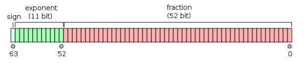
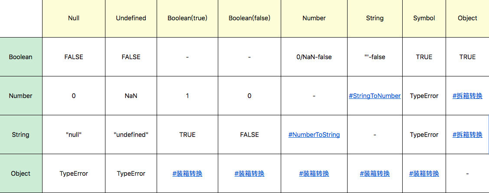

# JavaScript 类型系统

- JavaScript 类型系统
  - 特征
    - 动态类型：运行阶段才能确定变量类型
      - [类型判断](#类型判断)
      - 类型相等判断
    - [弱类型：隐式类型转换](#弱类型：隐式类型转换)
  - 分类
    - 原始类型/基本类型
      - Undefined：表示未定义或未初始赋值
        - JavaScript 的代码 undefined 是一个变量，而并非是一个关键字
        - 全局 undefined 是无法修改，但可以被作为局部变量篡改
        - **为了避免无意中被篡改，建议使用 void 0 来获取 undefined 值**
      - Null：表示空值
      - Boolean
      - Number
        - [为什么 0.1+0.2 不等于 0.3？](#number为什么-0102-不等于-03)
        - NaN：表示不是数字
        - Infinity：表示无穷数
      - String
        - Unicode 字符集，UTF16 编码方式
        - JavaScript 中的字符串一旦构造出来就无法改变（原内存空间），变量重新赋值只是重新创建新的字符串
      - Symbol
        - 创建唯一标识符，作为对象属性名，防止冲突
        - 创建对象的“隐藏”属性
      - BigInt
    - 复合类型/对象类型/引用类型 
      - Object
        - 内置特殊对象类型
          - Boolean
          - Number
          - String
          - Array
          - RegExp
          - Error
          - Date
          - Function
            - 按值传递：即复制实参的值；引用传递，即复制实参的地址
          - 数据结构
            - Set、WeakSet
            - Map、WeakMap

## Number：为什么 0.1+0.2 不等于 0.3？

浮点数一般采用**科学计数法**来表示的，由尾数（significand mantissa）、基数（base）和指数（exponent）三部分组成。

ECMAScript 中的 Number 类型使用 IEEE754 标准（二进制浮点数算术标准）来表示数字（整数和小数），并采用双精确度 64位：基数默认为 2，1 符号位（sign） + 11 指数位（exponent） + 52 尾数（fraction）：

  

- 精度丢失
  - 因为把十进制转化为二进制的算法是用十进制的小数乘以 2 直到没有了小数为止，所以十进制下的有些小数无法被精确地表示成二进制小数。而既然这里的浮点数是二进制，因此**小数就会存在精度丢失的问题**。
  - **对齐丢失**：而且当我们使用加减法的时候，由于需要先对齐（也就是把指数对齐，过程中产生移位），再计算，所以这个精度会进一步丢失。
  - **显示截断**：计算机在表示一个数字时，宽度是有限的，无限循环的小数存储在计算机时，只能被截断

### 怎么处理浮点数运算缺失导致的问题

- 转成整型做存储、计算，然后再格式化显示
- bigInt
- 第三方库：math.js
- 使用 Number.EPSILON 误差范围：`Math.abs(0.1 + 0.2 - 0.3) <= Number.EPSILON`

## 如何判断一个值是不是数字

- typeof 确保数字类型
- isNaN
- isFinite 是 JavaScript 中的一个内置函数，通过它，我们可以过滤掉 NaN 和 Infinity

```js
var isNum = function isNum(value){
  return typeof value === 'number' && Number.isFinite(value);
}
```

## 类型判断

- typeof
  - 无法判断除了 function 类型以外的其他具体引用类型
  - `typeof null === 'object'`
- instanceof
  - 可以判断具体引用类型，但是不能正确判断基础数据类型
  - instanceof 本质上是判断右边的构造函数的 prototype 对象是否存在于左边的原型链上。但根据原型链，`... instanceof Object` 都返回 true。
- Object.prototype.toString.call
  - 能够更加准确判断数据类型并统一返回格式为 “[object Xxx]” 的字符串，`Object.prototype.toString.call(null) // '[object Null]'`
  - `Symbol.toStringTag` 自定义输出
- 类型判断工具
  ```js
  function getType(target) {
      const type = typeof target;

      if(type !== 'object') {
          return type
      } else {
          return Object.prototype.toString.call(target).replace(/\[object (.*?)\]/g, "$1")
      }
  }
  ```
- 数组判断
  - Array.isArray

## 弱类型：隐式类型转换

- 类型转换
  - 显示转换，如 `String('123')`、`Boolean()`、`Number()`
  - 隐式转换，通过运算符会自动触发类型转换，如 `+'123'`
    - 类型转换规则  
      在 JS 中类型转换情况：toNumber 、 toString 、 toBoolean、toObject
        
      - 基本类型之间的转换
        - StringToNumber
          - Number
          - parseInt
          - parseFloat
        - NumberToString
          - String
      - 对象类型与基本类型之间的转换
        - 装箱转换
          - 包装类
        - 拆箱转换
          1. valueOf
          2. toString
          3. Symbol.toPrimitive(o [ , PreferredType ])

类型不同的变量比较时==运算只有三条规则：

- undefined 与 null 相等
- 字符串和 bool 都转为数字再比较
- 对象转换成 primitive 类型再比较
  另一个是对象如果转换成了 primitive 类型跟等号另一边类型恰好相同，则不需要转换成数字。