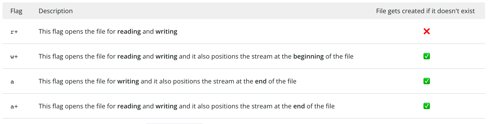

# NodeJS

- NodeJS
  - 模块系统
    - [模块规范](../JavaScript/JavaScript%20%E6%A8%A1%E5%9D%97.md)
    - [Node 模块解析](#node-模块解析)
    - [Corepack 与包管理](./Corepack%20与包管理.md)
  - [异步编程](../JavaScript/JavaScript%20异步编程.md)
  - 代码调试及错误处理
    - [调试指南](#调试指南)
  - API 模块
    - Node API 风格
      - 基于回调的 API 风格，如 `fs.readFile()`
      - 基于 Promise 的版本具有相同的名称，但在其 promises 模块中：`import { readFile } from "node:fs/promises";`
      - 以 xxxSync 函数命名格式的同步风格
    - [文件系统](#文件系统)
    - Buffer、Stream：解决大文件内存缓存限制问题
      - [Node Stream](https://github.com/zoubin/streamify-your-node-program/blob/master/README.md)
      - [Node.js Streams: Everything you need to know](https://www.freecodecamp.org/news/node-js-streams-everything-you-need-to-know-c9141306be93/)
      - [stream-handbook](https://github.com/substack/stream-handbook)
      - [Understanding Streams in Node.js](https://nodesource.com/blog/understanding-streams-in-nodejs)
    - 子进程、Worker 线程、Cluster
    - VM
      - [NPM 酷库：vm2，安全的沙箱环境](https://segmentfault.com/a/1190000012672620)
  - [Node.js 事件循环](./Node.js%20事件循环.md)
  - 深入
    - 第三方扩展
      - C++ addons NAPI
      - DLL
        - [node-ffi](https://github.com/node-ffi/node-ffi)
      - WebAssembly
    - [Node.js 源码剖析](https://theanarkh.github.io/understand-nodejs/)
  - 开发实战
    - [Nodejs CLI](./Nodejs%20CLI.md)
    - [Web 后端服务开发](#web-后端服务开发)
    - NodeJS 运行及部署
      - [PM2](https://pm2.keymetrics.io/)
    - NodeJS 日志及监控
      - 日志
        - [debug](https://github.com/debug-js/debug)
        - [winston](https://github.com/winstonjs/winston)
        - [pino](https://github.com/pinojs/pino)
          - https://betterstack.com/community/guides/logging/how-to-install-setup-and-use-pino-to-log-node-js-applications/#centralizing-and-monitoring-your-node-js-logs
    - NodeJS 性能优化
      - CPU（计算性能优化、JS Profile）
        1. 减少不必要的计算
        2. 空间换时间
        3. 提高计算能力
           1. C++ 插件
        4. 多进程、多线程
      - 内存（提高系统性能）
        - 减少内存使用，减少 GC 次数
          - Buffer、Stream
        - 内存泄漏，导致 GC 过久
          - 内存泄漏
            - JS 垃圾回收机制
            - 内存泄漏排查
          - APM
            - [clinicjs](https://clinicjs.org/)
            - [easy-monitor](https://github.com/hyj1991/easy-monitor)

## Node 模块解析(WIP)

- 模块路径
  - 文件系统路径
  - URL
    - file: 本地文件
    - data: 数据协议
    - node: 内置模块
  - Node 模块路径：既不以斜杠也不以点开头的路径，则以包名称开头
- Node 模块路径解析策略
  - startWith `#`
    - package imports
  - 解析算法遍历当前目录及其祖先，直到找到一个目录 node_modules，该目录下存在与包名匹配的（比如，）
    - 文件模块
    - 包含 package.json 的文件夹，解析 package.json 入口模块
      - `main`
        - 子路径被解释为相对于包目录
      - `exports`
        - `exports` 字段的优先级高于 `main` 字段
          - 向后兼容 `main`
            ```json
            {
              "main": "./dist/src/main.js",
              // "exports": "./dist/src/main.js", 
              "exports": {
                ".": "./dist/src/main.js"
              }
            }
            ```
        - 自定义子路径导出，隐藏包的内部结构（一旦 `exports` 属性存在，就只能使用其中列出的）
          ```json
            {
              "exports": {
                "./util/errors": "./dist/src/util/my_errors.js",
                "./lib/*": "./dist/src/*.js", // 对应映射多个文件
                
                "./util/errors.js": "./dist/src/util/errors.js",
                "./*": "./dist/src/*",

                //
                "./internal/*": null,
              }
            }
          ```
        - 条件导出
          ```json
          {
            "type": "module",
            "exports": {
              ".": {
                "require": "./main.cjs",
                "import": "./src/main.js"
              }
            }
          }
          ```
      - 文件扩展名
        - `.js` 文件的加载取决于 package.json 里面 `type` 字段的设置
          - commonjs（默认）
          - module
        - `.mjs` 文件总是以 ES6 模块加载
        - `.cjs` 文件总是以 CommonJS 模块加载
    - 文件夹模块下的 index.js 文件


- module
- 文件导出

## 调试指南(WIP)

- 调试指南
  - 用例测试
    - 单元测试
      - Jest
      - [Mocha](https://mochajs.org/)
    - 集成测试
  - 控制台日志
    - console
      - console.log
      - console.group/console.groupEnd
      - console.table
      - `console.dir(obj, {colors: true, depth: 0 })`
  - Debugger
    - [Debugging Node.js with Chrome DevTools](https://medium.com/@paul_irish/debugging-node-js-nightlies-with-chrome-devtools-7c4a1b95ae27)
      - `node --inspect app.js`
      - `chrome://inspect#devices`
    - [Debug in your IDE (VS Code)](https://code.visualstudio.com/docs/nodejs/nodejs-debugging#_auto-attach)
  - Hook up logging/APM tooling
    - 性能
      - 火焰图是可视化函数执行方式
      - 内存泄漏
    - 性能测试工具
      - https://github.com/artilleryio/artillery

## 文件系统

- 系统文件路径
  - `node:path`
    - `path.posix`：用于访问 macOS 在内的 Unix
    - `path.win32` 用于 Windows 平台
    - `path`：动态对应系统平台
  - 基础
    - 文件路径由一个或多个路径段组成
    - `path.sep`：路径分隔符，用于分隔路径中的两个相邻路径段
      - unix：`/`
      - window：`\\`
    - `path.delimiter`：路径定界符，分隔路径列表中的元素
    - CWD(The current working directory)：shell 工作环境下的一个当前工作目录的概念，如果我们使用部分路径，通常相对 CWD 进行解析。Windows 的工作方式与 Unix 不同的是有多个驱动，每个驱动器都有一个当前工作目录。
      - `process.cwd()`：获取当前 cwd
        - 在 window 系统中有多个驱动，当我们重新访问其中某个驱动器时，Node.js 会记住该驱动器之前的当前目录
      - `process.chdir(dirPath)`：修改 cwd
    - 开发需要访问到的特殊变量
      - `__filename`：表示当前的执行文件路径
      - `__dirname`：表示当前执行文件所在目录
      - `os.homedir()`：当前用户的目录
      - `os.tmpdir()`：临时文件目录
    - 路径解析
      - 完全路径可以直接使用，部分路径则缺少信息需要要解析成完全路径才能在系统工作
        - Unix
          - 完全路径：以 `/` 开头的表示绝对路径形式
          - 部分路径：以文件名或点开头的表示相对路径
            ```
            .   (current directory)
            ..  (parent directory)
            dir
            ./dir
            ../dir
            ../../dir/subdir
            ```
        - Window
          - 绝对路径是带驱动器号的
          - 其他路径都是部分路径的
      - `path.normalize()`：标准化路径
        - 删除单点路径段
        - 解析双点的路径段
        - 将多个路径分隔符变成一个路径分隔符
        - window 中会将合法的每个路径分隔符斜杠 `/` 转换为 `\\`
      - `path.resolve()`
        - 根据 CWD 为基础进行解析
        - 返回绝对路径
      - `path.join()`
        - 拼接解析路径的方式，如果第一个后面有参数是绝对路径，则它们将被解释为相对路径
      - `path.relative()`：创建相对路径
      - `path.parse()`、`path.format()`：解析、修改、生成路径
  - 实践
    - 跨平台文件系统路径
      - 问题
        - 不同系统平台路径分隔符可能不同
        - 文件结构可能不同：如主目录和临时文件目录可能位于不同位置，window 分不同驱动盘等
      - fix
        - 禁止硬编码绝对路径
        - 以当前工作目录或文件为准使用相对路径
        - 使用路径段数组，运行时再解析转换为特定的平台路径
        - 统一路径格式
          - 包装原生 API 的方法，内部动态处理
            - [pathe](https://github.com/unjs/pathe)
          - 使用 `file:` URL：可以屏蔽系统路径分隔符号问题
            - [URL](https://nodejs.org/api/url.html#the-whatwg-url-api)
            - `fileURLToPath`、`pathToFileURL`：系统路径和 URL 相互转换
    - glob：路径模式匹配
      - [node-glob](https://github.com/isaacs/node-glob)
      - [minimatch](https://github.com/isaacs/minimatch)
      - [micromatch](https://github.com/micromatch/micromatch)
      - [globby](https://github.com/sindresorhus/globby)
- 文件操作
  - 文件路径支持
    - 系统文件路径，如字符串路径的 POSIX 风格
    - `file:` URL
    - Buffer
  - 访问文件的方式
    - 一次性读写
    - 流式读写
    - 持用 FD、FileHandles 的引用
  - 实践
    - 跨平台处理行终止符 EOL
      - EOL
        - Windows：`\r\n`
        - Unix：`\n`
      - 阅读文本时，最好同时识别两个 EOL
      - 处理带有 EOL 的行时，有时删除它们很有用
      - 在编写行终止符时，我们有两种选择
        - 'node:os' 模块中的常量 EOL 包含当前平台的 EOL。
        - 我们可以检测输入文件的 EOL 格式，并在更改该文件时使用它
    - 文件目录操作
      - 检查文件或目录是否存在
        - `fsPromises.access()`：检查文件或目录是否存在
        - fs.mkdirSync(parentDir, {recursive: true})
          - recursive：能够按需创建父目录
      - mkdtemp：创建临时目录
    - 文件内容读写
      - open
        - flag
          - 
          - https://nodejs.dev/en/api/v19/fs/#file-system-flags
        - fd: filehandle
          - readFile
          - readlins
            ```js
            import { open } from 'node:fs/promises';

            const file = await open('./some/file/to/read');

            for await (const line of file.readLines()) {
              console.log(line);
            }
            ```
          - writeFile
      - close
    - 移至垃圾箱
      - [trash](https://github.com/sindresorhus/trash)
    - 文件监听
      - [chokidar](https://github.com/paulmillr/chokidar)

## 子进程、Worker 线程、Cluster

- 子进程、Worker 线程、Cluster
  - ChildProcess
    - API
      - spawn
        - command
        - args
        - options
      - fork
      - exec
      - execFile
    - `option.stdio`
    - `ChildProcess.exitCode`
      - 0（零）表示正常退出
      - 数字大于零意味着发生了错误
      - null表示该进程尚未退出
    - 命令模式与参数模式
  - WorkerThreads
    - [深入理解 Node.js Worker Threads](https://zhuanlan.zhihu.com/p/167920353)
  - Cluster
    - [How to use Cluster to increase Node.js performance](https://www.arubacloud.com/tutorial/how-to-use-cluster-to-increase-node-js-performance.aspx)

## Web 后端服务开发

- Web 后端服务开发
  - APIs
    - RESTFul API
      - [前后端接口规范 - RESTful 版](https://github.com/olivewind/restful-api-specification)
    - [RPC](https://grpc.io/)
  - 业务处理
    - [身份验证和授权](./身份验证及授权.md)
    - 安全
      - 数据检验
        - JSON Schema
        - typescript 运行验证
      - 数据加密
      - [Web 安全](../浏览器原理及WebAPI/Web%20安全.md)
  - HTML 渲染
    - 模板引擎
      - pug
      - ejs
  - 数据库
    - ORM
      - Prisma
      - Sequelize
      - TypeORM
    - Redis
  - 工程
    - 测试
      - 压测 http 服务（ab）
        - QPS
        - 吞吐率

### BFF

- BFF
  - 数据
    - 数据聚合和裁剪
    - 协议转换
  - 路由
    - 路由条件
    - 反向代理
      - [fastify/fast-proxy](https://github.com/fastify/fast-proxy)
    - 提供路由分发能力
      - hard coding
      - URL 规范化
      - 中心化配置
  - 可用性保障
    - 限流
    - 熔断降级
    - 负载均衡
    - 缓存
  - 安全
    - CORS
    - 合理使用 Content-Security-Policy
    - 使用 HTTPS/HSTS
    - 设置监控报警以及调用链追踪能力
  - 身份验证和权限校验
  - 扩展
    - 中间件
    - 插件：Hooks 设计
