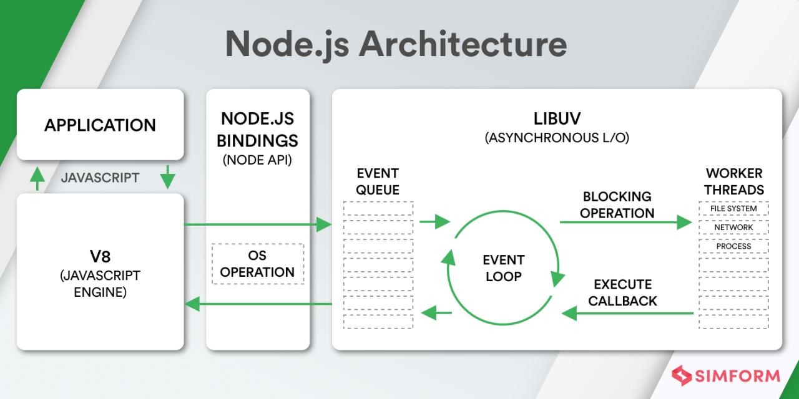

# NodeJS

- NodeJS
  - 架构
    - 组成结构   
    - 架构：非阻塞 IO 模型、事件驱动架构  
  - 模块机制
    - [模块规范](../JavaScript/JavaScript%20%E6%A8%A1%E5%9D%97.md)
      - ES Modules
      - CommonJS
    - 模块解析以及加载机制
    - [Corepack 与包管理](./Corepack%20与包管理.md)
  - 错误处理及代码调试
    - 错误处理
    - 代码调试
      - [调试指南](https://nodejs.org/zh-cn/docs/guides/debugging-getting-started/)
    - [node-clinic](https://github.com/clinicjs/node-clinic)
    - 内存泄漏
  - [异步编程](../JavaScript/JavaScript%20异步编程.md)
  - [Node.js 事件循环](./Node.js%20事件循环.md)
  - 全局变量及内置模块
    - 文件操作
      - global.process.cwd()、global.__filename 和 global.__dirname
      - FS 模块
      - Path 模块
      - npm
        - [chokidar](https://github.com/paulmillr/chokidar)
        - [node-fs-extra](https://github.com/jprichardson/node-fs-extra)
        - [node-glob](https://github.com/isaacs/node-glob)
        - [globby](https://github.com/sindresorhus/globby)
      - A&Q
        - 系统路径大小写及系统分割符号问题？
    - Event Emitter
    - Buffer、Stream：解决大文件内存缓存限制问题
      - [Node Stream](https://github.com/zoubin/streamify-your-node-program/blob/master/README.md)
      - [Node.js Streams: Everything you need to know](https://www.freecodecamp.org/news/node-js-streams-everything-you-need-to-know-c9141306be93/)
      - [stream-handbook](https://github.com/substack/stream-handbook)
      - [Understanding Streams in Node.js](https://nodesource.com/blog/understanding-streams-in-nodejs)
    - 多进程、多线程
      - Cluster
        - [How to use Cluster to increase Node.js performance](https://www.arubacloud.com/tutorial/how-to-use-cluster-to-increase-node-js-performance.aspx)
      - ChildProcess
        - Spawn vs Fork vs Exec
      - WorkerThreads
        - [深入理解 Node.js Worker Threads](https://zhuanlan.zhihu.com/p/167920353)
    - VM
      - [NPM酷库：vm2，安全的沙箱环境](https://segmentfault.com/a/1190000012672620)
  - 深入
    - 第三方扩展
      - C++ addons NAPI
      - DLL
        - [node-ffi](https://github.com/node-ffi/node-ffi)
      - WebAssembly
    - [Node.js 源码剖析](https://theanarkh.github.io/understand-nodejs/)
  - 开发实战
    - [CLI](#cli)
    - [WebServer](./NodeJS：Web%20服务开发.md)
    - NodeJS 单元测试
      - Jest
      - Mocha
    - NodeJS 运行及部署
      - [PM2](https://pm2.keymetrics.io/)
    - NodeJS 日志与监控
      - 日志
        - [winston](https://github.com/winstonjs/winston)
        - [pino](https://github.com/pinojs/pino)
    - NodeJS 性能优化
      - CPU（计算性能优化、JS Profile）
        1. 减少不必要的计算
        2. 空间换时间
        3. 提高计算能力
           1. C++ 插件
        4. 多进程、多线程
      - 内存（提高系统性能）
        - 减少内存使用，减少GC次数
          - Buffer、Stream
        - 内存泄漏，导致 GC 过久
          - 内存泄漏
            - JS 垃圾回收机制
            - 内存泄漏排查
          - APM
            - [clinicjs](https://clinicjs.org/)
            - [easy-monitor](https://github.com/hyj1991/easy-monitor)
- 资料
  - [使用 Node.js 构建 JavaScript 应用程序](https://docs.microsoft.com/zh-cn/learn/paths/build-javascript-applications-nodejs/)
  - Node.js 设计模式
  - [An Introduction to libuv](http://nikhilm.github.io/uvbook/)
  - [node-in-debugging](https://github.com/nswbmw/node-in-debugging)

## CLI

- CLI
  - 参数
    - 命令行参数
      - process.argv
      - [commander.js](https://github.com/tj/commander.js#readme)
      - [clipanion](https://github.com/arcanis/clipanion)
      - [yargs](https://github.com/yargs/yargs)
    - 环境变量
      - process.env
      - 环境配置文件：[dotenv](https://github.com/motdotla/dotenv#readme)
  - 用户输入
    - [process.stdin](https://nodejs.org/api/process.html#processstdin)
    - readline
    - [inquirer](https://github.com/SBoudrias/Inquirer.js#readme)
    - [prompts](https://github.com/terkelg/prompts#readme)
    - [enquirer](https://github.com/enquirer/enquirer#built-in-prompts)
  - 打印输出
    - process.stdout
    - process.stderr
    - console.log
    - 美化
      - 文本
        - [chalk](https://github.com/chalk/chalk)
        - [kleur](https://github.com/lukeed/kleur)
      - 文本框：[boxen](https://github.com/sindresorhus/boxen)
      - 进度
        - [ora](https://github.com/sindresorhus/ora#readme)
      - 任务列表：[listr](https://github.com/SamVerschueren/listr)
  - 子进程
    - [zx](https://github.com/google/zx)
  - shellbag
  - package.json `.bin`

## 错误处理


处理异步错误的其他最佳实践如下：

收听所有“出错”事件
听uncaughtException
使用domain（软弃用）或AsyncWrap
日志、日志、日志和跟踪
通知（可选）
退出并重新启动进程

```
process.on('uncaughtException', function (err) {
  console.error('uncaughtException: ', err.message)
  console.error(err.stack)
  process.exit(1)
})
```