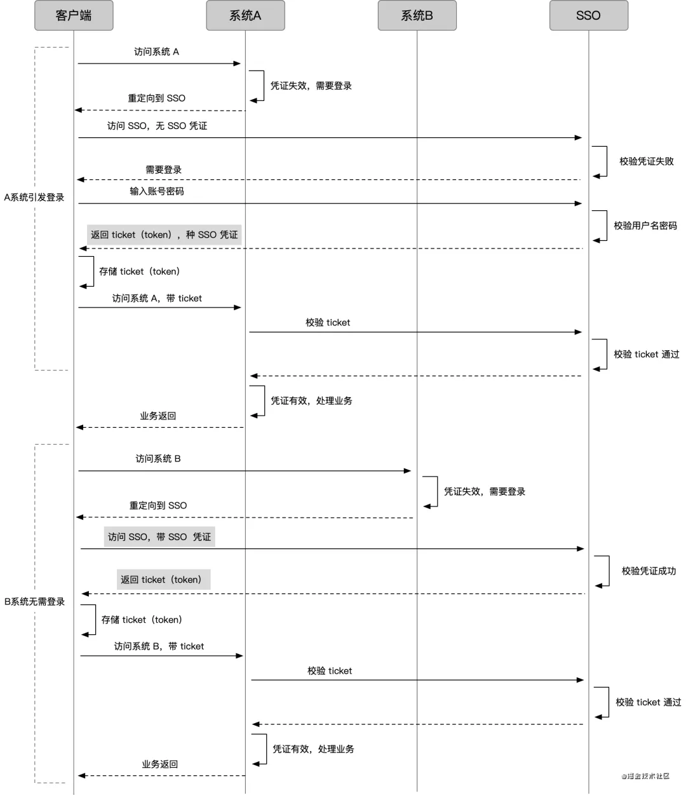

# 鉴权

- 身份认证及授权
  - 每次访问都需要账户密码验证
  - 缓存用户登陆的状态，根据状态存储位置划分为：
    - Session（Server）：使用内存或数据库实现会话功能存储用户状态
      - 更好控制用户状态，适合复杂的用户状态管理场景
      - Session 分布式问题
        - 集中存储，比如独立的 Redis 缓存服务器共享 session
        - 让同一台IP的请求负载均衡打到同一台服务器上，比如nginx可以通过配置ip_hash的方式来实现
      - 流程   
    - Token（Client）：利用特殊设计的 Token 校验实现身份验证
      - 无状态、去中心化
        - 适合多系统间交互；对于 C 端产品，Session 更好，安全性高
      - 无法控制登陆状态控制。在到期窗口，不安全存储，会导致黑客攻击利用
        - 过期机制 - Refresh Token    
      - JWT（JSON Web Token）
        - 规范 https://jwt.io/
        - 是一种开放的 Token 设计标准，允许在两方之间进行安全、可靠的通信
        - jwt = header.payload.signature
          - Header = base64url({ typ, alg, ...})
            - typ：表示令牌类型，JWT 令牌统一写为 JWT
            - alg：签名算法，默认为 HS256
          - Payload = base64url({...})
          - Signature = HASH(Header.Payload, secret)
        -   
  - SSO（单点登录）
    - 流程  
    - ticket 存储使用
      - 顶级域相同：cookie 顶级域共享 + 共享 session/token
      - 顶级域不同：借用 code 设置第一方 ticket 的存储，防止跨域问题    
  - OAuth（开放授权）
    - OAuth 的核心就是向第三方应用颁发令牌 
    -  
      - [OAuth 2.0 的四种方式](https://www.ruanyifeng.com/blog/2019/04/oauth-grant-types.html)
      - 授权码模式（常用）：指的是第三方应用先申请一个授权码，相比直接分发令牌安全性更高，然后再用该码及第三方应用备案信息获取令牌

- virtual DOM更快是建立在一个前提之上，大部分代码并不是以最高性能的方式操作真实DOM的
- 人性是懒惰的，大部分人并不会直接基于原生DOM实现增量操作，因为面向增量编程是痛苦的，而面向全量编程是开心的
- virtual DOM的真正价值，是把懒惰的人们喜欢的而面向全量编程，转换为针对真实DOM的增量操作（这一次的vdom和上一次的vdom进行diff，找出发生变化的地方，即，增量），并保证这个过程引入的性能损失极可能低。

- 浏览器 Token 存储 Token：将认证信息存放在标记为 HttpOnly，Secure，Same-Site=strict的 Cookie 中，从而避免 XSS 和 CSRF