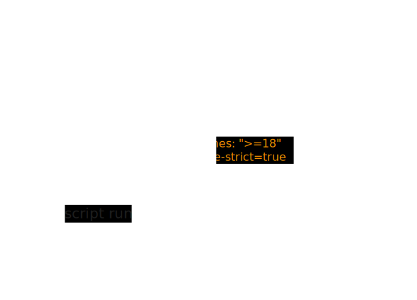

# Nodejs 包管理

- 包管理（[Pnpm](https://pnpm.io/)）
  - [包描述文件：package.json](#packagejson-常见字段)
  - 创建现代化模块包
    - 构建 CommonJS (CJS) 和 ECMAScript (ESM) 模块格式
    - 编写单元测试
    - 自动化版本管理和发布
      - 语义版本控制
  - 依赖管理
    - 安装
    - 更新
      - 补丁
    - 删除
    - 联调
      - `link`
    - 查看
  - 脚本运行
    - pnpm run
    - pnpm dlx
    - pnpm exec/npx
  - Workspaces
- [Node 开发环境锁定](#node-开发环境锁定)

## 创建现代化模块包

- 创建现代化模块包
  - 构建 CommonJS (CJS) 和 ECMAScript (ESM) 模块格式
  - 配置 package.json
    - 常见字段
  - 编写单元测试
  - 自动化版本管理和发布
    - 语义版本控制

## 发包

pnpm 在默认情况下，如果可用的 packages 与已声明的可用范围相匹配，pnpm 将从 workspace 链接这些 packages，并在 package.json 以 `workspace:` 协议声明；而当发包的时候将动态标准化依赖为 `workspace:` 协议：

```json
{
  "dependencies": {
    "foo": "workspace:*",
    "bar": "workspace:~",
    "qar": "workspace:^",
    "zoo": "workspace:^1.5.0"
  }
}
```

将会被转化为：

```json
{
  "dependencies": {
    "foo": "1.5.0",
    "bar": "~1.5.0",
    "qar": "^1.5.0",
    "zoo": "^1.5.0"
  }
}
```

### Publish 工作流

> 以下基于 [github package npm 注册源](https://docs.github.com/cn/packages/working-with-a-github-packages-registry/working-with-the-npm-registry)为例

1. Running unit tests 运行单元测试
2. 确认 package 相关信息（[package.json 常见字段](#packagejson-常见字段)）
3. npm publish --dry-run
4. Pack
5. Versions
  - 自动化版本管理
    - [semantic-release](https://github.com/semantic-release/semantic-release)
6. Changelog
7. Register & Oauth

   - 注册源配置
     - .npmrc：`@laoergege:registry=https://npm.pkg.github.com/`
     - package.json#publishConfig：
       ```json
       "publishConfig": {
         "registry":"https://npm.pkg.github.com",
         "access": "public"
       }
       ```
   - 身份认证

     - 个人访问令牌
       - .npmrc：`//npm.pkg.github.com/:_authToken=TOKEN`
     - 命令行

       ```shell
       $ npm login --scope=@OWNER --registry=https://npm.pkg.github.com

       > Username: USERNAME
       > Password: TOKEN
       > Email: PUBLIC-EMAIL-ADDRESS
       ```

8. `pnpm publish`

## package.json 常见字段

> package.json 文档链接
>
> - [npm](https://docs.npmjs.com/cli/v8/configuring-npm/package-json)
> - [pnpm](https://pnpm.io/zh/package_json)

- package.json
  - 项目描述
    - name
      - Global names
      - `@scope/name`
    - version
      - 语义版本控制
    - description
    - keywords
    - homepage
    - license
    - people fields: author, contributors
    - repository
    - workspaces
  - 模块描述
    - type
    - main
    - module
    - types
    - 依赖关系
      - dependencies
      - devDependencies
      - peerDependencies
    - overrides：通常用于开发覆盖包做测试
  - 脚本命令
    - bin
    - scripts
  - 发包配置
    - publishConfig
    - private
    - files
  - 环境声明
    - engines


## Node 开发环境锁定



- 使用 Node 版本管理工具对项目进行 Node 环境安装和版本切换
  - [fnm](https://github.com/Schniz/fnm)
  - [nvm](https://github.com/nvm-sh/nvm)
  - [volta](https://github.com/volta-cli/volta)
- 启动 [corepack](https://github.com/nodejs/corepack) 对包管理默认
  - `corepack enable`
  - `corepack use <name@version>`
  - package.json 配置
    ```json
    {
      "packageManager": "pnpm@8.9.2",
      "scripts": { "prepare": "corepack enable" }
    }
    ```
- 指定项目 scripts run 的版本环境
  - package.json `engines` + .npmrc `engine-strict=true`
- 依赖版本：lockfile