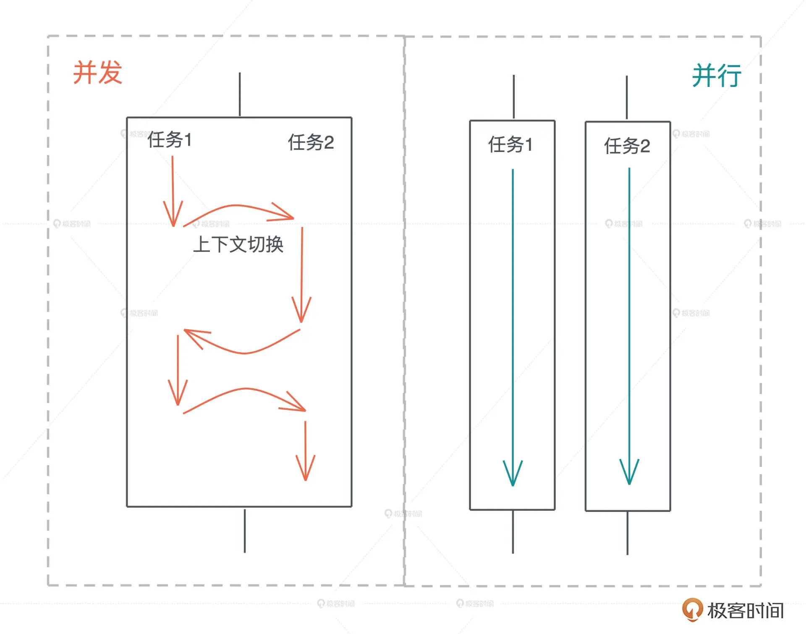

# Rust

- Rust
  - 设计理念
    - 内存安全、并发安全、性能
    - 多范式编程
    - 划分 Safe rust 和 Unsafe Rust（方便与其他语言沟通）
  - [Rust 编程基础](#rust-编程基础)
  - [所有权、借用及生命周期](./所有权、借用及生命周期.md)
  - 数据结构
    - 数组（长度固定、类型相同）
      - `let arr: [i32; 5] = [1,2,3,4,5];`
      - `let arr2 = [3; 5]; // let arr2 = [3,3,3,3,3]`
    - 元组：`let tup = (32, 'A', 0.12);`
      - 解构：`let (x, y, z) = tup;`
      - 索引：`tup.1`
    - 集合
      - 矢量 `Vec`
      - 哈希 `HashMap`
  - 代码调试
    - 日志
      - println! 格式化 `\{}` 调用 `std::fmt::Display` 实现
        - 打印结构体的信息需要单独实现 `std::fmt::Display`，不过可以借助`std::fmt::Debug` 
      - println! 格式化 `\{:?}`、`\{:#?}` 调用 `std::fmt::Debug` 实现
        - `#[derive(Debug)]` 派生 Debug trait
        - `dbg!`
    - 测试
      - 单元测试
        - `#[test]`
        - `#[should_panic]` 预期的失败
        - `#[ignore]` 忽略测试
      - 文档测试 `///`
      - 集成测试
  - [Rust 错误处理](./Rust%20错误处理.md)
  - 进阶
    - 泛型编程
      - 数据结构的泛型
      - 使用泛型结构代码的泛型化
    - 面向接口编程
      - 接口将调用者和实现者隔离开，大大促进了代码的复用和扩展。面向接口编程可以让系统变得灵活，但是当使用接口去引用具体的类型时，在运行时变量原本的类型被抹去，我们无法单纯从一个指针分析出这个引用具备什么样的能力，所以我们就需要虚表来辅助运行时代码的执行。有了虚表，我们可以很方便地进行动态分派，它是运行时多态的基础。
      - Trait
    - 函数式编程
      - 函数往往是一等公民
      - 闭包是将函数，或者说代码和其环境一起存储的一种数据结构。闭包引用的上下文中的自由变量，会被捕获到闭包的结构中，成为闭包类型的一部分。
    - 并发编程
      - 并发是系统拥有同时与多件事情打交道的能力；并行是同时处理多件事情的手段    
      - 异步编程
    - 宏编程
      - 声明宏
      - 过程宏
        - 函数宏
        - 派生宏
        - 属性宏
    - 面向对象编程
  - rustup：rust 开发管理工具
    - rustc：rust 编译器
    - cargo：rust 构建系统和包管理工具
      - 概念
        - package：项目
        - crate：库
        - workspace
      - 命令
        - build
        - run
        - check
  - 学习资料
    - [Rust编程语言入门教程（Rust语言/Rust权威指南配套）](https://www.bilibili.com/video/BV1hp4y1k7SV)
    - [tour_of_rust](https://github.com/richardanaya/tour_of_rust)

## Rust 编程基础

- 编程基础
  - 变量、值和类型声明
    - 变量
      - Rust 的变量命名规范：蛇形命名法 (snake_case)
      - 声明不可变变量：`let`
        - 隐藏变量：即可重复声明变量
      - 可变变量声明：`let mut`
      - 常量声明：`const`
        - 不可与 `mut` 配合，且使用**必须注明值的类型**
        - 常量被编译后放入可执行文件的数据段，可全局访问
      - 静态变量：`static let`
    - 值和类型
      - 类型是对值的区分，它包含了值在内存中的长度、对齐以及值可以进行的操作等信息；值是无法脱离具体的类型讨论的
      - rust 编译器会自动隐式**类型推导**
        - 但特殊情况也需要表明数据类型，如 const 变量声明
      - 类型分类
        - 标量类型
          - 整数
            - 无符号：`u32`
            - 有符号：`i32`
          - 浮点
            - IEEE-754 标准
          - 布尔
          - 字符
            - 单个字符：`char`
        - 复合类型：多个类型值组合在一起共同表达单个类型值的复杂数据结构
          - 结构体 `struct`
            - 默认可变
            - 使用**字段初始化**简写语法
              ```rs
              fn build_user(email: String, username: String) -> User {
                  User {
                      active: true,
                      username,
                      email,
                      sign_in_count: 1,
                  }
              }
              ```
            - 使用结构体更新语法从其他实例创建实例
              ```rs
              fn main() {
                  let user2 = User {
                      email: String::from("another@example.com"),
                      ..user1
                  };
              }
              ```
            - 实现方法成员：`impl [Type] { fn xx(&self) -> [Type] {...} }`
              - 方法：以 `&self` 为第一参数的函数
                - `&self` 实际上是 `self: &Self` 的缩写
                - 仅仅使用 `self` 作为第一个参数来使方法获取实例的所有权是很少见的；这种技术通常用在当方法将 self 转换成别的实例的时候
              - 静态方法：不以 `&self` 为第一参数的函数
                - 访问：`Xxx::method`
              - 自动引用和解引用机制
                - 当使用 `object.something()` 调用方法时，Rust 会自动为 object 添加 `&`、`&mut` 或 `*` 以便使 object 与方法签名首个参数匹配
                  ```rs
                  struct Foo;

                  impl Foo {
                      fn foo(&self) {
                          println!("foo");
                      }
                  }

                  fn main() {
                      let f = Foo;
                      f.foo();  // Rust 会自动将 f 转换为其引用 &f 来匹配 foo 方法的签名
                  }
                  ```
            - 元组结构体 `struct Xxx(xxx, xxx, xxx, ...)`：匿名字段，通过索引访问
            - 单元结构体 `struct Xxx`：如果你定义一个类型，但是不关心该类型的内容, 只关心它的行为时，就可以使用单元结构体
          - 枚举 `enum`
            - 标签联合
        - 类型转换
  - 语句、表达式与运算符
    - 语句是执行动作的指令，以分号";"结尾
    - 表达式是计算产生值
    - **面向表达式**：一切皆是表达式，即一切皆类型
      - 在 Rust 中，无论是（大多数）语句还是表达式会产生值，值即类型，rust 就是通过一切类型检查保证内存安全、并发安全
      - 比如
        - 分号也是一种表达式，返回单元类型 `; -> ()`
        - 语句块会对里面最后表达式的值作为其值返回，否则默认 `; -> ()`
    - 注释
      - 文档注释
    - 控制流
      - 顺序
      - 跳转
        - 循环
          - `loop {...}`：一直循环
          - `while [expr] {...}`：条件循环
            - 总是返回 `()` 类型
          - `for ... in [迭代器] {...}`：集合迭代
          - 中断
            - `break [expr]`
            - `continue`
            - `return [expr]`
        - 分支 
          - `if [condition] {...} else {...}`
          - 模式匹配（基于类型的分支）
            - `match expr {}`
              - 解构
              - _
            - `if let`
              - `if let ... else`
            - `while let`
        - 错误跳转
          - `expr?`：自动错误传播
            - expr 必须返回 Result 类型
        - 异步跳转
          - `expr.await`
  - 函数 `fn xxx_xxx([arg:type, ...]) -> [type]{...}`
    - 函数是一等公民
    - 函数声明提升
    - 返回值
      - 默认最后一个表达式
      - `return`：指定返回值
  - 模块系统
    - Workspace：多个 Package 工作空间
    - Package：Cargo 功能工作的基本单位
      - 包中可以包含至多一个库 crate(library crate)，可以包含任意多个二进制 crate(binary crate)，但是必须至少包含一个 crate（无论是库的还是二进制的）
        - 通过将文件放在 `src/bin` 目录下，一个包可以拥有多个二进制 crate：每个 `src/bin` 下的文件都会被编译成一个独立的二进制 crate
    - Crate：crate 是 rustc 编译的代码单位，表示单个二进制项目或库
      - crate 对外使用有两种形式
        - library crate
        - binary crate
      - crate 是一颗模块树，可以类比文件系统，对模块的引用路径则是基于该模块树
      - crate root 是一个源文件，Rust 编译器以它为起始点，并构成你的 crate 的根模块
        - Cargo 遵循的一个约定：`src/main.rs` 就是一个与包同名的二进制 crate 的 crate root；而 `src/lib.rs` 则是与包同名的库 crate 的 crate root。crate root 将由 Cargo 传递给 rustc 来实际构建库或者二进制项目
    - Module
      - `mod xxx {...}`：定义模块
      - 模块成员默认私有
        - `pub`：公开模块成员
        - `pub struct{ pub xxx, ... }`：即使 struct 公开，但内部字段依旧私有，需要 `pub` 指定字段成员
        - `pub emnu`：所有变体都是公共的
      - `mod xxx;`：可将模块拆分成多个文件，仅声明模块，自动加载链接
        - 编译器会在下列路径中寻找模块代码
          - `./xxx.rs`
          - `./xxx/mod.rs`（旧风格，编译器只允许其中一个风格）
          - `./xxx/child.rs` 其子文件模块
      - 使用 `use` 关键字来引入外部包的模块
    - Path
      - 通过模块路径引用模块的公开成员
        - `::`：rust 语言中引用路径分割符
        - 路径有两种形式
          - 绝对路径（absolute path）是以 crate root 为准 `crate` 字面量开头的全路径
          - 相对路径（relative path）从当前模块开始，以 `self`、`super` 或模块的标识符开头
      - `use`：减少重复路径
        - 嵌套路径
          - `use xxx::{ ... }`
          - `::{self, ... }`
        - `::*`：引入所有公开成员
        - `pub use`：导入导出
      - as 定义成员别名：`use std::io::Result as IoResult;`
      - 最佳实践
        - 路径只指定到父级，保留父级标识能更好区分变量