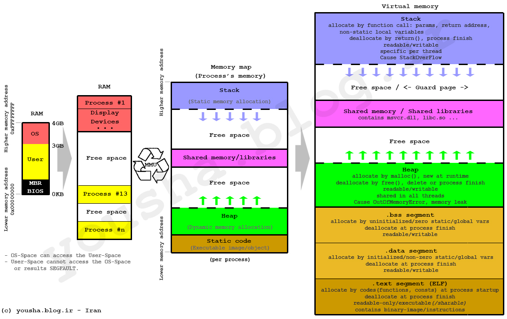

# 内存分配原理



操作系统会为进程分配一块为内存区域，程序内存分为
- 栈
- 堆
- 数据段
- 代码段

### 数据什么时候可以放在栈上，什么时候需要放在堆上呢？

**栈上存放的数据是静态的，固定大小，固定生命周期；堆上存放的数据是动态的，不固定大小，不固定生命周期**。

在编译时，一切无法确定大小或者大小可以改变的数据，都无法安全地放在栈上，最好放在堆上。除了动态大小的内存需要被分配到堆上外，动态生命周期的内存也需要分配到堆上。

对于存入栈上的值，它的大小在编译期就需要确定。这主要是考虑到调用栈的大小，避免**栈溢出（stack overflow）**。一旦当前程序的调用栈超出了系统允许的最大栈空间，无法创建新的帧，来运行下一个要执行的函数，就会发生栈溢出，这时程序会被系统终止，产生崩溃信息。除了**值大小**会导致栈溢出，还有另一个原因就是**函数无终止递归调用**。

### 堆栈数据的生命周期管理

大多数编程语言基本使用栈结构去管理函数调用关系，当函数结束函数内部变量也就不可用。分配跟释放，也就只需将栈顶、栈底指针移动，非常高效。

堆上存储的变量，其生命周期从分配后开始，一直到**显示释放**时才结束，因此堆上的变量允许在多个调用栈之间引用。但也导致堆变量的管理非常复杂，手工管理会引发很多内存安全性问题，而自动管理，无论是 GC 还是 ARC，都有性能损耗和其它问题。

#### GC

采用了**追踪式垃圾回收**（Tracing GC）的方法，来自动管理堆内存。这种方式通过定期标记（mark）找出不再被引用的对象，然后将其清理（sweep）掉，来自动管理内存，减轻开发者的负担。

#### ARC

自动引用计数（Automatic Reference Counting）。在编译时，它为每个函数插入 retain/release 语句来自动维护堆上对象的引用计数，当引用计数为零的时候，release 语句就释放对象。

从效率上来说，GC 在内存分配和释放上无需额外操作，而 ARC 添加了大量的额外代码处理引用计数，所以 GC 效率更高，吞吐量（throughput）更大。但是，GC 释放内存的时机是不确定的，释放时引发的 **STW（Stop The World）**，也会导致代码执行的延迟（latency）不确定。所以一般携带 GC 的编程语言，不适于做嵌入式系统或者实时系统。

### 栈的调用过程

> - [对于ESP、EBP寄存器的理解](https://www.cnblogs.com/xiangtingshen/p/11221277.html)
> - [图解函数调用过程](https://mp.weixin.qq.com/s/Od9X-qnQ3WWyZiLIS4uPFg)

栈内存区是由操作系统为线程分配管理的，并且每条线程都有自己的内存栈，并且有硬件指令指支持（CPU的 POP 指令和 PUSH 指令、ESP寄存器、EBP寄存器），形成 LIFO（后进先出）的数据管理结构。

**esp是栈顶指针**，是cpu机制决定的，push、pop指令会自动调整esp的值；

**ebp只是存取某时刻的esp，用来标识栈低**。进入一个函数内后开始，cpu会将esp的值赋给ebp，ebp 记录该栈底。

函数开始

```
 push ebp // 记录上一个栈底
 mov ebp,esp // 设置 ebp 为当前栈底
```

函数调用

```
call Fun // 将返回地址入栈
```

函数结束

```
mov esp, ebp // 将栈顶指针移动栈底
pop ebp // ebp 恢复上一栈底
ret // pop 返回地址，程序返回到主程序中，并执行下一条指令，并且移动 esp
```

消除形参

**释放参数涉及两种子函数调用标准，一种是STDCALL标准，一种是C标准。两种方式的核心思想就是修改esp。**


#### Why 栈堆内存

为什么一定要分“堆”和“栈”两个存储空间呢？所有数据直接存放在“栈”中不就可以了吗？

“堆”和“栈” 其实只是个内存空间概念，实际内存上并什么区分。

大多数语言使用该内存栈，来保存函数内部的局部变量，并且结合硬件（CPU 寄存器 esp、ebp 模拟栈顶、栈低指针）形成函数调用栈。栈在内存的分配与归还速度极快，因为也就是指针方向移动而已。

所有数据不可以直接存放在栈内存中，因为操作系统划分的栈空间大小有限，数据量过大时，也就容易发生栈溢出。