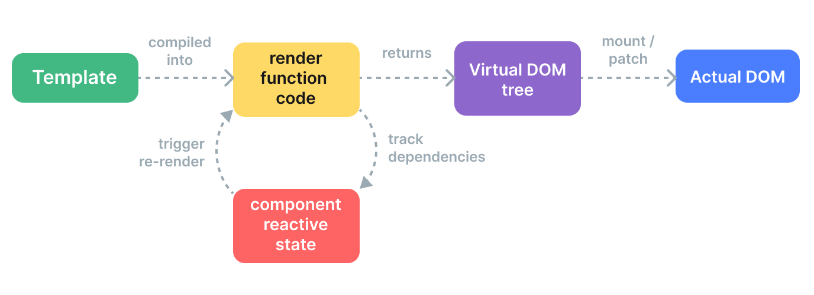

```ts
export function shouldUpdateComponent(
  prevVNode: VNode,
  nextVNode: VNode,
  optimized?: boolean
): boolean {
  const { props: prevProps, children: prevChildren, component } = prevVNode
  const { props: nextProps, children: nextChildren, patchFlag } = nextVNode
  const emits = component!.emitsOptions

  if (optimized && patchFlag >= 0) {
    if (patchFlag & PatchFlags.DYNAMIC_SLOTS) {
      // slot content that references values that might have changed,
      // e.g. in a v-for
      return true
    }
    if (patchFlag & PatchFlags.FULL_PROPS) {
      if (!prevProps) {
        return !!nextProps
      }
      // presence of this flag indicates props are always non-null
      return hasPropsChanged(prevProps, nextProps!, emits)
    } else if (patchFlag & PatchFlags.PROPS) {
      const dynamicProps = nextVNode.dynamicProps!
      for (let i = 0; i < dynamicProps.length; i++) {
        const key = dynamicProps[i]
        if (
          nextProps![key] !== prevProps![key] &&
          !isEmitListener(emits, key)
        ) {
          return true
        }
      }
    }
  } else {
    // this path is only taken by manually written render functions
    // so presence of any children leads to a forced update
    if (prevChildren || nextChildren) {
      if (!nextChildren || !(nextChildren as any).$stable) {
        return true
      }
    }
    if (prevProps === nextProps) {
      return false
    }
    if (!prevProps) {
      return !!nextProps
    }
    if (!nextProps) {
      return true
    }
    return hasPropsChanged(prevProps, nextProps, emits)
  }

  return false
}
```

component
- props
- children
- dirs
- transiton

element
- props
  - style
  - class
  - props
- children

1. 快速更新判断
   - shouldUpdateComponent
   - diff 少点
2. 快速更新
   1. 全量更新 vs 标记动态更新


默认下 jsx 角度，
默认情况下有 chidren、dirs、transiton 都会直接发生更新

diff 少 props

非编译优化 children， $table 可以跳过 slots 校验
PatchFlags.DYNAMIC_SLOTS 优化判断

- UI 范式
  - SFC
  - Template/JSX
- 编译：Template/JSX => render
  ```html
  <input class="vue" id="1"/>
  ```

  ```js
  import { openBlock as _openBlock, createElementBlock as _createElementBlock } from "vue"

  export function render(_ctx, _cache, $props, $setup, $data, $options) {
    return (_openBlock(), _createElementBlock("input", {
      class: "vue",
      id: "1"
    }))
  }
  ```
  - 函数模块化，TreeShaking
- Vue3 编译优化、升级
  - Props
  - 指令
  - 插槽
    - 函数插槽
    - children：插槽对象
  - 静态提升、事件缓存
  - 扁平树结构，并且用区块来做动静结构分离


# vue 编译优化

- 带编译时信息来提升虚拟 DOM 运行时性能
  - 静态提升、事件缓存
  - 扁平树结构，并且用区块来做动静结构分离
  - 更新类型标记 patch flag

```html
<div>
  <div>Hello World!</div>
  <div :class="style">{{name}}</div>
  <button @click="() => {alert('Hello World!')}">click me</button>
</div>
```

```js
import { createElementVNode as _createElementVNode, toDisplayString as _toDisplayString, normalizeClass as _normalizeClass, openBlock as _openBlock, createElementBlock as _createElementBlock } from "vue"

// 静态提升
const _hoisted_1 = /*#__PURE__*/_createElementVNode("div", null, "Hello World!", -1 /* HOISTED */)

export function render(_ctx, _cache, $props, $setup, $data, $options) {
  return (_openBlock(), _createElementBlock("div", null, [
    _hoisted_1,
    _createElementVNode("div", {
      class: _normalizeClass(_ctx.style)
      // h 函数第四个参数 patchFlag，精准 diff
    }, _toDisplayString(_ctx.name), 3 /* TEXT, CLASS */),
    _createElementVNode("button", {
      // 事件缓存
      onClick: _cache[0] || (_cache[0] = () => {_ctx.alert('Hello World!')})
    }, "click me")
  ]))
}
```

  


## 学习参考

- [渲染机制｜Vue.js](https://cn.vuejs.org/guide/extras/rendering-mechanism.html)