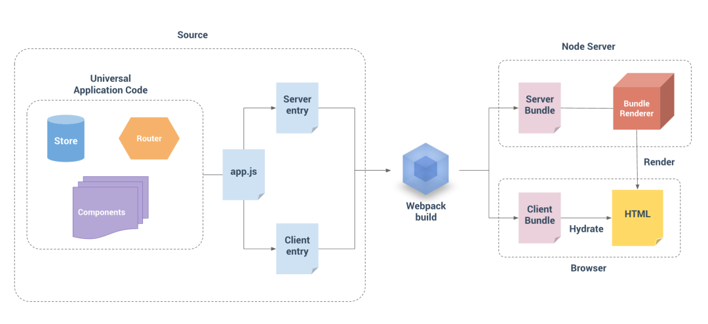

## Vue SSR

- Vue SSR
  - 同构渲染的“同构”一词的含义是，同样一套代码既可以在服务端运行，也可以在客户端运行
  - SSR：由服务端直接渲染输出 HTML 内容到客户端，再在客户端将静态的 HTML“激活”(hydrate) ，使之能够交互
    - good
      - 更快的首屏加载
      - 更好的 SEO
    - bad
      - 开发中的限制
        - 限定组件生命周期钩子 beforeCreate 和 created
        - 访问平台特有 API
      - 需要更多的服务端负载及运维
  - Vue SSR 原理
    - HTML 渲染：`createSSRApp` + `renderToString`
    - 客户端激活
      - vue hydrate
       - 注入失败？[当 Vue 遇到激活失败](https://cn.vuejs.org/guide/scaling-up/ssr.html#hydration-mismatch)，即预渲染的 HTML 的 DOM 结构与 vDom 结构匹配不上时。它将尝试自动恢复并调整预渲染的 DOM 以匹配客户端的状态，这将导致一些渲染性能的损失，因为需要丢弃不匹配的节点并渲染新的节点
  - 工程架构
    - SSR 同构应用架构 
      - 同构代码构建
        - Node.js 和浏览器的环境也不同（比如你在 Node.js 里没有window）。库可能针对 Node 和浏览器有不同的构建和逻辑；框架可能会将组件编译为 CSR 和 SSR 的不同输出。这通常意味着对于客户端构建和 SSR 构建，我们需要两个管道来处理转换和捆绑
        - 热更新？watch？
      - header 标签注入 client 代码
        - [unhead](https://github.com/vueuse/head)
    - 通用的路由、数据获取和状态存储方案
      - 数据请求及状态同步
        - 数据请求：获取到每个模板页面初始化的请求，并在服务器端请求好，再进行 HTML 拼凑
        - 数据同步：数据状态注水脱水，让客户端、服务端同步
          - [注意使用模块单例，会导致服务状态会被共享](https://cn.vuejs.org/guide/scaling-up/ssr.html#cross-request-state-pollution)
          - provider/inject
  - 框架
    - Vite SSR
    - vite-plugin-ssr
    - nuxt
  - Nuxt
    - [vite-node](https://github.com/vitest-dev/vitest/tree/main/packages/vite-node)：开发中使用 Vite 进行加载模块及更新
      - vite
        - 按需请求模块服务 + 模块转换（rollup）
        - 热更新
    - BS 架构
    - Nitro 服务器引擎
      - 对 Node.js、浏览器、服务工作者等的跨平台支持。
      - 具有热模块重新加载的开发服务器。
      - 自动代码拆分和异步加载块
      - API 路由支持
        - [h3](https://github.com/unjs/h3)
        - 类型化的 API 路由
      - 开箱即用的无服务器支持
      - 静态+无服务器站点的混合模式