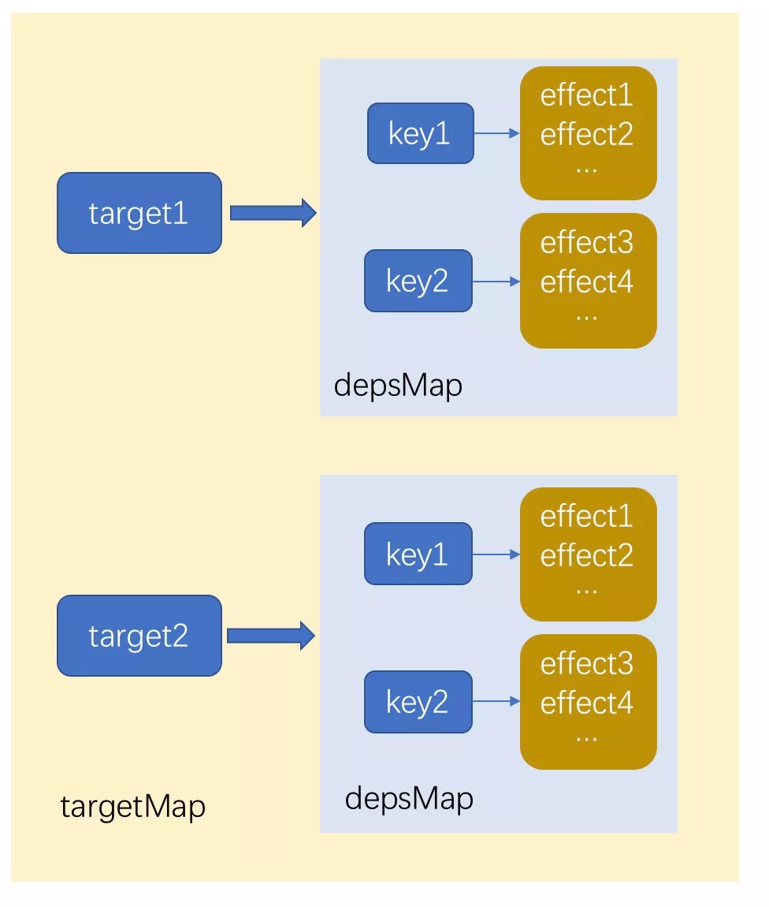
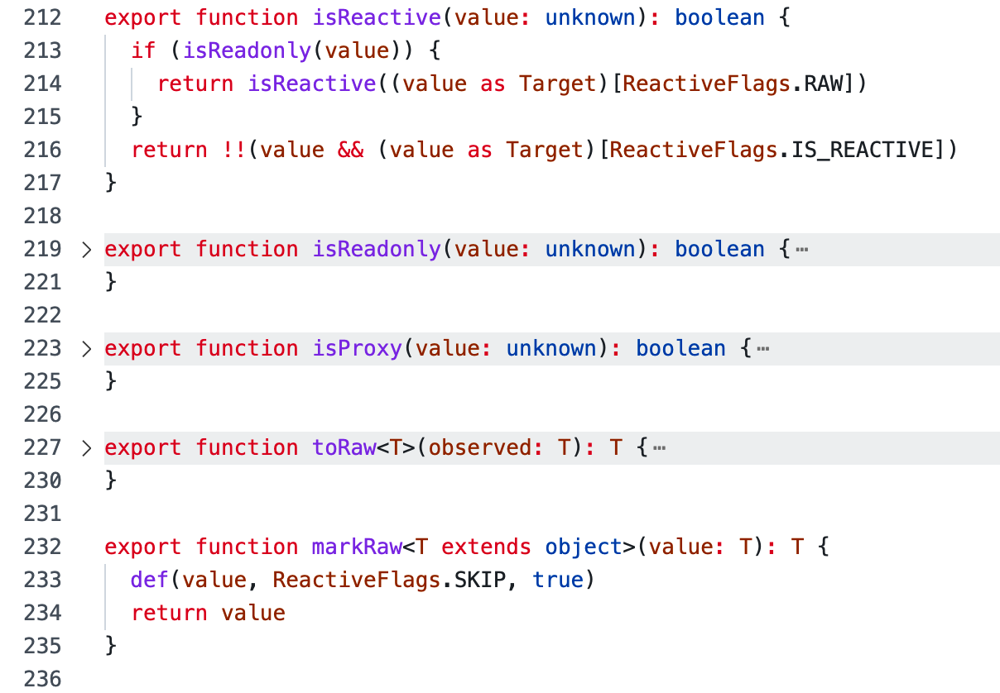

# Vue 的响应式系统

> 示例源码主要为 vue3.2

响应式系统是 Vue 最底层的核心机制，而且在 Vue3.x 中已经抽取成的 Reative API 可单独使用。

- Vue 的响应式系统
  - [响应式原理](#响应式原理)
  - [Reative API 分析](#vue-reactive-api-源码分析)
  - [响应式渲染机制](./vue%20的响应式渲染机制.md)

## 响应式原理

```js
let A = 1;
let B = 2;
let C = A + B; // 3

// change A
A = 2;

console.log(C); // 3
```

传统命令式编程下，A 发生改变，`C = A + B` 并不会重新执行。为了能够重新计算就需要将 `C = A + B` 语句包装成可复用的函数，并且观察 A 的变化以便发生改变时调用该函数。

Vue 的响应式原理的实现本质就是数据劫持 + 观察者模式，Subject、Observer 角色在 Vue3 响应式设计中分别对应的是 Reactive 响应式数据、Effect 副作用的概念。

Vue2 和 Vue3 的响应式实现并其实没多大区别，大致都是需要以下重要三步：

1. 数据劫持
2. 依赖收集
3. 变更通知

只是数据劫持的方式从 `Object.defineProperty` 改为 `Proxy`。

### Vue3 响应式原理 mini 版本实现

```js
function reactive(target) {
  // case...

  // 数据代理、操作劫持
  return new Proxy(target, {
    get(target, property) {
      // 依赖收集
      track(target, property);
      return Reflect.get(...arguments);
    },
    set(target, property) {
      const result = Reflect.set(...arguments);
      // 变更通知
      trigger(target, property);
      return result;
    },
  });
}
```

Proxy 代理的是一个对象，对象属性能够任意访问，我们需要跟踪数据被访问的地方，并将这些“观察者”收集起来。

reactive 包装下我们已经可以对数据进行访问、修改劫持。

#### Effect 包装

那么数据被访问时，我们要收集的是什么、怎么收集？

上面说到 `为了能够重新计算就需要将 C = A + B 语句包装成可复用的函数`，可是用户自定义的函数在执行过程中，我们是无法获取该函数对象。

将该需要重复调用的函数进行高阶函数封装成“副作用”，在“副作用”环境中有依赖到响应式数据时需要将当前“副作用”进行收集。

```js
const effectStack = []; // 副作用栈
let activeEffect = null; // 当前执行的副作用环境

// 副作用
function effect(fn) {
  const _effect = (...args) => {
    // 指向当前执行的副作用环境
    activeEffect = _effect;

    // 清除响应式数据收集的当前副作用依赖
    cleanup(activeEffect);

    effectStack.push(fn);
    fn(...args);
    effectStack.pop();
    activeEffect = effectStack[effectStack.length - 1];
  };

  _effect.deps = [];

  return _effect();
}
```

#### `effectStack`，用于副作用嵌套场景。

```js
const A = effect(() => {
  xxx;
});
const B = effect(() => {
  A();
});
```

嵌套场景主要是 vue 组件嵌套，vue 组件的渲染也是一种副作用（[vue 组件响应式更新渲染机制](./vue%20组件响应式更新渲染机制.md)）。

#### `cleanup(activeEffect)`，解决动态依赖场景。

在响应式作用下，每次副作用重新运行时都会触发响应式数据重新收集当前副作用，但并不是所有响应式数据在下次重新执行过程中被访问到，比如响应式数据 A 和 B，在下次重新运行因为 if 条件可能只使用到了 B，故需要清除 A 的依赖。

总而言之，就是为了解决动态依赖场景下，某个依赖已经不是当前副作用的依赖，故需要清除无效依赖。

一个简单方法就是将副作用之前的依赖全部清除，然后重新进行收集。

```js
// 清除依赖
function cleanup(effect) {
  const { deps } = effect;
  if (deps.length) {
    for (let i = 0; i < deps.length; i++) {
      // 将副作用从当前响应式数据的依赖收集中删除
      deps[i].delete(effect);
    }
    deps.length = 0;
  }
}
```

#### 缓存结构

为了能够方便在代码上下文中找到对应响应式数据，设计一个缓存结构 `targetMap => depsMap => deps`。

```js
// 缓存结构
// targetMap => depsMap => deps
// deps = new Set() // 收集响应式数据对应的依赖
const depsMap = new Map(); // 存放所有响应式数据的依赖集
const targetMap = new WeakMap(); // 存放与响应式数据关联的代理对象
```



#### 副作用收集

```js
function track(target, key) {
  // 获取响应式数据的依赖集
  let depsMap = targetMap.get(target);

  if (!depsMap) {
    targetMap.set(target, (depsMap = new Map()));
  }

  let deps = depsMap.get(key);

  if (!deps) {
    depsMap.set(key, (deps = new Set()));
  }

  if (!deps.has(activeEffect)) {
    // 收集当前激活的 effect
    deps.add(activeEffect);
    // 当前响应式数据的 dpes 作为 effect 的依赖
    // clearup 时能够将副作用从响应式数据的 deps 中清除
    activeEffect.deps.push(deps);
  }
}
```


响应式数据修改触发副作用执行，即相当于观察者模式下的变更通知。

```js
function trigger(target, key) {
  const depsMap = targetMap.get(target);
  if (!depsMap) return;
  let deps = depsMap.get(key);

  if (deps) {
    for (const effect of [...deps]) {
      effect();
    }
  }
}
```

## Vue Reactive API 源码分析

> Vue Reactive API 基本实现原理大概类似上面，下面仅对部分 API 源码细节分析

Vue Reactive API 大致分为两类：

- 响应式数据
  - [reactive](#reactive)
    - [ReactiveFlags key](#内部-reactiveflags-key)
  - [ref：Ref 与 Reactive 有何区别，为什么要有 Ref？](#refref-与-reactive-有何区别为什么要有-ref)
  - computed
  - deferredComputed
- 响应式副作用
  - effect，将副作用封装成响应式副作用
    - [ReactiveEffect](#reactiveeffect)
  - effectScope
    - getCurrentScope
    - onScopeDispose
  - _runtiom-dom_
    - watchEffect
    - watch

### reactive

```js
// packages/reactivity/src/reactive.ts

function createReactiveObject(
  target: Target,
  isReadonly: boolean,
  baseHandlers: ProxyHandler<any>,
  collectionHandlers: ProxyHandler<any>,
  proxyMap: WeakMap<Target, any>
) {
  //proxy 对象再次 reactive 还是原 proxy，除非转是 readyonly
  if (
    target[ReactiveFlags.RAW] &&
    !(isReadonly && target[ReactiveFlags.IS_REACTIVE])
  ) {
    return target;
  }

  //同一原始 target 多次执行 reactive 都会得到同一 proxy
  const existingProxy = proxyMap.get(target);
  if (existingProxy) {
    return existingProxy;
  }

  // 只允许普通对象或者集合类型，内置对象类型如 Date、Function 类型则不可以
  const targetType = getTargetType(target);
  if (targetType === TargetType.INVALID) {
    return target;
  }

  const proxy = new Proxy(
    target,
    // 根据数据类型，分为基础对象代理操作和集合类型代理操作
    targetType === TargetType.COLLECTION ? collectionHandlers : baseHandlers
  );
  proxyMap.set(target, proxy);
  return proxy;
}

function targetTypeMap(rawType: string) {
  switch (rawType) {
    case "Object":
    case "Array":
      return TargetType.COMMON;
    case "Map":
    case "Set":
    case "WeakMap":
    case "WeakSet":
      return TargetType.COLLECTION;
    default:
      return TargetType.INVALID;
  }
}
```

1. proxy 对象再次 reactive 还是原 proxy，除非转 readyonly
2. 同一原始 target 多次执行 reactive 都会得到同一 proxy（proxyMap 缓存）
3. 只允许普通对象或者集合类型，内置对象类型如 Date、Function 类型则不可以
4. \_\_v_skip 属性的对象、被冻结的对象

#### 内部 ReactiveFlags key

Vue 内部会针对有 ReactiveFlags 的对象做一些特殊处理。

```ts
export const enum ReactiveFlags {
  SKIP = "__v_skip", // 跳过响应化
  IS_REACTIVE = "__v_isReactive", // 响应式标记
  IS_READONLY = "__v_isReadonly", // 响应式只读标记
  IS_SHALLOW = '__v_isShallow', // 浅响应，即只对对象第一层属性响应式
  RAW = "__v_raw", // 原始数据
}
```

工具函数 isReactive、isReadonly、isProxy、markRaw 等都是 flag key 快速实现。



#### get 依赖收集

get 代理操作主要做了 3 件事：

1. 依赖跟踪、收集
2. 数组操作代理
3. 延迟响应式

```js
// createReactiveObject => baseHandlers => createGetter
// packages/reactivity/src/baseHandlers.ts
function createGetter(isReadonly = false, shallow = false) {
  return function get(target: Target, key: string | symbol, receiver: object) {
    // 内部特殊 key 处理...

    // 数组操作代理
    const targetIsArray = isArray(target);
    if (!isReadonly && targetIsArray && hasOwn(arrayInstrumentations, key)) {
      return Reflect.get(arrayInstrumentations, key, receiver);
    }

    const res = Reflect.get(target, key, receiver);

    if (!isReadonly) {
      // 依赖收集
      track(target, TrackOpTypes.GET, key);
    }

    // case...

    if (isObject(res)) {
      // 延迟响应化，性能优化，不像以前初始化时递归响应化
      // Convert returned value into a proxy as well. we do the isObject check
      // here to avoid invalid value warning. Also need to lazy access readonly
      // and reactive here to avoid circular dependency.
      return isReadonly ? readonly(res) : reactive(res);
    }

    return res;
  };
}
```

#### 数组代理

得益于 Proxy，Vue3 对数组已不需要重写数组部分 API，但某些数组方法与代理对象之间会存在需要重写。

```ts
function createArrayInstrumentations() {
  const instrumentations: Record<string, Function> = {}
  // instrument identity-sensitive Array methods to account for possible reactive
  // values
  ;(['includes', 'indexOf', 'lastIndexOf'] as const).forEach(key => {
    instrumentations[key] = function (this: unknown[], ...args: unknown[]) {
      const arr = toRaw(this) as any
      for (let i = 0, l = this.length; i < l; i++) {
        track(arr, TrackOpTypes.GET, i + '')
      }
      // we run the method using the original args first (which may be reactive)
      const res = arr[key](...args)
      if (res === -1 || res === false) {
        // if that didn't work, run it again using raw values.
        return arr[key](...args.map(toRaw))
      } else {
        return res
      }
    }
  })
  // instrument length-altering mutation methods to avoid length being tracked
  // which leads to infinite loops in some cases (#2137)
  ;(['push', 'pop', 'shift', 'unshift', 'splice'] as const).forEach(key => {
    instrumentations[key] = function (this: unknown[], ...args: unknown[]) {
      pauseTracking()
      const res = (toRaw(this) as any)[key].apply(this, args)
      resetTracking()
      return res
    }
  })
  return instrumentations
}
```

1. 保证 includes、indexOf、lastIndexOf 参数可接受响应式数据
2. push、pop 等数组操作会返回 length，防止再次触发 get。

```js
const test = [1, 2, 3];

const _test = new Proxy(test, {
  get(traget, key, r) {
    const res = Reflect.get(...arguments);
    console.log(key, res);
    return res;
  },
});

// 访问属性: proxy[foo]和 proxy.bar
_test.push(4); // 返回 _test.length 会再触发 get
console.log(_test.length);
```

### effect

effect 将副作用封装成响应式副作用，能够在响应式数据发生变化时重新执行。effect 是一个偏低层 API，是同步调度。在 Vue 开发中，用得更多的是 `watchEffect` 和 `watch`。

```js
export interface ReactiveEffectOptions extends DebuggerOptions {
  lazy?: boolean // 延迟执行
  scheduler?: EffectScheduler // 副作用执行调度器
  scope?: EffectScope // 副作用作用域
  allowRecurse?: boolean
  onStop?: () => void
}

// 将副作用封装成响应式副作用
export function effect<T = any>(
  fn: () => T,
  options?: ReactiveEffectOptions
): ReactiveEffectRunner {
  if ((fn as ReactiveEffectRunner).effect) {
    fn = (fn as ReactiveEffectRunner).effect.fn
  }
  // 生成副作用对象
  const _effect = new ReactiveEffect(fn)
  if (options) {
    extend(_effect, options)
    if (options.scope) recordEffectScope(_effect, options.scope)
  }
  // 延迟执行控制
  if (!options || !options.lazy) {
    _effect.run()
  }
  const runner = _effect.run.bind(_effect) as ReactiveEffectRunner
  runner.effect = _effect
  return runner
}
```

```ts
export class ReactiveEffect<T = any> {
  active = true;
  deps: Dep[] = []; // 存储相关响应式数据依赖

  // can be attached after creation
  computed?: boolean;
  allowRecurse?: boolean;
  onStop?: () => void;
  // dev only
  onTrack?: (event: DebuggerEvent) => void;
  // dev only
  onTrigger?: (event: DebuggerEvent) => void;

  constructor(
    public fn: () => T,
    public scheduler: EffectScheduler | null = null,
    scope?: EffectScope | null
  ) {
    recordEffectScope(this, scope);
  }

  run() {
    // ...
    try {
      effectStack.push((activeEffect = this));

      //...

      return this.fn();
    } finally {
      //...
      effectStack.pop();
      const n = effectStack.length;
      activeEffect = n > 0 ? effectStack[n - 1] : undefined;
    }
  }

  stop() {
    // 停止副作用
  }
}
```

#### ReactiveEffect.run 副作用执行

在上面 mini 响应式实现中，每次副作用重新执行前都要 `clearup()` 清除副作用的所有依赖，然后再在执行过程中重新收集依赖，因为在动态执行过程中，旧依赖可能不再是依赖。

这个过程牵涉到大量对 Set 集合的添加和删除操作。在许多场景下，依赖关系是很少改变的，因此这里存在一定的优化空间。

Vue3.2 采用大概思路就是标记清除：

1. 执行前先对所有依赖进行“已收集”标记
2. 执行过程对依赖重新标记为“新收集”
3. 删除掉所有不是最新的已收集依赖

```js
export const createDep = (effects) => {
  const dep = new Set(effects);
  dep.w = 0; // 标记已收集
  dep.n = 0; // 标记新收集
  return dep;
};
```

```js
const effectStack: ReactiveEffect[] = [] // 副作用栈
let activeEffect: ReactiveEffect | undefined // 栈顶副作用

let effectTrackDepth = 0 // 副作用栈深度
export let trackOpBit = 1 // 用于标识依赖收集的状态
const maxMarkerBits = 30 // 表示最大标记的位数，trackOpBit 超过时则执行 clearup() 依赖全清

//...
// 响应式副作用执行
run() {
 if (!this.active) {
   return this.fn()
 }
 if (!effectStack.includes(this)) {
   try {
     // 入栈
     effectStack.push((activeEffect = this))
     enableTracking()
     // 将栈深度转换成二进制
     trackOpBit = 1 << ++effectTrackDepth

     if (effectTrackDepth <= maxMarkerBits) {
       // 将所有依赖初始化为已收集
       initDepMarkers(this)
     } else {
       cleanupEffect(this)
     }
     // 副作用执行
     return this.fn()
   } finally {
     if (effectTrackDepth <= maxMarkerBits) {
       // 清除旧依赖
       finalizeDepMarkers(this)
     }

     trackOpBit = 1 << --effectTrackDepth

     resetTracking()
     // 出栈
     effectStack.pop()
     const n = effectStack.length
     activeEffect = n > 0 ? effectStack[n - 1] : undefined
   }
 }
}
//...

const initDepMarkers = ({ deps }) => {
  if (deps.length) {
    for (let i = 0; i < deps.length; i++) {
      deps[i].w |= trackOpBit // 赋值给 w 标记依赖已经被收集
    }
  }
}
```

重新依赖收集。

```js
export function trackEffects(
  dep: Dep,
  debuggerEventExtraInfo?: DebuggerEventExtraInfo
) {
  let shouldTrack = false
  if (effectTrackDepth <= maxMarkerBits) {
    // 判断依赖是否被标记为新的
    if (!newTracked(dep)) {
      dep.n |= trackOpBit // 标记为最新依赖
      // 如果依赖已经被收集，则不需要再次收集
      shouldTrack = !wasTracked(dep)
    }
  } else {
    // Full cleanup mode.
    shouldTrack = !dep.has(activeEffect!)
  }

  if (shouldTrack) {
    dep.add(activeEffect!)
    activeEffect!.deps.push(dep)
  }
}
```

清除旧依赖。

```js
export const finalizeDepMarkers = (effect: ReactiveEffect) => {
  const { deps } = effect;
  if (deps.length) {
    let ptr = 0;
    for (let i = 0; i < deps.length; i++) {
      const dep = deps[i];
      if (wasTracked(dep) && !newTracked(dep)) {
        dep.delete(effect); // 删除旧依赖
      } else {
        deps[ptr++] = dep; // 调整 deps 数组
      }
      // 重置回上一层状态
      dep.w &= ~trackOpBit;
      dep.n &= ~trackOpBit;
    }
    deps.length = ptr;
  }
};
```

#### trackOpBit 的设计

trackOpBit 设计为二进制位是跟踪响应式数据在 effect 嵌套深度的被收集位置，如果使用数组方式去记录状态，空间及运算效率不如二进制高。

> js 二进制数据前缀表示 0b

1. 初始时 trackOpBit = 0，w = 0
2. 数据在第一层使用时: trackOpBit = 0b10， w |= trackOpBit = 0b10
3. 数据在第二层使用 trackOpBit = 0b100， w |= trackOpBit = 0b110
4. trackOpBit = 0b100 可以表示当前是在第二层，w 通过或运算可以记录数据在哪几层使用过

```js
const wasTracked = (dep) => (dep.w & trackOpBit) > 0;
```

通过与运算就可以知道该依赖是否在当前层收集过。

#### ReactiveEffect.allowRecurse

ReactiveEffect.allowRecurse 是否允许副作用递归（重复）执行，默认 allowRecurse 是 undefined 为不允许，[场景应用了解](./vue%20的响应式渲染机制.md#Effect.allowRecurse)。

#### ReactiveEffect.scheduler 副作用调度器

默认情况下，副作用是同步触发执行，当设置调度器时则由其调度执行，了解 [vue 的渲染调度机制：异步更新](./vue%20的响应式渲染机制.md)。

```ts
export function triggerEffects(
  dep: Dep | ReactiveEffect[],
  debuggerEventExtraInfo?: DebuggerEventExtraInfo
) {
  // spread into array for stabilization
  for (const effect of isArray(dep) ? dep : [...dep]) {
    //...
    if (effect.scheduler) {
      effect.scheduler();
    } else {
      effect.run();
    }
    //...
  }
}
```

### ref：Ref 与 Reactive 有何区别，为什么要有 Ref？

Vue 提供了 reactive、ref 创建响应式数据，那么 reactive 和 ref 有什么区别？

1. Vue 数据劫持的实现上无论是 Object.defineProperty、proxy 都有个缺点就是必须是对象类型，不支持基础类型
2. （个人觉得）ref 主要是规范化对原始类型的响应式化，即将原始类型包装成带 value 属性的对象再进行响应化
3. 实现原理细节上
   - reactive 是通过 proxy 实现
   - ref 的实现上使用 object.defineProperty 的 get 与 set 完成的，但对于非原始类型的参数则转换成 reactive 去响应化（Why？个人猜测，如果一个原始类型直接通过 reactive 支持，需要创建一个 Map 对象，参考上面 [reactive 实现的缓存结构](#缓存结构)，有点浪费）

```ts
const convert = <T extends unknown>(val: T): T =>
  isObject(val) ? reactive(val) : val

class RefImpl<T> {
  private _value: T
  private _rawValue: T

  public dep?: Dep = undefined
  public readonly __v_isRef = true

  constructor(value: T, public readonly _shallow = false) {
    this._rawValue = _shallow ? value : toRaw(value)
    // value 值为对象类型，则转换成 reactive 支持
    this._value = _shallow ? value : convert(value)
  }

  get value() {
    //...
  }

  set value(newVal) {
    //...
  }
}
```

## 参考学习

- [细说 Vue.js 3.2 关于响应式部分的优化](https://mp.weixin.qq.com/s/02-6xMskeTMuTwrJ1fkZow)
