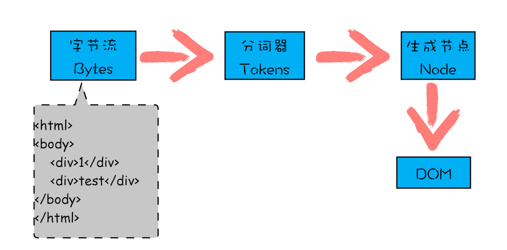
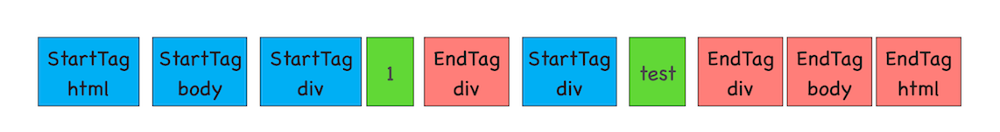
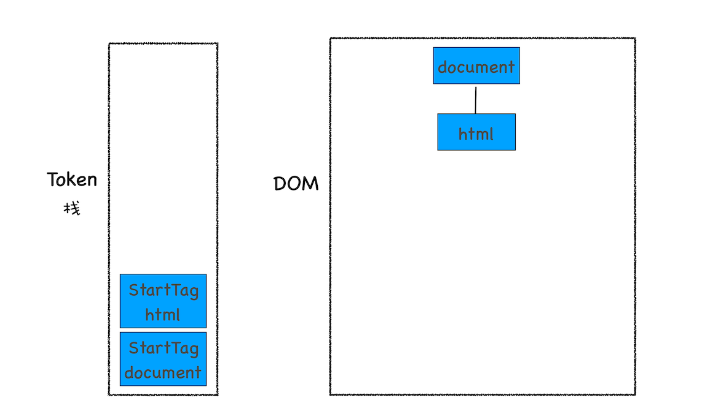
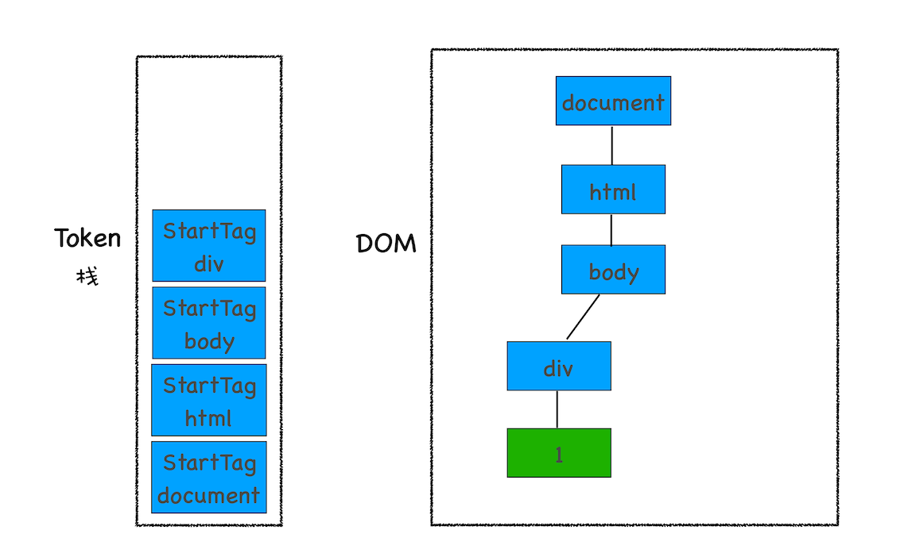
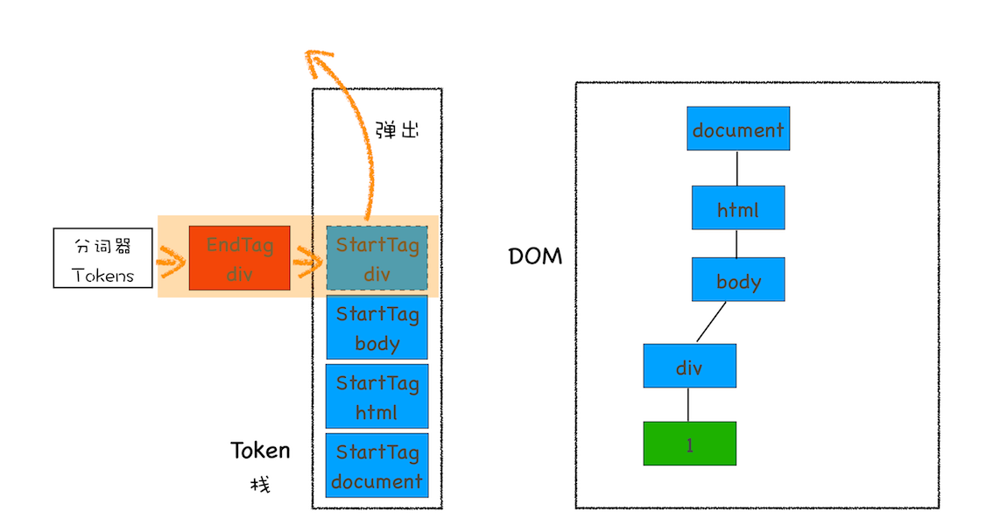
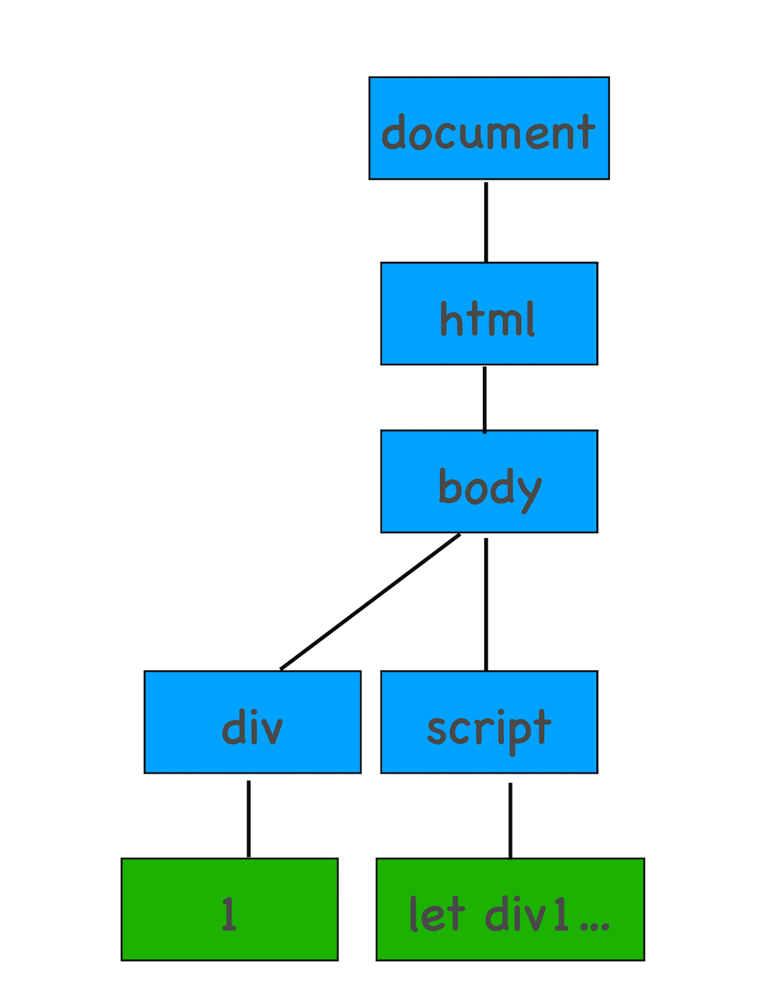

# 浏览器 HTML 解析过程

浏览器是以流式形式过程解析 html，接受过来的字节流通过分词器，生成 Node，再插入 DOM 中。

  

```html
<html>
<body>
    <div>1</div>
    <div>test</div>
</body>
</html>
```

1. 分词 token

  

2. HTML 解析器维护了一个 Token 栈结构，将 StartTag Token 压入栈，并且为该 Token 创建一个 DOM 节点，然后将该节点加入到 DOM 树中，它的父节点就是栈中相邻的那个元素生成的节点

  

3. 文本类型 token，不必入栈，直接创建文本节点，插入栈顶节点，作为子节点

  

4. EndTag Token 匹配栈顶是否为对应的 StartTag Token，StartTag Token 出栈

  

```html
<html>
<body>
    <div>1</div>
    <script>
    let div1 = document.getElementsByTagName('div')[0]
    div1.innerText = 'time.geekbang'
    </script>
    <div>test</div>
</body>
</html>
```

5. script 类型，停止解析，执行脚本，如果是外链脚本，还需要等待加载脚本执行完毕

