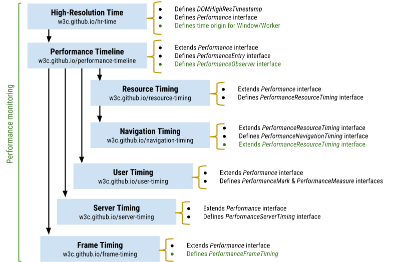

# Web 前端性能优化

- 制定性能指标
  - [Web 性能指标](#web-性能指标)
  - 自定义性能指标
- 前端工程：在本地或 CI 中进行性能预算测试
  - 测试工具
    - [WebPageTest](https://www.webpagetest.org/)
    - [lighthouse](https://web.dev/learn/#lighthouse)
    - [lighthouse-ci](https://github.com/GoogleChrome/lighthouse-ci)
    - [Web Vitals Chrome 扩展程序](https://github.com/GoogleChrome/web-vitals-extension)
    - [PageSpeed Insights](https://pagespeed.web.dev/)：集成 Lighthouse 性能审计 + [Chrome 用户体验报告](https://developers.google.com/web/tools/chrome-user-experience-report/)
    - 体积大小
      - [size-limit](https://github.com/ai/size-limit)
      - [bundlesize](https://github.com/siddharthkp/bundlesize)
  - 调试工具
    - [Chrome DevTools](https://developer.chrome.com/docs/devtools/)
- [前端性能监控](#前端监控)

## 前端监控

- 监控方式
  - 合成监控：场景模拟，在受控环境监控页面的性能
  - 真实用户监控：线上代码中注入脚本，上传真实用户场景数据
- 前端埋点
  - 代码埋点：前端开发人员在代码中自定义监听和收集
  - 可视化埋点
  - 无痕埋点（全埋点）：通过技术手段无差别地记录用户在前端页面上的行为，然后在后端数据清洗
- 数据采集
  - 前端性能指标采集方式
    - 加载性能
    - [Performance API](#performance-api)
    - [web-vitals](https://github.com/GoogleChrome/web-vitals)：基于 Performance API 的 Web Vitals 封装
  - 前端异常分类及采集
    - JS 错误
    - promise
    - 资源加载失败
    - 网络请求失败
- 数据上报
  - 尽量不影响应用的性能
  - 使用非阻塞 API，避免阻塞主线程
  - sendBeacon
    - 不受跨域限制
    - 不阻塞页面
  - requestIdleCallback
  - img
- 数据清洗、持久
- 数据聚合、报告
- 报警通知

### 前端异常分类及采集

- 前端异常分类
  - JS 错误
    - 编译时（语法错误）
    - 运行时
  - Promise
  - 资源加载、网络请求失败
- 捕获错误
  - `try ... catch ...`

### 数据上报

数据上报原则：
- 尽量不影响应用的性能

## Performance API

Web 标准提供性能相关的 API 及继承关系如下图：

- Performance API

## 123

DOMContentLoaded，这个事件发生后，说明页面已经构建好 DOM 了，这意味着构建 DOM 所需要的 HTML 文件、JavaScript 文件、CSS 文件都已经下载完成了。
Load，说明浏览器已经加载了所有的资源（图像、样式表等）

RTT 就是这里的往返时延。它是网络中一个重要的性能指标，表示从发送端发送数据开始，到发送端收到来自接收端的确认，总共经历的时延。通常 1 个 HTTP 的数据包在 14KB 左右，所以 1 个 0.1M 的页面就需要拆分成 8 个包来传输了，也就是说需要 8 个 RTT。

除 transform 或 opacity 属性之外，更改任何属性始终都会触发绘制。
坚持使用 transform 和 opacity 属性更改来实现动画。

使用 will-change 或 translateZ 提升移动的元素。
避免过度使用提升规则；各层都需要内存和管理开销。

降低选择器的复杂性；使用以类为中心的方法，例如 BEM。
减少必须计算其样式的元素数量。

计算元素的计算样式的最糟糕的开销情况是元素数量乘以选择器数量

减少打包时间：缩减范围、缓存副本、定向搜索、提前构建、并行构建、可视结构
减少打包体积：分割代码、摇树优化、动态垫片、按需加载ć作用提升、压缩资源

提交数据之后渲染进程会创建一个空白页面，我们通常把这段时间称为解析白屏，并等待 CSS 文件和 JavaScript 文件的加载完成，生成 CSSOM 和 DOM，然后合成布局树，最后还要经过一系列的步骤准备首次渲染。

RAIL

1、影响白屏时间的因素：网络，服务端性能，前端页面结构设计。
2、影响首屏时间的因素：白屏时间，资源下载执行时间。

- hints
  - DNS 预解析（dns-prefetch）
  - 预连接（preconnect）
  - prerender
  - prefetch
  - preload
- 页面可见性
- 分片

## 参考

- [How the browser renders a web page? — DOM, CSSOM, and Rendering](https://medium.com/jspoint/how-the-browser-renders-a-web-page-dom-cssom-and-rendering-df10531c9969)
- [The future of loading CSS](https://jakearchibald.com/2016/link-in-body/)
- [How to Eliminate Render-Blocking Resources: a Deep Dive](https://sia.codes/posts/render-blocking-resources/)
- [Eliminate render-blocking resources](https://web.dev/render-blocking-resources/)
- [The Critical Request: How to Prioritise Requests to Improve Speed](https://calibreapp.com/blog/critical-request)
- [Explore JavaScript Dependencies With Lighthouse Treemap](https://sia.codes/posts/lighthouse-treemap/)

不要@import 在样式表中使用来加载更多样式表。浏览器直到稍后才会发现它。最好<link>在 HTML 中使用标签加载它们

- webpack 构建优化

  - 减少打包时间：缩减范围、缓存副本、定向搜索、提前构建、并行构建、可视结构
    - 配置 include/exclude 缩小 Loader 对文件的搜索范围
    - 配置 cache 缓存 Loader 对文件的编译副本
    - 配置 resolve 提高文件的搜索速度
    - 并行构建
      - thread-loader
    - 配置 BundleAnalyzer 分析打包文件结构
  - 减少打包体积：分割代码、摇树优化、动态垫片、按需加载、作用提升、压缩资源
    - splitChunks
    - 动态垫片：通过垫片服务根据 UA 返回当前浏览器代码垫片
      - polyfill.io/v3/polyfill.min.js
      - "https://polyfill.alicdn.com/polyfill.min.js
      - 压缩资源
        - js
          - terser-webpack-plugin

PRPL 模式

推送 (Push)（或预加载）最重要的资源。
尽快渲染 (Render) 初始路线。
预缓存 (Pre-cache) 剩余资产。
延迟加载 (Lazy load) 其他路线和非关键资产。

压缩/缩小、延迟加载（既阻塞又不占其他资源宽带）
优先关键
异步非关键
  media
  preload =》 stylesheet
避免在 CSS 文件中使用 @import

- 资源/包大小
  - 图像
    - 格式
    - 压缩
    - 响应式图片
      - `@media`
      - `image-set`
      - imagesrcset & imagesizes
      - 延迟加载屏幕外图像

## Web

- 页面加载
  - 资源的网络请求
    - 连接复用
    - 并发连接
    - Http 缓存
      - CDN
  - 关键资源
    - 请求数量
    - 大小/体积
      - 代码拆分、延迟加载非关键代码
        - 使用 DevTools 代码覆盖确定可以删除或延迟加载的代码的机会
      - 缩小
        - 混淆
        - 删除未使用的代码
        - 使用 babel-preset-env 和 browserlist 来避免转译现代浏览器中已有的功能
        - tree-shaking
      - 压缩
  - 关键请求：如何确定请求的优先级以提高速度
  - 初始渲染
    - 避免阻塞渲染的顺序请求链
      - 内联合并
      - 预加载或预连接

- 提取关键 css
  - [critical](https://github.com/addyosmani/critical)
- 异步加载非关键 CSS
  - `<link rel="preload" href="styles.css" as="style" onload="this.onload=null;this.rel='stylesheet'"><noscript><link rel="stylesheet" href="styles.css"></noscript>`
- 预加载关键资产以提高加载速度

- Coverage
- webpack-bundle-analyzer 分析包内容
- bundlesize 验证 webpack 资产不超过指定的大小

- 评审工具
  - Lighthouse

- 资源
  - 关键资源：初始
    - Critical CSS
      - [critters](https://github.com/GoogleChromeLabs/critters)

- JavaScript 性能
  - tree-shaking
  - 代码分割
  - Web Workers

- 懒加载
- 按需加载