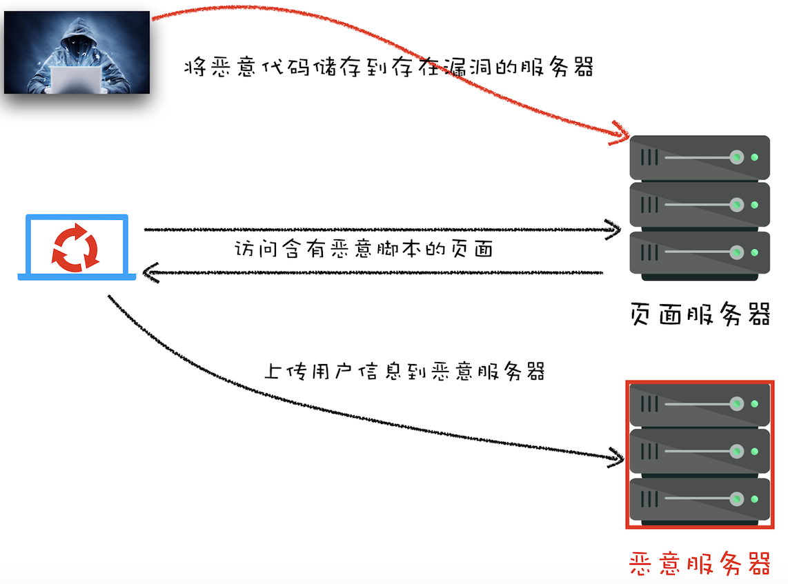

# Web 安全

web 安全
  - XSS
  - CSRF
    - 防御方案
      - 请求来源限制，比如限制 HTTP Referer 才能完成操作
      - token 验证机制，比如请求数据字段中添加一个 token，响应请求时校验其有效性
      - 用户操作限制，比如验证码

- Web 安全
  - 页面安全
    - 核心：[同源策略](#同源策略)
    - 同源策略下的“妥协”
      - 页面中可以引入第三方资源
        - [XSS 攻击](#跨站脚本攻击xss)
        - [防止 XSS 攻击](#防止-csrf-攻击)
      - 跨域资源共享（CORS）
      - 跨文档通信机制（window.postMessage）
    - [CSRF 攻击与 cookie 机制](#csrf-攻击与-cookie-机制)
      - [防止 CSRF 攻击](#防止-csrf-攻击)
  - 网络安全
    - [HTTPS](../计算机网络及HTTP/HTTPS.md)：解决 HTTP 劫持（明文传输，内容篡改）
      - 点击嵌套劫持
      - 广告
  - 浏览器系统安全
    - 多进程架构 + 渲染进程沙箱机制（将操作系统和渲染进程进行隔离，通过 IPC 来通信的）
        
    - [站点隔离策略](#站点隔离策略)：将不同站点隔离在不同沙箱（进程）内
  - Web 身份认证及授权

## 同源策略

同源策略：如果两个 URL 的协议、域名和端口都相同，我们就称这两个 URL 同源。同源策略会隔离不同源的之间的资源访问，比如 DOM、数据存储 Cookie、LocalStorage 和 IndexDB，网络请求 ajax/fetch。

同源策略是浏览器大局方面的安全策略，限制不同源的 web 页面之间的相互操作，以此来保证安全性，但是却极大地降低了便利性。在安全和便利性的权衡下，同源策略又做出了一些安全妥协：

1. 页面中可以嵌入第三方资源（容易导致 XSS 攻击，为了解决 XSS 攻击，浏览器中引入了内容安全策略，称为 CSP）
2. 跨域资源共享（CORS）
3. 跨文档消息机制（window.postMessage）

其中 CSP 和 CORS 是在这种大策略“妥协”下的设置的阀门，保证一定便利性的同时确保安全。


## 跨站脚本攻击（XSS）

XSS 全称是 Cross Site Scripting，为了与“CSS”区分开来，故简称 XSS，翻译过来就是“跨站脚本”。XSS 攻击是指黑客往 HTML 文件中或者 DOM 中**注入恶意脚本**，从而在用户浏览页面时利用注入的恶意脚本对用户实施攻击的一种手段。

恶意脚本注入方式有：

- 存储型 XSS 攻击
  1. 用户**通过输入**向服务器储存恶意脚本
  2. 服务器返回带有恶意脚本的页面
     
- 反射型 XSS 攻击
  1. 反射型 XSS 攻击是将恶意代码拼接在 URL 处，常见于网站搜索、跳转等，一个特点是需要黑客诱导用户点击 URL 实现代码注入
  2. 服务端不做处理直接拼接在 HTML 处返回  
- 基于 DOM 的 XSS 攻击：主要利用 js 能够访问 DOM 的原理及前端页面不严谨的代码产生的安全漏洞，就会导致注入了恶意代码。比如使用 `.innerHTML`、`document.write()`、`document.outerHTML` 这些能够修改页面结构的 API 时要注意防范恶意代码，尽量使用 `.textContent`、`.setAttribute()` 等。

三种攻击方式区别：
1. 反射型 XSS 跟存储型 XSS 的区别是：**存储型 XSS 的恶意代码存在数据库里，反射型 XSS 的恶意代码存在 URL 里**。
2. DOM 型 XSS 跟前两种 XSS 的区别：**基于 DOM 的 XSS 攻击是不牵涉到页面 Web 服务器的**。DOM 型 XSS 攻击中，取出和执行恶意代码由浏览器端完成，属于前端 JavaScript 自身的安全漏洞，而其他两种 XSS 都属于服务端的安全漏洞。

## 防止 XSS 攻击

XSS 攻击有两大要素：

1. 攻击者提交恶意代码。(输入来源)
2. 浏览器执行恶意代码。（输出执行）

- 输入来源
  - 客户端和服务器对用户**输入**内容进行过滤、限制其输入长度
- 输出执行
  - 拼接 HTML 字符串：对 HTML 进行转义编码（HTML 的编码是十分复杂的，在不同的上下文里要使用相应的转义规则）
  - 防止 JavaScript 执行时，把**不可信的输入数据**当作**字符串代码**执行
    - DOM 操作
      - 在使用 `.innerHTML`、`.outerHTML`、`document.write()` 时要特别小心，不要把不可信的数据作为 HTML 插到页面上，而应尽量使用 `.textContent`、`.setAttribute()`、 `.style` 等
      - `<a>` 标签的 href 属性
    - eval
    - function
    - setTimeout、setInterval
    - window.location
    - 等
- 其他
  - 充分利用 [CSP 内容安全策略](https://developer.mozilla.org/zh-CN/docs/Web/HTTP/CSP)
  - cookie 使用 HttpOnly 属性
  - 验证码：防止脚本冒充用户提交危险操作

### 推荐阅读

- [前端安全系列（一）：如何防止XSS攻击？](https://tech.meituan.com/2018/09/27/fe-security.html)
- [AwesomeXSS](https://github.com/s0md3v/AwesomeXSS)

## CSRF 攻击（跨站请求伪造）

CSRF（Cross-site request forgery），称为“跨站请求伪造”，攻击者诱导受害者进入第三方网站，在第三方网站中，向被攻击网站发送跨站请求。利用受害者在被攻击网站已经获取的注册凭证，绕过后台的用户验证，达到冒充用户对被攻击的网站执行某项操作的目的。

CSRF的特点

- CSRF（通常）发生在**第三方域名**，因为外域通常更容易被攻击者掌控。但如果被攻击网站管控用户内容不严格的话，也有可能被发布恶意超链接等，这样防护起来就更困难了，因为 referer 是来自于本身。
- 和 XSS 不同的是，CSRF 攻击不需要将恶意代码注入用户的页面，仅仅是利用**服务器的漏洞**和**用户的登录状态**来实施攻击。

1. GET类型的CSRF，如页面自动发起 Get 请求

```html
<!DOCTYPE html>
<html>
  <body>
    <h1>黑客的站点：CSRF攻击演示</h1>
    
  </body>
</html>
```

2. POST类型的CSRF，如页面表单自动发起 POST 请求

```html
<!DOCTYPE html>
<html>
<body>
  <h1>黑客的站点：CSRF攻击演示</h1>
  <form id='hacker-form' action="https://time.geekbang.org/sendcoin" method=POST>
    <input type="hidden" name="user" value="hacker" />
    <input type="hidden" name="number" value="100" />
  </form>
  <script> document.getElementById('hacker-form').submit(); </script>
</body>
</html>
```

3. 链接类型的CSRF

比起其他两种用户打开页面就中招的情况，这种引诱需要用户点击链接才会触发。

```html
<div>
   </img> </div> <div>
  <a href="https://time.geekbang.org/sendcoin?user=hacker&number=100" taget="_blank">
    点击下载美女照片
  </a>
</div>
```

### 防止 CSRF 攻击

> 根据 CSRF 的特点进行防备

- CSRF（通常）发生在第三方域名，对第三方域限制
  - 验证请求的来源站点（通过 HTTP 请求头中的 Referer 和 Origin 属性）
  - 充分利用好 Cookie 的 SameSite 属性
    - Cookie 正是浏览器和服务器之间维护登录状态的一个关键数据，通常 CSRF 攻击都是从第三方站点发起的，要防止 CSRF 攻击，我们最好能实现从第三方站点发送请求时禁止 Cookie 的发送
- CSRF 攻击不是将恶意代码注入用户的页面，不能获取页面数据信息
  - 重要接口加验证参数
    - CSRF Token
    - 图片、短信验证

## 站点隔离策略

同站和同源要求不一样，同源要求协议、主机名、端口一致：

  

而同站条件：协议 、eTLD（有效顶级域） + 1 域相同：

  

> eTLD 列表的维护网站是 [publicsuffix.org/list](https://publicsuffix.org/list/)。

站点隔离即不同站点隔离在不同沙箱，Chromium 提供了四种进程模式：

- Process-per-site-instance (default) 每个站点实例即一个进程
  - 每个站点实例即一个进程，意味着每个 tab 页即至少一个渲染进程。特殊情况，如果**两个同站页面并且有关联连接，才使用同一进程**
    - `window.open`、`<a target="_blank">` 打开的新页面，通过 `window.opener` 访问另一个页面
    - 同站点的 iframe
- Process-per-site 同个站点使用同个进程
- Process-per-tab 每个标签页一个进程
- Single process 所有的共用一个进程

Process-per-site-instance 是最重要的，因为这个是 Chrome 默认使用的模式，也就是几乎所有的用户都在用的模式。当你打开一个 tab 访问 a.baidu.com ，然后再打开一个 tab 访问 b.baidu.com，这两个 tab 会使用两个进程，而对于Process-per-site，当你打开 a.baidu.com 页面，在打开 b.baidu.com 的页面，这两个页面的tab使用的是共一个进程，因为这两个页面的site相同，而如此一来，如果其中一个tab崩溃了，而另一个tab也会崩溃。

## 参考

- 极客《浏览器工作原理与实践》
- [前端安全系列之二：如何防止CSRF攻击？](https://juejin.cn/post/6844903689702866952)
- [理解“同站”和“同源”](https://web.dev/same-site-same-origin/#%22schemeful-same-site%22)