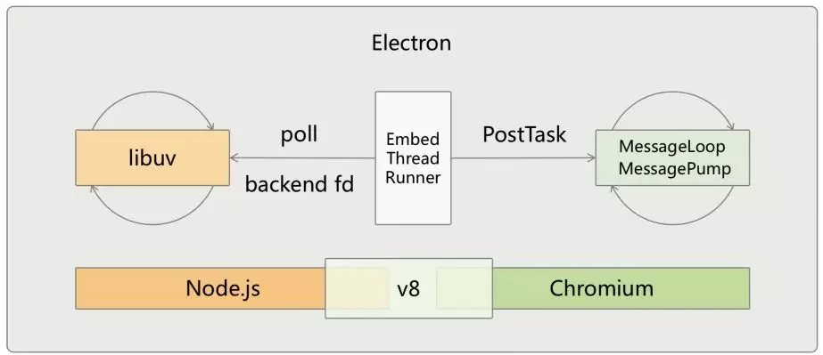

# Review

- 重新正轨
  - 重塑内核，修心养性
  - 找工作
    - 外包工作、外包项目
    - 面试、刷题
- [技术学习](#计算机技术栈)

## 软件开发技术栈

- 计算机技术栈
  - 领域
    - Web
      - HTML/CSS
      - WebAPI
        - [ ] PWA：博客 + PWA
      - HTTP
        - [ ]《透视 HTTP 协议》
      - 浏览器
        - [ ] 《浏览器原理及实践》
      - 前端框架及工程化
        - [Vue](./前端框架/README.md)
        - React
        - [前端工程化](./content/前端工程化/README.md)
      - Web 服务
        - [NodeJS 服务开发](./NodeJS)
      - 音视频
        - [ ] 《从 0 打造音视频直播系统》
      - 图表
    - 容器
      - [ ] 《Kubernetes 入门实战课》
  - 软件设计及架构、软件工程及软件工具
    - 软件设计及架构
      - [ ]《软件设计之美》
    - 软件工程及软件工具
      - DevOps
      - Git
      - [SSH](./软件设计及架构、软件工程、软件工具/SSH.md)
        - [ ] [ssh-tutorial](https://github.com/wangdoc/ssh-tutorial)
  - 程序设计语言与实现原理、编译原理
    - [JavaScript](./JavaScript/README.md)
      - [ ] 《JavaScript 核心原理精讲》
      - [ ] 《ES6 入门教程》
      - Typescript
    - Rust
      - [ ] [《Rust 程序设计语言》](https://kaisery.github.io/trpl-zh-cn/title-page.html)
      - [ ] 如何用 napi-rs 搭建一个 Node.js 可以调用的 Rust 库
      - [ ] WebAssembly + 前端
      - [ ] Rust CLI
    - 语言实现原理、编译原理
      - [ ] https://craftinginterpreters.com/contents.html
      - [ ] 《手把手带你写一门编程语言》
      - SICP
        - [MIT 计算机程序的构造和解释](https://github.com/DeathKing/Learning-SICP)
        - [Berkeley 的 61A 课程](https://www.bilibili.com/video/av40460492/?vd_source=5e3f59e2a50994ae58323e0f75a50d48)
      - [《程序语言理论与实现》](https://bobzhang.github.io/courses/)
      - 《编译原理》龙书
      - https://www.edx.org/course/compilers
  - 计算机基础
    - 计算机网络
      - [ ] 《计算机网络通关 29 讲》
      - [ ] 《趣谈网络协议》
      - [ ] 《计算机网络-自顶向下方法》
      - [The TCP/IP Guide](http://www.tcpipguide.com/free/t_TCPSlidingWindowAcknowledgmentSystemForDataTranspo-6.htm)
        - RFC：https://datatracker.ietf.org/doc/rfc1644/
    - 操作系统
      - [ ] 《重学操作系统》
      - [ ]《趣谈 Linux 操作系统》
      - 《现代操作系统：原理与实现》
    - [数据结构与算法](./数据结构与算法/README.md)
      - [ ] leetcode 200 道
      - [ ] 《数据结构与算法之美》
      - [ ] 《算法面试通关 40 讲》
      - [ ] [Hello 算法](https://www.hello-algo.com/)
    - 计算机组成原理
      - [ ]《程序是怎样跑起来的》
      - [ ] https://www.bilibili.com/video/BV1iW411d7hd
  - 数学与应用

## 计算机基础知识

- 计算机基础知识
  - 文本编码
    - Unicode
      - Unicode 只是一个符号集，它只规定了符号的二进制代码
    - 二进制存储格式
      - UTF-8
        - 一种变长的编码方式。它可以使用1~4个字节表示一个符号，根据不同的符号而变化字节长度
    - 阅读推荐
      - [字符编码笔记：ASCII，Unicode 和 UTF-8](https://www.ruanyifeng.com/blog/2007/10/ascii_unicode_and_utf-8.html)

## 电商

- 做生意
  - 物流
  - 销售
  - 库存
  - 供应链

## Rust

- 静态变量与常量区别？
  - const 系统会在编译时对常量变量进行求值；无论在何处使用，其值都会被内嵌
  - staic 使用时不会内联，并且具有实际关联的内存位置
- 注释、Rustdoc
  - 文档注释

## 低代码-表单

- `表单设计器 => 表单 UI 描述模型 => 表单渲染器 => [UI 模型(VNode) => Vue Render =>] UI`
  - 表单 UI 描述模型
    - 表单组件描述
    - 交互逻辑描述
      - 数据校验
        - 必填
        - 大小
        - 格式
        - 联动数据校验
      - 错误提示
- `表单 UI 描述模型 => 表单数据描述模型`
  - 表单数据描述模型
- `表单数据描述模型 => 数据模型校验器 check 数据`
- `表单数据描述模型 => 表格 UI 模型描述 => 表格渲染器 => [UI 模型(VNode) => Vue Render =>] UI`
- 其他
  - [JSON Schema](https://json-schema.org/)
  - JSON Schema 验证器：[ajv](https://github.com/ajv-validator/ajv)

## 扫码枪

- 需求
  - 商品扫码
    - 录入价格
    - 计算价格
    - 价格查询
- 扫码枪系统
  - 商品信息
    - 扫码录入
      - ocr
    - 扫码查询
  - 结算台
    - 扫码累计价格
    - 订单生成
  - 订单信息
  - 控制台
    - 移动设备链接
- 原型
- CS 架构
  - 客户端：扫码枪 + 扫码 APP
- 扫码枪对接原理
  - 系统对焦输入获取数据
  - 通讯协议
- [html5-qrcode](https://github.com/mebjas/html5-qrcode)

### 知识体系

- 跨端框架
  - CEF
  - Flutter
  - ReactNative
  - Electron
    - 基础
      - Electron 架构
        - Chromium
        - Electorn API
          - GUI
        - 集成 Node.js    
          - node add-on
          - node-ffi
          - OS API
            - Shell
        - 多进程架构
          - 主进程
          - 渲染进程
        - Chromium 和 Node 如何交互？
      - 进程通信
        - 渲染 =》 主
          - ipcRenderer.invoke
          - ipcMain.handle
        - 主 =》 渲染
          - ipcRenderer.on
          - webContents.send
    - 工程
      - electron 与构建工具集成
        - [electron-vite](https://github.com/alex8088/electron-vite)
    - 请求+响应模式，设置超时
- Monorepo
  - pnpm
  - git
- Node Server

- 按键
  - 跨平台
  - 特殊键组合
- 穿透类型
- stun
  - onice
    - if pc.remote
- 流畅
  - sdp
  - ice

- VSCode & 项目配置工具
  - [Vue](https://github.com/vuejs/language-tools)
    - [Vue Language Features (Volar)](https://marketplace.visualstudio.com/items?itemName=Vue.volar)
    - [TypeScript Vue Plugin (Volar)：支持在 TS 文件中引入 Vue 单文件组件](https://marketplace.visualstudio.com/items?itemName=Vue.vscode-typescript-vue-plugin)
      - [Volar Takeover 模式：项目只用 Vue 的 TS 语言服务实例](https://cn.vuejs.org/guide/typescript/overview)
    - [Vue VSCode Snippets](https://marketplace.visualstudio.com/items?itemName=sdras.vue-vscode-snippets)
    - 组件文档
      - [vue-component-meta](https://github.com/vuejs/language-tools/tree/master/packages/component-meta)
      - [vite-plugin-vue-component-preview](https://github.com/johnsoncodehk/vite-plugin-vue-component-preview)
  - Typescript
    - 只启用项目 TS 
  - JS
    - [ESLint](https://marketplace.visualstudio.com/items?itemName=dbaeumer.vscode-eslint)
  - 格式化
    - [Prettier - Code formatter](https://marketplace.visualstudio.com/items?itemName=esbenp.prettier-vscode)

- 后端
  - 高并发
  - 数据库，网络
  - 业务本身
    - 依赖后端人员对业务的理解来设计架构，拆分业务

- 了解和学习：了解一些 AI 的基本概念，例如“人工智能”、“机器学习”、“深度学习”是什么，他们直接的关系是什么等等。你不必了解具体算法、模型的实现细节，但需要了解些简单的、基本的概念，这将有助于你理解和使用 AI
- 使用和拓展：多使用如 ChatGPT 等 AI 工具，例如你在学习上述的 AI 概念时，就可以使用 ChatGPT。并且可以在你所处的领域尝试拓展 AI 的使用方向，例如你是程序员，可以尝试将 AI 融合到当前已有项目中，优化用户体验等等；
- 多做分享：在 AI 时代初期，大部分人其实还没有太多使用 AI。如果你能够学习并应用 AI，那你可以将你的学习和使用 AI 的过程及心得体会分享出来，顺便做自媒体。分享会让你对知识理解更透彻，让你形成个人影响力，甚至通过分享（自媒体）可以获得切实的收入。虽然自媒体红利似乎殆尽，但我觉得 AI 内容自媒体目前还很有前景

- 软件系统的复杂度来源
  - 需求变动，可能会破坏原有的代码架构，导致系统越来越臃肿复杂，维护也越来越难
  - 技术复杂度
- 架构设计 => 复杂度：架构设计可以降低满足需求和需求变化带来的复杂度
  - why
    - 对于复杂的需求，架构设计通过对系统抽象和分解，把复杂系统拆分成若干简单的子系统
- 架构设计原则
  - 架构即决策。选择合适、简单、演化
- 部署运行架构
  - 分布式的架构，可以把高访问量分摊到不同的服务器，这样即使流量很大，分流到单台服务器的压力并不大
  - 异地多活这样的架构方案可以保证即使一个机房宕机，还可以继续提供服务
- 架构设计
  - how
    - 常见架构
      - 分层架构
- 架构模式
  - 分层架构
    - 表现层（presentation）：用户界面，负责视觉和用户互动
    - 业务层（business）：实现业务逻辑
    - 持久层（persistence）：提供数据，SQL 语句就放在这一层
    - 数据库（database） ：保存数据

- “所谓架构就是“用最小的人力成本来满足构建和维护系统需求”的设计行为”
- “大型物理建筑通常可以用比例模型分层描述细节信息，但是软件项目内部结构是很难用模型分层描述的。”
- “软件系统的架构质量是由它的构建者所决定的，软件架构这项工作的实质就是规划如何将系统切分成组件，并安排好组件之间的排列关系，以及组件之间互相通信的方式。 
 而设计软件架构的目的，就是为了在工作中更好地对这些组件进行研发、部署、运行以及维护”

- 架构设计，就是通过组织人员和技术，低成本满足需求以及需求的变化，保障软件稳定高效运行
- 架构设计的目标，是用最小的人力成本来满足需求的开发和响应需求的变化，用最小的运行成本来保障软件的运行

用最小的人力成本来满足需求的开发和响应需求的变化，用最小的运行成本来保障软件的运行
    - 架构设计的道，就是组织人员和技术把系统和团队拆分，并安排好切分后的排列关系，让拆分后的部分能通过约定好的协议相互通信，共同实现最终的结果。

  - 高性能架构
    - 软件系统中高性能带来的复杂度主要体现在两方面
      - 单台计算机内部为了高性能带来的复杂度
        - 并发 - 多进程多线程
        - 进程间通信
        - 共享内存 - 互斥锁
      - 多台计算机集群为了高性能带来的复杂度
        - 任务分配：每个执行单元都可以处理完整的任务，将任务请求分配到不同的单元上执行
          - 分配器设计
            - 连接管理：连接建立、连接检测、连接中断后如何处理等
            - 分配算法：轮询算法、按权重分配、负载分配
        - 任务分解：对任务拆分降解，再分配到不同的机器上执行
          - 通信成本
    - How
      - 面对“不确定性”时架构设计的三原则
        - 合适优于业界领先
        - 简单优于复杂
        - 演化优于一步到位
      - 流程
        - 识别复杂度

- 系统是分层，哪些角色模块应该属于同一层，或者说怎么分更合适？
- 系统是独立的，模块是系统的组成逻辑
- 架构是解决某个或某类问题
- 如何做业务架构

- 软件架构层面
  - 代码
  - 部署运行
  - 模型、表、API

- 函数式编程
  - 范式：思想及风格
  - 思想
    - FP 的基础是通过计算由组合在一起的函数构建的表达式来生成所需的结果
  - 好处
    - 模块化
      - 可重用、组合
    - 可理解的
    - 可测试

var billTheUser = (clicked => {
return (some, sales, data) => {
if (!clicked) {
clicked = true;
window.alert("Billing the user...");
// actually bill the user
}
};
})(false);

闭包+高阶解决方案

基础功能 + 高阶函数

- JavaScript 函数时编程
  - 使用函数作为第一类对象
  - 箭头函数——现代方式

- 函数式编程
  - 纯函数
    - 给定相同的参数，该函数总是计算并返回相同的结果
      - 不能依赖于任何外部 信息或状态
      - 函数结果也不能依赖于 I/O 结果、随机数、其他一些外部变量或不可直接控制的值
    - 无副作用：这包括输出到 I/O 设备、对象的突变、函数外部程序状态的更改等
  - 容器 - 函数数据类型

- 常见系统开发功能模块
  - 角色和权限
  - 主题设计
  - 组件库

- HMR 
  - 大多数捆绑器使用 ECMAScript 模块 (ESM) 作为模块，因为它更容易分析导入和导出

- 用概念指代事物，是（第一层次）抽象能力
- 共同点，可以抽离出来一个概念（抽象）类

- React 严重依赖严格的相等检查来了解变量是否发生了变化，这是一种花哨的说法，即使用 === 和 Object.is() 来比较新旧变量。当您使用 === 比较 JavaScript 基元（如字符串）时，JS 会通过值来比较它们（您已经知道了）。但当 JS 将数组、对象或函数相互比较时，==== 的使用是在比较它们的身份，换句话说，是在比较它们的内存分配。这就是为什么在 JavaScript 中 {} === {} 是假的，因为它们在内存中是两个不同的对象。

- Prisma 从数据库模型中为后端应用程序生成类型，而 tRPC 则从后端为前端 API 层维护类型安全
- tRPC 使用 JSON-RPC 作为规范，HTTP 作为传输层
- RSC
- 基于 Rust 的 JavaScript 工具链
  - [oxc](https://oxc-project.github.io/)
- 孤岛
  - https://mp.weixin.qq.com/s/hLDtOz2AEbLCdRVBHkb3MQ
  - https://mp.weixin.qq.com/s/AR4schTcEkc0lOObZA-jRQ
- ocr 服务
- Cache-Control
  - 主要是解决了 Expires 一个重大的缺陷，就是它设置的是一个固定的时间点，客户端时间和服务端时间可能有误差
- test
  - https://www.browsercat.com/post/ultimate-guide-visual-testing-playwright
- Blog
  - `nitroApp.hooks.hook("content:file:beforeParse", (file: ContentFile)` 类型问题
  - Toc、JSX 组件更新问题
  - vueuse pr、类似 rxjs 响应式 api 设计
    - 思考
      - computed 单个计算
        - (cb) => ref
      - pipe 压缩计算
        - (ref, cb) => ref
    - api
      - event-emitter
      - untilValue
  - provide/inject ts 体操
  - https://metascraper.js.org/#/
  - 命令式组件 Side
    - 创建命令式组件
      - create
      - destroy
      - Comp
    - 动态组件内容配置
      - slot
      - component
      - teleport
- bun = node.js + 性能 + 工具链（包管理、打包、测试） + serverless + web
- 计算机
  - 存储
    - 缓存
  - 计算
  - I/O
    - 网络
  - 调度
- 虚拟化技术
  - VMware 为应用提供虚拟的计算机（虚拟机）；Docker 为应用提供虚拟的执行环境，被称作容器（Container）
  - Linux 容器技术
    - Cgroups：用来限制某组进程使用的 CPU 资源和内存资源，控制进程的资源能使用
    - Namespace：设置每个容器能看到能够使用的目录和文件
- 微服务（Micro Service），指的是服务从逻辑上不可再分，是宏服务（Mono Service）的反义词
- 机器人流程自动化 RPA
- 缓存置换算法
  - FIFO：先进先出算法，当缓存空间不足时，优先删除最先加入缓存的数据项，该算法主要适用于实时性较强的数据
  - LRU：最近最少使用算法，当缓存空间不足时，优先删除最久没有被使用到的数据，该算法主要适用于热点数据
  - LFU：最不常使用算法，当缓存空间不足时，优先删除使用频率较少的数据，该算法主要适用于数据访问模式不会频繁发生变化的数据
- 应用 shell

- 打包工具
  - 构建优化
  - 生产优化
- [unplugin-parcel-macros](https://github.com/devongovett/unplugin-parcel-macros)
- 状态管理
  - 全局状态：这是整个层次结构中不同组件可以访问的状态
  - 分层状态：这是层次结构的子树中不同组件可以访问的状态
  - 单个组件级别状态：这是层次结构中单个组件内可以访问的状态
- 在这些场景中，如果在保持 Vue 的响应式双向绑定的同时，可以轻松分离状态而没有 prop 钻取的摩擦和痛苦，那就太好了。这正是 defineModel 发挥作用的地方，因为它极大地减少了 prop drilling 的摩擦
- 逻辑组合、复用
  - 响应式-分离和封装相关的状态和逻辑
- 就是要做一件事，只需要集齐这件事要发生的要素就行了。行动力不足，就是连拆解工作都不做，其本质是缺乏学习能力
  - 拆解思维，无疑能极大限度提高行动力
- 软连接
  - 实际上是一个特殊的文件。在符号连接中，文件实际上是一个文本文件，其中包含的有另一文件的位置信息
  - A 的目录项中的 inode 节点号与 B 的目录项中的 inode 节点号不相同，A 和 B 指向的是两个不同的 inode，继而指向两块不同的数据块。但是 A 的数据块中存放的只是 B 的路径名（可以根据这个找到 B 的目录项）。A 和 B 之间是“主从”关系，如果 B 被删除了，A 仍然存在（因为两个是不同的文件），但指向的是一个无效的链接。
- rust
  - 包、作用域
    - 类型
    - 函数、父
  - 错误
- git
  - 合并方向为：develop -> test -> master
  - 在实际开发中，在推送代码前，往往都要先执行一次git pull将远程仓库的代码拉取到本地并进行合并
- 服务开发
  - 进程管理
- 应用
  - 使用形式（以下三种或组合）
    - GUI
    - 服务
    - CLI
  - 工程
    - 开发框架及脚手架
    - 部署运行
    - 日志监控
- Node 应用开发启动
  - "type": "module"
  - pnpm
  - ts
  - script
    - watch
    - --enable-source-maps
- 闭包
  - 泄漏
- 亮点
  - 看你项目规模，业务领域，用户量，创造效益，是否使用哪些组件框架，哪些进行定制化改造
  - 我一般面试中意的公司都会看一下他们公司干嘛的  项目有啥需求 往他招人的需求方向上扯犊子