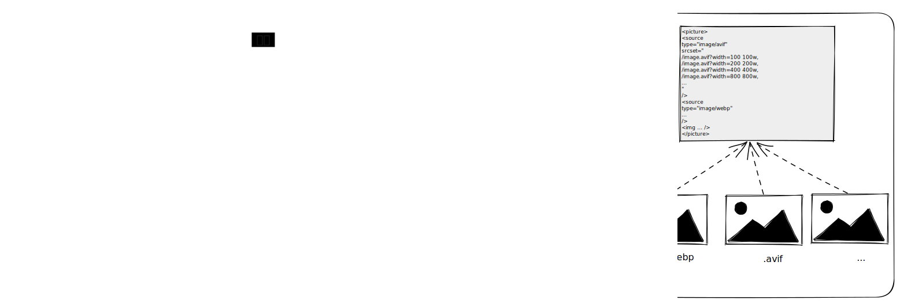
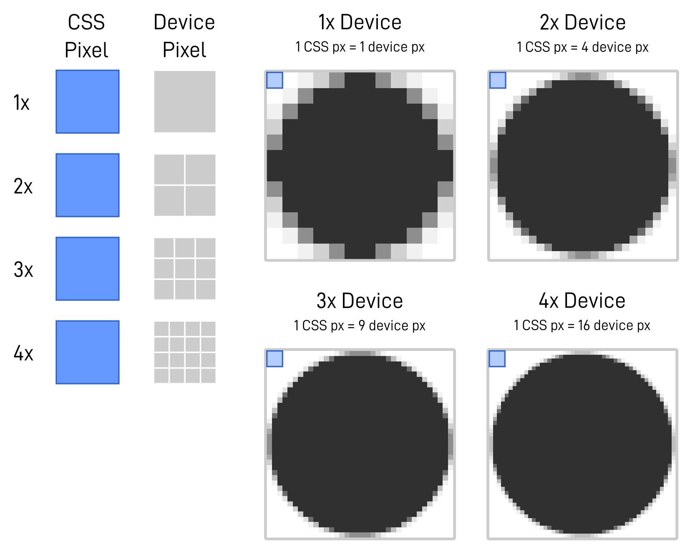

- Web 图像最佳实践
  - 尽量避免使用 background-image
    - 延长请求链（Fetch Html => Fetch CSS => Fetch Image）
    - 屏幕尺寸和分辨率-媒体查询和图像集结合
  - 延迟加载： `loading="lazy"`
    - 延迟非视口内或者靠近视口的图像加载
    - [如果对视口内的图像使用该属性会导致加载变较慢](https://web.dev/learn/images/performance-issues/#deferring-image-requests)
  - 优先加载关键图像
    - preload
    - `fetchpriority="high"`
      - 允许您将资源标记为相对于相同类型资源的“高”和“低”优先级
      - [fetchpriority 不同于 loading 的是它不会从根本上改变浏览器的行为：它不会指示浏览器在其他资源之前加载某些资源，而是为其围绕请求资源做出的决策提供重要的上下文](https://web.dev/learn/images/performance-issues/#fetch-priority)
  - 避免布局偏移
    - 设置 `width` 和 `height` 固定值
    - [现代浏览器行为](https://caniuse.com/mdn-html_elements_img_aspect_ratio_computed_from_attributes)：将 `width` 和 `height` 作为计算图像的长宽比，而不是使用这些属性的值来确定布局中元素的固定大小
    - `{max-width: 100%;height: auto}`
    - aspect-ratio
  - 响应式图像
    - 图片效果与像素密度关系
      - 屏幕
        - 物理像素，分辨率，即构成屏幕本身的硬件像素数量
        - 设备像素比(DPR)：物理像素与逻辑像素之间的比率
        - 逻辑像素：抽象独立的像素单位，用于面向开发
      - 它只有浏览器级别的信息：用户视口的大小、用户显示器的像素密度、用户首选项等。
    - 根据尺寸和分辨率，使用 `srcset` 和 `sizes` 合理控制图像源
      - `srcset`：预设图像源集，让浏览器选择
        - `srcset=1.png 2x`，x 描述像素密度 
        - `srcset=2.png 600w`，w 描述图像宽度 
      - `sizes`：描述图像相对视口的布局大小，协助浏览器决策图像源
        - `sizes="80vw"`
        - `sizes="calc(100vw-2em)"`
        - 断点：`sizes="(min-width: 1200px) calc(80vw - 2em), 100vw"`
        - [细节描述](https://web.dev/learn/images/descriptive/#describing-usage-with-sizes)
    - `max-width: 100%;height: auto`
    - 保证不会溢出容器，并且随着容器大小缩放。但为了保证图像现实效果，必须使用最大尺寸的图像源
    - 随着第一批“视网膜”设备的出现，情况变得更加糟糕，因为显示密度与视口大小一起成为一个问题。图像源需要更大的固有宽度才能适应高密度显示。简单来说，密度加倍的显示器需两倍的图像像素才能尽可能清晰地渲染图像
  - 选择正确的图像编码格式与压缩
    > https://web.dev/learn/images/raster-images/
    - 光栅图像格式定义图像内容（像素网格）的描述指令，服务器不会通过网络将图像数据发送到浏览器，而是发送描述像素网格的字节流，再该像素网格构成该图像以供客户端
    - 图像压缩是用更少的字符来描述相同的图像，这是叫做无损压缩的方式。但我们的眼睛也不具有完美的保真度，选择有损压缩可更近一步降低图像大小
    - 我们需要在性能、图像场景及体验之间找合适的平衡点，选择正确的图像压缩格式
      - 内容场景
        - 在为摄影图像目录选择编码时，AVIF在质量和传输大小方面明显胜出，但支持有限，WebP提供优化的现代后备，而JPEG是最可靠的默认值
    - 图像源所需的替代尺寸将是由这些图像在页面布局中占据的位置决定
  - img
    - 浏览器进行计算并选择向用户显示的最佳尺寸
    - `<picture>`：配置不同格式的图片
      ```html
      <picture>
        <source
          type="image/avif"
          srcset="
            /image.avif?width=100 100w,
            /image.avif?width=200 200w,
            /image.avif?width=400 400w,
            /image.avif?width=800 800w,
            ...
          "
        />
        <source
          type="image/webp"
          srcset="
            /image.webp?width=100 100w,
            /image.webp?width=200 200w,
            /image.webp?width=400 400w,
            /image.webp?width=800 800w,
            ...
          "
        />
        
      </picture>
      ```
    - `aspect-ratio`：避免布局偏移
      ```html
      
      ```
    - `decoding="async"`：异步图像解码
    - `alt`：提高可访问性和 SEO


    - 框架 Image 组件
      - 完全省略sizes不仅违反了 HTML 规范，而且会导致默认行为，相当于sizes="100vw"通知浏览器该图像仅受视口本身的约束，从而导致选择最大可能的候选源。
      - [respImageLint](https://web.dev/learn/images/automating/)
      - LCP
      - Lazysizes
      - sizes="auto"
    - 图像 CDN 服务：集成图像处理服务和 CDN 功能
      - 使用特殊的配置路径，如 `https://res.cloudinary.com/demo/image/upload/w_400,q_60/sample.jpg`
      - 编码格式和内容协商
        - 请求 `Accept: image/avif,image/webp,image/apng,image/svg+xml,image/*,*/*;q=0.8`
        - 响应 `Content-Type: image/avif`
    - CMS 图像管理流程：一个是针对构建和维护站点时使用的图像资产（背景、图标、徽标等）的开发级任务，另一个是与通过使用网站，例如编辑团队嵌入帖子中的照片，或用户上传的头像。虽然上下文可能不同，但最终目标是相同的：根据开发团队定义的设置进行自动编码和压缩 

## 图像工程化架构




- 带图像服务的 CDN

## 参考


- 物理像素
  - 设备像素、分辨率，宽*高
- 逻辑像素
- 像素密度 DPR

  


- 自动执行压缩和编码
  - 服务
  - 构建时
    - [imagemin](https://github.com/imagemin/imagemin)
    - [sharp](https://sharp.pixelplumbing.com/)
- 尺寸适配
- 使用形式
  - 响应式图片组件
    - pictrue
      - source
        - type
        - media
          - `<source media="(prefers-color-scheme: dark)" srcset="hero-dark.jpg">`
        - srcset
          - w
        - size
          - sizes 完全省略不仅违反了 HTML 规范，而且会导致默认行为等效于 sizes="100vw"
          - respImageLint
          -  Lazysizes
             -  sizes="auto"
      - img
- 性能优化