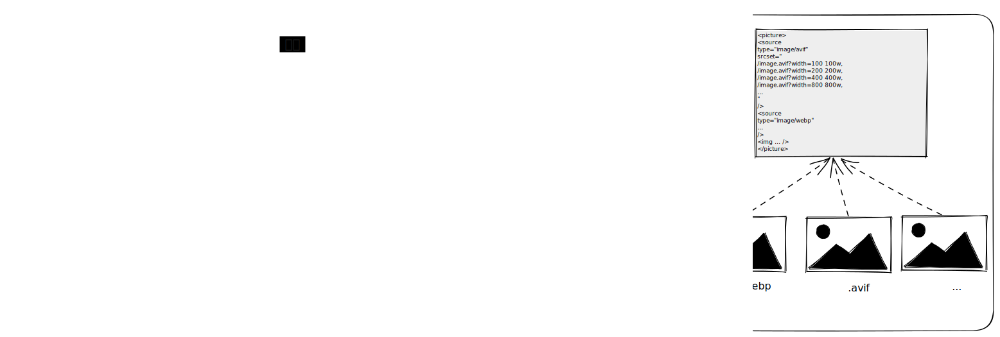

# Web 图像最佳实践

- Web 图像最佳实践
  - 关键图像
    - 优先加载
      - `<link preload />`
      - `fetchpriority="high"`
        - 允许您将资源标记为相对于相同类型资源的“高”和“低”优先级
    - 尽量避免使用 `background-image`：延长请求链（Fetch Html => Fetch CSS => Fetch Image）
    - 延迟加载非视口内的图像
      - [延迟加载图像方法](https://web.dev/lazy-loading-images/)
  - 避免布局偏移
    - 设置 `width` 和 `height` 固定值
    - `` + css `{max-width: 100%;height: auto}`
      - [现代浏览器行为](https://caniuse.com/mdn-html_elements_img_aspect_ratio_computed_from_attributes)会将 `width` 和 `height` 作为计算图像的长宽比
      - 通过 CSS 样式覆盖 HTML 属性的高度即可，进行响应式宽高而不是使用这些属性的值来确定布局中元素的固定大小
    - `aspect-ratio`：避免布局偏移
      ```html
      
      ```
  - 选择正确的图像编码格式与压缩：需要在性能、图像场景及体验之间找合适的平衡点，选择正确的图像压缩格式
    - 矢量图像
    - 光栅图像
      - 光栅图像格式：一组逐像素的描述指令，用于渲染二维网格
        - 服务器不会通过网络将图像数据发送到浏览器，而是发送描述像素网格的字节流，再该像素网格构成该图像以供客户端
        - 图像压缩是用更少的字符来描述相同的图像，这是叫做无损压缩的方式。但我们的眼睛也不具有完美的保真度，选择有损压缩可更近一步降低图像大小
      - 常见格式
        - GIF
        - JPEG
        - PNG
        - WebP
        - AVIF
      > 更多了解 https://web.dev/learn/images/raster-images/
  - 响应式图像
    - 响应式布局
      - `max-width: 100%`
        - 保证不会溢出容器，并且随着容器大小缩放。但为了保证图像现实效果，必须使用最大尺寸的图像源
    - 响应式加载：动态加载合适的图像
      - 图片显示效果与像素密度关系
        - 像素概念
          - 物理像素，分辨率，即构成屏幕本身的硬件像素数量
          - 设备像素比(DPR)：物理像素与逻辑像素之间的比率
          - 逻辑像素：抽象独立的像素单位，用于面向开发
        - 理想情况下，图片像素与物理像素呈现 1:1 的显示比例最佳
          - 在 DPR 为 的 2 显示器上，渲染 400 逻辑像素宽的布局中的图像时，要渲染的图像必须具有至少 800 像素的固有宽度，才能防止被拉大
          - 在 DPR 为 的 1 显示器上，800 像素的图像和 400 像素的图像渲染在 400 逻辑像素宽的布局中的效果差不多，但会造成性能浪费
      - **根据布局尺寸和分辨率**，`` 使用 `srcset` 和 `sizes` 合理控制图像源
        - `srcset`：预设图像源集，让浏览器选择
          - `srcset=1.png 2x`，x 描述像素密度 
          - `srcset=2.png 600w`，w 描述图像宽度 
        - `sizes`：描述图像相对视口的布局大小，协助浏览器决策图像源
          - `sizes="80vw"`
          - `sizes="calc(100vw-2em)"`
          - `sizes="(min-width: 1200px) calc(80vw - 2em), 100vw"`
          - [更多了解](https://web.dev/learn/images/descriptive/#describing-usage-with-sizes)


    - 框架 Image 组件
      - 完全省略sizes不仅违反了 HTML 规范，而且会导致默认行为，相当于sizes="100vw"通知浏览器该图像仅受视口本身的约束，从而导致选择最大可能的候选源。
      - [respImageLint](https://web.dev/learn/images/automating/)
      - LCP
      - Lazysizes
      - sizes="auto"
    - 图像 CDN 服务：集成图像处理服务和 CDN 功能
      - 使用特殊的配置路径，如 `https://res.cloudinary.com/demo/image/upload/w_400,q_60/sample.jpg`
      - 编码格式和内容协商
        - 请求 `Accept: image/avif,image/webp,image/apng,image/svg+xml,image/*,*/*;q=0.8`
        - 响应 `Content-Type: image/avif`
    - CMS 图像管理流程：一个是针对构建和维护站点时使用的图像资产（背景、图标、徽标等）的开发级任务，另一个是与通过使用网站，例如编辑团队嵌入帖子中的照片，或用户上传的头像。虽然上下文可能不同，但最终目标是相同的：根据开发团队定义的设置进行自动编码和压缩 

## 图像工程化架构



- 带图像服务的 CDN


- 自动执行压缩和编码
  - 服务
  - 构建时
    - [imagemin](https://github.com/imagemin/imagemin)
    - [sharp](https://sharp.pixelplumbing.com/)
- 尺寸适配
- 使用形式
  - 响应式图片组件
    - pictrue
      - source：配置图片格式
        - type
        - media
          - `<source media="(prefers-color-scheme: dark)" srcset="hero-dark.jpg">`
        - srcset
          - w
        - size
          - sizes 完全省略不仅违反了 HTML 规范，而且会导致默认行为等效于 sizes="100vw"
          - respImageLint
          -  Lazysizes
             -  sizes="auto"
      - img
- 图像性能优化
  - 编码格式
    - 响应式图片
      - 根据屏幕大小和分辨率选择性加载
        - DPR
        - srcset
        - sizes
    - Image 组件的最佳实践