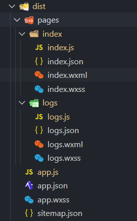
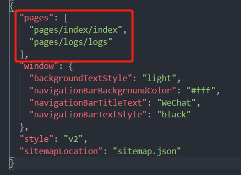
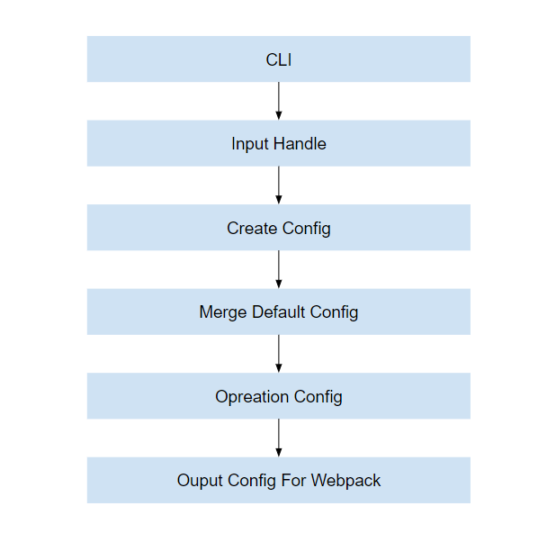

微信小程序项目 webpack 工程化，最简单的思路：使用 webpack 输出符合微信项目文件规范！

本项目使用的是 webpack + typescript + sass

## entry
微信小程序应用是多页面结构应用，每个页面由 JS、JSON、WXSS、WXML 文件构成



在 app.json 中 pages 注册页面



而我们需要获取 pages 和 app 作为 webpack 的 entry，大概数据结构如下：

```json
{
  app: './app.ts',
  'pages/index/index': './pages/index/index.ts',
  'pages/logs/logs': './pages/logs/logs.ts'
}
```

除了需要处理的文件，如 ts、scss、js，其他文件统统通过 [copy-webpack-plugin](https://github.com/webpack-contrib/copy-webpack-plugin) 复制到 miniprogramRoot 指定的目录下

```javascript
new CopyWebpackPlugin({
    patterns: [
        {
            from: '.',
            to: '.',
            globOptions: {
                ignore: [
                    '**/*.ts',
                    '**/*.scss',
                    '**/*.js',
                ]
            }
        }
    ]
}),
```

### 分离 runtime

每个 entry 文件 webpack 打包后内容都包含 webpack runtime 的代码，开发小程序的包的是由严格的大小限制，我们也要减少多余重复的代码

```javascript
optimization: {
    // 值"single"会创建一个在所有生成块之间共享的运行时文件
    runtimeChunk: 'single'
}
```

上面操作会分离 runtime 成单独文件，而小程序的主入口程序是 app，所以我们需要把 runtime 的代码合并到 app 中去，不然小程序会运行不起来，编写 webpack 插件

```javascript
const { ConcatSource } = require('webpack-sources')

class RuntimePlugin {
    apply(compiler) {
        compiler.hooks.emit.tap('RuntimePlugin', (compilation) => {

            const runtime = compilation.getAsset('runtime.js').source
            const source = compilation.getAsset('app.js').source

            // merge runtime into app
            compilation.updateAsset('app.js', new ConcatSource(runtime, source))
            // delete runtime
            delete compilation.assets['runtime.js']
        });
    }
}

module.exports = RuntimePlugin
```

## babel + typescript

## scss 支持

小程序页面的 wxss 和 js 文件是同处于同一级目录下，同样需要多增加 scss 文件的入口

```javascript
// entry.js

module.exports = () => {
    ...
    // add app entry
    pages.unshift('app')

    return pages.reduce((pre, next) => {
        // ts entry
        pre[next] = `./${next}.ts`
        // scss entry
        pre[next + '.scss'] = `./${next}.scss`
        return pre
    }, {})
}

```
通过 [file-loader](https://github.com/webpack-contrib/file-loader) 将编译后的内容提取复制到对应路径下

```javascript
...
{
    test: /\.s[ac]ss$/i,
    use: [
        {
            loader: 'file-loader',
            options: {
                useRelativePath: true,
                name: '[path][name].wxss',
                context: miniprogram_src
            }
        },
        // Compiles Sass to CSS
        'sass-loader'
    ],
},
...
```

构建后， dist 目录下会生 `xxx.scss.js` 文件，这是我们不需要的，需要在构建后进行删除


```javascript
...
class RuntimePlugin {

    apply(compiler) {
        compiler.hooks.emit.tap('RuntimePlugin', (compilation) => {
            ...
            // delete the .scss.js file which will emit
            let { entry } = compiler.options
            let entryArray = Object.keys(entry)
            for (let index = 0; index < entryArray.length; index++) {
                const entry = entryArray[index];
                if (entry.indexOf('.scss') > -1) {
                    delete compilation.assets[entry + '.js']
                }
            }
        });
    }
}
...
```

## npm 包


## 多环境变量

多环境变量支持，很简单，使用 [dotenv-webpack](https://github.com/mrsteele/dotenv-webpack) 插件即可。
多环境变量没什么好讲，这里主要是调整 webpack 配置代码结构，将输入、修改，输出分离。按照常用习惯，.env 文件默认为通用环境变量，.env.[env-mode] 则为特定环境模式下的变量，优先级更高。



- CLI 为与用户交互，获取输入
- Input Handle 主要对输入的数据处理
- Create Config 创建配置对象
- Merge Default Config 合并默认配置
- Opreation Config 修改配置操作
- Ouput Config For Webpack 输出 webpack 配置

这里主要提到下 [webpack-chain](https://github.com/neutrinojs/webpack-chain)， 将 webpack config 配置对象化，并抽象 webpack 配置为可链式操作的API，方便修改配置且修改方式标准化，有助于跨项目共享。非常值得学习。