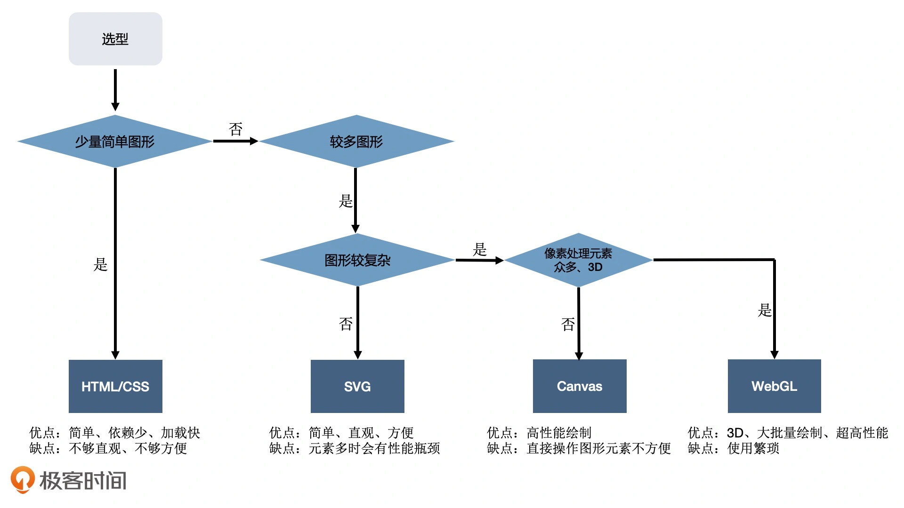
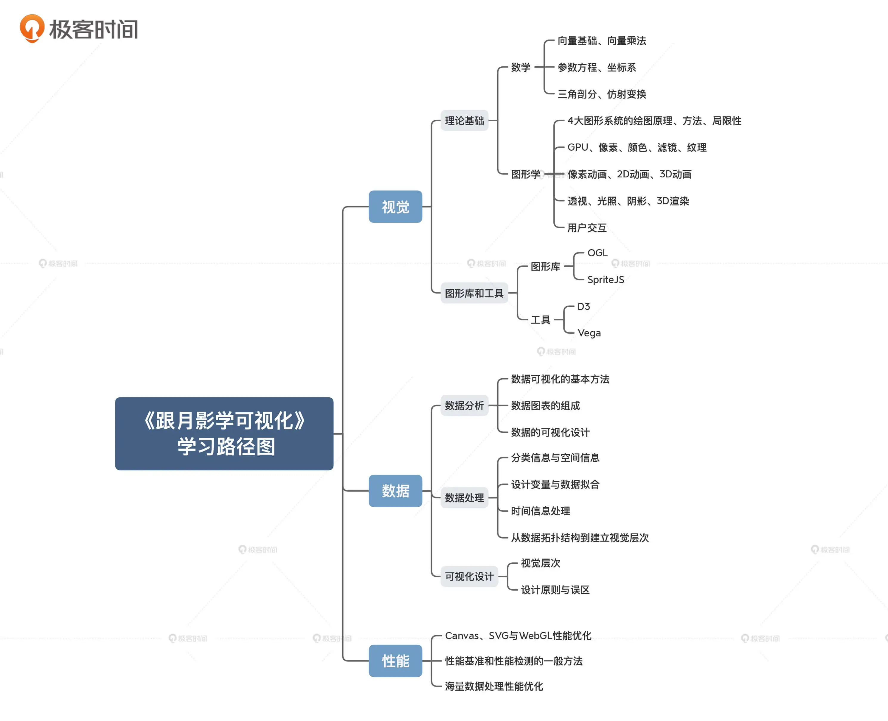
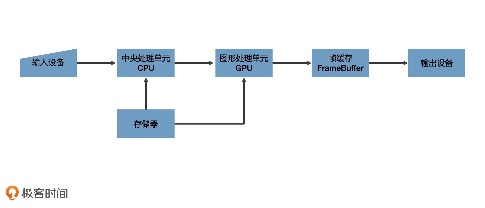
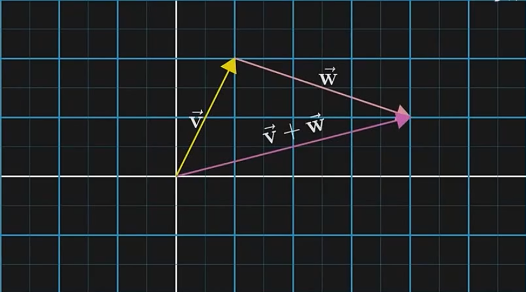
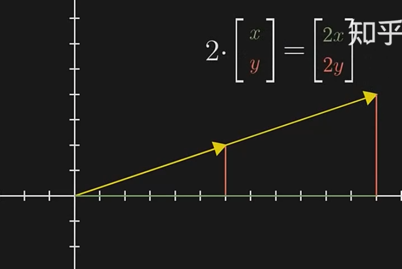

# 可视化

- 可视化
  - 视觉
    - 理论基础
      - 数学
        - 描述几何信息
          - 几何图形维度划分：点、线、面、体
          - **直角**坐标系
            - 坐标换算（矩阵运算）
            - 坐标系变换、对称
          - 向量来描述点和线段（原点 (0,0) 到坐标 (x,y) 的一根线段）
          - 勾股定理
      - 图形学
    - 图形系统（Web）    
      - HTML + CSS
      - [SVG](https://developer.mozilla.org/zh-CN/docs/Web/SVG)
        - SVG 作为一种浏览器支持的图像格式，既可以作为 HTML 内嵌元素使用，也可以作为图像通过 img 元素加载，或者绘制到 Canvas 内
        - SVG 绘制可视化图形与用 Canvas 绘制有明显区别，SVG 通过创建标签来表示图形元素，然后将图形元素添加到 DOM 树中，交给 DOM 完成渲染
        - 交互实现起来非常简单，但SVG 的图形元素会非常多，这会导致 DOM 树渲染成为性能瓶颈
      - [Canvas2D](./Canvas.md)
      - 3D
        - WebGL
        - WebGPU
    - 图形库
      - [SpriteJS](https://spritejs.org/#/)
      - ThreeJS
      - [pixijs](https://pixijs.com/)
    - 工具
    - 数据驱动框架
      - [D3.js](https://d3js.org/)
  - 数据
    - 设计语言
    - 数据建模
    - 数据分析
  - 性能优化

  

## 计算机图形系统原理

  

1. 数据经过 CPU 逻辑处理，成为具有特定结构的几何信息
2. GPU 光栅化即转成图像的像素阵列：元素坐标计算 + 着色
3. 光栅结果会输出到帧缓存中，最后渲染到屏幕上

## WebGL

1. 创建 WebGL 上下文
2. 创建 WebGL 程序（WebGL Program）
3. 将数据存入缓冲区
4. 将缓冲区数据读取到 GPU
5. GPU 执行 WebGL 程序，输出结果

## 向量和向量空间

方向、大小（长度）
一组有序的特征（数字）列表

向量运算
- 加法
- 乘法

向量加法
向量加法的定义差不多是线性代数中唯一允许向量离开原点的情况
  
 
  

基向量

缩放向量相加