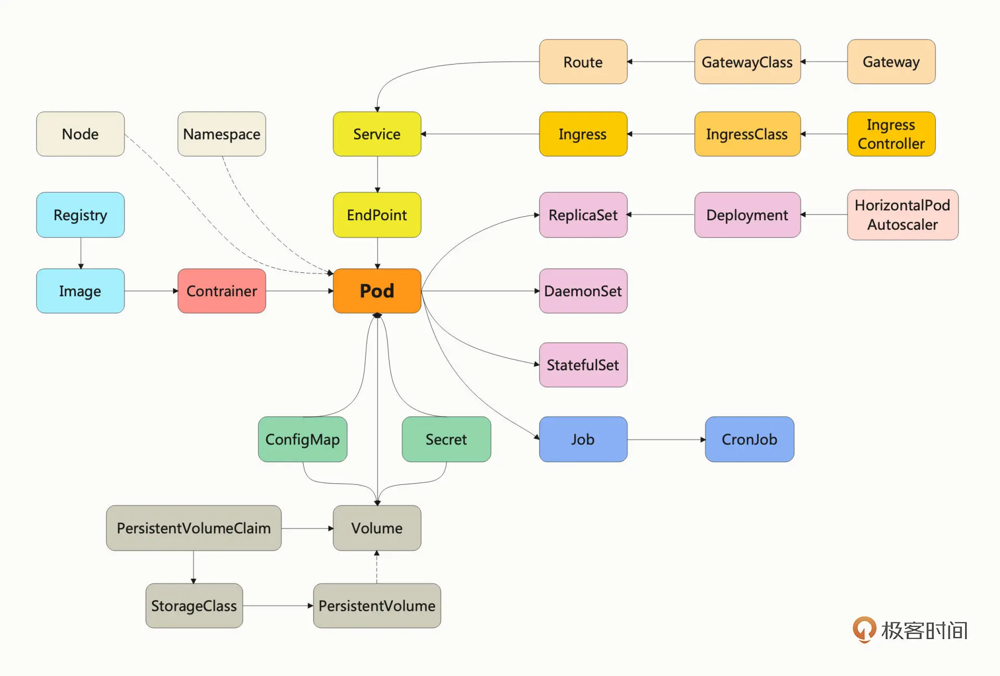

---
tags:
 - kubernetes
 - 容器
---

# Kubernetes

- Kubernetes
  - Kubernetes 是一个生产级别的容器编排平台和集群管理系统，能够创建、调度容器，监控、管理服务器
  - Node
    - 集群节点可以是实体，也可以是虚拟机
    - 分类
      - Master Node
      - Worker Node
    - 组成
      - Component
        - Master Component
          - apiserver
            - [API 对象](#api-对象)
          - etcd
            - 分布式的 KV 数据库
          - scheduler
            - 容器编排
          - controller-manager
            - 负责维护容器和节点等资源的状态
        - Worker Component
          - kubelet
            - Node 的代理，负责管理 Node 相关的绝大部分操作，并且与 apiserver 通信
          - kube-proxy
            - 网络代理
          - container-runtime（任何符合标准的容器运行时，如 containerd、CRI-O 等）
            - 创建容器，管理 Pod 的生命周期
      - Addon
        - DNS
        - Dashboard
  - [Pod](#pod)
  - [Job/CronJob](#jobcronjob)
  - [ConfigMap/Secret](#configmapsecret)

## API 对象

作为一个集群操作系统，Kubernetes 在理论层面抽象出了很多个概念，用来描述系统的管理运维工作，这些概念就叫做“API 资源对象”。

```sh
# 显示出资源对象相应的 API 版本和类型
kubectl api-resources 
```

这些 API 对象全面地描述了集群的节点、应用、配置、服务、账号等等信息，apiserver 会把它们都存储在数据库 etcd 里，然后 kubelet、scheduler、controller-manager 等外部用户和内部组件都必须和它通信，通过 apiserver 来操作它们，就在 API 对象这个抽象层次实现了对整个集群的管理。

使用 YAML 格式描述 API 对象，必须的字段是 apiVersion、kind、metadat：

```yaml
apiVersion: v1
kind: 
metadata:
  name: 
  labels:
spec:
```

```sh
# Kubernetes 自带的 API 文档，会给出对象字段的详细说明
kubectl explain pod.spec.containers
```

## Pod

现实中经常会有多个进程密切协作才能完成任务的应用，而仅使用容器很难描述这种关系，所以就出现了 Pod，它“打包”一个或多个容器，保证里面的进程能够被整体调度，并共享网络、存储等资源，故 Pod 是 Kubernetes 应用调度部署的最小单位。

Pod 是 Kubernetes 的核心对象，以 Pod 为中心的 Kubernetes 资源对象关系图：

  

### YAML 来定制 Pod

```markdown
- spec
  - containers
    - name
    - image
    - ports
    - imagePullPolicy：指定镜像的拉取策略，可以是 Always/Never/IfNotPresent
    - env
    - command：定义容器启动时要执行的命令，相当于 Dockerfile 里的 ENTRYPOINT 指令
    - args：相当于 Dockerfile 里的 CMD 指令
```

创建 pod yaml 文件并使用：

```sh
kubectl run ngx --image=nginx:alpine --dry-run=client -o yaml > ngx.pod.yml

kubectl apply -f ngx.pod.yml
```

## Job/CronJob

```sh
kubectl create cm info --dry-run=client -o yaml > info.yaml
```

```
apiVersion: batch/v1
kind: Job
metadata:
spec:
  template:
    [Pod spec]
```

```
apiVersion: batch/v1
kind: CronJob
metadata:
  name: echo-cj
spec:
  schedule:
  jobTemplate:
   [Job spec]
```

## ConfigMap/Secret