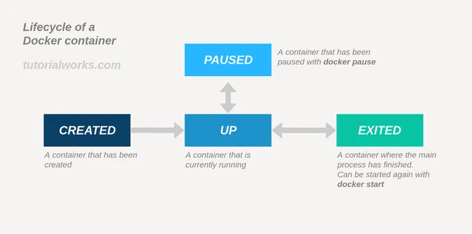
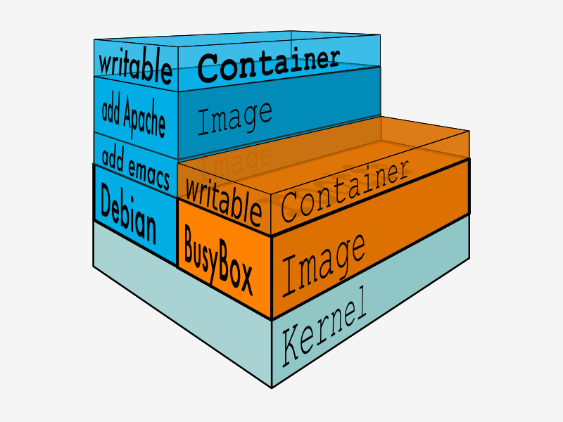

# 容器技术

- 容器技术
  - Linux 资源隔离技术
    - namespace
    - cgroup
    - chroot
  - [术语介绍](https://developers.redhat.com/blog/2018/02/22/container-terminology-practical-introduction#)
  - 容器技术
    - 镜像
      - [镜像分层机制](#镜像分层机制)
      - [Dockerfile](#dockerfile)
    - 镜像仓库
    - 容器及运行时
      - 容器就是被隔离的进程
      - 容器标准：[OCI（开放容器倡议）](https://opencontainers.org/)
      - 容器生命周期   
    - 容器编排
  - Docker
    - [Docker CLI](#docker-cli)
  - [Kubernetes 就是一个生产级别的容器编排平台和集群管理系统](./Kubernetes.md)

## 镜像分层机制

容器镜像的一个最主要的特征：分层。

容器镜像内部并不是一个平坦的结构，而是由许多的镜像层组成的，每层都是只读不可修改的一组文件，相同的层可以在镜像之间共享，然后多个层像搭积木一样堆叠起来，再使用一种叫“Union FS 联合文件系统”的技术把它们合并在一起，就形成了容器最终看到的文件系统。而**容器其实就是在静态镜像的基础上加个可写层**。

  

## Dockerfile

- Dockerfile
  - 指令
    - FROM
    - ARG
      - 创建的变量只在镜像构建过程中可见，容器运行时不可见
    - ENV
      - 创建的变量不仅能够在构建镜像的过程中使用，在容器运行时也能够以环境变量的形式被应用程序使用
    - WORKDIR：设置工作目录
    - COPY
      - 从构建上下文中复制文件到镜像中
    - ADD
      - 从构建上下文中复制文件到镜像中
      - 从 URL 下载和自动解压
    - RUN
      - 执行 Shell 命令
      - 多行命令，在末尾使用续行符 `\`
    - CMD、ENTRYPOINT：容器启动时的运行命令，必须指定 CMD 或 ENTRYPOINT 其中的一个
      - 多个重复指令会覆盖
      - ENTRYPOINT 优先级高于 CMD
        - CMD 指定将提供给 ENTRYPOINT 的参数
      - CMD 会被运行容器时指定命令覆盖；ENTRYPOINT 则将可运行容器时的命令作为传参
      - CMD 适合作为服务启动命令；ENTRYPOINT 适合将容器作为可执行程序
    - EXPOSE：声明容器对外服务的端口号，实际并不会自动端口映射
    - VOLUME：创建一个外部挂载
  - 编写正确、高效的 Dockerfile
    - 选择合适的基础镜像
    - 每个指令都会生成一个镜像层，尽量精简合并指令
      - docker 中目前只有 RUN, COPY, ADD 会创建层数会增加镜像的体积
    - 一旦层发生变化，所有下游层也必须重新创建，做好镜像分层缓存
    - 多阶段构建

## Docker CLI

- 镜像管理
  - `pull`
  - `images`
    - `-a`：为了加速镜像构建、重复利用资源，Docker 会利用中间层镜像，-a 显示包括中间层镜像在内的所有镜像
  - `rmi`：删除镜像
  - `tag`：镜像命名 `<name>:<tag>`
  - `inspect`：查看容器/镜像详细信息
  - `image history`：查看镜像分层
- 镜像制作
  - `build -t xxx:tag <构建上下文>`
    - 构建上下文：上下文路径/URL
    - .dockerignore：忽略构建上下文中的文件
  - `commit`：将运行中的容器做成镜像
    - https://yeasy.gitbook.io/docker_practice/image/commit
- 容器运行
  - `run`
    - `--rm`
    - `-d`
    - `-a`
    - `-it`
  - [容器启动运行模式](./%E5%AE%B9%E5%99%A8%E5%90%AF%E5%8A%A8%E8%BF%90%E8%A1%8C%E6%A8%A1%E5%BC%8F.md)
- 容器交互
  - 交互
    - `exec`
      - `run` 是针对容器默认程序启动，而 `exec` 是进入了容器内部去跑命令
    - `attach`
  - `cp <宿主｜容器ID 文件> <容器｜宿主 文件>`：容器和主机之间互相拷贝文件
    - eg: `podman cp a.txt 062:/tmp`
  - 挂载
    - `run -v <宿主目录｜数据卷:容器目录>`
    - 挂载目录(mount) vs 数据卷(volumn)
      - 挂载目录依赖于具有特定目录结构的主机文件系统，而数据卷能够将主机与容器解耦
      - volumn 会将 container 目录中的内容拷贝到 volume 中，而 mount 会将外部的目录覆盖容器内部目录
  - 网络互通
    - `run -net`
      - `none`
      - `host`：直接使用宿主机网络，相当于去掉了容器的网络隔离
      - `bridge`（默认）：容器和宿主机再通过虚拟网卡接入网桥进行通信
    - `run -p <宿主端口>:<容器端口>`：端口映射，端口号映射需要使用 bridge 模式
- 容器管理
  - `top`
  - `kill`
  - `ps`
  - `stop`
  - `rm`
- 数据卷
  - `volume create`