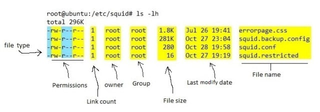

# Linux 用户与权限

- Linux 是一个多用户平台，允许多个用户同时登录系统工作
  - 用户分类
    - root
    - 普通用户
    - 用户组
    - 所有用户
  - 指令
    - 创建用户：`sudo useradd foo`
    - 查看当前用户的分组：`groups`
      - 查看当前用户的分组及id：`id`
        - `> uid=501(lianyuansheng) gid=20(staff) groups=20(staff)...`
          - gid 用户当前主要工作分组
- Linux 权限
  - 系统调用权限
  - 文件权限
    - 权限划分
      - 读权限（r）：控制读取文件
      - 写权限（w）：控制写入文件
      - 执行权限（x）：控制将文件执行，比如脚本、应用程序等
    - `ls -l` 命令可查看文件权限    
      - 第一个符号为**文件类型**
        - `-`：普通文件
        - `d`：代表目录
        - `p`：代表管道
        - 等
      - 文件的权限可以用 9 个字符，3 组 rwx 描述
        - 第一组是用户权限
          - 文件初始权限：
            - 谁创建谁拥有
            - 每个用户创建一个同名分组，被创建文件所属的分组是当时用户所在的工作分组（主要分组），如果没有特别设置，那么就属于用户所在的同名分组
        - 第二组是组权限
        - 第三组是所有用户的权限
      - 修改文件权限
        ```shell
        # 使用符号修改：
        # 设置foo可以执行
        chmod +x ./foo
        # 不允许foo执行
        chmod -x ./foo
        # 也可以同时设置多个权限
        chmod +rwx ./foo
        
        # 使用二进制或者十进制：
        # 设置rwxrwxrwx (111111111 -> 777)
        chmod 777 ./foo
        # 设置rw-rw-rw-(110110110 -> 666)
        chmod 666 ./foo
        ```
      - 修改文件所属用户
        ```shell
        # 修改foo文件所属的用户为bar
        chown bar ./foo
        
        # 修改foo的分组位g，用户为u
        chown g.u ./foo
        ```
      - 执行文件
        - 当一个文件被分配执行权限，用户输入一个文件名，回车即可执行
        - 如果没有指定完整路径，Linux 就会在一部分目录中查找这个文件，可以通过echo $PATH 看到 Linux 会在哪些目录中查找可执行文件