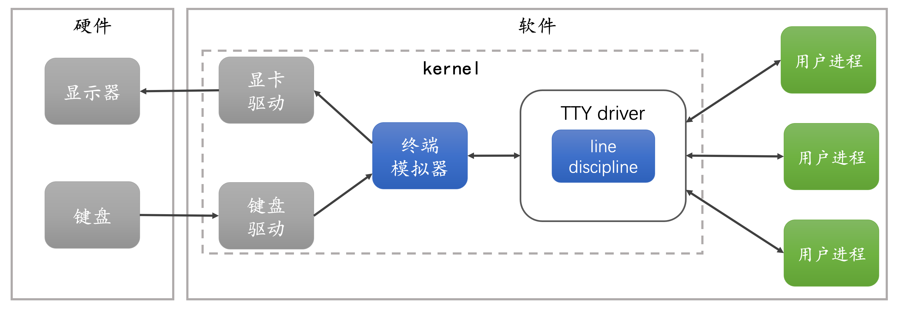
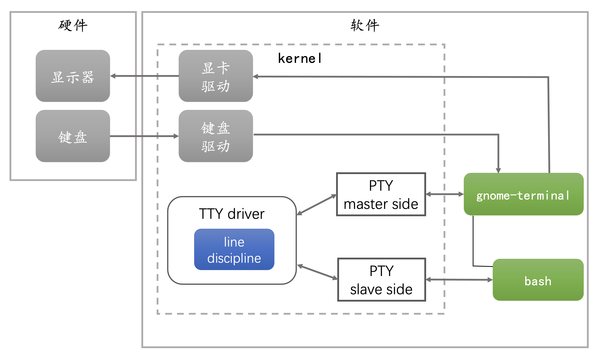
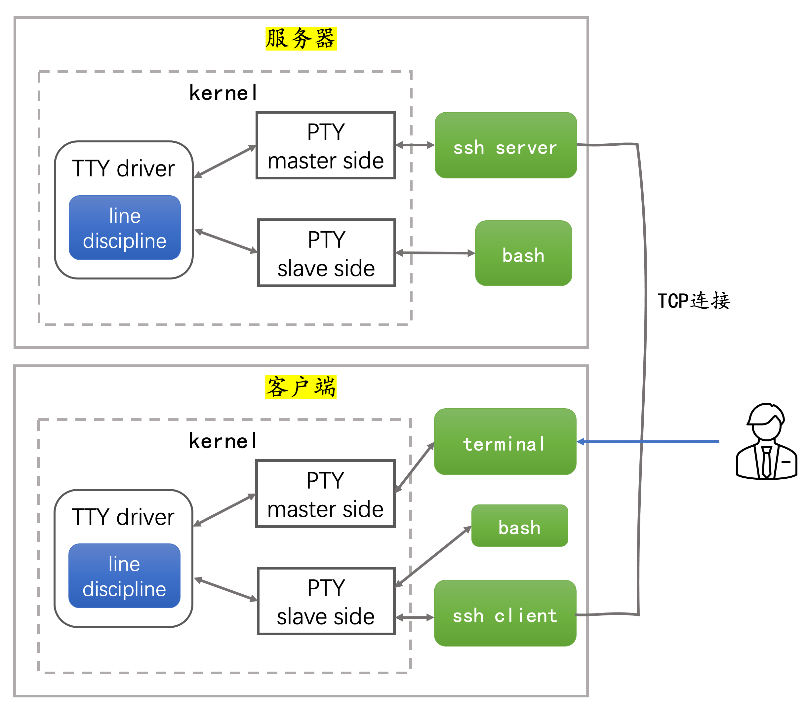

# TTY

- TTY 电传打字机，后来连接计算机作为终端设备，现在指任何能够提供字符输入和输出的设备 
- 随着硬件终端逐渐演化成了软件的概念，出现了软件仿真终端，称为终端模拟器（terminal emulator），其直接运行在内核态。就像过去的物理终端一样，它监听来自键盘的事件将其发送到 TTY 驱动，并从 TTY 驱动读取响应，通过显卡驱动将结果渲染到显示器上 
- 在 Linux 和类 Unix 系统中，TTY 都由一个特殊的设备文件 `/dev/tty[n]` 所抽象化表示。与这个虚拟终端的交互，是通过对这个设备文件的读写操作，以及使用 ioctl 系统调用操作这个设备文件进行的
  - 通过执行 tty 命令可以查看代表当前虚拟终端的设备文件：
    ```shell
    $ tty
    /dev/ttys005
    ```
  - 查看与 tty 交互的后台进程，与 tty 持久交互的则是前台进程
    ```shell
    $ lsof /dev/ttys005
    COMMAND   PID          USER   FD   TYPE DEVICE SIZE/OFF NODE NAME
    zsh     68684 lianyuansheng    0u   CHR   16,5 0t214736 1185 /dev/ttys005
    zsh     68684 lianyuansheng    1u   CHR   16,5 0t214736 1185 /dev/ttys005
    zsh     68684 lianyuansheng    2u   CHR   16,5 0t214736 1185 /dev/ttys005
    zsh     68684 lianyuansheng   10u   CHR   16,5   0t6811 1185 /dev/ttys005
    lsof    79386 lianyuansheng    0u   CHR   16,5 0t214736 1185 /dev/ttys005
    lsof    79386 lianyuansheng    1u   CHR   16,5 0t214736 1185 /dev/ttys005
    lsof    79386 lianyuansheng    2u   CHR   16,5 0t214736 1185 /dev/ttys005
    ```
  - 与 Shell 区别
    - Shell 由 terminal 程序 fork 出来，是 terminal 的子进程
    - Shell 负责解释执行用户输入的字符命令，而 TTY 则是处理键盘事件，负责字符的显示
- 伪终端 PTY（pseudo TTY）：运行用户态的仿终端软件，比如 xterm，gnome-terminal，以及远程终端 ssh
  - 伪终端如何与 TTY 驱动交互（以 gnome-terminal 为例） 
    - 先分配一个伪终端
      - PTY 是通过打开特殊的设备文件 /dev/ptmx 创建，由一对双向的字符设备构成，称为 PTY master 和 PTY slave
    - 让 gnome-terminal 持有 PTY master 的文件描述符 `/dev/ptmx`
    - fork 一个 shell 子进程，并让 shell 持有 PTY slave 的设备文件 `/dev/pts/[n]`，即让其标准输入、标准输出和标准错误都设置为 PTY slave
    - PTY master 和 PTY slave 之间通过 TTY 驱动会话交流
    - 输入的命令由 shell 子进程执行
- TTY 驱动包含的 line discipline 是一个逻辑组件
  - 可通过 `stty` 查看设置 TTY 的特征和 line discipline 规则
  - line discipline 主要有以下功能：
    - 缓存字符，回车发送
    - 拦截处理一些特殊的功能键，发送进程信号，如当用户按 `CTRL+c` 时，它向连接到 PTY slave 的进程发送 `kill -2（SIGINT）` 信号

## 远程终端

> TODO: 实现一个远程终端玩具
>
> 

## 参考

- [理解 Linux 终端、终端模拟器和伪终端](https://mazhen.tech/p/%E7%90%86%E8%A7%A3linux-%E7%BB%88%E7%AB%AF%E7%BB%88%E7%AB%AF%E6%A8%A1%E6%8B%9F%E5%99%A8%E5%92%8C%E4%BC%AA%E7%BB%88%E7%AB%AF/)
- [The TTY demystified](http://www.linusakesson.net/programming/tty/)
