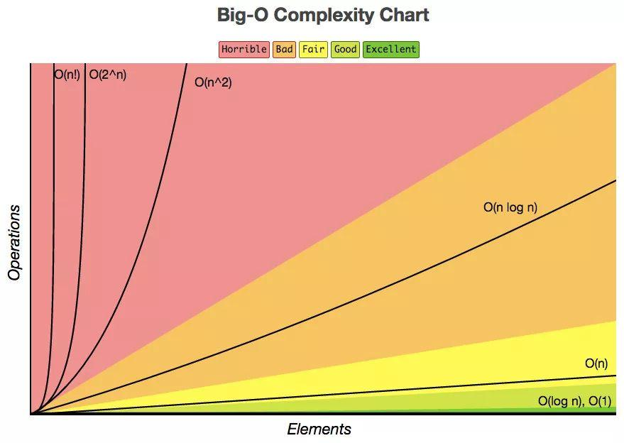
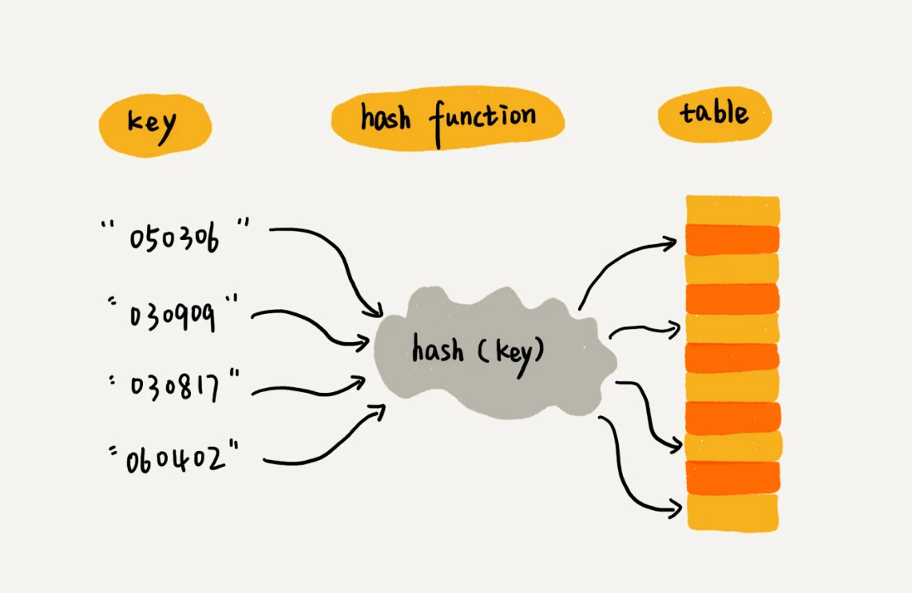
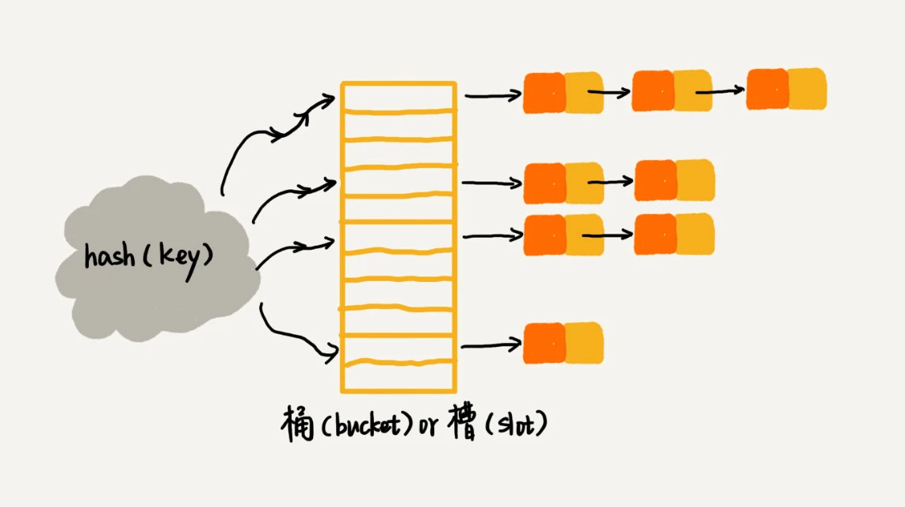
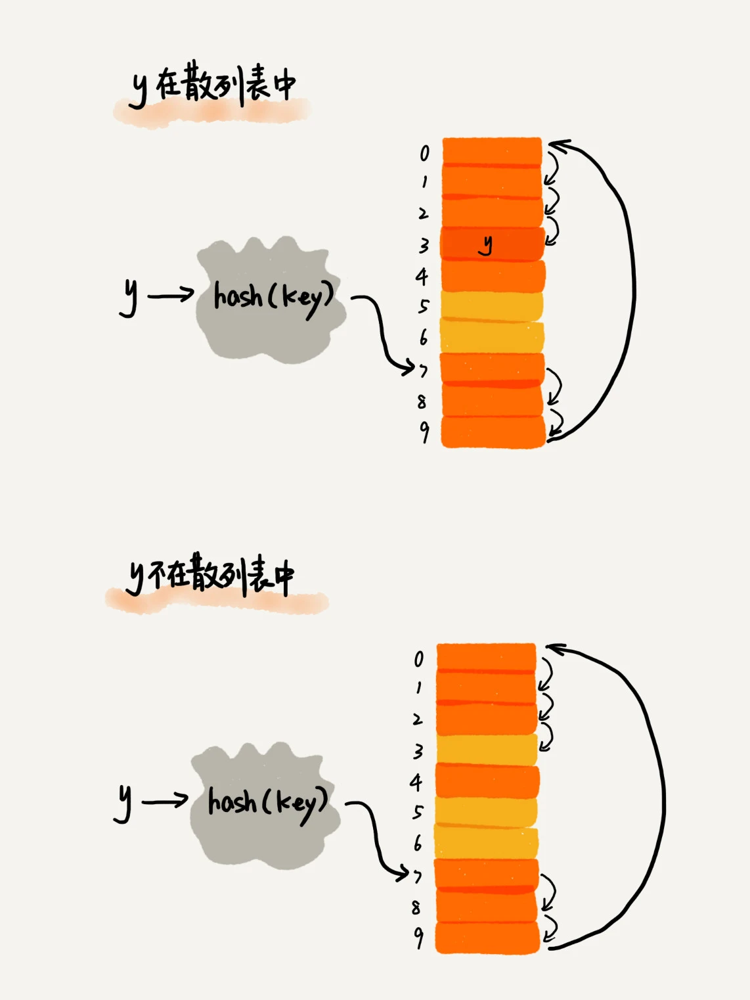
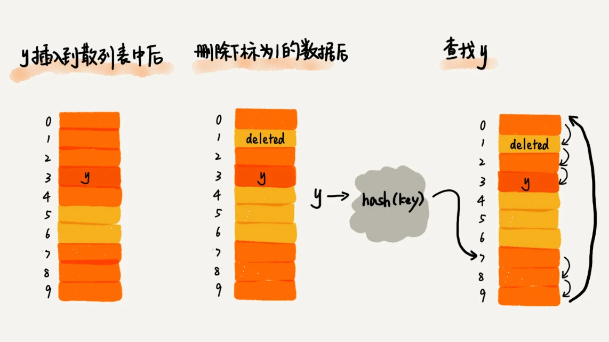

# 数据结构与算法

- 数据结构与算法
  - 算法评估
    - 除了寻求解法外，我们的目标是设计“既快又省”的数据结构与算法
      - 时间效率：算法运行速度的快慢。
      - 空间效率：算法占用内存空间的大小
    - 算法复杂度是一个关于输入数据量 n 的函数，用 `O(n)` 表示，用于描述了随着输入数据大小的增加，算法执行所需时间和空间的增长趋势
      - 时间复杂度
        - 推算方法
          - 与具体的常数、系数无关
          - 循环嵌套时使用乘法
          - 多项式级的时间复杂度由其中最高阶的项来决定
        - 常见类型    
        - 最差、最佳、平均时间复杂度
          - 最差时间复杂度更为实用，因为它给出了一个效率安全值
          - 计算平均时间复杂度往往比较困难，在这种情况下，我们通常使用最差时间复杂度作为算法效率的评判标准
      - 空间复杂度：与时间复杂度不同的是，我们通常只关注最差空间复杂度。这是因为内存空间是一项硬性要求，我们必须确保在所有输入数据下都有足够的内存空间预留
  - 数据结构：是在计算机中组织与存储数据的方式
    - 逻辑结构揭示了数据元素之间的逻辑关系
      - 线性数据结构
      - 非线性数据结构
        - 树形结构
        - 网状结构
    - [底层存储结构：数组、链表](./底层存储结构：数组、链表.md)
    - 栈、队列
      - 栈：是一种遵循先入后出逻辑的线性数据结构，只能在栈顶部操作数据
      - 队列：是一种遵循先入先出规则的线性数据结构，只能在队尾插入元素，在队头删除元素
    - [散列表/哈希表](#散列表哈希表)
    - [树](./树.md)
    - 图
  - 算法
    - [算法思想：递归、分治、枚举、回溯、贪心、动态规划](./递归、分治、枚举、回溯、贪心、动态规划.md)
    - [排序算法](./排序算法.md)
      - 快排
      - 归并排序
        - 归并算法：交替合并有序序列
      - 堆排序
    - 缓存算法
      - LRU，最近最少使用（淘汰旧数据）
      - LFU，最不经常使用（淘汰频率次数最少的数据）
    - 其他
      - 位运算
      - 布隆过滤器
  - 经典工程问题
    - 海量数据排序问题：处理的数据量非常大，没法一次性放到内存中进行排序
      - 分治的思想：将海量的数据集合根据某种方法，划分为几个小的数据集合，每个小的数据集合单独加载到内存来解决，然后再将小数据集合合并成大数据集合
      - 多路归并排序
    - 搜索匹配结果
      - 枚举搜索/回溯思想
      - 组合排序模型
      - 正则表达式匹配、编译原理中的语法分析
    - 字符串匹配
    - 子序
      - 子序列，不是子串

## 散列表/哈希表

- 原理：数组（利用数组支持按照下标随机访问数据的特性） + hash 函数 
  - Array[index = hash(key)]    
- 哈希冲突
  - 开放寻址法：发生散列冲突，我们就重新探测一个空闲位置，将其插入（不管采用哪种探测方法，当散列表中空闲位置不多的时候，散列冲突的概率就会大大提高）
    - [线性探测](#线性探测)
    - 二次探测
    - 双重散列
  - 链表法（最坏情况：插入、删除、查询都是 O(n)）   

### 线性探测

  

将删除的元素，特殊标记为 deleted。当线性探测查找的时候，遇到标记为 deleted 的空间，并不是停下来，而是继续往下探测，直到空才停止查找。

  

## 问题分类

#### 区间合并

[leetcode 合并区间](https://leetcode-cn.com/problems/merge-intervals/)

1. 按区间的开始进行递增排序，保证合并区间的开始为最小
2. 区间重叠判断，否放入结果集
3. 是则区间合并，选择最大的结束点为合并区间的结点

## 二分查找

- 二分查找
  - 前提
    - **底层是有序数组结构**
    - **单调性（递增、递减)**
      - 数据单调性是**二分查找从中间位置往左往右的判断依据**，但不一定，有些题目，如果能根据条件得到判断条件还是可以使用二分法 [搜索旋转排序数组](https://leetcode-cn.com/problems/search-in-rotated-sorted-array/)
  - **局限：适合处理静态数据，也就是没有频繁的数据插入、删除操作**
  - 时间复杂度 log(n)
  - 代码模板


### 代码模板

1. 循环退出条件注意是 low<=high
2. mid 的取值
   1. (left + right) / 2，容易边界溢出
   2. low+(high-low)/2
   3. low+((high-low)>>1)，性能优化
3. 边界更新 low 和 high：low=mid+1，high=mid-1

```
left, right = 0, len(array) - 1
while left <= right # 可能没有等于，不需要 if array[mid] == target 时就不要等于
  # 2. mid
  mid = (left + right) / 2
  if array[mid] == target:
    # break or return

  # 3. 边界
  elif array[mid] < target:
    left = mid + 1
  else
    right = mid - 1
```

