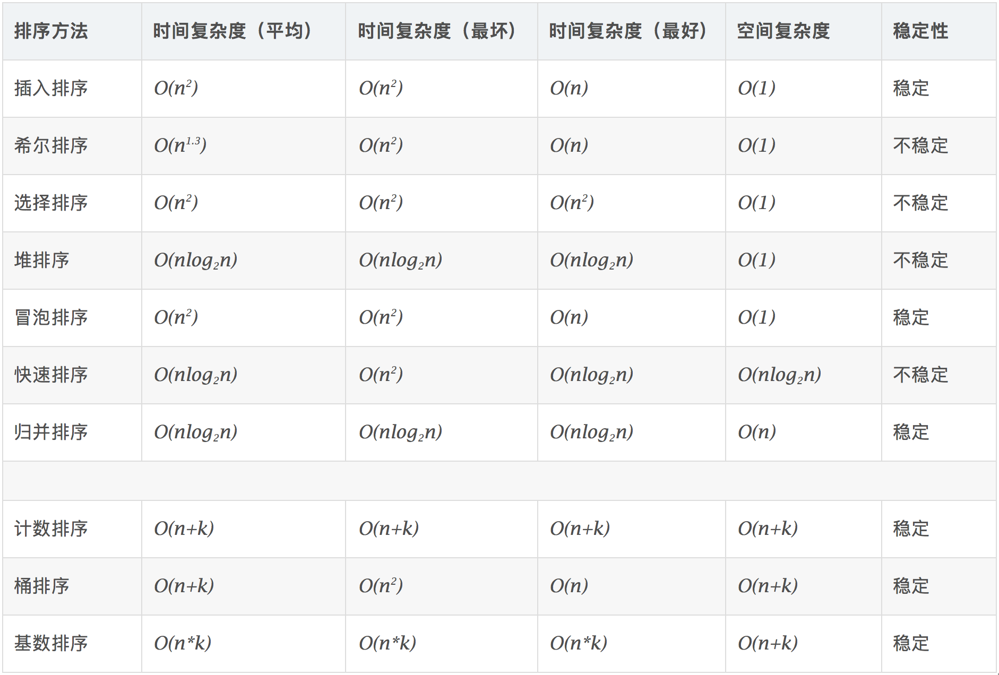
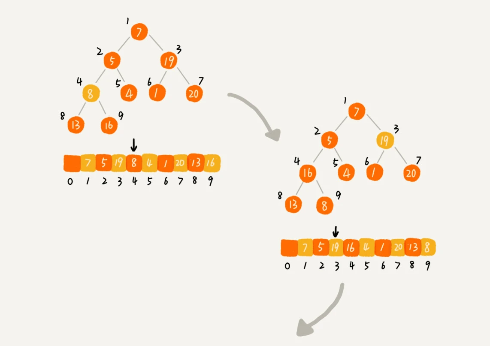
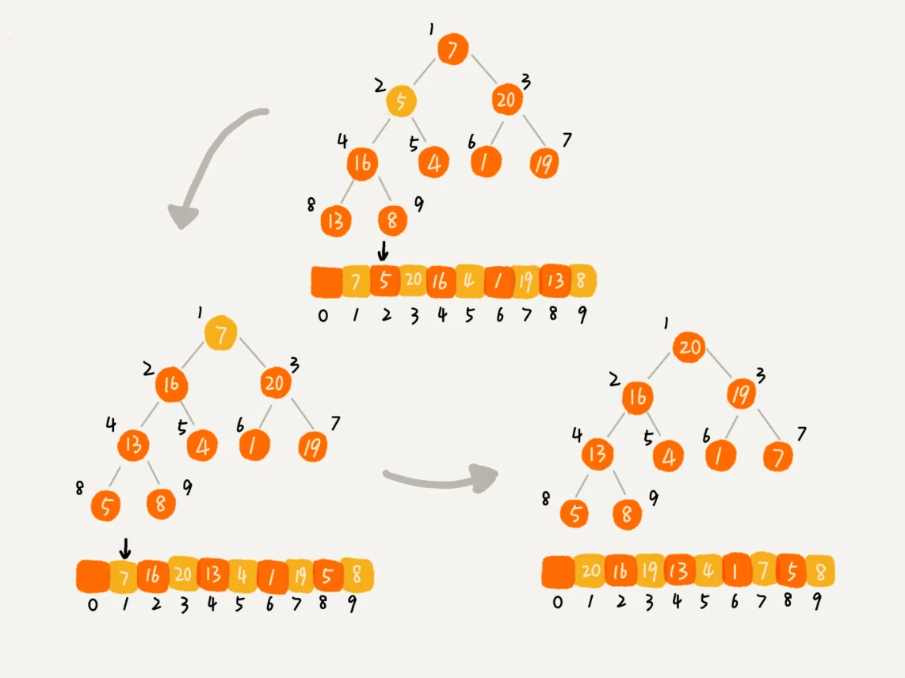
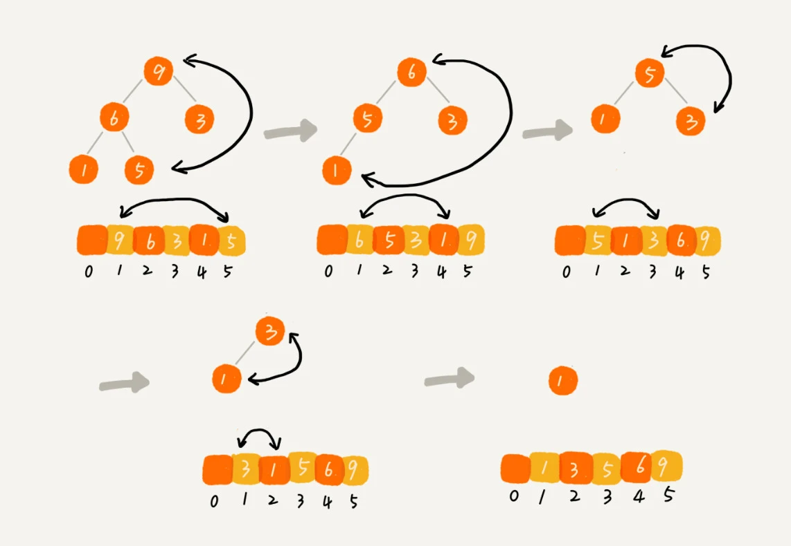

# 排序算法

- 排序
  - 比较类
    - 初级排序
      - 冒泡
      - 选择
      - 插入
    - 高级排序
      - 快速
      - 归并
  - 非比较
    - 计数排序
    - 桶排序
    - 基数排序



- 稳定性：即当 a = b 时，a 不需要发生位移，依旧在 b 的前面
- 原地排序：在原来数组基础上排序

## 初级排序 - O(n^2)

### 选择排序（Selection Sort）

每次找最小值，最后与待排序数组的起始位置交换。

```js
function selectionSort(nums) {
  for (let i = 0; i < nums.length; i++) {
    let min = i;
    for (let j = i + 1; j < nums.length; j++) {
      if (nums[min] > nums[j]) {
        min = j;
      }
    }

    let tmp = nums[i];
    nums[i] = nums[min];
    nums[min] = tmp;
  }

  return nums;
}
```

### 插入排序（Insertion Sort）

从前到后逐步构建有序序列；对于未排序数据，在已排序序列中从后
向前扫描，找到相应位置并插入。

```js
function insertionSort(nums) {
  for (let i = 1; i < nums.length; i++) {
    let tmp = nums[i];
    let j = i - 1;
    while (j >= 0 && tmp < nums[j]) {
      nums[i--] = nums[j--];
    }
    nums[i] = tmp;
  }
  return nums;
}
```

### 冒泡排序（Bubble Sort）

嵌套循环，每次查看相邻的元素如果逆序，则交换，每次冒泡后数组尾部第 i 个元素将排好序。

```js
function bubbelSort(nums) {
  for (let i = nums.length - 1; i > 0; i--) {
    for (let j = 0; j <= i; j++) {
      if (nums[j] > nums[j + 1]) {
        let tmp = nums[j];
        nums[j] = nums[j + 1];
        nums[j + 1] = tmp;
      }
    }
  }
  return nums;
}
```

## 高级排序 - O(N\*LogN) （重点掌握！）

### 快速排序（Quick Sort）

1. 数组取标杆 pivot，将小元素放 pivot 左边，大元素放右侧（重点练习），
2. 然后依次对左边和右边的子数组继续快排；以达到整个序列有序。

```js
function quickSort(arr, left, right) {
  if (left >= right) return arr;

  const index = partition(arr, left, right);
  quickSort(arr, left, index - 1);
  quickSort(arr, index + 1, right);
  return arr;
}

function partition(nums, left, right) {
    let pivot = right
    let i = 0
    // 分成两个区间：已处理、未处理，
    // 遍历选择一个小于 pivot 的元素，排到已处理区间的尾部
    for (let index = i; index < nums.length - 1; index++) {
        if(nums[index] < nums[pivot]) {
            [nums[index], nums[i]] = [nums[i], nums[index]]
            i++
        }
    }
    [nums[i], nums[pivot]] = [nums[pivot], nums[i]]

    return i
}

quickSort(nums, 0, nums.length - 1);
```

### 归并排序（Merge Sort）

> 归并排序不是原地排序算法，需要借助额外的存储空间

1. 把长度为 n 的输入序列分成两个长度为 n/2 的子序列；
2. 对这两个子序列分别采用归并排序；
3. 将两个排序好的子序列合并成一个最终的排序序列（合并两个有序数组！重点练习）。

```js
function mergeSort(nums) {
  if (nums.length <= 1) return nums;
  let mid = Math.floor(nums.length / 2);
  let left = nums.slice(0, mid);
  let right = nums.slice(mid);
  return merge(mergeSort(left), mergeSort(right));
}

function merge(left, right) {
  const result = [];
  let i = 0,
    j = 0;
  while (i < left.length && j < right.length) {
    result.push(left[i] < right[j] ? left[i++] : right[j++]);
  }

  while (i < left.length) {
    result.push(left[i++]);
  }

  while (j < right.length) {
    result.push(right[j++]);
  }

  return result;
}
```

### 堆排序（Heap Sort）

1. 利用系统自带的优先队列实现，分两大步骤依次入队和依次出队即可
2. 堆实现：堆化和排序

#### 堆实现：堆化和排序

1. 将数组堆化
   - 顺序建堆（从下往上堆化）
   - 逆序建堆（从上往下堆化） 

```js
// 从上往下堆化
// 对下标从 2n​ 开始到 1 的数据进行堆化，下标是 2n​+1 到 n 的节点是叶子节点，我们不需要堆化
private static void buildHeap(int[] a, int n) {
  for (int i = n/2; i >= 1; --i) {
    heapify(a, n, i);
  }
}

private static void heapify(int[] a, int n, int i) {
  while (true) {
    int maxPos = i;
    if (i*2 <= n && a[i] < a[i*2]) maxPos = i*2;
    if (i*2+1 <= n && a[maxPos] < a[i*2+1]) maxPos = i*2+1;
    if (maxPos == i) break;
    swap(a, i, maxPos);
    i = maxPos;
  }
}
```



 

2. 排序

交换堆顶和最后一个元素，从上而下堆化，size--，类似删除堆顶元素。


题目：[215. 数组中的第 K 个最大元素](https://leetcode-cn.com/problems/kth-largest-element-in-an-array/)。

## 特殊排序

### 计数排序（Counting Sort）