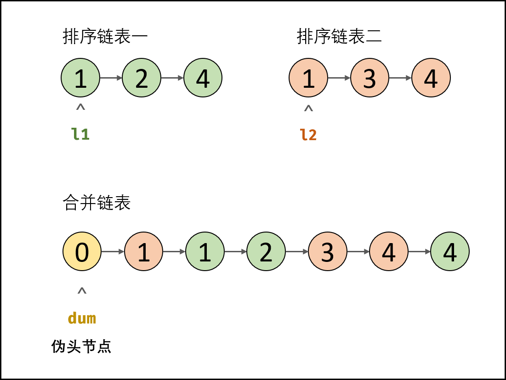

### 题目

https://leetcode-cn.com/problems/he-bing-liang-ge-pai-xu-de-lian-biao-lcof/

```javascript
/**
 * Definition for singly-linked list.
 * function ListNode(val) {
 *     this.val = val;
 *     this.next = null;
 * }
 */
/**
 * @param {ListNode} l1
 * @param {ListNode} l2
 * @return {ListNode}
 */
var mergeTwoLists = function(l1, l2) {
    let cur1 = l1
    let cur2 = l2
    let head = res = {
        next: null
    };

    while(cur1 && cur2) {
        if(cur1.val < cur2.val) {
            head.next = cur1;
            cur1 = cur1.next;
        } else {
            head.next = cur2;
            cur2 = cur2.next;
        }
      	head = head.next;
    }

    if(cur1) {
        head.next = cur1
    }

    if(cur2) {
        head.next = cur2
    }

    return res.next
};
```

###  总结



算法：遍历、双指针交替遍历

建议：空头链表，简化边界条件