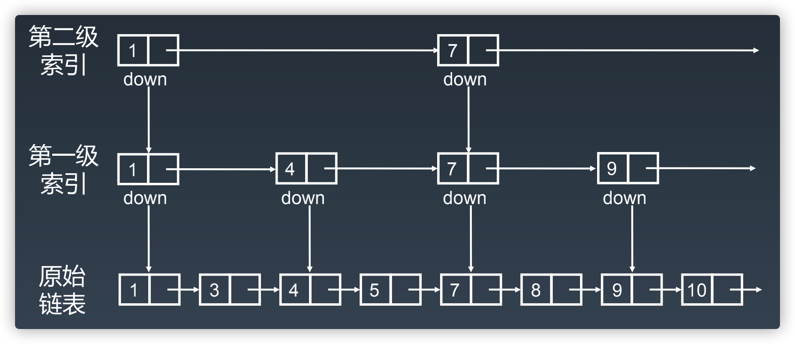

# 底层存储结构：数组、链表

数据结构种类很多，底层实现无非数组或者链表，但它们存在的目的都是在不同的应用场景合理组织数据，尽可能高效地查找、修改，也就是更好的空间换时间策略。

无论哪种（抽象）数据结构，在底层存储上只有两种结构：

- 数组
  - 数组（Array）是一种**线性表数据结构**。它用一组**连续**的内存空间，来存储一组具有**相同类型**的数据
    > - **线性表**：就是数据排成像一条线一样的结构。每个线性表上的数据最多只有前和后两个方向
    > - **非线性表**：数据之间并不是简单的前后关系
  - 由于是**紧凑连续存储和相同数据类型的存储结构**，所以数组可以随**机访问**，时间复杂度为 O(1)，可以通过索引快速找到对应元素。
  - 但查询某个元素是否存在时需要遍历整个数组，耗费 O(n) 的时间
  - 正因为连续存储，内存空间必须一次性分配够，所以说数组如果要扩容，需要重新分配一块更大的空间，再把数据全部复制过去，时间复杂度 O(N)
  - **你如果想在数组中间进行插入和删除，每次必须搬移后面的所有数据以保持连续，时间复杂度 O(N)**
  - 数组访问越界
- 链表：通过指针将一组零散的内存块串联在一起，每个链表的结点除了存储数据之外还要存储指针
  - 因为元素不连续，而是靠指针指向下一个元素的位置，所以不存在数组的扩容问题
  - 如果知道某一元素的前驱和后驱，**操作指针即可删除该元素或者插入新元素，时间复杂度 O(1)**
    - 插入、删除（O(1)）  
      - 插入：`x->next=c; b->next=x`
      - 删除：`a->next=b->next->next`
  - 因为存储空间不连续，你无法根据一个索引算出对应元素的地址，所以**不能随机访问，只能顺序访问，时间复杂度 O(n)**
  - 由于每个元素必须存储指向前或后元素位置的指针，会**消耗相对更多的储存空间**
  - 链表类别
    - 单链表  
    - 循环链表  
    - 双向链表  
    - 双向循环链表  
  - 链表技巧：使用**带头链表**防止空指针
    - 使用**带头链表**：简化操作，针对链表的插入、删除操作，需要对插入第一个结点和删除最后一个结点的情况进行特殊处理
  - 高级
    - [跳表](#跳表)

## 跳表

类似链表，查找操作如果需要加速，可以添加多级索引，变成跳表，以提升效率
思想推广一下就是，一维数据结构的某项操作如果需要加速，则可以进行升维，使其更多附加信息，以提升效率。
本质是空间换时间

