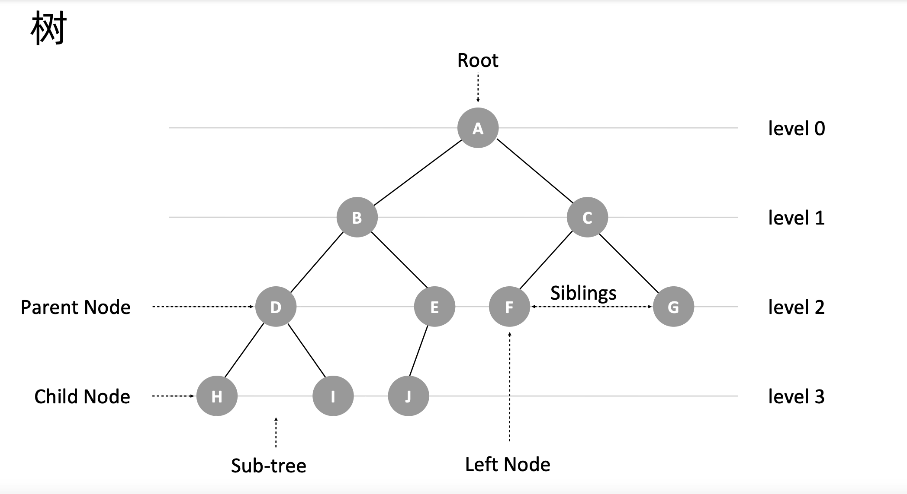

  
# 递归、分治、枚举、回溯、贪心、动态规划

## 递归

- 递归是一种应用非常广泛的编程技巧。**递归的本质就是循环**：通过函数体，**自己调自己**来进行的循环。
- 递归要素
  - 寻找**重复性**
  - **终止条件**
- 递归模板
  ```js
  function recursion(level, param1, param2, ...) {
  // 1. 终止条件
  // 2. 递归缓存返回（可选）
  // 3. 逻辑处理
  // 4. 递归调用
  // 5. 状态重置（可选）
  }
  ```
- 注意造成**堆栈溢出**
- 递归转循环（模拟栈）：递归本身就是借助栈来实现的，只不过我们使用的栈是系统或者虚拟机本身提供的，我们没有感知罢了。如果我们自己在内存堆上实现栈，手动模拟入栈、出栈过程，这样任何递归代码都可以改写成看上去不是递归代码的样子
- 抵制人肉递归

### 抵制人肉递归

写递归时最忌讳**人肉递归**，当我们在看到或者写递归时，我们要**避免不自觉得剖析递归过程**：把递归平铺展开，脑子里就会循环，一层一层往下调，然后再一层一层返回，试图想搞清楚计算机每一步都是怎么执行的，这样就很容易被绕进去。因此我们在写递归的时候**只需要关注重复的问题本身**以及如何把**原问题与子问题的递归关系**即可，而不需要过分关注这个子问题是如何被解决的。

题目 [翻转二叉树](https://leetcode-cn.com/problems/invert-binary-tree/description/)，树的结构定义中其节点都是**相同的**，所以树的问题一般都适合采用递归的形式。对于翻转二叉树，我们只需把当前节点的左右子节点对调，并且深度遍历每个子节点即可。

  

```js
var invertTree = function (root) {
    if (!root) {
        return null
    }

    [root.right, root.left] = [invertTree(root.left), invertTree(root.right)]

    return root
};
```

## 分治

分治思想，即**分而治之**，形式上分为**拆分问题、独立处理、合并结果**。

在计算机科学中体现为**分治法**（英语：Divide and conquer）：一种基于**多项分支递归**的一种很重要的**算法范型**。具体上就是将原问题划**分**成 n 个规模较小，并且结构与原问题相似的子问题，如果分割后的问题**仍然无法直接解决**，那么就继续分割子问题，直到每个小问题都可解，然后再合并其结果，就得到原问题的解。

> 分治思想更多的是一种“拆分”问题的解决思路 🤔。而其分治法模型未必就高效，但分治法是很多高效算法的基础，如归并排序、快速排序。关键在于子问题合并上优化复杂度，否则就起不到减小算法总体复杂度的效果了

分治法在每轮递归上，都包含了分解问题、解决问题和合并结果这 3 个步骤：

1. 分解：将原问题分解成一系列子问题；
2. 解决：递归地求解各个子问题，若子问题足够小，则直接求解，无需再分；
3. 合并：将子问题的结果合并成原问题

  

子问题特点：分治法中原问题所分解出的各个子问题是相互**独立**的，即子问题之间不包含公共的子问题，**没有重叠子问题，这一点是分治算法跟动态规划的明显区别**。

## 枚举、回溯、贪心、动态规划

> leetcode 题目[《零钱兑换》](https://leetcode.cn/problems/coin-change/)

给你一个整数数组 coins ，表示不同面额的硬币；以及一个整数 amount ，表示总金额。  
计算并返回可以凑成总金额所需的**最少**的硬币个数 。如果没有任何一种硬币组合能组成总金额，返回 -1 。

```
输入：coins = [1, 2, 5], amount = 11
输出：3 
解释：11 = 5 + 5 + 1
```

枚举思想：面对最值问题（求最大、最小、最优之类）的求解，本质上还是需要进行穷举，即**枚举所有的可能解的组合，从所有候选答案中去选择正确的解**。那么如何进行穷举？

### 回溯

我们枚举所有的解，找到满足期望的解。为了有规律地枚举所有可能的解，避免遗漏和重复，我们采用试错的方式，把问题求解的过程分为多个阶段。每个阶段，我们都会面对一个岔路口，我们先随意选一条路尝试，当发现这条路走不通的时候（不符合期望的解），就“回溯”到上一个岔路口，选择另选一种走法继续走，这就是回溯算法思想，**回溯算法本质上就是一种暴力的穷举搜索算法**。

针对上面题目，我们每次从 `[1, 2, 5]` 中选择出不同的数组合出刚好符合条件的结果。

  

在这个过程中，我们不断构建了一颗“状态”树，搜索接近**问题状态**的树。我们将问题转成树结构的思维模式，我们只需要对这颗状态树进行**遍历**即可。

回溯算法非常适合用深度优先遍历的递归方式实现，因为这种形式赋予了回溯这种可以回退一步的能力：它通过堆栈保存了上一步的当前状态。

回溯算法的框架：

```py
// python 示例
result = []
def backtrack(路径, 选择列表):
    if 满足结束条件:
        result.add(路径)
        return
    
    for 选择 in 选择列表:
        做选择
        backtrack(路径, 选择列表)
        撤销选择
```

本题目用回溯解法如下：

```js
// javascript
var coinChange = function (coins, amount) {
    const result = []
    dfs(coins, amount, result)
    return Math.min(...result)
}
function dfs(coins, amount, result, target = 0, count = 0) {
    if (target >= amount) {
        return result.push(count)
    }

    for (const c of coins) {
        dfs(coins, amount, result, target + c, count + 1)
    }
}
```

回溯算法是个暴力算法，指数级复杂度，因为需要遍历、枚举所有情况。不过回溯算法可以使用剪枝优化，即剪去一些不可能到达最终状态（即答案状态）的节点，从而减少状态空间树节点的生成。常见**剪枝优化**操作有：

- 备忘录/记忆化搜索
- 可行性剪枝：当搜索到某个状态时，如果发现这个状态不能产生解，就可以剪去这个状态及其子树
- 最优性剪枝：当搜索到某个状态时，如果已经找到了一条更优的解，就可以剪去这个状态及其子树
- 启发式剪枝：根据问题的特点，设计相应的启发式函数，用来评估某个状态是否有可能产生解，从而减少搜索空间

### 动态规划

- 计算机的本质是一个状态机，内存里存储的所有数据构成了当前的状态，CPU 只能利用当前的状态计算出下一个状态。当你企图使用计算机解决一个问题时，其实就是在思考如何将这个问题表达成状态（用哪些变量存储哪些数据）以及如何在状态中转移（怎样根据一些变量计算出另一些变量）
- 重点在于如何鉴定“某一类问题”是动态规划可解的而不是纠结解决方法是递归还是递推！
  - 普通递推
    - 只递推出单个状态
  - 分解问题成阶段
- 所谓阶段是指随着问题的解决，在同一个时刻可能会得到的不同状态的集合
- 假如问题有n个阶段，每个阶段都有多个状态，不同阶段的状态数不必相同，一个阶段的一个状态可以得到下个阶段的所有状态中的几个。那我们要计算出最终阶段的状态数自然要经历之前每个阶段的某些状态。
- 既然问题都是可以划分成阶段和状态的。这样一来我们一下子解决了一大类问题：一个阶段的最优可以由前一个阶段的最优得到。
- 如果一个阶段的最优无法用前一个阶段的最优得到呢？
  - 回溯
  - 再来一个迷宫的例子。在计算从起点到终点的最短路线时，你不能只保存当前阶段的状态，因为题目要求你最短，所以你必须知道之前走过的所有位置。因为即便你当前再的位置不变，之前的路线不同会影响你的之后走的路线。这时你需要保存的是之前每个阶段所经历的那个状态，根据这些信息才能计算出下一个状态
  - 每个阶段的状态或许不多，但是每个状态都可以转移到下一阶段的多个状态，所以解的复杂度就是指数的，因此时间复杂度也是指数的。
- 刚刚提到的之前的路线会影响到下一步的选择，这个令人不开心的情况就叫做有后效性。
- 因此第i个阶段的最优解只是由前i-1个阶段的最优解得到的，然后就得到了DP方程（感谢
- 为什么最优
  - 每个阶段产生多个状态


- 动态规划
  - 动态规划则是一种将原问题**分解成子问题**来求解的方法思想，且问题具有最优子结构和重叠子问题特征
    - 最优子结构：可以通过子问题的最优解推导出原问题的最优解
      - **我们需要分析出“最优子结构”，从而推导找出状态转移方程**：计算机的本质是一个状态机，内存里存储的所有数据构成了当前的状态，CPU 只能利用当前的状态计算出下一个状态。当你企图使用计算机解决一个问题时，其实就是在思考如何将这个问题表达成状态（用哪些变量存储哪些数据）以及如何在状态中转移（怎样根据一些变量计算出另一些变量）
      - 重叠子问题 =》 最优
    - 重叠子问题
      - 动态规划和分治算法的区分：分治算法要求分割成的子问题，不能有重复子问题，而动态规划正好相反，动态规划之所以高效，就是因为回溯算法实现中存在大量的重复子问题
      - 同一个子问题会被计算多次
  - 通过保存已经计算过的子问题的解，避免重复计算，提高计算效率。
  - 适合场景
    - 多阶段决策最优解模型
      - 回溯
      - 贪心
      - 动态规划
      - 后面阶段的状态可以通过前面阶段的状态推导出来


DP为什么会快？
　　无论是DP还是暴力，我们的算法都是在可能解空间内，寻找最优解
DP是枚举有希望成为答案的解
在暴力算法中，可能解空间往往是指数级的大小；如果我们采用DP，那么有可能把解空间的大小降到多项式级。

设计状态是DP的基础。接下来的设计转移，有两种方式：一种是考虑我从哪里来（本文之前提到的两个例子，都是在考虑“我从哪里来”）；另一种是考虑我到哪里去，这常见于求出f(x)之后，更新能从x走到的一些解。这种DP也是不少的，我们以后会遇到

**动态规划本质上是针对某一类问题上递推的应用**，对**问题状态的定义**和**状态转移方程的定义**是动态规划的核心。

当一个问题的解需要分 n 个阶段，每个阶段会得到的不同状态的集合，一个阶段的一个状态可以得到下个阶段的所有状态中的几个，所以解的复杂度就是指数的，因此时间复杂度也是指数的。那我们要计算出最终阶段的状态数自然要经历之前每个阶段的某些状态。

有时候我们并不需要真的计算所有状态

我们一般是用动态规划来解决最优问题。而解决问题的过程，需要经历多个决策阶段。每个决策阶段都对应着一组状态。然后我们寻找一组决策序列，经过这组决策序列，能够产生最终期望求解的最优值

备忘录、DP table 就是在追求“如何聪明地穷举”。用空间换时间的思路

动态规划比较适合用来求解**最优问题**

- 这就是一种用动态规划解决问题的思路。我们把问题分解为多个阶段，每个阶段对应一个决策。我们记录每一个阶段可达的状态集合（去掉重复的），然后通过当前阶段的状态集合，来推导下一个阶段的状态集合，动态地往前推进
- 回溯+备忘录
- 动态规划
- 大部分动态规划能解决的问题，都可以通过回溯算法来解决，只不过回溯算法解决起来效率比较低，时间复杂度是指数级的。动态规划算法，在执行效率方面，要高很多。尽管执行效率提高了，但是动态规划的空间复杂度也提高了，所以，很多时候，我们会说，动态规划是一种空间换时间的算法思想
- 动态规划适合解决的问题的模型。我把这个模型定义为“多阶段决策最优解模型”
  - 我们一般是用动态规划来解决最优问题。而解决问题的过程，需要经历多个决策阶段。每个决策阶段都对应着一组状态。然后我们寻找一组决策序列，经过这组决策序列，能够产生最终期望求解的最优值


    - 无后效性
      - 在推导后面阶段的状态的时候，我们只关心前面阶段的状态值，不关心这个状态是怎么一步一步推导出来的
      - 子问题之间的依赖是单向性的，某阶段状态一旦确定，就不受后续决策的影响
    - 重复子问题：在穷举的过程中（比如通过递归），存在重复计算的现象
  - 关键
    - 状态定义
      - 问题状态x，求问题结果f(x)
    - 决策：能让状态发生变化的选择
      - 做决策 => 产生状态转移 => 状态转移方程
      - 改变状态，让状态不断逼近初始化状态的操作。这个决策，就是状态转移方程状态转移的方向
    - 状态转移方程
      - 最优子结构：子问题的最优解能够推导原问题的最优解，这样就不会反复回溯到子问题求解
      - 本质：递推关系
        - 将问题分解成子问题，找重复性，找到如何将大问题分解为小问题的规律，并且基于此写出递推公式，然后再推敲终止条件，最后将递推公式和终止条件翻译成代码。
        - **归纳法**
      - 状态转移
        - 我从哪里来？
      　　我要到哪里去？
  - 解法
    - 回溯 + 备忘录：从执行效率上来讲，这跟动态规划的解决思路没有差别
    - 状态转移表法、填表法
      - 回溯算法实现 - 定义状态 - 画递归树 - 找重复子问题 - 画状态转移表 - 根据递推关系填表 - 将填表过程翻译成代码
    - 状态转移方程法：找最优子结构 => 写状态转移方程
      - 递归 + 备忘录
      - 递推 + DP 表
- 和常规递推有什么区别
  - 递推是一种解决问题的具体实现方法，而动态规划是将一个问题转换为递推方式解决的算法思路

  - 我理解的动态规划，就是从全遍历的递归树为出发点，广度优先遍历，在遍历完每一层之后对每层结果进行合并（结果相同的）或舍弃（已经超出限制条件的），确保下一层遍历的数量不会超过限定条件数完W，通过这个操作达到大大减少不必要遍历的目的。
  在空间复杂度优化上，通过在计算中只保留最优结果的目的重复利用内存空间。
- 动态规划与回溯区别
  - why dp 效率更高
    - 动态规划是一个阶段一个阶段从前往后进行决策的,但是回溯+备忘录并不是从前往后,而是一条路走到头再回来重新走,如果仅仅考虑去重的话,两者效率几乎一致,甚至回溯更省空间;但是如果考虑重复的话有覆盖的可能,则极端情况下回溯+备忘录的效率和直接回溯穷举的效率是一样的,但是动态规划此时依然和考虑去重时的效率一致,不会退化


那为什么动态规划会比回溯更高效：

- 回溯算法需要暴力搜索出所有可能结果，再从中搜索出正确答案
- 对重复子问题进行最优截断
- 动态规划会记录中间阶段

- 最优
- 推倒

能用动态规划解决的问题，需要满足三个特征，最优子结构、无后效性和重复子问题：


1. 无后效性：子问题之间的依赖是单向性的，某阶段状态一旦确定，就不受后续决策的影响。
2. 重叠子问题


2.贪心思考的是：下一步最优是从当前最优得到的
3.动规思考的是：当前位置最优“子问题”。子问题表现为一种结构，不是直接的结果
4.递推的技巧：只考虑“一步”，并从中定义出子问题


题目的状态转移方程如下：

```
f(n) = Math.min(f(n - 1), f(n - 2), f(n - 5)) + 1
```

含有备忘录的递归写法已经与动态规划从效率上说基本相差无几，即都是消除重叠子问题的重复计算。但它离我们日常看到的动态规划还有差距，可以说：

带备忘录的递归解法使用的是自顶向下的处理方式来解题，可以说：

- 带备忘录的递归：自顶向下模型
- 动态规划：是一种递推方式，自底向上模型

递归写法：

```js
var coinChange = function (coins, amount) {
    return dfs(coins, amount, 0)
};
var temp = {}
function dfs(coins, amount, level = 0) {
    if (amount === 0) return level

    if (temp[amount]) return temp[amount]

    let min = Infinity
    for (const c of coins) {
        let _amount = amount - c
        if (_amount >= 0) {
            temp[amount] = dfs(coins, _amount, level + 1)
            min = Math.min(min, temp[amount])
        }
    }

    return min === Infinity ? -1 : min
}
```

递推写法：

```js
var coinChange = function (coins, amount) {
    if (amount === 0) return 0

    let i = 1;
    let temp = coins.reduce((obj, key) => (obj[key] = 1, obj), {})
    while (i <= amount) {
        temp[i] ??= Math.min(...coins.map(c => (temp[i - c] ??= Infinity))) + 1
        i++
    }

    return temp[amount] === Infinity ? -1 : temp[amount]
};
```

## 总结

- 递归是一种**循环**技巧，关键在于**找重复性**
- 

分治、贪心、回溯、动态规划可以归为一类，而分治单独可以作为一类，因为它跟其他三个都不大一样。为什么这么说呢？前三个算法解决问题的模型，都可以抽象成**多阶段决策最优解模型**，而分治算法解决的问题尽管大部分也是最优解问题，但是，大部分都不能抽象成多阶段决策模型。

多阶段决策最优解模型：解决问题的过程，需要经历多个决策阶段。每个决策阶段都对应着一组状态，然后通过当前阶段的状态集合，来推导下一个阶段的状态集合，经过一组决策序列，能够产生最终期望求解的最优值。


- 回溯算法是个“万金油”。基本上能用的动态规划、贪心解决的问题，我们都可以用回溯算法解决。回溯算法相当于穷举搜索。穷举所有的情况，然后对比得到最优解。不过，回溯算法的时间复杂度非常高，是指数级别的，只能用来解决小规模数据的问题。对于大规模数据的问题，用回溯算法解决的执行效率就很低了
  
  - 尽管动态规划比回溯算法高效，但是，并不是所有问题，都可以用动态规划来解决。能用动态规划解决的问题，需要满足三个特征，最优子结构、无后效性和重复子问题。在重复子问题这一点上，动态规划和分治算法的区分非常明显。分治算法要求分割成的子问题，不能有重复子问题，而动态规划正好相反，动态规划之所以高效，就是因为回溯算法实现中存在大量的重复子问题。
  - 所有贪心的思路就是我们最优化求解的根本思想，所有的方法只不过是针对贪心思路的改进和优化而已。回溯解决的是正确性问题，而动态规划则是解决时间复杂度的问题,即消除重叠子问题的重复计算。
  
  - 贪心算法实际上是动态规划算法的一种特殊情况。它解决问题起来更加高效，代码实现也更加简洁。不过，它可以解决的问题也更加有限。它能解决的问题需要满足三个条件，最优子结构、无后效性和贪心选择性（这里我们不怎么强调重复子问题）。
  - 其中，最优子结构、无后效性跟动态规划中的无异。“贪心选择性”的意思是，通过局部最优的选择，能产生全局的最优选择。每一个阶段，我们都选择当前看起来最优的决策，所有阶段的决策完成之后，最终由这些局部最优解构成全局最优解。

## 学习参考

- [回溯算法解题套路框架](https://labuladong.gitee.io/algo/1/8/)
- [动态规划解题套路框架](https://labuladong.gitee.io/algo/3/25/69/)
- 极客专栏《数据结构与算法之美》
- [什么是动态规划（Dynamic Programming）？动态规划的意义是什么？ - 阮行止的回答 - 知乎](https://www.zhihu.com/question/23995189/answer/613096905)
- [什么是动态规划（Dynamic Programming）？动态规划的意义是什么？ - 王勐的回答 - 知乎](https://www.zhihu.com/question/23995189/answer/35429905)