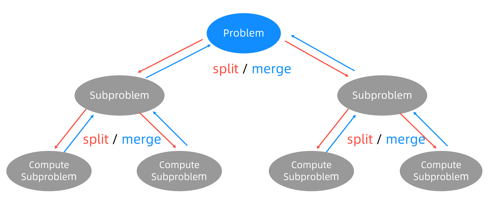
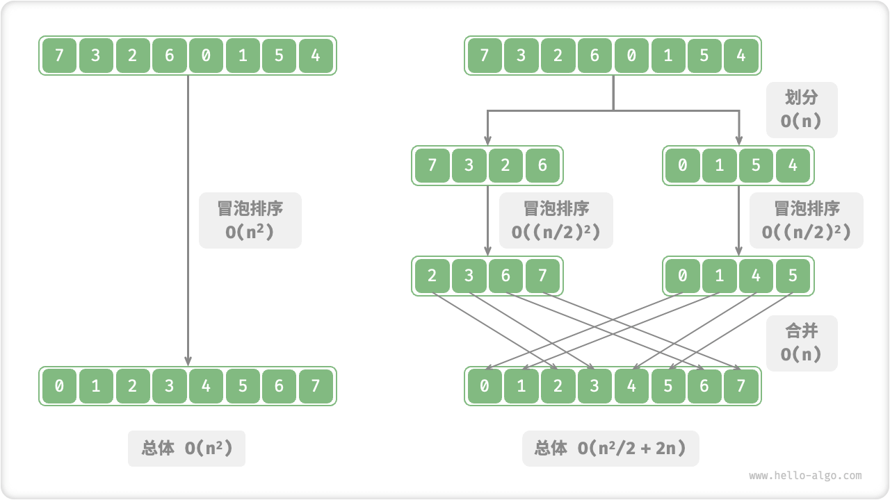
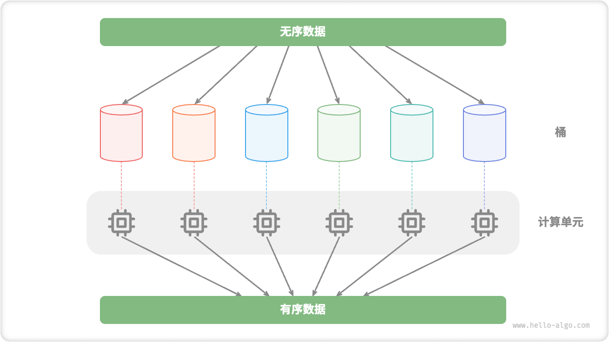
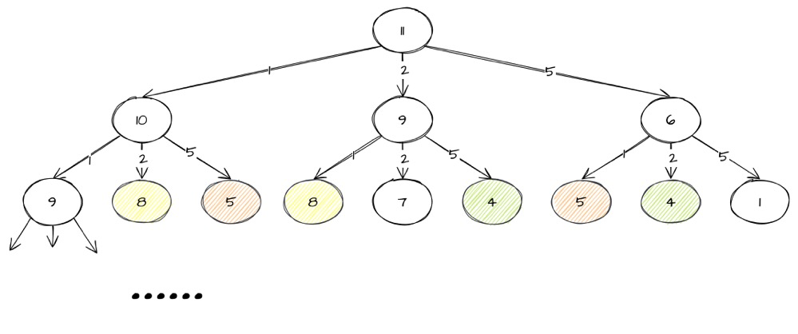

# 递归、分治、枚举、回溯、贪心、动态规划

## 递归

- 递归是一种应用非常广泛的编程技巧。**递归的本质就是循环**：通过函数体进行自我调用
  - 递归要素
    - 寻找**重复性**，能够不断把**大问题缩小成小问题（数据规模更小的相似问题）**进行推导的规律
    - 递归终止条件
  - 递归模板
    ```js
    function recursion(level, param1, param2, ...) {
    // 1. 终止条件
    // 2. 递归缓存（可选）
    // 3. 逻辑处理
    // 4. 递归调用
    // 5. 状态重置（可选）
    }
    ```
  - 注意
    - 堆栈溢出
    - 重复计算
  - 递归转迭代：模拟栈
- **抵制人肉递归**：计算机擅长做重复的事情，所以递归正合它的胃口。而我们人脑更喜欢平铺直叙的思维方式。当我们看到递归时，我们总想把递归平铺展开，脑子里就会循环，一层一层往下调，然后再一层一层返回，试图想搞清楚计算机每一步都是怎么执行的，这样就很容易被绕进去

## 分治

分治，即**分而治之**。在算法中为**分治法**（英语：Divide and conquer）：一种基于**多项分支递归**的一种很重要的**算法范型**，具体上就是：

- 分（划分阶段）：将原问题划**分**成 n 个规模较小，并且结构与原问题相似的子问题，如果分割后的问题**仍然无法直接解决**，那么就继续递归子问题，直到每个小问题都可解为止
- 治（合并阶段）：至底向上合并每个子问题的结果，直到到原问题的解



- 分治思想更多的是一种“拆分”问题的解决思路 🤔。而其分治法模型未必就高效，但分治法是很多高效算法的基础：
  - 操作数量优化  
  - 并行计算优化    
- 可以看的出，**关键在于子问题处理及合并上优化复杂度**，否则就起不到减小算法总体复杂度的效果了
- 分治法中原问题所分解出的各个子问题是相互**独立**的，没有重叠子问题即不包含重复数据，这一点是分治算法跟动态规划的明显区别

## 枚举、回溯、贪心、动态规划

> leetcode 题目[《零钱兑换》](https://leetcode.cn/problems/coin-change/)

给你一个整数数组 coins ，表示不同面额的硬币；以及一个整数 amount ，表示总金额。  
计算并返回可以凑成总金额所需的**最少**的硬币个数 。如果没有任何一种硬币组合能组成总金额，返回  -1 。

```
输入：coins = [1, 2, 5], amount = 11
输出：3
解释：11 = 5 + 5 + 1
```

### 枚举

面对最值问题（求最大、最小、最优之类）的求解，本质上还是需要进行穷举（枚举算法），即**直接暴力枚举所有的可能解，从所中选择满足条件的解**。

### 回溯

回溯算法，一种采用试错思想来避免不必要搜索的穷举式的搜索算法。

在搜索过程中，分为多个阶段，每个阶段我们都会面对一个分岔路口，我们先随意选一条路**尝试**，当发现这条路走不通的时候（不符合期望的解），就**回退**到上一个岔路口，选择另选一种走法继续走。

回溯算法通常采用“深度优先搜索”来遍历解空间，因为这种形式赋予了回溯这种可以回退一步的能力：它通过堆栈保存了上一步的当前状态。

针对上面题目，我们每次从 `[1, 2, 5]` 中选择出不同的数组合出刚好符合条件的结果。



在这个过程中，我们不断构建解空间，一颗“状态”树，搜索接近**问题状态**的树。我们将问题转成树结构的思维模式，我们只需要对这颗状态树进行**遍历**即可。

回溯算法的框架：

```py
// python 示例
result = []
def backtrack(路径, 选择列表):
    if 满足结束条件:
        result.add(路径)
        return

    for 选择 in 选择列表:
        做选择
        backtrack(路径, 选择列表)
        撤销选择，恢复到之前的状态
```

本题目用回溯解法如下：

```js
// javascript
var coinChange = function (coins, amount) {
  const result = [];
  dfs(coins, amount, result);
  return Math.min(...result);
};
function dfs(coins, amount, result, target = 0, count = 0) {
  if (target >= amount) {
    return result.push(count);
  }

  for (const c of coins) {
    dfs(coins, amount, result, target + c, count + 1);
  }
}
```

回溯算法本质上是一种穷举，尝试所有可能的解决方案直到找到满足条件的解，时间复杂度可以达到指数级，因为需要遍历、枚举所有情况。不过在搜索过程可以使用剪枝优化，即剪去一些不可能到达最终状态（即答案状态）的节点，从而减少状态空间树节点的生成。常见**剪枝优化**操作有：

- 备忘录/记忆化搜索
- 可行性剪枝：当搜索到某个状态时，如果发现这个状态不能产生解，就可以剪去这个状态及其子树
- 最优性剪枝：当搜索到某个状态时，如果已经找到了一条更优的解，就可以剪去这个状态及其子树
- 启发式搜索：在搜索过程中引入一些策略或者估计值，从而优先搜索最有可能产生有效解的路径

## 动态规划

- 动态规划
  - 动态规划是一种**子问题分解来求解原问题**的思路
  - **重叠子问题**：动态规划和分治算法同样是问题分解，但分治算法不能有重叠子问题。动态规划之所以高效，就是因为存在大量的重叠子问题可以进行缓存优化
  - **无后效性**：给定一个确定的状态，它的未来发展只与当前状态有关，而与当前状态过去所经历过的所有状态无关
    - 动态规划原意是一种解决多阶段决策过程最优化问题的数学方法（**多阶段决策最优解模型**）
    - “阶段”意味着每个阶段都会产生多个状态，一个阶段的一个状态可以得到下个阶段的某几个状态，而下个阶段的某个状态可以由上个阶段的某些状态得到
    - 我们把原问题拆分成多个子阶段问题，某个阶段的子问题只能由前面阶段更小的子问题的解得到
  - 动态规划常用来求解**最优问题**。通过子问题的最优解来推导出原问题的最优解，也就是**最优子结构**
- 求解思路
  - 问题判断
    - 三大
    - 决策树模型
    - 问题包含最大（小）或最多（少）等最优化描述
  - 定义问题状态：思考如何将这个问题表达成状态，比如当问题状态 x 条件下，求问题结果 f(x)
  - 寻找决策，得出状态转移方程
    - 做决策 => 产生状态转移 => 状态转移方程
    - 决策：能让状态发生变化的选择
    - 递归、分解问题
    - 数学归纳法
  - 状态转移
    - 自顶向下模型：记忆化递归（分解问题思路）
    - 自底向上模型：定义 dp 表，从初识状态转移填表，从最小子问题的解开始，迭代地构建更大子问题的解，直至得到原问题的解


贪心思考的是：下一步最优是从当前最优得到的
  3.动规思考的是：当前位置最优“子问题”。子问题表现为一种结构，不是直接的结果


题目的状态转移方程如下：

```
f(n) = Math.min(f(n - 1), f(n - 2), f(n - 5)) + 1
```

递归写法：

```js
var coinChange = function (coins, amount) {
  return dfs(coins, amount, 0);
};
var temp = {};
function dfs(coins, amount, level = 0) {
  if (amount === 0) return level;

  if (temp[amount]) return temp[amount];

  let min = Infinity;
  for (const c of coins) {
    let _amount = amount - c;
    if (_amount >= 0) {
      temp[amount] = dfs(coins, _amount, level + 1);
      min = Math.min(min, temp[amount]);
    }
  }

  return min === Infinity ? -1 : min;
}
```

递推写法：

```js
var coinChange = function (coins, amount) {
  if (amount === 0) return 0;

  let i = 1;
  let temp = coins.reduce((obj, key) => ((obj[key] = 1), obj), {});
  while (i <= amount) {
    temp[i] ??= Math.min(...coins.map((c) => (temp[i - c] ??= Infinity))) + 1;
    i++;
  }

  return temp[amount] === Infinity ? -1 : temp[amount];
};
```

## 总结


分治、贪心、回溯、动态规划可以归为一类，而分治单独可以作为一类，因为它跟其他三个都不大一样。为什么这么说呢？前三个算法解决问题的模型，都可以抽象成**多阶段决策最优解模型**，而分治算法解决的问题尽管大部分也是最优解问题，但是，大部分都不能抽象成多阶段决策模型。


- 回溯算法是个“万金油”。基本上能用的动态规划、贪心解决的问题，我们都可以用回溯算法解决。回溯算法相当于穷举搜索。穷举所有的情况，然后对比得到最优解。不过，回溯算法的时间复杂度非常高，是指数级别的，只能用来解决小规模数据的问题。对于大规模数据的问题，用回溯算法解决的执行效率就很低了


  - 所有贪心的思路就是我们最优化求解的根本思想，所有的方法只不过是针对贪心思路的改进和优化而已。回溯解决的是正确性问题，而动态规划则是解决时间复杂度的问题,即消除重叠子问题的重复计算。


“贪心选择性”的意思是，通过局部最优的选择，能产生全局的最优选择。每一个阶段，我们都选择当前看起来最优的决策，所有阶段的决策完成之后，最终由这些局部最优解构成全局最优解。

## 学习参考

- [回溯算法解题套路框架](https://labuladong.gitee.io/algo/1/8/)
- [动态规划解题套路框架](https://labuladong.gitee.io/algo/3/25/69/)
- 极客专栏《数据结构与算法之美》
- [什么是动态规划（Dynamic Programming）？动态规划的意义是什么？ - 阮行止的回答 - 知乎](https://www.zhihu.com/question/23995189/answer/613096905)
- [什么是动态规划（Dynamic Programming）？动态规划的意义是什么？ - 王勐的回答 - 知乎](https://www.zhihu.com/question/23995189/answer/35429905)
