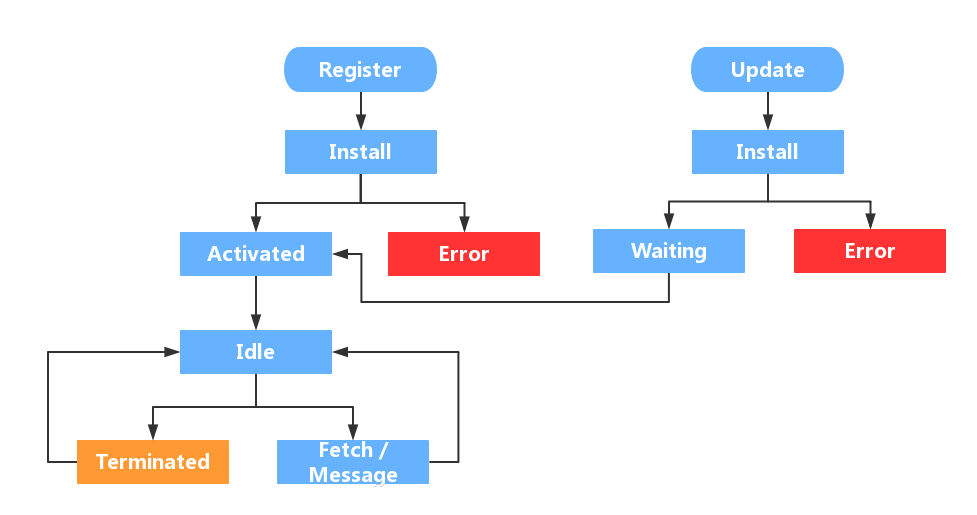

# PWA

- PWA：渐进式 Web 应用程序，是一系列技术集合
  - [Manifest](https://developer.mozilla.org/zh-CN/docs/Web/Manifest)
  - [Service Worker](#service-worker)
  - 离线存储 CacheStorage
  - Notification
  - Push Message
  - 后台同步
    - https://github.com/web-push-libs/web-push
- PWA 实践
  - 设计标准
    - 移动优先、响应式设计
    - 渐进增强，功能检测
      - 使用 `@supports` 检查浏览器是否支持 CSS 功能
      - 发布现代 JavaScript，您可以使用 module/nomodule 模式
    - 提供快速且良好的用户体验
      - Web Vitals 
        - 加载中
        - 交互的
        - 视觉稳定性
  - 应用分发与安装
    - 分发
      - 应用商城
      - Web 搜素
    - Manifest + 离线模式
      - 图标
      - 主题
        - 主题颜色
        - 背景颜色
        - 强调色
  - 应用更新
    - 更新类型
      - Manifest
      - 应用程序数据
      - [Service Worker 实践](#service-worker-实战)
        - 版本管理
        - 资源缓存
      - 提供离线体验
    - 更新提醒
      - 使用 DOM 或画布 API在屏幕上呈现通知
      - Message push
      - 图标提示：[Badging API](https://developer.mozilla.org/en-US/docs/Web/API/Badging_API)

## Service Worker

- 安全限制：HTTPS/localhost
- 服务范围
  - 默认下由 SW 文件路径决定其控制范围
    - 比如 `//example.com/foo/sw.js` 它的默认范围是 `//example.com/foo/`
  - 手动作用域设置
    - `navigator.serviceWorker.register('sw.js', {scope: xxx})`
    - HTTP 响应设置 Service-Worker-Allowed 头部
  - `navigator.serviceWorker.controller` 获取当前作用域的 Service Worker 实例
  - **作用域冲突**
    - 每个范围只允许一个 ServiceWorker 实例
    - 子域注册的服务会优先于父域的服务
- [生命周期](#生命周期)
- [SW 更新](#sw-更新)

### 生命周期



- 注册：`navigator.serviceWorker.register()` 下载、解析、执行 Service Worker
  ```js
  if ('serviceWorker' in navigator) {
    navigator.serviceWorker.register("/serviceworker.js");
  }
  ```
- 安装：激活 `install` 事件（首次安装、更新安装时触发）
  - `event.waitUntil()` 延迟安装完成
  - 安装阶段通常是实现预缓存方案
    ```js
    // /sw.js
    self.addEventListener("install", (event) => {
      const cacheKey = "MyFancyCacheName_v1";

      event.waitUntil(
        caches.open(cacheKey).then((cache) => {
          // Add all the assets in the array to the 'MyFancyCacheName_v1'
          // `Cache` instance for later use.
          return cache.addAll([
            "/css/global.bc7b80b7.css",
            "/css/home.fe5d0b23.css",
            "/js/home.d3cc4ba4.js",
            "/js/jquery.43ca4933.js",
          ]);
        })
      );
    });
    ```
- 等待：安装成功后，如果没用旧版本在运行就会直接激活，否则新版便会进入等待状态，除非
  - 旧版本 Service Worker 控制下的页面全部关闭，重启页面
  - 强制跳过等待 `self.skipWaiting()`
- 激活：触发 `activate` 事件
  - 首次注册激活时，已打开的页面只有在刷新后才会受控，可以强制控制页面 `self.clients.claim()`
  - 激活后对旧缓存进行清理
- 监听事件
  - `fetch`
    ```js
    // fetch event handler in your service worker file
    self.addEventListener("fetch", event => {
        // 可以创建新的响应或者从缓存中响应
        const response = .... // a response or a Promise of response
        event.respondWith(response);
    });
    ```
  - `push`
  - `sync`
  - `notification`
  - `periodic-sync`
- 终止
- 废弃
  - 安装失败
  - 激活失败
  - 用户执行了注销操作 `registration.unregister();`
  - 新版本的 Service Worker 替换了旧版本

### SW 更新

- 更新检查触发
  - Scope 内导航
  - 注册的 SW 的 URL 或者 Scope 发生改变
  - A functional events such as push and sync, unless there's been an update check within the previous 24 hours.
- SW 内部检测是否更新原理：检测 SW 及其 importScript 内容字节是否发生变化
- 手动更新
  ```js
  navigator.serviceWorker.register('/sw.js').then(reg => {
    // sometime later…
    reg.update();
  });
  ```
- 自定义更新处理逻辑
  ```js
    navigator.serviceWorker.register('/sw.js').then(reg => {
      reg.installing; // the installing worker, or undefined
      reg.waiting; // the waiting worker, or undefined
      reg.active; // the active worker, or undefined

      // 检测服务工作者的变化
      reg.addEventListener('updatefound', () => {
        // A wild service worker has appeared in reg.installing!
        const newWorker = reg.installing;

        newWorker.state;
        // "installing" - the install event has fired, but not yet complete
        // "installed"  - install complete
        // "activating" - the activate event has fired, but not yet complete
        // "activated"  - fully active
        // "redundant"  - discarded. Either failed install, or it's been
        //                replaced by a newer version

        newWorker.addEventListener('statechange', () => {
          // newWorker.state has changed
        });
      });
    });

    navigator.serviceWorker.addEventListener('controllerchange', () => {
      // This fires when the service worker controlling this page
      // changes, eg a new worker has skipped waiting and become
      // the new active worker.
    });
  ```
- SW 更新最佳实践
  - 避免更改你的 SW 脚本的 URL
    - 如果在离线优先的模式下，index.html 会被缓存导致每次 sw 都是旧版本
    - 最好由 SW 内部机制触发更新
  - 禁止强缓存
  - 慎用 skipWaiting，提示更新

#### SW 更新提示

```js
// index.js
export async function initSW() {
  if ('serviceWorker' in navigator) {
    const registration = await navigator.serviceWorker.register('/sw.js');
    //... 其他逻辑
    if (registration.waiting) {
      // 请示是否更新
      showSwUpdateTip(registration);
    }
    registration.addEventListener('updatefound', () => {
      const newWorker = registration.installing;
      newWorker.addEventListener('statechange', () => {
        if (newWorker.state === 'installed') {
          setTimeout(() => {
            if (newWorker.state === 'installed') {
              showSwUpdateTip(registration);
            }
          }, 200);
        }
      });
    });

    // 提示刷行页面
    navigator.serviceWorker.addEventListener('controllerchange', () => {
      toast('success', '页面更新完毕，即将刷新页面', {
        onHidden: () => {
          window.location.reload();
        }
      });
    });

    return registration;
  }
}

function showSwUpdateTip(registration) {
  toast(
    'info',
    '页面已更新，请点击此处进行更新',
    {
      timeOut: 0,
      onHidden: () => {
        registration.waiting.postMessage('skipWaiting');
      }
    }
  );
}

// sw.js
self.addEventListener('message', event => {
  if (event.data === 'skipWaiting') {
    self.skipWaiting();
  }
});
```

### Service Worker 实战


- 资源缓存
  - 原则
    - 合理使用空间和带宽，在快速或离线体验之间找到平衡点
    - 不要一次性缓存所有资产，在 PWA 的生命周期内合理得安排多次缓存资产
  - 缓存时机
    - 在安装 service worker 时缓存最少的资产集
    - 网络空闲或者主线空闲的时候
    - 当用户导航到某个部分或路线时按需缓存
    - 激活时清除旧版本
    - 响应式缓存
  - 缓存策略
    - 预缓存
    - 按需缓存
    - 运行时缓存：指在运行时从网络请求资源时的缓存策略（[代码示例](https://web.dev/learn/pwa/serving/)）
      - 仅缓存  
      - 仅限网络
      - 缓存优先：优先使用缓存，资源不存在则退为网络请求 
      - 网络优先：优先网络请求，网络失败则退为使用缓存 
      - SWR(Stale-while-revalidate)
  - 跨域资源
    - 响应必须返回 2xx 状态代码，否则 `cache.add()`、`cache.addAll()` 会失败
    - 将被当作**不透明响应**：意味着您的代码将无法查看或修改该响应的内容或标头，及其大小
  - 更新及清除
  - WorkBox
    - 路由拦截
    - Workbox 模块在不同的上下文中工作

## 学习参考

- [Progressive Web Apps](https://web.dev/progressive-web-apps/)
- [Learn PWA](https://web.dev/learn/pwa/)
- [The service worker lifecycle](https://web.dev/service-worker-lifecycle/)

- SW
  - 预缓存处理
  - 请求策略
    - 路由匹配
  - 缓存置换控制

