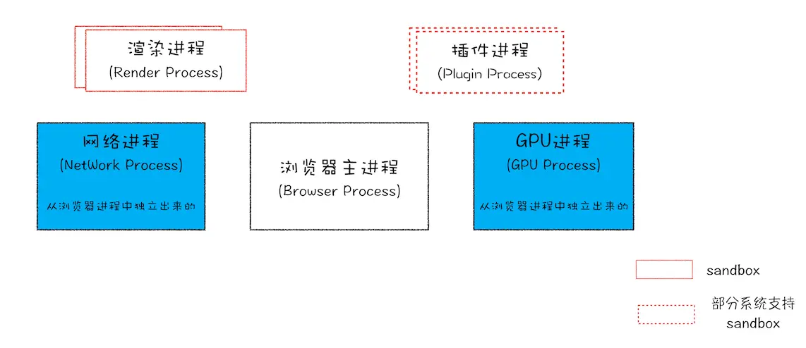

# 浏览器原理及API

本系列都是以 chrome/chromium 为主，参考学习资料：
- 极客时间《浏览器工作原理与实践》
- [深入了解现代网络浏览器 系列](https://developer.chrome.com/blog/inside-browser-part1/)
- [Blink 文档链接](https://www.chromium.org/blink)

## 浏览器原理

- 多进程架构
    
  - 浏览器进程，主要负责界面显示、用户交互、子进程管理，同时提供存储等功能。
  - GPU进程 
  - 网络进程，网络资源加载。
  - 渲染进程，渲染页面、运行 JavaScript等。
  - 插件进程 
- [页面导航流程](./页面导航流程.md)
- [页面渲染原理](./页面渲染原理.md)
- [事件循环与消息队列](./消息队列与事件循环.md)

## Web 安全策略

- 同源策略
  - js设置document.domain实现跨域

## Web API

- [Web 前端性能优化](./Web%20前端性能优化.md)
- WeAPI
  - 页面
    - DOM
      - [视图中的各种宽高偏移](./视图中的各种宽高偏移.md)
      - [DOM 事件模型](./DOM%20事件模型.md)
      - [WebComponent](./WebComponent.md)
    - [Canvas](./Canvas.md)
    - 不同上下文（窗口、iframe、worker）通信
      - 同源
        - 引用通信：window.opener + iframe.contentWindow
        - localStorage + storageEvent
        - SharedWorker + 消息通道
        - ServiceWorker
      - 消息通道机制
        - postMessage
        - MessageChannel
        - BroadcastChannel（同源限制）
  - [存储 & 缓存](./Web%20存储%20&%20缓存.md)
  - 网络
    - 同源
      - Ajax
      - Fetch
      - [WebSocket](https://developer.mozilla.org/en-US/docs/Web/API/WebSocket)
    - 非同源
      - CORS（[跨域资源共享](https://developer.mozilla.org/zh-CN/docs/Web/HTTP/CORS#http_%E5%93%8D%E5%BA%94%E9%A6%96%E9%83%A8%E5%AD%97%E6%AE%B5)）
        - 简单请求：拦截响应
          - 方法：GET、HEAD、POST
          - 头部字段不超
            - `accept`
            - `accept-language`
            - `content-language`
            - Content-Type：`text/plain`、`multipart/form-data`、`application/x-www-form-urlencoded`
          - 非自定义头部
        - 非简单请求：拦截请求
          - 非简单请求在发送正式的request之前，会先发送**预请求**
          - Access-Control-Request-Method
          - Access-Control-Request-Headers
        - 响应头
          - Access-Control-Allow-Origin
            - 限定一个域名或者通配符 *
          - Access-Control-Allow-Methods
          - Access-Control-Allow-Headers
          - Access-Control-Expose-Headers
          - Access-Control-Max-Age：缓存预请求
        - 无论是哪一种，请求都会携带 origin，后端都需要返回 Access-Control-Allow-Origin
        - 发送身份凭证信息或者响应设置 cookie，那必须满足三个条件：
          - 后端 Response header 有 Access-Control-Allow-Credentials: true
          - 后端 Response header 的 Access-Control-Allow-Origin 不能是*，要明确指定
          - 前端
            - 前端请求加上 withCredentials: 'include'
            - 页面元素 ``
        - [playground](https://jakearchibald.com/2021/cors/playground/)
      - JSONP：利用了 script 标签的 src 属性来实现跨域数据交互的，因为浏览器解析HTML代码时，原生具有src属性的标签，浏览器都赋予其HTTP请求的能力，而且不受跨域限制，使用src发送HTTP请求，服务器直接返回一段JS代码的函数调用，将服务器数据放在函数实参中，前端提前写好响应的函数准备回调，接收数据，实现跨域数据交互
      - Proxy Server：服务器代理
      - WebSocket
  - [多线程：WebWorker](./WebWork.md)
    - [task-worklet](https://github.com/developit/task-worklet)
    - [workerize](https://github.com/developit/workerize)
  - [PWA](./PWA.md)
  - 多媒体
    - [WebRTC](https://developer.mozilla.org/zh-CN/docs/Web/API/WebRTC_API)
  - 其他
    - ResourceHints
      - [prerender](https://web.dev/speculative-prerendering/)
    - SanitizerAPI
      - [Safe DOM manipulation with the Sanitizer API](https://web.dev/sanitizer/)
    - TaskSchedulingAPI
    - WebAssembly

## 场景分类

- 下载
  - [文件下载，搞懂这9种场景就够了](https://mp.weixin.qq.com/s/PysSe6MykjYzVrWQCKJXvg)
  - [动态表格大文件下载可以这样优化！](https://mp.weixin.qq.com/s/14bJxJ9U9mG76tw-Z93UqQ)