# Web 前端性能优化策略

> [性能指标了解](./Web%20%E5%89%8D%E7%AB%AF%E6%80%A7%E8%83%BD%E4%BC%98%E5%8C%96.md)

- 页面加载
  - 指标
    - 白屏（FP、FCP）：浏览器发起页面请求后到提交数据阶段，这时页面展示出来的还是之前页面的内容。当渲染进程“确认提交”之后会创建一个空白页面，我们通常把这段时间称为**解析白屏**（这也就是 Web 应用与原生应用体验最大的区别之一，这对用户体验影响很大）。
    - 首屏可交互时间（FID、TBT、TTI）
  - 优化策略
    - 资源网络请求（可打开 Chrome Devtools 工具的网络面板做性能分析）
      - Queuing：请求排队，因为[资源优先级](#资源优先级)以及 TCP 连接数量限制（HTTP/1.1 浏览器为每个域名最多维护 6 个连接导致的）
        - 并发请求
          - 域名分片
          - HTTP/2（多路复用）
        - 请求合并（资源合并）
          - 图标：雪碧图
          - 代码打包
      - TTFB：第一字节时间 
        - [HTTP 缓存](../HTTP/http%20缓存.md)
        - [preconnect（预连接）、dns-prefetch（DNS 预查询）](https://web.dev/preconnect-and-dns-prefetch/)
        - HTTP/1 keep-alive
        - 减少请求数据大小
          - HTTP/2（头部压缩）
        - 提高服务器性能
      - Content Download：资源下载时间
        - 减少资源大小：压缩/缩小
        - 提高宽带吞吐
        - CDN
    - 关键渲染路径
      - 消除[渲染阻塞资源](#渲染阻塞资源)
        - JS
          - defer
            - 异步加载
            - 等到 DOM 解析完毕，但在 DOMContentLoaded 事件之前执行
            - 具有 defer 特性的脚本保持其相对顺序，就像常规脚本一样
          - async
            - 异步加载
            - 加载就绪时运行
        - CSS
          - media: [loadCSS](https://github.com/filamentgroup/loadCSS)
      - 减少关键资源大小：以减少下载时间（往返次数 RTT）
        - 数据压缩
          - Gzip
          - Brotli
        - 代码缩小
          - 删除空格、注释、混淆
          - 消除未使用代码
            - TreeShaking
            - 代码按需引入：第三方库依赖过大，会给首屏加载带来很大的压力，一般解决方式是按需求引入对应文件。
          - 发布传输现代化代码
      - 减少[关键资源](#关键资源)数量
        - 延迟加载非关键资源
          - 代码（非关键内容）拆分 + 懒加载
            - [代码拆分分析](#代码拆分分析)
            - [延迟加载非关键 CSS](https://web.dev/defer-non-critical-css/)
          - 图片懒加载
      - 最小化关键请求链路：提高关键请求优先级，缩短关键路径长度
        - 页面结构设计：将 CSS 放在文件头部，JavaScript 文件放在底部
        - 资源内联：通过 HTML 内联 JavaScript、CSS 来移除文件下载时间
          - 内联内容不易过大，否则拆分成单文件，利用缓存
          - 内容大小参考 [TCP 慢启动](https://hpbn.co/building-blocks-of-tcp/#slow-start-restart)，首屏内容保持在 14 KB （压缩）以下，即 1-RTT 最佳 🤔
        - Resource Priority Hints
          - preload
          - prefetch
          - fetchpriority
    - 渲染模式
      - CSR
        - SSR
        - prerender（预渲染）
- 交互渲染
  - 指标
    - 帧率
    - 交互响应速度
  - 绘制一帧生命周期  
  - 生成一帧的方式：
    - [重排(reflow)、重绘(repaint)](#重排重绘)
    - 合成线程直接进行页面合成
  - 优化原则：避免抢占主线程过多时间，让渲染引擎稳定生成更多帧，提高帧率
    - JS
      - 对输入处理程序防抖
      - 减少 JavaScript 脚本执行时间
        - 时间分片
        - WebWork 多线程
      - 防止内存泄漏，系统频繁的垃圾回收
    - 渲染
      - 避免[强制同步布局和布局抖动](#强制同步布局和布局抖动)
        - 读写分离：尽量不要在修改 DOM 结构时再去执行 DOM 查询操作
        - 批量处理 + 异步更新
          - 使用 DOMFragment 缓存批量化 DOM 操作
          - 隐藏元素，进行批修改再显示
          - 拷贝元素，进行批修改再替换
      - 尽可能减少 reflow、repaint 的工作
      - 合理利用分层合成机制：合成操作是在合成线程上完成的，这也就意味着在执行合成操作时，是不会影响到主线程执行的
        - 利用 CSS3 实现动画
        - 将元素提升单独图层：减少重排重绘范围
          - will-change，能够将要执行动画的某个元素提前单独生成一个图层
          - translateZ
          - opacity
          - filters

## 资源优先级

在优先请求队列中，浏览器对不同资源类型请求有相应的优先级，高优先级的先进行请求。

> 可通过 Chrome NetWork 面板查看 Priority 列。 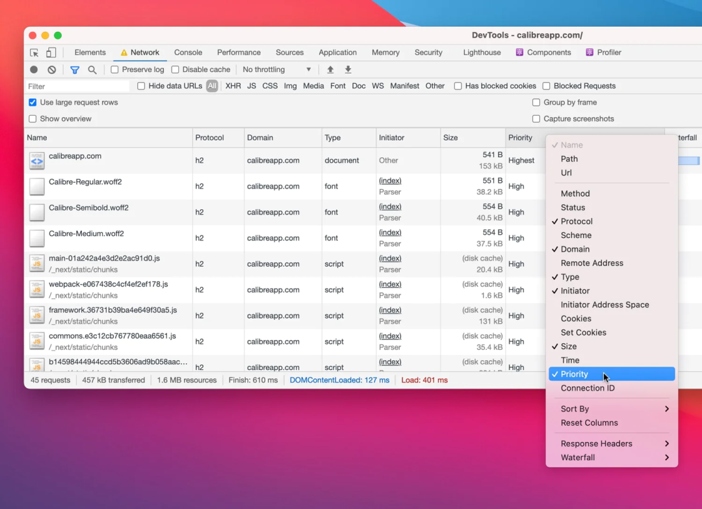

[Chrome 资源优先级文档](https://docs.google.com/document/d/1bCDuq9H1ih9iNjgzyAL0gpwNFiEP4TZS-YLRp_RuMlc/edit)

| 资源类型 | 优先级 |
| -------- | ------ |
| HTML      | Highest        |
| Font | Highest|
| Font (preload) | High|
| CSS | Highest |
| CSS | Highest |
| Images | 默认是 Low，在初始视口中渲染时升级为 High |
| JS | Highest |
| Ajax, XHR, or fetch() API | High |

## 关键资源

关键资源是指对页面初始视口的首屏渲染所需要的资源。

如何确定关键资源？从界面上感性角度去理解

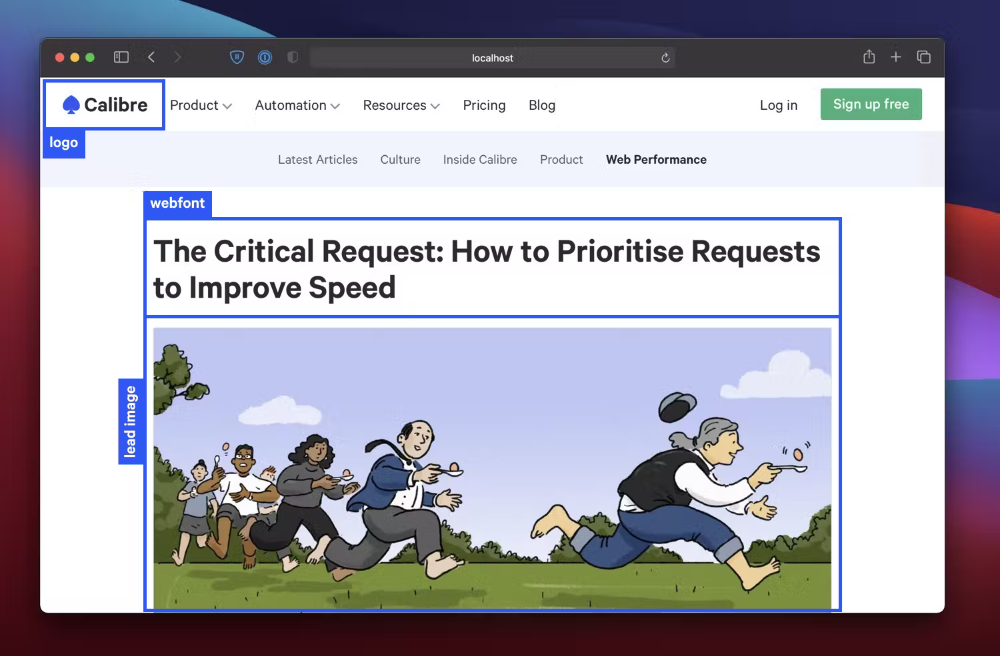  

或者通过 DevTools Performance 面板观察 FP、FCP、LCP 或者自定义首屏指标之前发起的请求链去进行确认，在指标之前的请求大致可认为是关键资源：

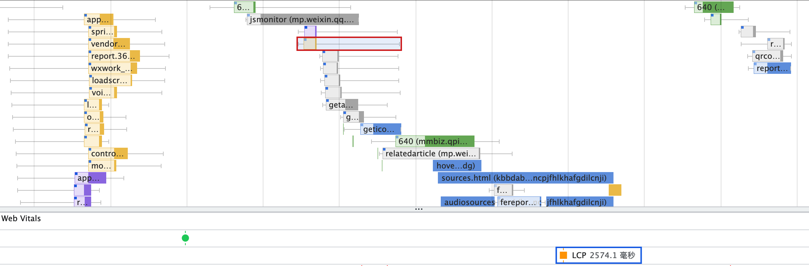  

Lighthouse 性能审计：以高优先级的资源为关键资源

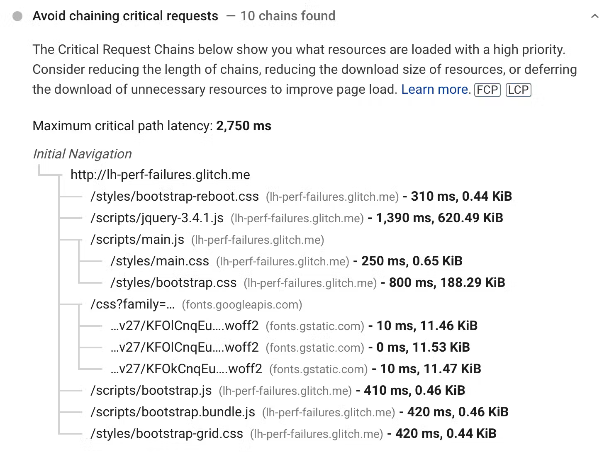  

## 代码拆分分析

可通过DevTools 中的 Coverage 面板查看资源利用率，一般可挑选体积大和利用率低的文件进行拆分

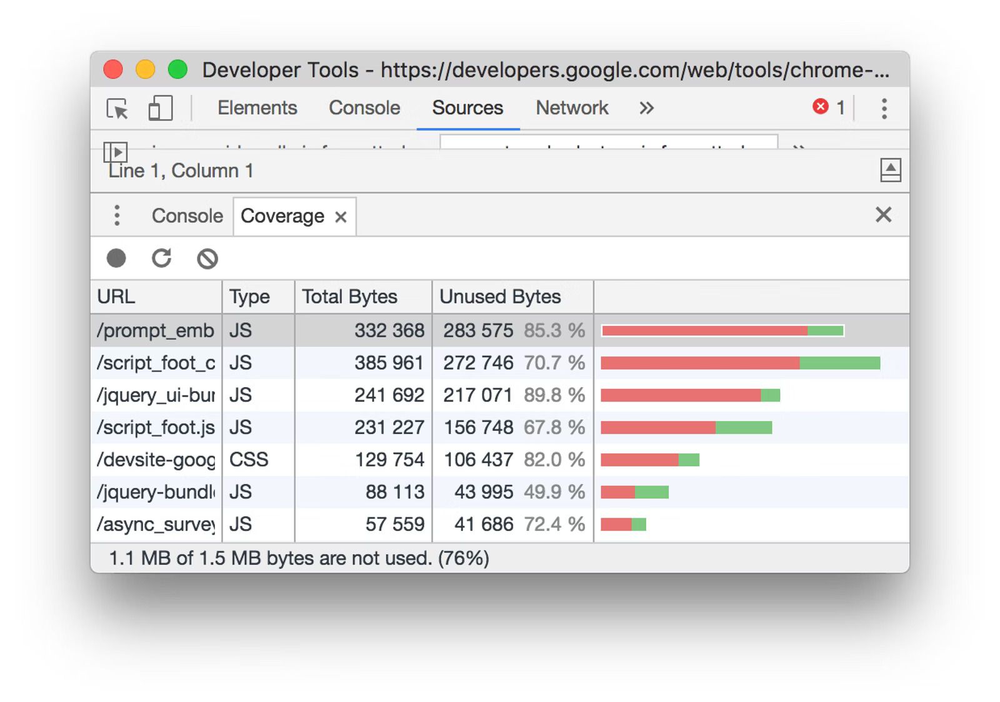  

或者 Lighthouse 性能审计板块

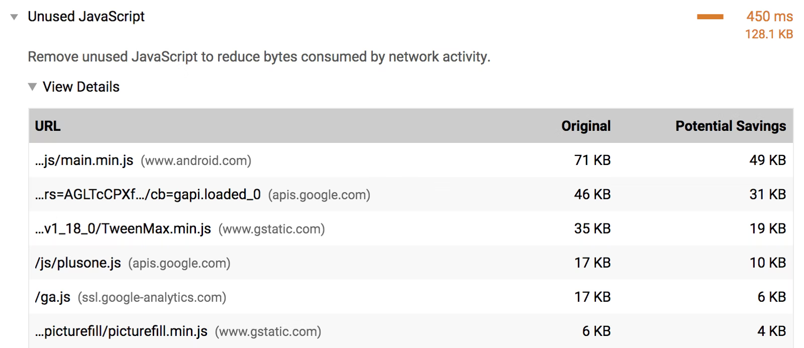  

文件依赖分析，可通过相应的构建工具如 webpack 的[Webpack Bundle Analyzer](https://github.com/webpack-contrib/webpack-bundle-analyzer)

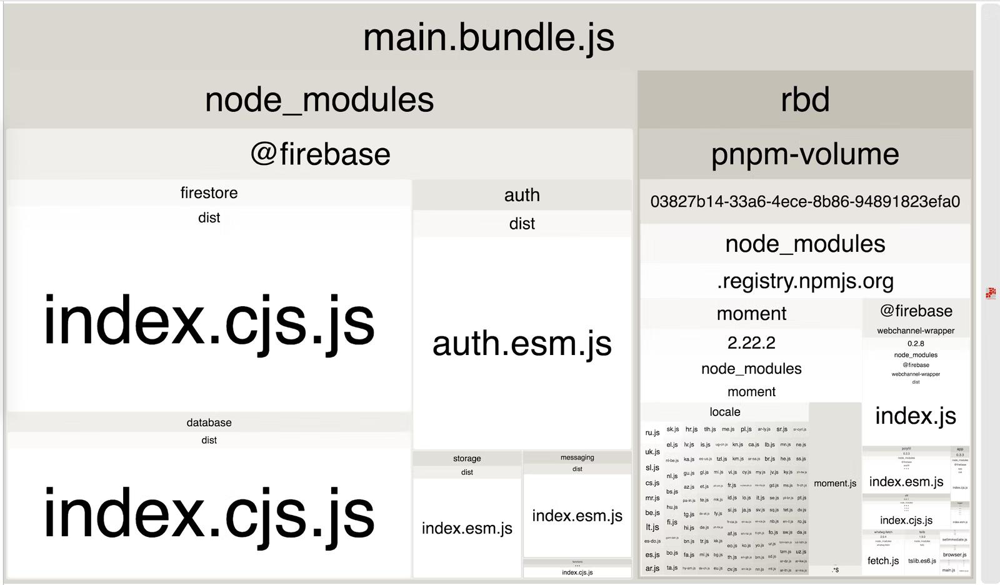  

Lighthouse Treemap 工具（需要开启 sourcemap）

> [Explore JavaScript Dependencies With Lighthouse Treemap](https://sia.codes/posts/lighthouse-treemap/)

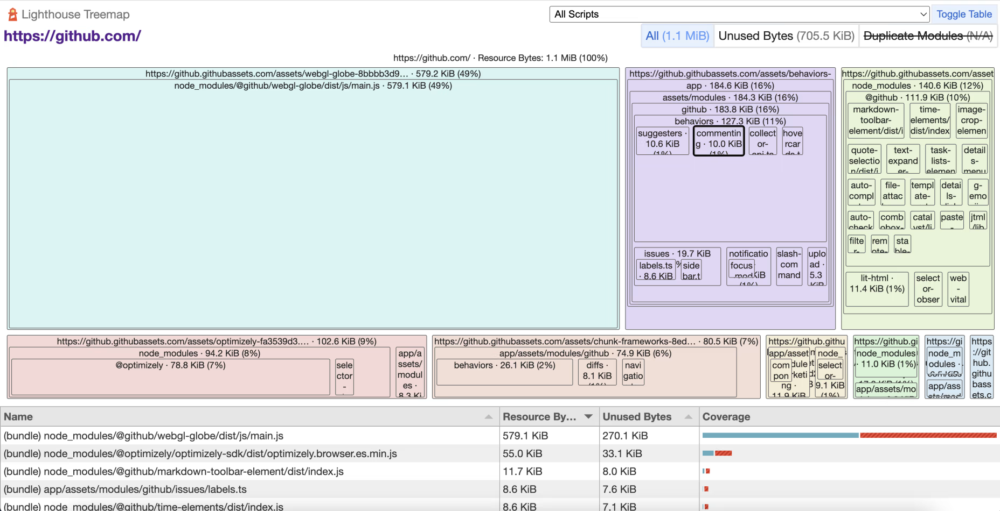  

最后代码中删除未使用的库或文件！

## 渲染阻塞资源

HTML、JS、CSS 资源加载行为会导致浏览器关键渲染路径（Critical Rendering Path）阻塞，了解浏览器对 HTML、JS、CSS 的加载行为：

- HTML
  - 流式解析：HTML 解析器并不是等整个文档加载完成之后再解析的，而是网络进程加载了多少数据，HTML 解析器便解析多少数据
  - 预加载扫描：当渲染引擎收到字节流之后，会开启一个预解析线程，用来分析 HTML 文件中包含的 JavaScript、CSS 等相关文件，解析到相关文件之后，预解析线程会提前下载这些文件
  - 流式渲染：现代浏览器增量构建 DOM，只要有可用的 DOM 就无需等待 HTML 完全解析再渲染，除非 CSS 渲染阻塞
- JS：无论内联还是外链，都会阻塞 DOM 解析，直到 JS 加载执行完成
- CSS：CSS 解析不是增量过程，如果浏览器在解析样式表内容时开始逐步构建 CSSOM，它将导致渲染树的多次渲染，造成样式闪烁（FOUC）因为 css 的可重叠样式规则
  - 内联：会阻塞 DOM 解析，直到内联 CSS 解析完成
  - 外链
    - link in head
      - 一般不会阻塞 DOM 解析 
      - 但如果后面跟 JS 脚本的情况，会阻塞后面 JS 脚本执行，相当于间接导致阻塞 DOM 解析 
        JavaScript 引擎在解析 JavaScript 之前，是不知道 JavaScript 是否操纵了 CSSOM 的，所以渲染引擎在遇到 JavaScript 脚本时，不管该脚本是否操纵了 CSSOM，都会执行 CSS 文件下载，解析操作，再执行 JavaScript 脚本。
      - 阻塞渲染
        - 浏览器在渲染页面的过程需要解析 HTML、CSS 以得到 DOM 树和 CSS 规则树，它们结合后才生成最终的渲染树并渲染，一旦浏览器发出获取外部样式表的请求，渲染树的构建就会停止，因此，关键渲染路径( CRP ) 也被卡住，屏幕上没有渲染任何内容
        - 浏览器可以使用 CSSOM 树的旧状态来生成渲染树，因为 HTML 正在被解析以在屏幕上逐步渲染事物。但这有一个巨大的缺点。在这种情况下，一旦样式表被下载和解析，并且 CSSOM 被更新，渲染树将被更新并呈现在屏幕上。现在，使用旧 CSSOM 生成的渲染树节点将使用新样式重新绘制，并且还可能导致无样式内容( FOUC )闪烁，这对 UX 非常不利。因此浏览器将等到样式表被加载和解析 w 完成，CRP 才会被解锁。正因为如此，建议尽可能早地加载所有外部样式表，可能在 head 部分中。
    - link in body：这是一种缺失规范，浏览器之间怪异的行为
      - Safari：阻止渲染，直到所有 CSS 加载执行完毕
      - Firefox：不会阻塞渲染，可能导致样式闪烁
      - Chrome/Edge：阻塞 DOM 解析，但可渲染之前的内容

总的来说，HTML 可流式渲染，主要是 JS 阻塞解析，而 CSS 阻塞渲染，也可能间接阻塞 HTML 解析。

但也并不是所有的 JS、CSS 会造成渲染阻塞，比如：

`<script>` tags in the `<head>` which do not have at least one of the following attributes: **async, defer, module**
Stylesheet `<link>` tags in the `<head>` without a **disabled** attribute or a **media query** which does not match (e.g., print)

## 资源优先级

## 重排、重绘

  

1. 重排、重绘分别对应浏览器渲染流程中 Layout、Paint 阶段，Layout 位于Paint 前，重排一定会导致重绘，重绘不一定会导致重排
2. 浏览器会自动合并更改，在达到某个数量或时间后，会合并为一次 reflow，而 reflow 是渲染页面的重要一步，打开浏览器就一定会至少 reflow 一次，所以我们不可能避免 reflow

> 触发重排重绘的属性列表：https://csstriggers.com/

## 强制同步布局和布局抖动

正常情况下渲染任务中的样式计算、布局计算都是在另外的任务中异步完成的

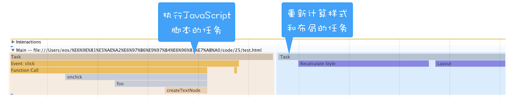

如果在修改 DOM 结构时候再去执行 DOM 查询操作，就会发生强制同步布局。

所谓强制同步布局，是指 JavaScript 强制将计算样式和布局操作提前到当前的任务中。

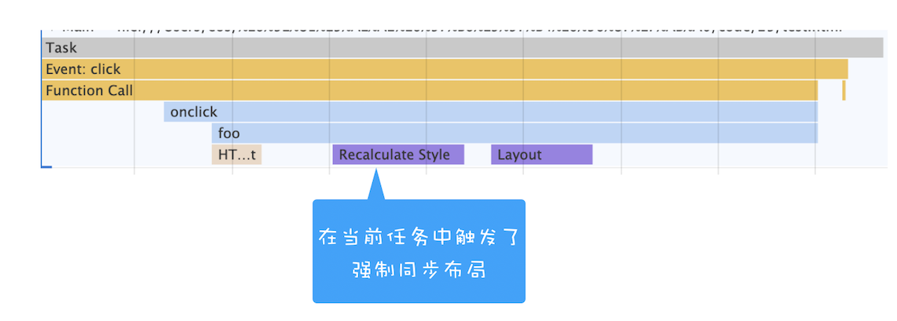

布局抖动，是指在一次 JavaScript 执行过程中，多次执行强制布局和抖动操作。

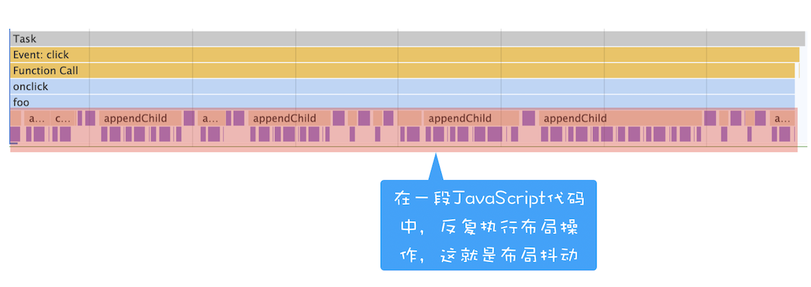

**如此频繁会大大影响当前函数的执行效率，从而阻塞其他渲染任务执行**。