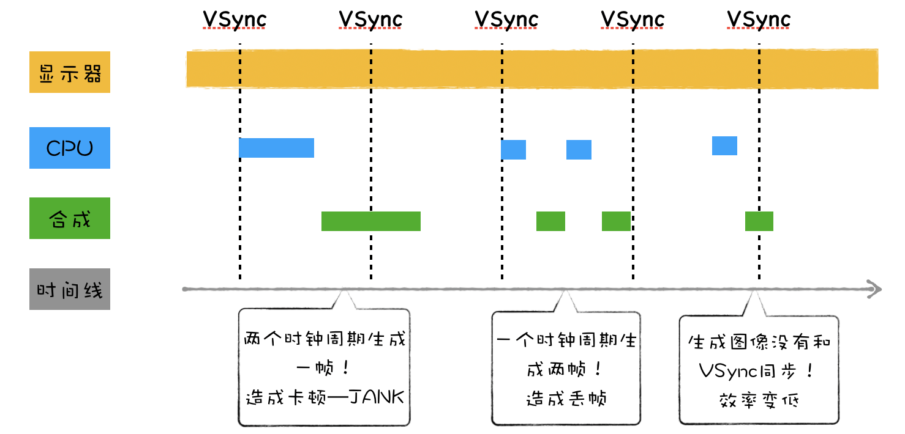

# 消息队列和事件循环系统

> 本文只是总结浏览器事件循环的心智模型要点

1. 事件循环系统是 HTML 标准定义的，用户代理实现，而不是 JavaScript 引擎提供的，JavaScript 引擎只是一个常驻内存的程序，等待用户代理分发 JS 任务
2. 事件循环系统的本质是一个单线程协调各类事件任务的模型机制
   > 为了防止资源竞争，在 Chrome 中每个渲染进程只有一个主执线程，主执行线循环不断得各类事件，比如处理 DOM 构建、计算样式、处理布局，同时还需要处理 JavaScript 任务以及各种输入事件。要让这么多不同类型的任务在主线程中有条不紊地执行，这就需要一个系统来统筹调度这些任务，这个统筹调度系统就是消息队列和事件循环系统。
3. 消息队列分为**宏任务队列**和**微任务队列**两种类型队列
4. 宏任务队列就是宿主环境协调的各类事件的队列，微任务队列就是 JavaScript 引擎内部执行的任务队列
5. 宏任务类型
   - 脚本 script 任务
   - 用户输入事件处理
   - UI 渲染任务（DOM、Style、Layout、Paint、Composite）
   - 网络请求 ajax、fetch
   - 计时器 setTimeout、setInterval
     - 计时器的回调不一定在指定时间后能执行。而是在**指定时间后，将回调函数放入事件循环的队列中**，如果当前任务执行时间过久，会影响定时器任务的执行
     - 每个 setTimeout 产生的任务会直接 push 到任务队列中；而 setInterval 在每次把任务 push 到任务队列前，都要进行一下判断(看上次的任务是否仍在队列中，如果有则不添加，没有则添加)。
     - setTimeout
       - 浏览器会将 `setTimeout` 或 `setInterval` 的五层或更多层嵌套调用（调用五次之后）的最小延时限制在 4ms
       - 未激活的页面，setTimeout 执行最小间隔是 1000 毫秒
       - 延时执行时间有最大值 大约 24.8 天
   - MessageChannel、postMessage
     - [实现一个比`setTimeout(fn, 0)`零延迟的定时器](https://dbaron.org/log/20100309-faster-timeouts)
   - requestAnimationFrame
     - 由系统 VSync 信号触发调度，在每一帧渲染之前执行
     - 当显示器将一帧画面绘制完成后，并在准备读取下一帧之前，显示器会发出一个垂直同步信号（vertical synchronization）给 GPU，简称 VSync    
     - 如果页面未激活的话，requestAnimationFrame 也会停止渲染，这样既可以保证页面的流畅性，又能节省主线程执行函数的开销
   - requestIdleCallback
     - 在“浏览器重排/重绘”后如果当前帧还有空余时间时被调用的
     - 可以设置超时强制
   - GC
6. 微任务
   - promise.then、promise.catch、promise.finally
   - MutationObserver
   - queueMicrotask
7. 事件循环心智模型
   1. 主线程从宏任务队列取一任务执行执行完后
   2. 再循环执行完微任务队列里的所有任务
   3. UI 渲染判断
   4. 重回到 1

   

   心智代码：

   ```js
   for (let task of macroQueue) {
     task();

     for (let microTask of microQueue) {
       microTask();
     }

     render()
   }
   ```
8. 在每一次的事件循环最后不一定会执行渲染，除非任务里发生重排重绘操作，而且多次操作可能被积累起来只做一次渲染
9. 宏任务队列实际在浏览器实现中并不是单个消息队列而是多消息队列架构，而微任务队列只有一个队列
10. Blink 任务调度，参考[《BlinkOn Scheduler Presentation
》](https://docs.google.com/presentation/d/1V09Qq08_jOucvOFs-C7P4Hz2Vsswa6imqLxAf7ONomQ/edit#slide=id.g3f2d525d4_116)，总结如下
  - 按照任务类型分组任务队列
  - 基于不同的场景来动态调整消息队列的优先级
      
  - 设置队列权重：如果连续执行了一定个数的高优先级的任务，那么中间会执行一次低优先级的任务，这样就缓解了任务饿死的情况

## 参考

- 极客时间《浏览器工作原理与实践》
- [Jake Archibald: 在循环 - JSConf.Asia](https://www.youtube.com/watch?v=cCOL7MC4Pl0)
- [Tasks, microtasks, queues and schedules](https://jakearchibald.com/2015/tasks-microtasks-queues-and-schedules/)
- [为什么要用 setTimeout 模拟 setInterval ？](https://segmentfault.com/a/1190000038829248)