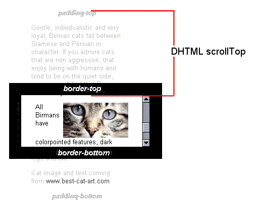

# 视图中的各种宽高偏移概念

- screen
  - width
  - height
  - availHeight 返回浏览器窗口在屏幕上可占用的垂直空间，即最大高度
  - 
- window
  - innerWidth
  - innerHeight
  - outerWidth
  - outerHeight
  - 
  - screenLeft 浏览器窗口到屏幕左边缘的 CSS 像素距离数值
  - screenTop 浏览器窗口到屏幕顶边缘的 CSS 像素距离数值
  - scrollX 页面水平方向滚动的像素值
  - scrollY 页面垂直方向已滚动的像素值
    - [目录定位 Demo](#目录定位-demo)
- 元素
  - rect：元素在视口中的区域位置
    - `getBoundingClientRect() -> {x,y,top,left,bottom,right}` 
  - client：元素的可视内容
  - 大小，即`padding+conten` 不包含滚动条
    - clientWidth
    - clientHeight
    - 
  - 边框
    - clientLeft
    - clientTop
  - offset：元素相对于 [HTMLElement.offsetParent](https://developer.mozilla.org/zh-CN/docs/Web/API/HTMLElement/offsetParent) 中的表现
    - 大小（ content + padding + scroll + border ）
      - offsetWidth
      - offsetHeight
      - 
    - 偏移
      - offsetLeft
      - offsetTop
      - 
  - scroll：元素的滚动内容
    - scrollWidth
    - scrollHeight
    - 
    - 滚动超出的距离
      - scrollLeft
      - scrollTop
      - 

## 目录定位 Demo

以下是使用 rxjs 实现的目录定位功能。

```js
fromEvent(document, "scroll")
  .pipe(
    startWith(null), // 初始定位
    debounceTime(100), // 性能，防治执行过度
    // 转换成锚点元素的 offsetTop 数组
    switchMap(() => from(archorsOffsetTop)),
    tap(([idx, offsetTop]) => {
      // 消除元素样式效果
      items[+idx]?.classList.remove("active");
    }),
    // 计算出文档滚动距离和 offsetTop 最为接近的锚点元素
    filter(([idx, offsetTop]) => {
      let d = window.scrollY
      return d <= (offsetTop - 10) // 10 误差调整
    }),
    throttleTime(10), // 过滤后续元素
    tap(([idx, offsetTop]) => {
      // 添加元素样式效果
      items[+idx - 1]?.classList.add("active");
    }),
  ).subscribe()
```