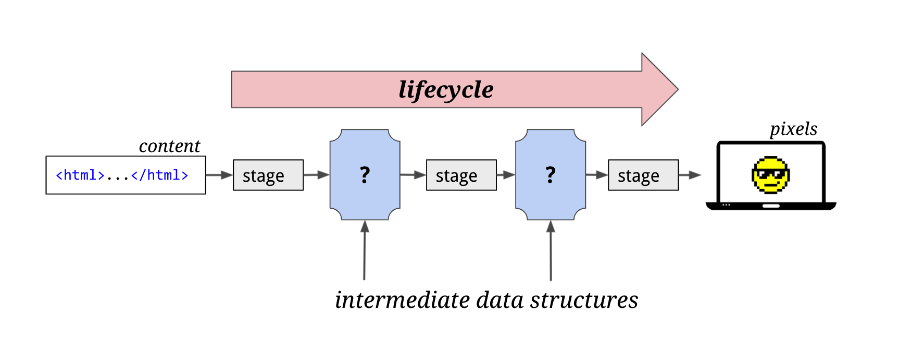
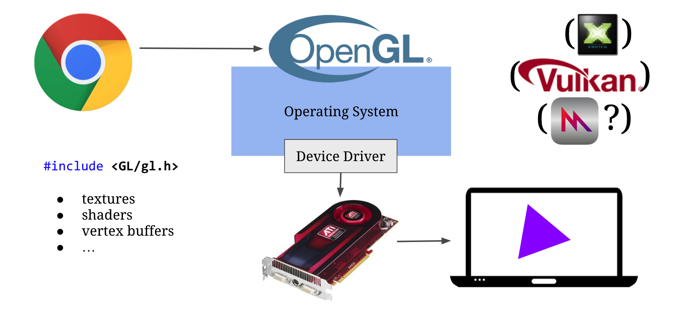
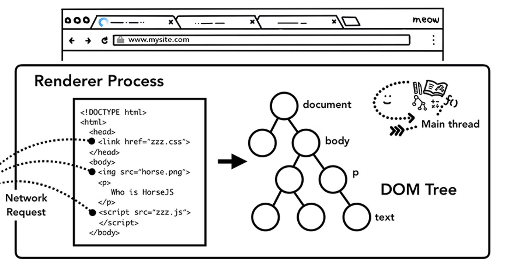
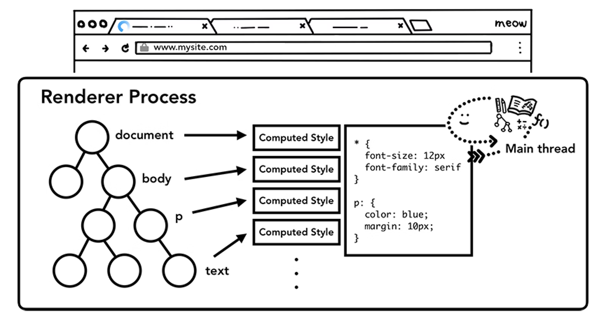
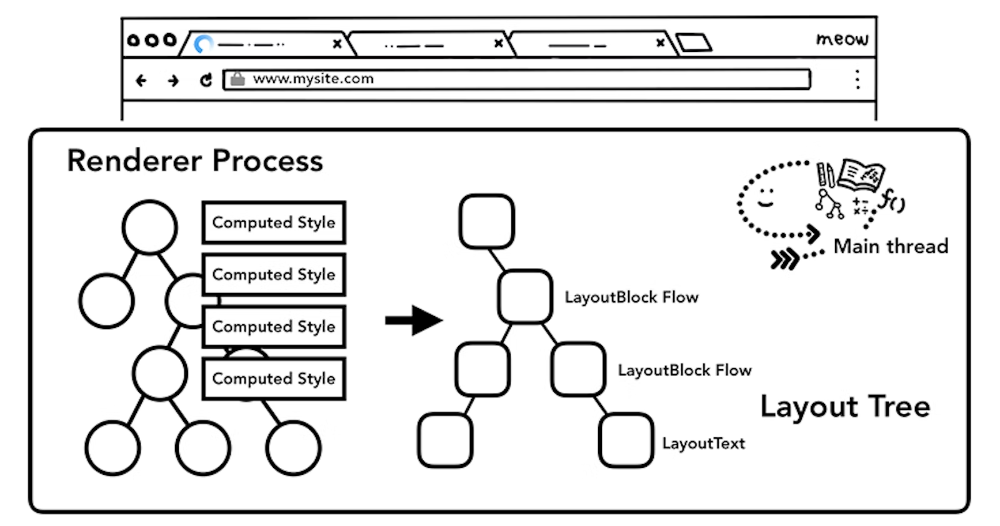
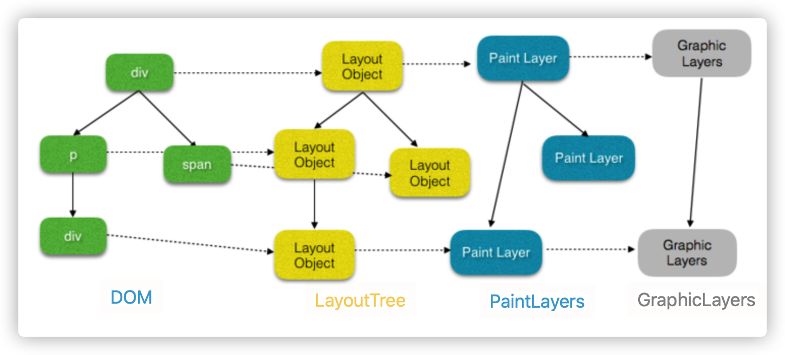
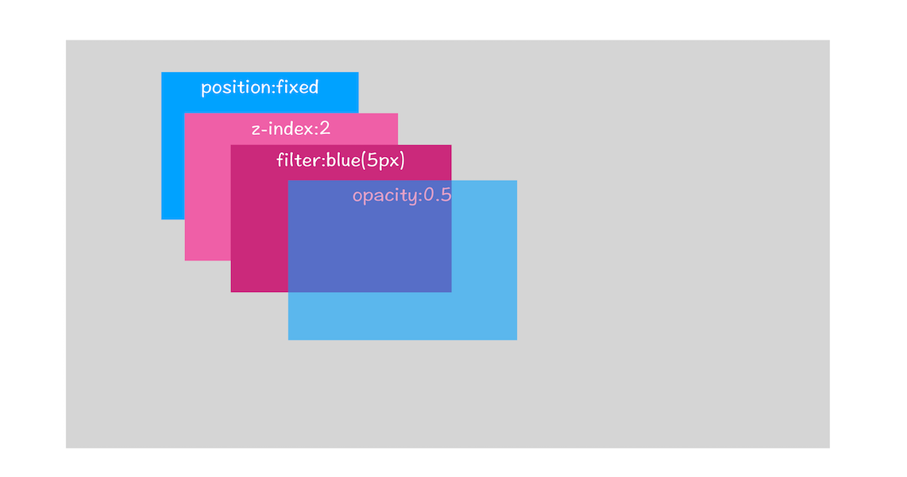
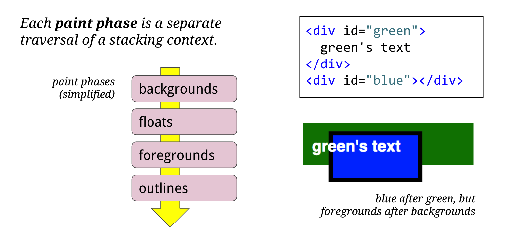

# 浏览器页面渲染原理

> 本文以 Chrome 浏览器为例理解现代化浏览器渲染原理

现代化浏览器多进程架构中，浏览器会进程创建一个沙箱的渲染进程，并使用 Web 渲染引擎（如 [Blink](https://www.chromium.org/blink)）将 HTML、CSS 和 JavaScript 等 Web 内容转换为用户可以与之交互的网页。

Chrome 的 Blink 渲染进程会包含以下线程：

- 主线程（Blink 渲染引擎）
- 合成线程 compositor ("cc")
- WebWorker 线程
- 光栅线程

## 渲染管道

一个页面形成需要经过多个流程阶段，我们把这样的一个处理流程叫做渲染流水线或者渲染管道。

渲染是一个复杂的过程，为了提高渲染效率，整个渲染渲染流程就像是一条管道，分成多个渲染阶段，每个阶段都会产生中间产物，当发生更新时，就可以从某一阶段的产物复用开始，这样即提高渲染效率并且分多阶段任务执行，可以降低系统复杂度，提高任务调度灵活性。

**管道的最终是将 Web 内容转换成底层操作系统提供的图形库调用操作，去驱动显卡生成页面像素**，在多平台的今天，有标准 API 图形库 OpenGL，但在 window 平台，还需要额外转换成 DirectX API 调用，未来还将实现更多图形库支持，如 vulkan。

## 渲染流程

- DOM：构建 DOM 树
- Style：样式计算
- Layout：布局计算
- Layers：图层分层
- Panit：图层绘制
- 分块
- Raster：光栅
- Compositing：合成
- GPU display

### Parse HTML：构建 DOM 树

将 HTML 解析成一种树形数据结构 DOM（Document Object Model）。

  

### Recalculate Style：样式计算

1. CSS 解析，同 HTML 解析一样，将 CSS 文本解析成内部数据结构 styleSheets
2. 计算出 DOM 树中每个节点的具体样式，并被保存在 ComputedStyle 的结构内，在计算过程中需要遵守 CSS 的**继承和层叠**两个规则。

  

### Layout：布局计算

1. 创建布局树（Layout Tree），遍历 DOM 树中的所有可见节点，并把这些节点加到布局树中。

     

   DOM 并不是跟 layout tree 的节点并不是一对一对应关系，不可见的节点包括：

   - display：none 的元素
   - 伪元素 after 与 before
   - 文本内联元素将会被隐式 block 包裹
   - head 标签下面的全部内容
   - 等

2. 布局计算，计算每个节点的布局信息，比如坐标及几何等信息。

### Layers：分层

浏览器的页面实际上被分成了很多图层，这些图层叠加后合成了最终的页面。

如果没有采用分层机制，那么每次页面有很小的变化时，都从布局树直接生成目标图片的话，会严重影响页面的渲染效率。

为了提升每帧的渲染效率，Chrome 引入了**分层和合成**的机制。

上图中从 DOM 到最终 Graphic Layer（图层）的转换并不是一对一，只有具有特定样式的节点会被转换为单独的图层，如果一个节点没有对应的层，那么这个节点就从属于父节点的图层，比如 `span` 节点还是属于 `div` 图层。

#### PaintLayers（渲染层）

PaintLayer 是用来实现 stacking contest（层叠上下文），以此来保证页面元素以正确的显示顺序，这样才能正确的展示元素的重叠以及半透明元素等等

形成层叠上下文的属性条件如下：

参考 [MDN 层叠上下文](https://developer.mozilla.org/zh-CN/docs/Web/CSS/CSS_Positioning/Understanding_z_index/The_stacking_context)。

#### GraphicsLayers（图层）

并不是所有的 PaintLayer 都能成为 GraphicsLayer，**因为生成图层是会占用内存**，只有某些特殊的 PaintLayer 才会被提升为 GraphicsLayer。

要能成为图层的节点除了要满足层叠上下文属性条件，还需要具有以下条件：

- 根元素
- 硬件加速
  - 3D transform 或 perspective 的元素
  - 硬件加速的 video
  - 3D 或硬件加速的 2D 的canvas
- CSS3 动画：对 opacity、transform、fliter、backdropfilter 应用了 animation 或者 transition（需要是激活 的 animation 或者 transition，当 animation 或者 transition 效果未开始或结束后，提升合成层也会失效）
- will-change
- 裁剪滚动区域
- **overlaps a composited layer 的元素**

以上只列举常见情况，更多详情查看

- [无线性能优化：Composite](https://fed.taobao.org/blog/taofed/do71ct/performance-composite/?spm=taofed.homepage.header.13.7eab5ac8Ut2aYd)
- [CompositingReasons.cpp](https://chromium.googlesource.com/chromium/blink/+/72fef91ac1ef679207f51def8133b336a6f6588f/Source/platform/graphics/CompositingReasons.cpp?autodive=0%2F%2F%2F)

### Paint：图层绘制

在完成图层树的构建之后，渲染引擎会对图层树中的每个图层进行绘制，但 Paint 阶段并不是真正的界面绘制，而是生成**绘制指令**列表，交给其他线程进行光栅任务，大大减低了主线程的负担，提高主线程效率。

可以打开“开发者工具”的“Layers”标签，选择“document”层，来实际体验下绘制列表，如下图所示：

生成指令的过程，每一个图层都是分为多阶段并按照层叠顺序对 layout subTree 进行遍历生成指令。

下面案列 float 布局中，一个元素甚至有可能部分地位于另一个元素的前面和一部分之后，因为先绘制所有背景完后再绘制文本。

### Raster：光栅化

光栅化，就是将绘制指令生成位图。

#### bitmap（位图）

#### tile

Chromium 目前实际支持三种不同的光栅化和合成的组合方式：软件光栅化 + 软件合成，软件光栅化 + gpu 合成，gpu 光栅化 + gpu 合成。在移动平台上，大部分设备和移动版网页使用的都是 gpu 光栅化 + gpu 合成的渲染方式，理论上性能也最佳。

通常情况下，页面的内容都要比屏幕大得多，显示一个页面时，如果等待所有的图层都生成完毕，再进行合成的话，会产生一些不必要的开销，也会让合成图片的时间变得更久。因此，合成线程会将每个图层分割为大小固定的图块，然后优先绘制靠近视口的图块，这样就可以大大加速页面的显示速度。不过有时候， 即使只绘制那些优先级最高的图块，也要耗费不少的时间，因为涉及到一个很关键的因素——纹理上传，这是因为从计算机内存上传到 GPU 内存的操作会比较慢。为了解决这个问题，Chrome 又采取了一个策略：在首次合成图块的时候使用一个低分辨率的图片。比如可以是正常分辨率的一半，分辨率减少一半，纹理就减少了四分之三。在首次显示页面内容的时候，将这个低分辨率的图片显示出来，然后合成器继续绘制正常比例的网页内容，当正常比例的网页内容绘制完成后，再替换掉当前显示的低分辨率内容。这种方式尽管会让用户在开始时看到的是低分辨率的内容，但是也比用户在开始时什么都看不到要好。

### 显示器显示图像原理

每个显示器都有固定的刷新频率，通常是 60HZ，也就是每秒 60 次读取显卡的**前缓冲区**。

显卡的职责就是合成新的图像，并将图像保存到后缓冲区中，一旦显卡把合成的图像写到后缓冲区，系统就会让后缓冲区和前缓冲区互换，这样就能保证显示器能读取到最新显卡合成的图像。

渲染引擎会通过渲染流水线生成新的图片，并发送到显卡的后缓冲区。

> 在 GPU 加速的场景下渲染引擎则是借助 GPU 去合成图片

渲染引擎生成的每一张图片称为一帧，每秒更新了多少帧称为帧率，比如 1 秒更新了 60 帧，那么帧率就是 60Hz（或者 60FPS）。为了保证图像显示流程，那么帧率就需要尽量达到显示器刷新频率，比如大多数设备屏幕的更新频率是 60 次 / 秒，那么渲染引擎需要每秒更新 60 张图片到显卡的后缓冲区。

> 现在大多数显示器刷新率在 60Hz，

> 不涉及图层的内容的操作能直接在合成线程中完成，比如操作的是整个图层的几何变换，透明度变换，阴影等，这些变换都不会影响到图层的内容，而文字信息的改变，布局的改变，颜色的改变，统统不会涉及，涉及到这些内容的变化就要牵涉到重排或者重绘了。

