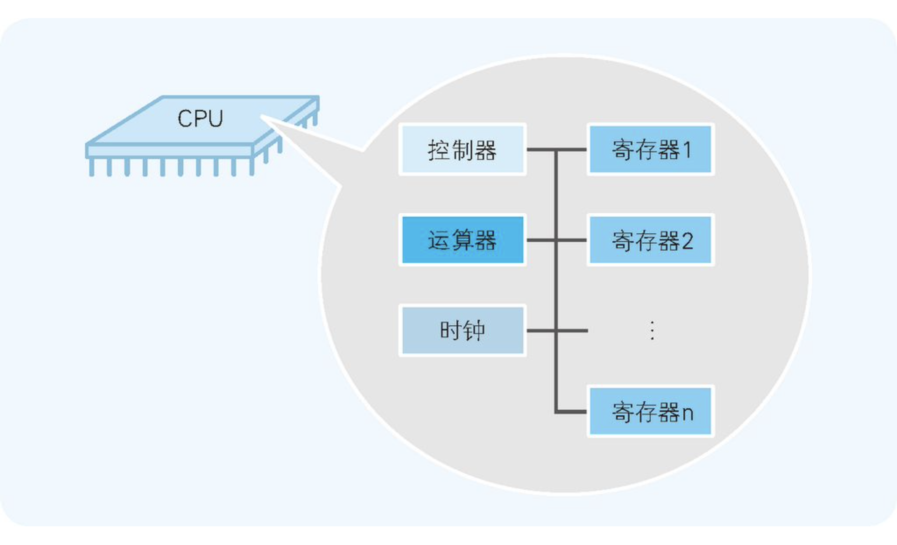
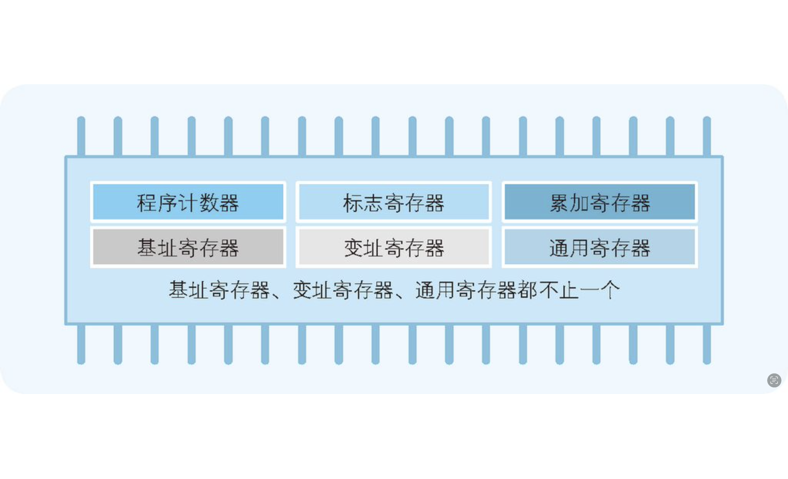

- 计算机原理
  - CPU
    - CPU 的内部由寄存器、控制器、运算器和时钟四个部分构成，各部分之间由电流信号相互连通  
      - 运算器：负责运算从内存读入寄存器的数据
      - 控制器
      - 寄存器：用来暂存指令、数据等处理对象
        - 数据分为“用于运算的数值”和“表示内存地址的数值“
        - **“机器语言级别的程序是通过寄存器来交互处理的。也就是说，在程序员看来“CPU 是寄存器的集合体”**
        - 寄存器种类 
  - 二进制
    - 二进制数转换成十进制数的方法
      - 位权、基数
    - 计算机内部所有信息都用二进制数表示
      - 位 bit，计算机处理信息的最小单位——位
      - 字节 byte：计算机所处理的信息的基本单位是 8 位二进制数。8 位二进制数被称为一个字节，字节是最基本的信息计量单位
    - 补码
      - 二进制数中表示负数值时，取最高位称为符号位。符号位是 0 时表示正数 ，符号位是 1 时表示负数
      - 在实际的硬件系统中，计算机 CPU 的运算器只实现了加法器，而没有实现减法器；计算机在做减法运算时，实际上内部是在做加法运算。用加法运算来实现减法运算
      - 在表示负数时就需要使用“二进制的补数”
        - 补码缘由
          - 二进制高位溢出会自动丢弃，计算机数据的溢出，就相当于取模
          - 一个 256 个码点的逻辑钟面：a - 32 相当于 a + (256-32) - 256，即可将减法转变成加法。
          - (255-32) 的值就是 32 的反码
          - 算上 0 这个码点，(256-32) 的值相就是 32 的补码
      - 补码计算
        - 原码取反 + 1
        - 补码的源码：取反 + 1
    - 运算机制
      - 位移，相当于乘除 2 的次方
        - 左移，低位补 0
        - 右移，高位补 符号位值
      - 逻辑运算
        - 与
        - 或
        - 非
        - 异或
        - 左移，低位补 0
        - 右移，高位补 0
      - 位数扩充：就是指在保持值不变的前提下将其扩充位数
        - 不管是正数还是用补数表示的负数，都只需用符号位的值（0 或者 1）填充高位即可。这就是符号扩充的方法
  - 浮点数
    - 用二进制数表示小数，有一些十进制数的小数无法转换成二进制数
    - 浮点数是指用符号、尾数、基数和指数这四部分来表示的小数
      - [科学计数法](https://zhuanlan.zhihu.com/p/339949186) `V = (-1)^S * M * R^E`
  - 汇编
  - 机器指令与汇编
    - TODO: 函数调用指令过程

## 函数调用的汇编指令分析

### 内存栈

“栈（stack）有“干草堆积如山”的意思。就如该名称所表示的那样，数据在存储时是从内存的下层（大的地址编号）逐渐往上层（小的地址编号）累积，读出时则是按照从上往下的顺利进行（图 10-3）的。”

摘录来自
图灵经典计算机基础系列（套装全4册）
矢泽久雄
此材料可能受版权保护。


```c
//返回两个参数值之和的函数
int AddNum(int a, int b)
{
    return a + b;
}

//调用AddNum函数的函数
void MyFunc()
{
    int c;
    c = AddNum(123, 456);
}
```

```asm
AddNum:
        push    rbp
        mov     rbp, rsp
        mov     DWORD PTR [rbp-4], edi
        mov     DWORD PTR [rbp-8], esi
        mov     edx, DWORD PTR [rbp-4]
        mov     eax, DWORD PTR [rbp-8]
        add     eax, edx
        pop     rbp
        ret
MyFunc:
        push    rbp
        mov     rbp, rsp
        sub     rsp, 16
        mov     esi, 456
        mov     edi, 123
        call    AddNum
        mov     DWORD PTR [rbp-4], eax
        nop
        leave
        ret
```